# 🏗️ MusicVerse AI - Architecture Diagrams

**Last Updated:** 2025-12-08  
**Version:** 1.0

---

## 📑 Содержание

- [Общая архитектура системы](#общая-архитектура-системы)
- [Frontend архитектура](#frontend-архитектура)
- [Backend архитектура](#backend-архитектура)
- [Потоки данных](#потоки-данных)
- [Архитектура компонентов](#архитектура-компонентов)
- [Deployment архитектура](#deployment-архитектура)

---

## Общая архитектура системы

### High-Level Overview

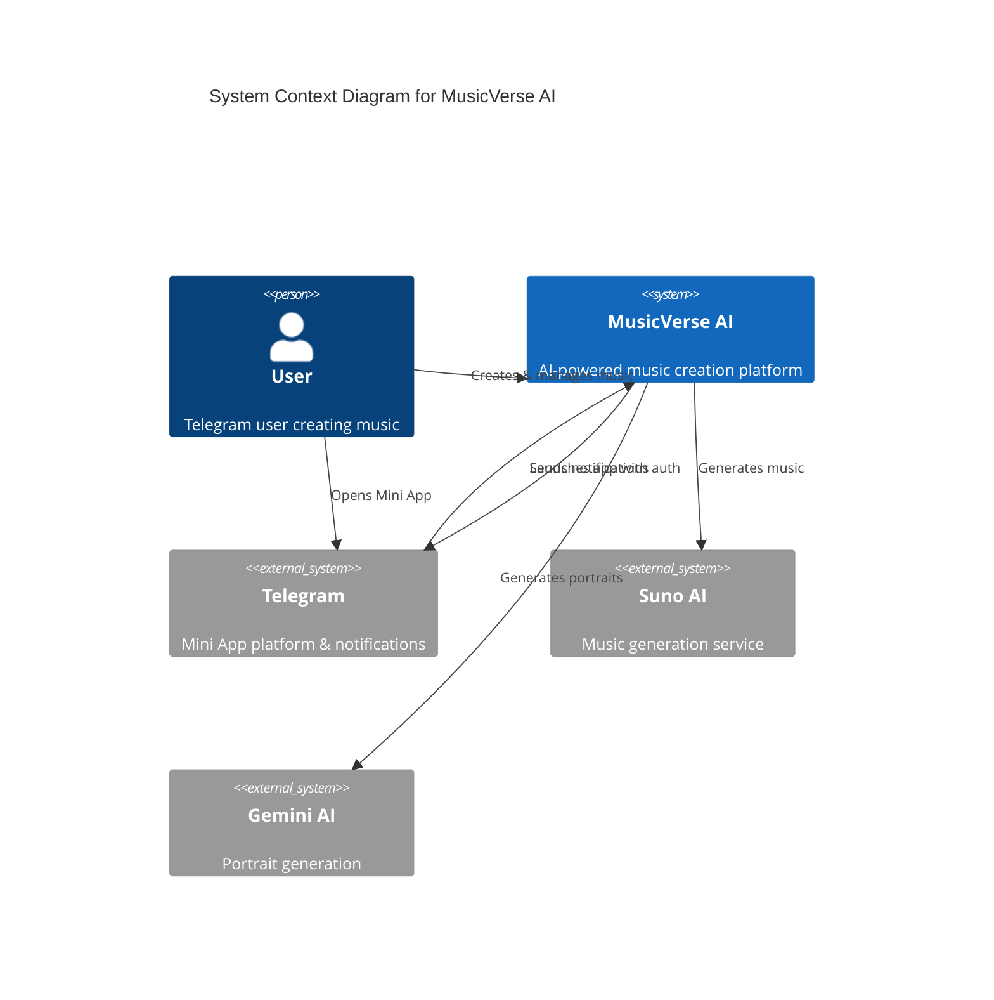

### Technology Stack

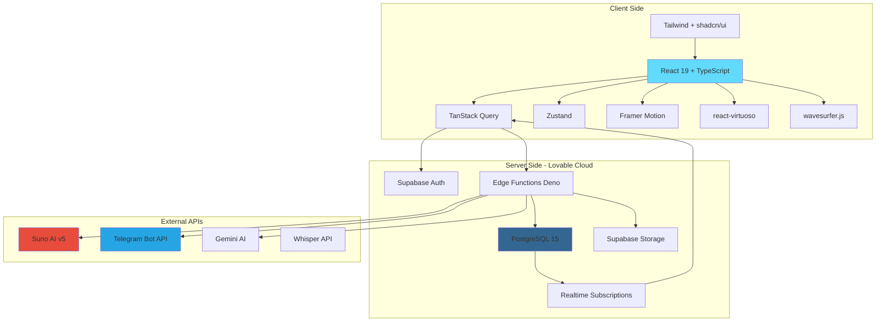

---

## Frontend архитектура

### Component Hierarchy

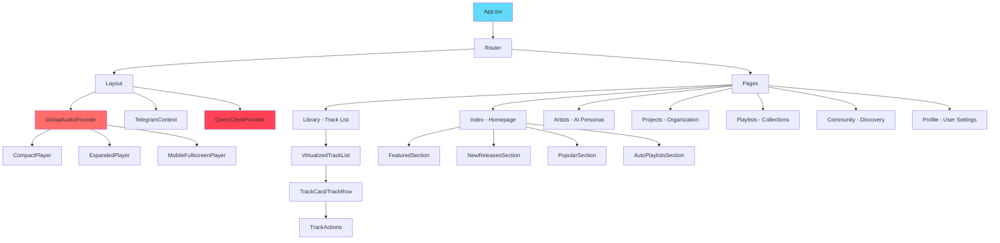

### State Management Architecture

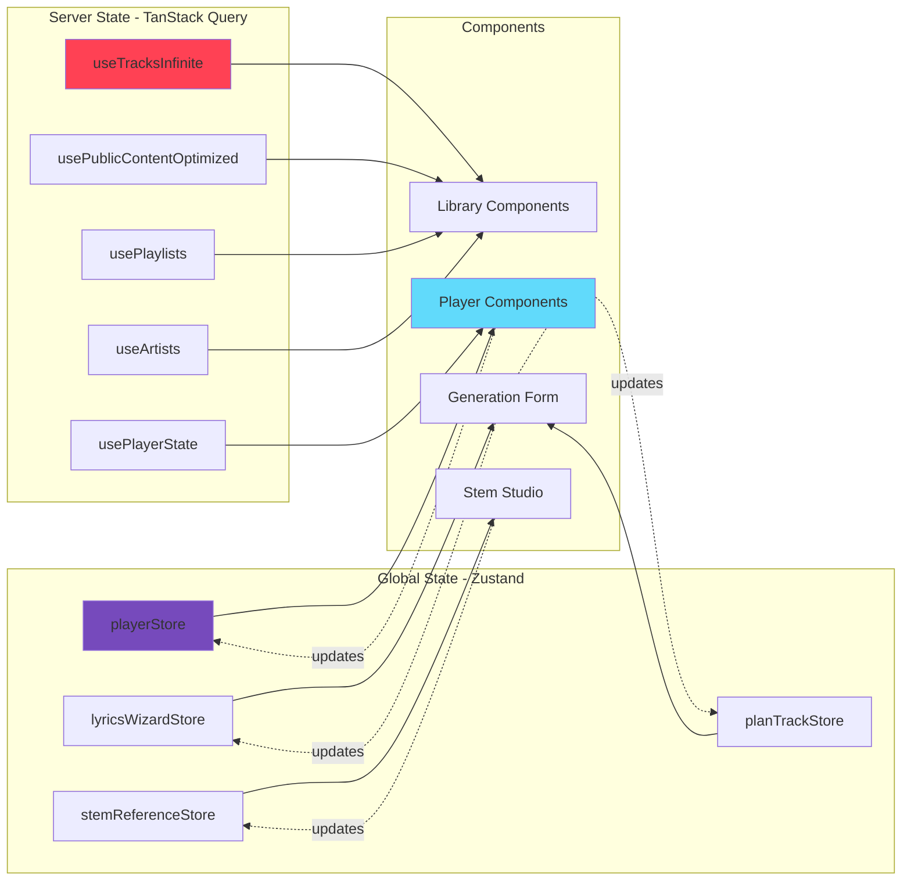

### Player State Machine

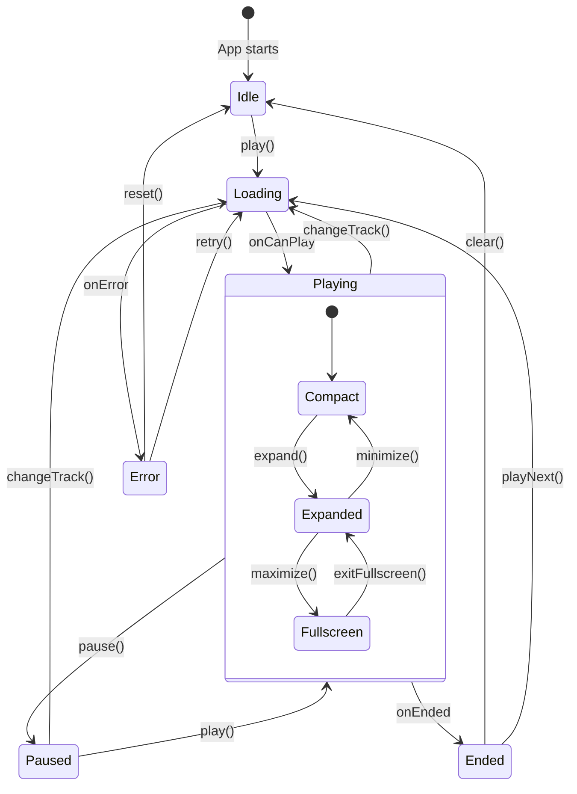

---

## Backend архитектура

### Database Architecture

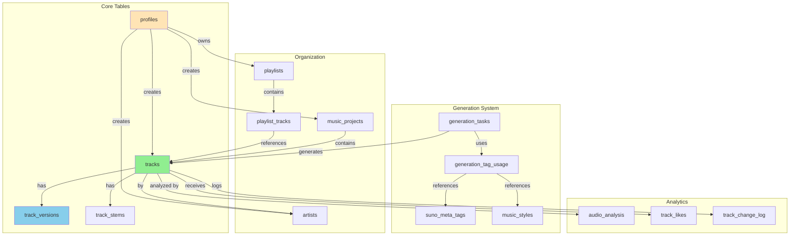

### Edge Functions Architecture

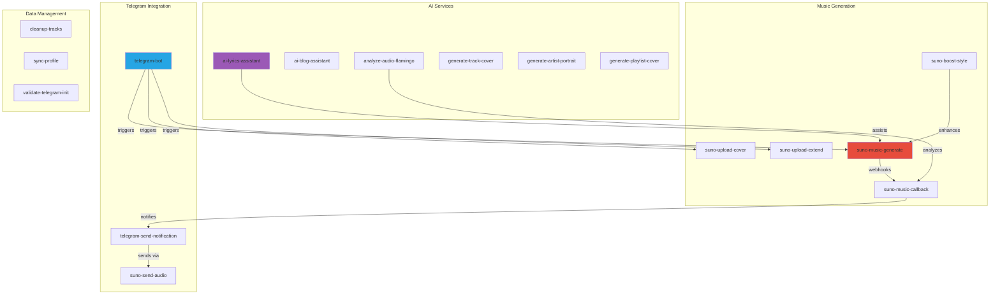

### RLS Security Model

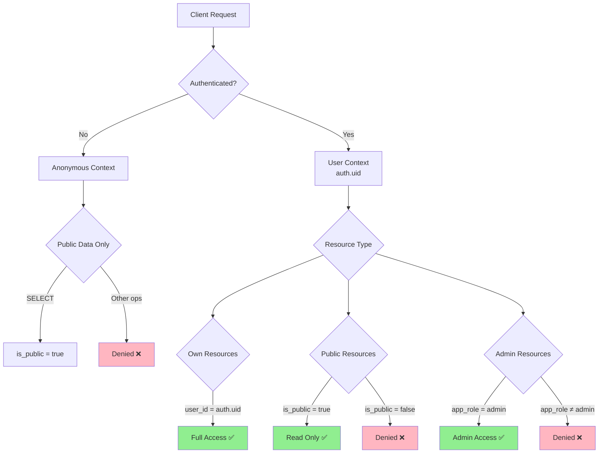

---

## Потоки данных

### Music Generation Flow

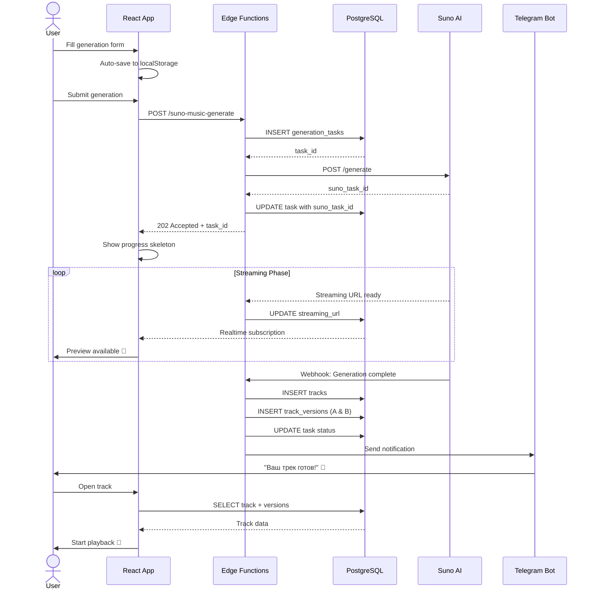

### Version Switching Flow

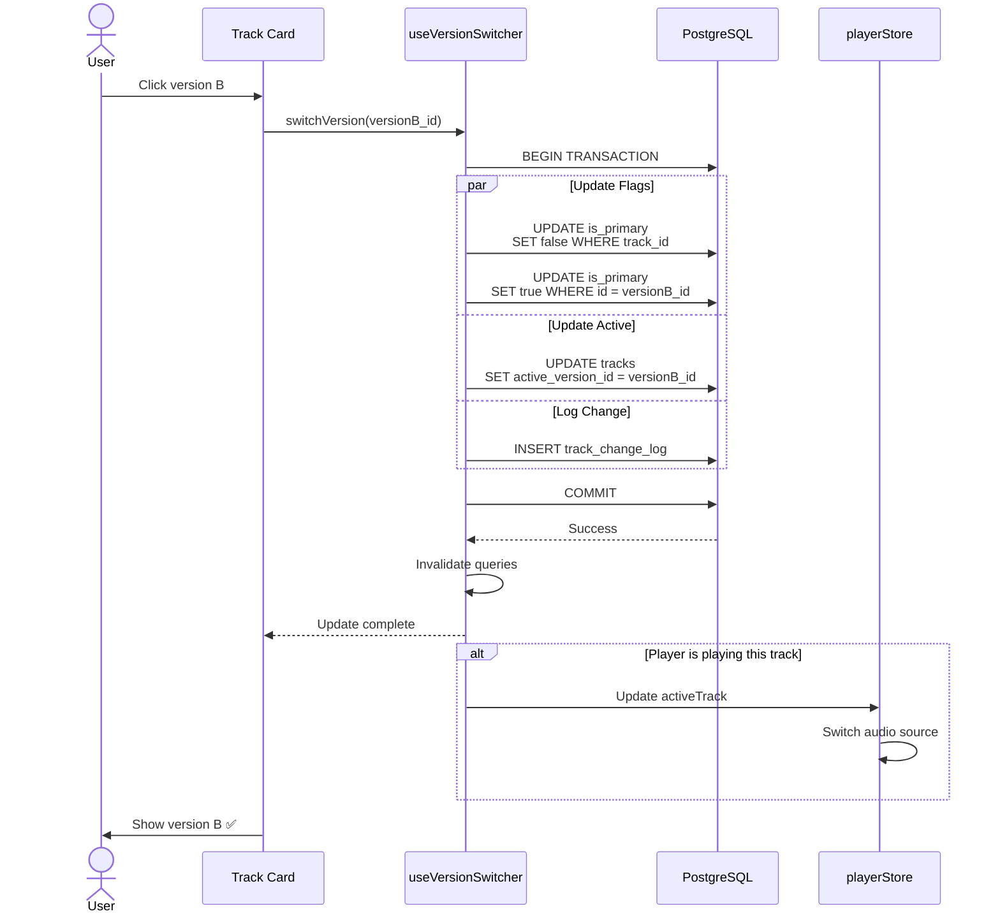

### Playlist Creation & Sharing Flow

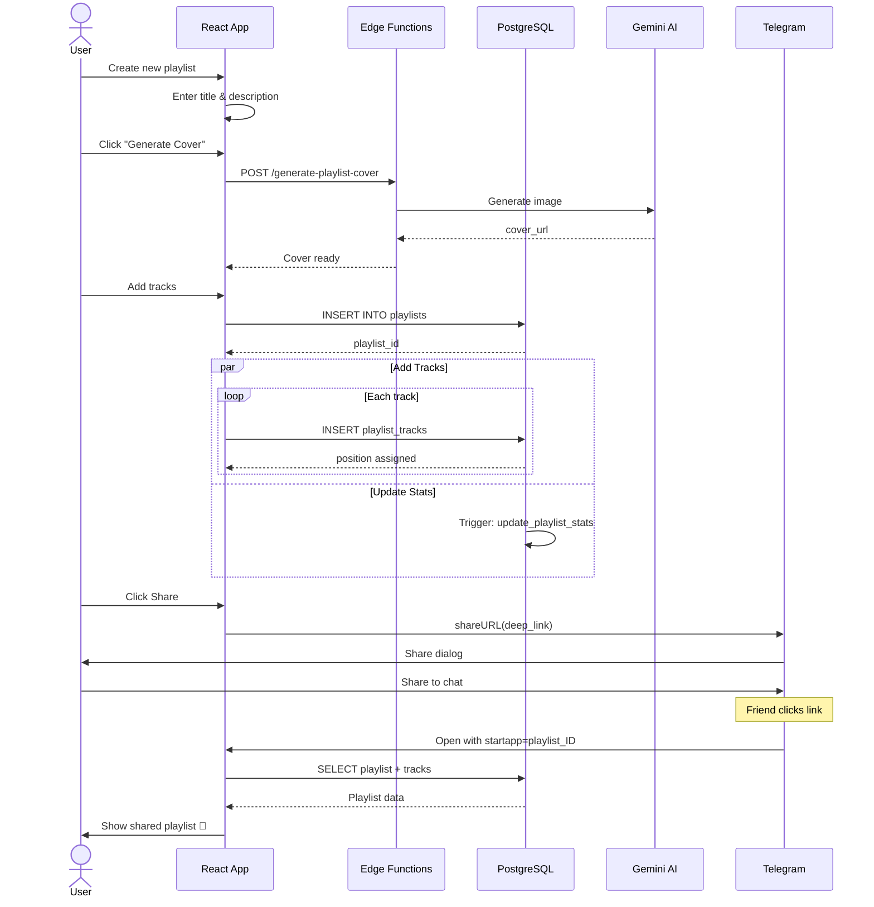

---

## Архитектура компонентов

### Generate Form Architecture

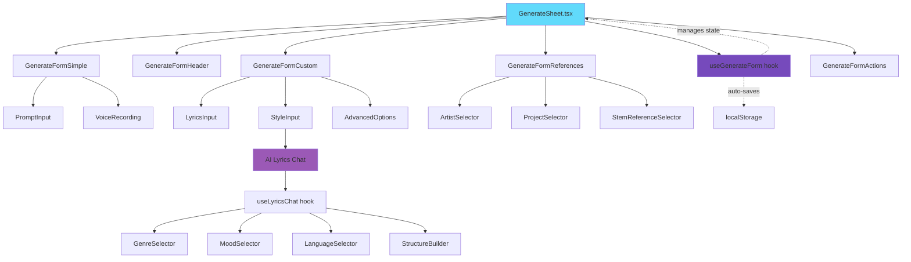

### Stem Studio Architecture

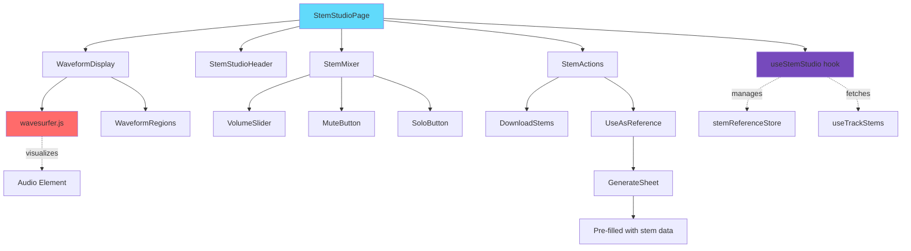

### Library Virtualization Architecture

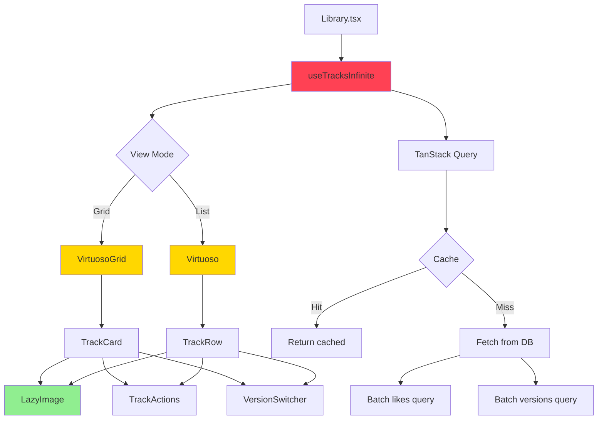

---

## Deployment архитектура

### Infrastructure Overview

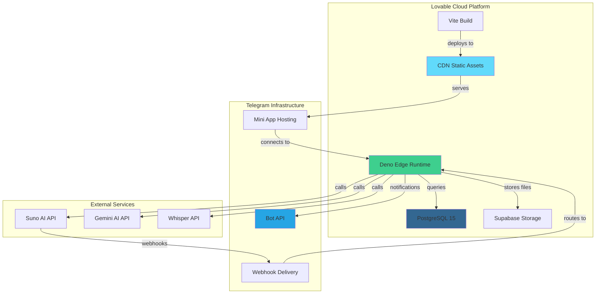

### CI/CD Pipeline

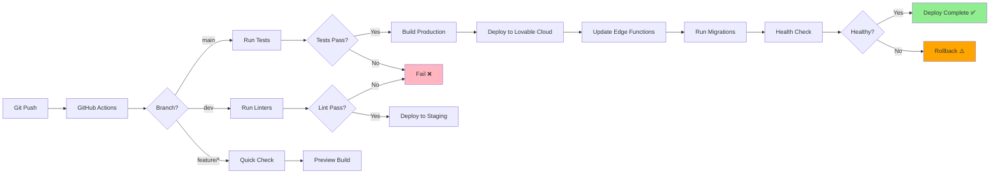

### Monitoring & Observability

```mermaid
graph TB
    subgraph "Application Metrics"
        A[Performance Monitoring]
        B[Error Tracking]
        C[User Analytics]
    end
    
    subgraph "Infrastructure Metrics"
        D[Database Performance]
        E[Edge Function Logs]
        F[Storage Usage]
    end
    
    subgraph "Business Metrics"
        G[Generation Success Rate]
        H[User Engagement]
        I[Feature Adoption]
    end
    
    subgraph "Alerting"
        J[Slack Notifications]
        K[Telegram Alerts]
        L[Email Reports]
    end
    
    A --> J
    B --> K
    D --> L
    E --> K
    G --> L
    
    style K fill:#26A5E4
    style J fill:#4A154B
```

---

## Best Practices

### Component Design Principles

1. **Single Responsibility**: Каждый компонент решает одну задачу
2. **Composition over Inheritance**: Используем композицию
3. **Hooks for Logic**: Логика в кастомных хуках
4. **Types First**: TypeScript типы для всех props
5. **Performance**: memo, useMemo, useCallback где нужно

### State Management Guidelines

```typescript
// ✅ GOOD: Global player state in Zustand
const usePlayerStore = create<PlayerState>((set) => ({
  activeTrack: null,
  isPlaying: false,
  play: (track) => set({ activeTrack: track, isPlaying: true }),
}));

// ✅ GOOD: Server state in TanStack Query
const { data } = useQuery({
  queryKey: ['tracks', userId],
  queryFn: () => fetchTracks(userId),
  staleTime: 30_000,
});

// ❌ BAD: Mixing concerns
const [tracks, setTracks] = useState([]); // Don't manage server state in useState
```

### Database Query Patterns

```sql
-- ✅ GOOD: Batch operations
SELECT t.*, tv.audio_url, tv.version_label,
       COALESCE(l.liked, false) as is_liked
FROM tracks t
JOIN track_versions tv ON tv.id = t.active_version_id
LEFT JOIN track_likes l ON l.track_id = t.id AND l.user_id = $1
WHERE t.user_id = $1
LIMIT 20;

-- ❌ BAD: N+1 queries
SELECT * FROM tracks WHERE user_id = $1;
-- Then for each track:
SELECT * FROM track_versions WHERE track_id = $2;
SELECT * FROM track_likes WHERE track_id = $2;
```

---

## Дополнительные ресурсы

- [DATABASE.md](./DATABASE.md) - Полная схема базы данных
- [PLAYER_ARCHITECTURE.md](./PLAYER_ARCHITECTURE.md) - Детали архитектуры плеера
- [TELEGRAM_BOT_ARCHITECTURE.md](./TELEGRAM_BOT_ARCHITECTURE.md) - Архитектура Telegram бота
- [PROJECT_SPECIFICATION.md](./PROJECT_SPECIFICATION.md) - Спецификация проекта

---

**Maintained by:** MusicVerse AI Team  
**License:** Proprietary
