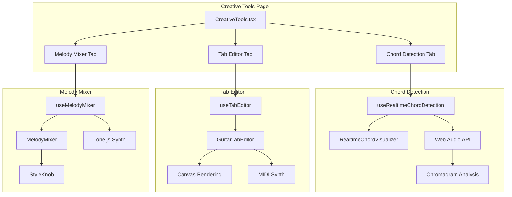

# 🎸 Creative Tools - Документация

## Обзор

Creative Tools — набор профессиональных инструментов для музыкантов, позволяющий:
- **Realtime Chord Detection** — распознавание аккордов в реальном времени
- **Guitar Tab Editor** — интерактивный редактор табулатур
- **Melody Mixer** — DJ-style инструмент для создания мелодий-референсов

## Архитектура



---

## 1. Realtime Chord Detection

### Описание
Распознавание гитарных аккордов в реальном времени через микрофон с визуализацией хромаграммы.

### Технология
- **Web Audio API** — захват аудио с микрофона
- **Pitch Class Profile (PCP)** — анализ 12 нотных классов
- **Chord Templates** — шаблоны major, minor, dim, aug, 7th

### Компоненты

#### `useRealtimeChordDetection.ts`
```typescript
interface RealtimeChordState {
  isListening: boolean;
  currentChord: string | null;  // "Am", "G", "F"
  confidence: number;           // 0-1
  chromagram: number[];         // 12 pitch classes
  rootNote: string;
  quality: string;
  history: ChordHistoryItem[];
}
```

#### `RealtimeChordVisualizer.tsx`
- Большой дисплей текущего аккорда с confidence
- Хромаграмма (12 столбцов для каждой ноты)
- История последних 8 аккордов
- Haptic feedback при смене аккорда

### Алгоритм распознавания

1. Захват аудио через `getUserMedia`
2. FFT анализ с размером 8192 (для низких частот гитары)
3. Вычисление хромаграммы каждые 50ms
4. Сравнение с chord templates (major, minor, etc.)
5. Выбор аккорда с максимальным confidence (>0.6)

### Поддерживаемые аккорды
- Major (C, D, E, F, G, A, B)
- Minor (Cm, Dm, Em, Fm, Gm, Am, Bm)
- Diminished (Cdim, Ddim, etc.)
- Augmented (Caug, Daug, etc.)
- Seventh (C7, D7, etc.)

---

## 2. Guitar Tab Editor

### Описание
Интерактивный редактор гитарных табулатур с поддержкой редактирования, воспроизведения и экспорта.

### Возможности
- Рисование нот на 6 струнах
- Поддержка техник: hammer-on, pull-off, slide, bend
- Undo/Redo
- Playback через MIDI синтез
- Экспорт в GP5, PDF, MIDI

### Компоненты

#### `useTabEditor.ts`
```typescript
interface TabEditorState {
  notes: TabNote[];
  selection: Selection | null;
  clipboard: TabNote[];
  history: TabNote[][];
  historyIndex: number;
  currentTool: 'select' | 'draw' | 'erase';
  bpm: number;
  isPlaying: boolean;
  playbackPosition: number;
}

interface TabNote {
  id: string;
  string: number;     // 0-5
  fret: number;       // 0-24
  position: number;   // timing
  duration: number;
  technique?: 'hammer-on' | 'pull-off' | 'slide' | 'bend';
}
```

#### `GuitarTabEditor.tsx`
- Toolbar: Select, Draw, Erase, Techniques
- Canvas: 6 строк табулатуры
- Controls: Play, Stop, BPM, Undo/Redo
- Export: GP5, PDF, MIDI

### Управление
- **Click** — добавить/редактировать ноту
- **Drag** — перемещение ноты
- **Delete/Backspace** — удалить ноту
- **Ctrl+Z / Ctrl+Y** — Undo/Redo

### Воспроизведение
Использует `useMidiSynth` с Tone.js Sampler для реалистичного звучания гитары.

---

## 3. Melody Mixer

### Описание
DJ-style интерфейс для создания мелодий путём смешивания музыкальных стилей. Вдохновлён PromptDJ MIDI.

### Возможности
- 8 слотов для стилей с регуляторами веса (0-100%)
- Master controls: BPM, Key, Scale
- Realtime preview через Tone.js
- Запись созданной мелодии
- Использование как audio reference для генерации

### Компоненты

#### `useMelodyMixer.ts`
```typescript
interface MelodyMixerState {
  slots: StyleSlot[];
  bpm: number;
  key: string;
  scale: 'major' | 'minor';
  isPlaying: boolean;
  isRecording: boolean;
  recordedBlob: Blob | null;
}

interface StyleSlot {
  id: string;
  name: string;
  weight: number;   // 0-1
  color: string;
}
```

#### `StyleKnob.tsx`
SVG-компонент поворотной ручки:
- Визуализация веса 0-100%
- Цветовое кодирование
- Touch/Mouse управление
- Анимация glow при активности

#### `MelodyMixer.tsx`
- Grid 4x2 со StyleKnob
- Master Controls панель
- Preview waveform
- Кнопки: Play, Record, Use as Reference

### Алгоритм генерации

```typescript
// Генерация аккордов на основе весов стилей
const chords = generateChordProgression(key, scale);

// Генерация мелодии с учётом стилей
slots.forEach(slot => {
  if (slot.weight > 0) {
    applyStyleToMelody(melody, slot.name, slot.weight);
  }
});

// Синтез через Tone.js
synth.triggerAttackRelease(note, duration);
```

### Предустановленные стили
1. Acoustic Guitar
2. Electric Clean
3. Fingerpicking
4. Power Chords
5. Jazz Chords
6. Blues Riffs
7. Classical
8. Funk Rhythm

---

## Интеграция с генерацией

### Workflow: Melody → Track

1. Пользователь создаёт мелодию в Melody Mixer
2. Нажимает "Use as Reference"
3. Мелодия конвертируется в аудио blob
4. Открывается GenerateSheet с:
   - `audioReference` = recorded melody
   - `prompt` = auto-generated tags
   - `mode` = 'custom'

### Workflow: Tab → Track

1. Пользователь создаёт табулатуру
2. Экспортирует в MIDI
3. MIDI конвертируется в аудио
4. Используется как reference

---

## API Reference

### useRealtimeChordDetection

```typescript
const {
  isListening,
  currentChord,
  confidence,
  chromagram,
  history,
  startListening,
  stopListening,
  clearHistory
} = useRealtimeChordDetection();
```

### useTabEditor

```typescript
const {
  notes,
  currentTool,
  bpm,
  isPlaying,
  addNote,
  removeNote,
  updateNote,
  setTool,
  setBpm,
  undo,
  redo,
  play,
  stop,
  exportMidi,
  clear
} = useTabEditor();
```

### useMelodyMixer

```typescript
const {
  slots,
  bpm,
  key,
  scale,
  isPlaying,
  isRecording,
  recordedBlob,
  updateSlotWeight,
  updateSlotName,
  setBpm,
  setKey,
  setScale,
  play,
  pause,
  startRecording,
  stopRecording
} = useMelodyMixer();
```

---

## Навигация

Доступ к Creative Tools:
- URL: `/creative-tools`
- Homepage: Quick Action "Creative Tools"
- Navigation Menu: Music → Creative Tools

---

## Технические требования

### Браузер
- Chrome 80+ / Firefox 75+ / Safari 14+
- Web Audio API support
- getUserMedia support (для микрофона)

### Зависимости
- `tone` — синтез и MIDI
- `@tonejs/midi` — MIDI parsing
- Web Audio API — анализ аудио

---

## Производительность

| Метрика | Цель | Текущее |
|---------|------|---------|
| Chord Detection Latency | <100ms | ~50ms |
| Tab Editor Response | <50ms | ~30ms |
| Melody Preview Latency | <200ms | ~100ms |

---

## Roadmap

### v1.1
- [ ] Экспорт chord progression в генерацию
- [ ] AI-assisted tab completion
- [ ] MIDI controller support для Melody Mixer

### v1.2
- [ ] Multi-track tab editor
- [ ] Chord voicing suggestions
- [ ] Style presets marketplace

---

## См. также

- [Stem Studio](./STEM_STUDIO.md)
- [Generation System](./GENERATION_SYSTEM.md)
- [MIDI Transcription](./MIDI_TRANSCRIPTION.md)
