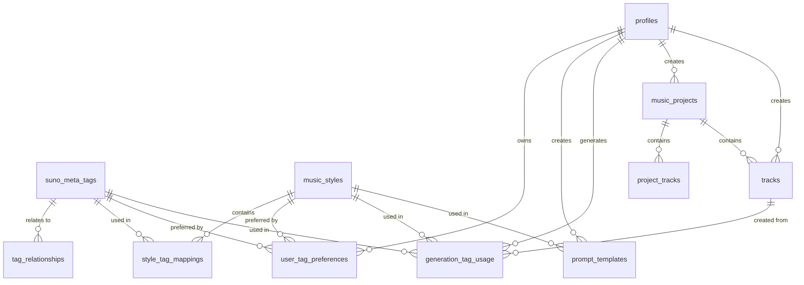

# 🗄️ Database Schema - MusicVerse AI

## Обзор

MusicVerse использует **PostgreSQL** с **графовой структурой данных** для управления:
- 174+ мета-тегов Suno
- 277+ музыкальных стилей
- 500+ связей между тегами
- Пользовательские предпочтения
- История генераций

## Архитектура базы данных



## Основные таблицы

### 1. suno_meta_tags (174+ записей)

Хранение всех доступных мета-тегов Suno AI с категоризацией.

```sql
CREATE TABLE public.suno_meta_tags (
  id UUID PRIMARY KEY DEFAULT gen_random_uuid(),
  tag_name VARCHAR(100) NOT NULL UNIQUE,
  category tag_category NOT NULL,
  description TEXT,
  syntax_format VARCHAR(200),
  is_explicit_format BOOLEAN DEFAULT false,
  compatible_models VARCHAR[] DEFAULT ARRAY['chirp-v4', 'chirp-auk', 'chirp-bluejay', 'chirp-crow'],
  usage_examples TEXT[],
  created_at TIMESTAMPTZ NOT NULL DEFAULT NOW(),
  updated_at TIMESTAMPTZ NOT NULL DEFAULT NOW()
);

CREATE INDEX idx_suno_meta_tags_category ON suno_meta_tags(category);
CREATE INDEX idx_suno_meta_tags_tag_name ON suno_meta_tags(tag_name);
```

**Enum: tag_category**
```sql
CREATE TYPE tag_category AS ENUM (
  'structure',              -- [Intro], [Verse], [Chorus]
  'vocal',                 -- [Male Vocal], [Falsetto]
  'instrument',            -- [Piano], [Guitar]
  'genre_style',           -- [Genre: Pop], [Style: Lo-fi]
  'mood_energy',           -- [Mood: Happy], [Energy: High]
  'production_texture',    -- [Mix: Warm], [Texture: Reverb]
  'effect_processing',     -- [Reverb], [Distortion]
  'special_effects',       -- [Applause], [Rain]
  'transition_dynamics',   -- [Build], [Key Change]
  'format'                 -- [Stereo], [Mono]
);
```

**Пример записи:**
```json
{
  "id": "uuid-here",
  "tag_name": "[Genre: Ambient Electronic]",
  "category": "genre_style",
  "description": "Ambient electronic music style with atmospheric sounds",
  "syntax_format": "[Genre: Ambient Electronic]",
  "is_explicit_format": true,
  "compatible_models": ["chirp-crow", "chirp-bluejay"],
  "usage_examples": ["[Genre: Ambient Electronic] [Mood: Dreamy]"]
}
```

### 2. music_styles (277+ записей)

Каталог уникальных музыкальных стилей с метаданными.

```sql
CREATE TABLE public.music_styles (
  id UUID PRIMARY KEY DEFAULT gen_random_uuid(),
  style_name VARCHAR(200) NOT NULL UNIQUE,
  primary_genre VARCHAR(100),
  geographic_influence VARCHAR(100)[],
  mood_atmosphere VARCHAR(100)[],
  is_fusion BOOLEAN DEFAULT false,
  component_count INTEGER,
  popularity_score INTEGER DEFAULT 0,
  description TEXT,
  created_at TIMESTAMPTZ NOT NULL DEFAULT NOW(),
  updated_at TIMESTAMPTZ NOT NULL DEFAULT NOW()
);

CREATE INDEX idx_music_styles_primary_genre ON music_styles(primary_genre);
CREATE INDEX idx_music_styles_style_name ON music_styles(style_name);
```

**Пример записи:**
```json
{
  "id": "uuid-here",
  "style_name": "ambient dub techno",
  "primary_genre": "Electronic",
  "geographic_influence": ["caribbean"],
  "mood_atmosphere": ["ambient"],
  "is_fusion": true,
  "component_count": 3,
  "popularity_score": 8,
  "description": "Fusion of ambient, dub and techno elements"
}
```

### 3. tag_relationships (500+ связей)

Графовая структура связей между тегами.

```sql
CREATE TABLE public.tag_relationships (
  id UUID PRIMARY KEY DEFAULT gen_random_uuid(),
  tag_id UUID NOT NULL REFERENCES suno_meta_tags(id) ON DELETE CASCADE,
  related_tag_id UUID NOT NULL REFERENCES suno_meta_tags(id) ON DELETE CASCADE,
  relationship_type VARCHAR(50) NOT NULL,
  strength INTEGER DEFAULT 1 CHECK (strength >= 1 AND strength <= 10),
  description TEXT,
  created_at TIMESTAMPTZ NOT NULL DEFAULT NOW(),
  UNIQUE(tag_id, related_tag_id, relationship_type)
);

CREATE INDEX idx_tag_relationships_tag_id ON tag_relationships(tag_id);
CREATE INDEX idx_tag_relationships_related_tag_id ON tag_relationships(related_tag_id);
```

**Типы связей:**
- `complements` - Дополняет (например, [Piano] + [Strings])
- `conflicts` - Конфликтует ([Fast BPM] + [Slow Mood])
- `enhances` - Усиливает ([Reverb] + [Wide Stereo])
- `requires` - Требует ([Vocals] + [Language: English])

**Пример записи:**
```json
{
  "id": "uuid-here",
  "tag_id": "piano-tag-uuid",
  "related_tag_id": "strings-tag-uuid",
  "relationship_type": "complements",
  "strength": 8,
  "description": "Piano and strings work well together in classical arrangements"
}
```

### 4. style_tag_mappings

Связь стилей с рекомендуемыми тегами.

```sql
CREATE TABLE public.style_tag_mappings (
  id UUID PRIMARY KEY DEFAULT gen_random_uuid(),
  style_id UUID NOT NULL REFERENCES music_styles(id) ON DELETE CASCADE,
  tag_id UUID NOT NULL REFERENCES suno_meta_tags(id) ON DELETE CASCADE,
  relevance_score INTEGER DEFAULT 5 CHECK (relevance_score >= 1 AND relevance_score <= 10),
  is_primary BOOLEAN DEFAULT false,
  created_at TIMESTAMPTZ NOT NULL DEFAULT NOW(),
  UNIQUE(style_id, tag_id)
);

CREATE INDEX idx_style_tag_mappings_style_id ON style_tag_mappings(style_id);
CREATE INDEX idx_style_tag_mappings_tag_id ON style_tag_mappings(tag_id);
```

### 5. user_tag_preferences

Персональные предпочтения пользователей по тегам и стилям.

```sql
CREATE TABLE public.user_tag_preferences (
  id UUID PRIMARY KEY DEFAULT gen_random_uuid(),
  user_id UUID NOT NULL,
  tag_id UUID NOT NULL REFERENCES suno_meta_tags(id) ON DELETE CASCADE,
  style_id UUID REFERENCES music_styles(id) ON DELETE CASCADE,
  usage_count INTEGER DEFAULT 0,
  is_favorite BOOLEAN DEFAULT false,
  last_used_at TIMESTAMPTZ,
  created_at TIMESTAMPTZ NOT NULL DEFAULT NOW(),
  updated_at TIMESTAMPTZ NOT NULL DEFAULT NOW(),
  UNIQUE(user_id, tag_id, style_id)
);

CREATE INDEX idx_user_tag_preferences_user_id ON user_tag_preferences(user_id);
CREATE INDEX idx_user_tag_preferences_tag_id ON user_tag_preferences(tag_id);
```

### 6. prompt_templates

Шаблоны промптов для повторного использования.

```sql
CREATE TABLE public.prompt_templates (
  id UUID PRIMARY KEY DEFAULT gen_random_uuid(),
  user_id UUID,
  name VARCHAR(200) NOT NULL,
  template_text TEXT NOT NULL,
  tags UUID[] NOT NULL,
  style_id UUID REFERENCES music_styles(id) ON DELETE SET NULL,
  is_public BOOLEAN DEFAULT false,
  usage_count INTEGER DEFAULT 0,
  created_at TIMESTAMPTZ NOT NULL DEFAULT NOW(),
  updated_at TIMESTAMPTZ NOT NULL DEFAULT NOW()
);

CREATE INDEX idx_prompt_templates_user_id ON prompt_templates(user_id);
```

### 7. generation_tag_usage

История использования тегов в генерациях.

```sql
CREATE TABLE public.generation_tag_usage (
  id UUID PRIMARY KEY DEFAULT gen_random_uuid(),
  user_id UUID NOT NULL,
  track_id UUID REFERENCES tracks(id) ON DELETE CASCADE,
  tags_used UUID[] NOT NULL,
  style_id UUID REFERENCES music_styles(id) ON DELETE SET NULL,
  prompt_text TEXT,
  success BOOLEAN DEFAULT true,
  created_at TIMESTAMPTZ NOT NULL DEFAULT NOW()
);

CREATE INDEX idx_generation_tag_usage_user_id ON generation_tag_usage(user_id);
CREATE INDEX idx_generation_tag_usage_track_id ON generation_tag_usage(track_id);
```

## Database Functions

### get_complementary_tags

Рекурсивный поиск совместимых тегов в графе.

```sql
CREATE OR REPLACE FUNCTION public.get_complementary_tags(
  _tag_id UUID,
  _max_depth INTEGER DEFAULT 2
)
RETURNS TABLE (
  tag_id UUID,
  tag_name VARCHAR,
  relationship_type VARCHAR,
  strength INTEGER,
  depth INTEGER
)
LANGUAGE plpgsql
STABLE
SECURITY DEFINER
SET search_path = public
AS $$
BEGIN
  RETURN QUERY
  WITH RECURSIVE tag_graph AS (
    -- Base: прямые связи
    SELECT 
      tr.related_tag_id AS tag_id,
      smt.tag_name,
      tr.relationship_type,
      tr.strength,
      1 AS depth
    FROM tag_relationships tr
    JOIN suno_meta_tags smt ON smt.id = tr.related_tag_id
    WHERE tr.tag_id = _tag_id
      AND tr.relationship_type IN ('complements', 'enhances')
    
    UNION
    
    -- Recursive: обход графа
    SELECT 
      tr.related_tag_id,
      smt.tag_name,
      tr.relationship_type,
      tr.strength,
      tg.depth + 1
    FROM tag_graph tg
    JOIN tag_relationships tr ON tr.tag_id = tg.tag_id
    JOIN suno_meta_tags smt ON smt.id = tr.related_tag_id
    WHERE tg.depth < _max_depth
      AND tr.relationship_type IN ('complements', 'enhances')
      AND tr.related_tag_id != _tag_id
  )
  SELECT DISTINCT 
    tg.tag_id,
    tg.tag_name,
    tg.relationship_type,
    tg.strength,
    tg.depth
  FROM tag_graph tg
  ORDER BY tg.strength DESC, tg.depth ASC;
END;
$$;
```

**Использование:**
```sql
-- Найти совместимые теги для Piano
SELECT * FROM get_complementary_tags('piano-tag-uuid', 2);

-- Результат:
-- tag_name            | relationship_type | strength | depth
-- [Strings]          | complements       | 8        | 1
-- [Vocals]           | complements       | 7        | 1
-- [Reverb]           | enhances          | 6        | 2
```

### build_suno_prompt

Автоматическое построение промпта из тегов.

```sql
CREATE OR REPLACE FUNCTION public.build_suno_prompt(
  _tag_ids UUID[],
  _style_id UUID DEFAULT NULL
)
RETURNS TEXT
LANGUAGE plpgsql
STABLE
SECURITY DEFINER
SET search_path = public
AS $$
DECLARE
  _prompt TEXT := '';
  _tag RECORD;
BEGIN
  -- Добавить стиль
  IF _style_id IS NOT NULL THEN
    SELECT style_name INTO _prompt 
    FROM music_styles 
    WHERE id = _style_id;
    _prompt := COALESCE(_prompt, '');
  END IF;
  
  -- Добавить теги
  FOR _tag IN 
    SELECT tag_name, syntax_format 
    FROM suno_meta_tags 
    WHERE id = ANY(_tag_ids)
    ORDER BY category, tag_name
  LOOP
    IF _tag.syntax_format IS NOT NULL THEN
      _prompt := _prompt || ' ' || _tag.syntax_format;
    ELSE
      _prompt := _prompt || ' ' || _tag.tag_name;
    END IF;
  END LOOP;
  
  RETURN TRIM(_prompt);
END;
$$;
```

**Использование:**
```sql
SELECT build_suno_prompt(
  ARRAY[
    'genre-pop-uuid',
    'mood-happy-uuid',
    'instrument-piano-uuid'
  ],
  'k-pop-style-uuid'
);

-- Результат:
-- "k-pop [Genre: Pop] [Mood: Happy] [Instrument: Piano]"
```

### recommend_styles_for_user

Персональные рекомендации на основе истории.

```sql
CREATE OR REPLACE FUNCTION public.recommend_styles_for_user(
  _user_id UUID,
  _limit INTEGER DEFAULT 10
)
RETURNS TABLE (
  style_id UUID,
  style_name VARCHAR,
  recommendation_score NUMERIC
)
LANGUAGE plpgsql
STABLE
SECURITY DEFINER
SET search_path = public
AS $$
BEGIN
  RETURN QUERY
  SELECT 
    ms.id AS style_id,
    ms.style_name,
    (
      COALESCE(SUM(utp.usage_count), 0) * 1.0 +
      COALESCE(COUNT(DISTINCT CASE WHEN utp.is_favorite THEN utp.tag_id END), 0) * 5.0 +
      ms.popularity_score * 0.1
    ) AS recommendation_score
  FROM music_styles ms
  LEFT JOIN style_tag_mappings stm ON stm.style_id = ms.id
  LEFT JOIN user_tag_preferences utp ON utp.tag_id = stm.tag_id AND utp.user_id = _user_id
  GROUP BY ms.id, ms.style_name, ms.popularity_score
  ORDER BY recommendation_score DESC
  LIMIT _limit;
END;
$$;
```

**Использование:**
```sql
-- Получить топ-10 рекомендаций для пользователя
SELECT * FROM recommend_styles_for_user('user-uuid', 10);

-- Результат:
-- style_name              | recommendation_score
-- lo-fi hip hop          | 42.3
-- ambient electronic     | 38.7
-- synthwave             | 35.2
```

## Row Level Security (RLS)

Все таблицы защищены RLS политиками:

### Публичные данные (только чтение)

```sql
-- Мета-теги доступны всем
CREATE POLICY "Anyone can view meta tags"
ON suno_meta_tags FOR SELECT USING (true);

-- Стили доступны всем
CREATE POLICY "Anyone can view music styles"
ON music_styles FOR SELECT USING (true);

-- Связи тегов доступны всем
CREATE POLICY "Anyone can view tag relationships"
ON tag_relationships FOR SELECT USING (true);
```

### Пользовательские данные

```sql
-- Предпочтения: только свои
CREATE POLICY "Users can manage own preferences"
ON user_tag_preferences FOR ALL
USING (auth.uid() = user_id);

-- Шаблоны: свои + публичные
CREATE POLICY "Users can view own and public templates"
ON prompt_templates FOR SELECT
USING (auth.uid() = user_id OR is_public = true);

CREATE POLICY "Users can manage own templates"
ON prompt_templates FOR ALL
USING (auth.uid() = user_id);
```

## Оптимизация

### Индексы

Все критичные поля имеют индексы:
- `category` для фильтрации тегов
- `tag_name` для поиска
- `primary_genre` для группировки стилей
- Внешние ключи для JOIN операций
- UUID массивы для быстрого поиска

### Кэширование

Рекомендуется кэшировать на уровне приложения:
- Список всех тегов (обновляется редко)
- Список стилей (обновляется редко)
- Граф связей (статичен)

### Мониторинг

```sql
-- Топ используемых тегов
SELECT 
  smt.tag_name,
  COUNT(*) as usage_count
FROM generation_tag_usage gtu
JOIN unnest(gtu.tags_used) tag_id ON true
JOIN suno_meta_tags smt ON smt.id = tag_id::uuid
GROUP BY smt.tag_name
ORDER BY usage_count DESC
LIMIT 20;

-- Топ стилей
SELECT 
  ms.style_name,
  COUNT(*) as usage_count
FROM generation_tag_usage gtu
JOIN music_styles ms ON ms.id = gtu.style_id
GROUP BY ms.style_name
ORDER BY usage_count DESC
LIMIT 20;
```

## Миграции

Все изменения схемы выполняются через миграции Supabase:

```bash
supabase/migrations/
├── 20240101_create_suno_tables.sql
├── 20240102_populate_meta_tags.sql
├── 20240103_populate_music_styles.sql
└── 20240104_create_graph_relations.sql
```

## Backup

Автоматический backup через Supabase:
- Ежедневный backup всей БД
- Point-in-time recovery (7 дней)
- Manual backup перед мажорными изменениями
