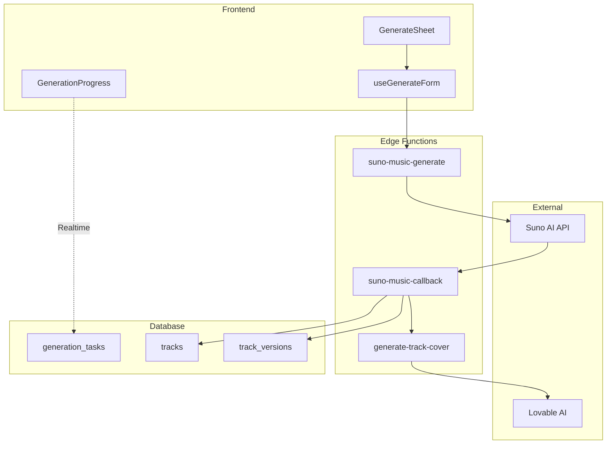
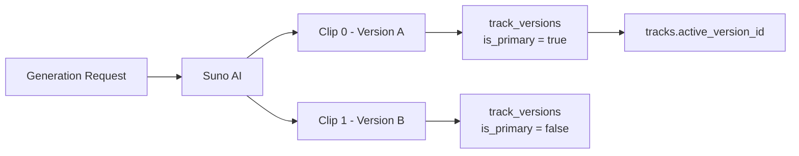
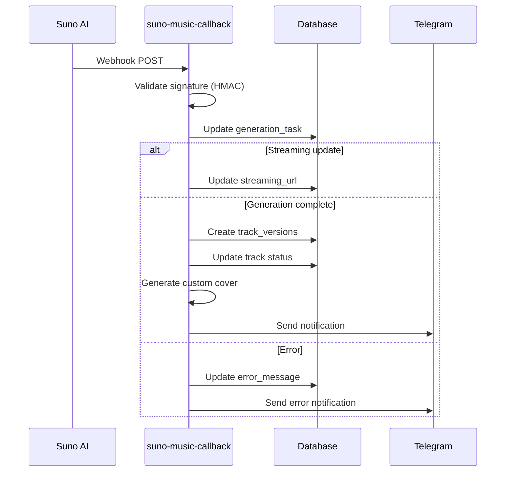

# 🎵 Система генерации музыки

**Last Updated:** 2026-01-04

Полное описание системы генерации треков через Suno AI.

## Обзор

MusicVerse использует Suno AI v5 для генерации музыки с поддержкой:
- A/B версионирование (2 варианта на запрос)
- Streaming preview во время генерации
- Custom mode с полным контролем lyrics
- Audio reference для covers/extends
- Section replacement для точечных изменений

## Архитектура



## Режимы генерации

### Simple Mode
Быстрая генерация по текстовому описанию:
- Prompt (описание трека)
- Style (жанр/настроение)
- Instrumental flag

```typescript
{
  mode: 'simple',
  prompt: 'Энергичная поп песня о лете',
  style: 'pop, upbeat, summer vibes',
  is_instrumental: false
}
```

### Custom Mode
Полный контроль над генерацией:
- Lyrics (текст песни с тегами секций)
- Style prompt
- Title
- Negative tags

```typescript
{
  mode: 'custom',
  title: 'Летний бриз',
  lyrics: '[Verse]\nСолнце светит ярко...\n[Chorus]\nЛето, лето...',
  style: 'pop ballad, dreamy vocals, acoustic guitar',
  negative_tags: 'heavy metal, screaming'
}
```

## A/B Версионирование

Каждая генерация создаёт 2 варианта трека:



### Переключение версий

```typescript
// В VersionSwitcher компоненте
const switchVersion = async (versionId: string) => {
  await supabase
    .from('tracks')
    .update({ active_version_id: versionId })
    .eq('id', trackId);
};
```

## Streaming Preview

Во время генерации доступен preview:

```typescript
// В suno-music-callback
if (clip.audio_url && !clip.is_complete) {
  await supabase
    .from('tracks')
    .update({ streaming_url: clip.audio_url })
    .eq('id', trackId);
}

// Frontend подписывается на Realtime
const channel = supabase
  .channel('track-streaming')
  .on('postgres_changes', {
    event: 'UPDATE',
    schema: 'public',
    table: 'tracks',
    filter: `id=eq.${trackId}`
  }, (payload) => {
    if (payload.new.streaming_url) {
      playStreamingPreview(payload.new.streaming_url);
    }
  })
  .subscribe();
```

## Callback обработка



## Cover генерация

Кастомные обложки без watermark:

```typescript
// В generate-track-cover
const prompt = `
  Abstract music visualization for "${trackTitle}"
  Style: ${style}
  Design: futuristic, vibrant colors, no text, no watermarks
  MusicVerse aesthetic
`;

const result = await fetch('https://openrouter.ai/api/v1/chat/completions', {
  body: JSON.stringify({
    model: 'google/gemini-3-pro-image-preview',
    messages: [{ role: 'user', content: prompt }]
  })
});
```

## База данных

### generation_tasks
```sql
CREATE TABLE generation_tasks (
  id UUID PRIMARY KEY,
  user_id UUID NOT NULL,
  prompt TEXT NOT NULL,
  status TEXT DEFAULT 'pending', -- pending, processing, completed, failed
  suno_task_id TEXT,
  track_id UUID,
  audio_clips JSONB,
  error_message TEXT,
  created_at TIMESTAMPTZ,
  completed_at TIMESTAMPTZ
);
```

### tracks
```sql
CREATE TABLE tracks (
  id UUID PRIMARY KEY,
  user_id UUID NOT NULL,
  title TEXT,
  prompt TEXT NOT NULL,
  style TEXT,
  lyrics TEXT,
  audio_url TEXT,
  streaming_url TEXT,
  cover_url TEXT,
  status TEXT DEFAULT 'pending',
  active_version_id UUID,
  has_stems BOOLEAN DEFAULT false,
  is_instrumental BOOLEAN DEFAULT false,
  duration_seconds INTEGER,
  play_count INTEGER DEFAULT 0,
  likes_count INTEGER DEFAULT 0
);
```

### track_versions
```sql
CREATE TABLE track_versions (
  id UUID PRIMARY KEY,
  track_id UUID REFERENCES tracks(id),
  audio_url TEXT NOT NULL,
  cover_url TEXT,
  version_label TEXT, -- 'Version A', 'Version B'
  version_type TEXT, -- 'original', 'extend', 'cover', 'section_replace'
  is_primary BOOLEAN DEFAULT false,
  clip_index INTEGER,
  duration_seconds INTEGER
);
```

## Лимиты Suno API

| Параметр | Лимит |
|----------|-------|
| Prompt length | 500 символов (non-custom) |
| Style length | 500 символов |
| Title length | 80 символов |
| Lyrics length | 3000 символов |

## Error Handling

```typescript
// Типичные ошибки
const SUNO_ERRORS = {
  RATE_LIMIT: 'Too many requests',
  CONTENT_POLICY: 'Content policy violation',
  TIMEOUT: 'Generation timeout',
  INVALID_AUDIO: 'Invalid audio reference'
};

// Retry strategy
const MAX_RETRIES = 3;
const RETRY_DELAY = 5000; // 5 seconds
```

## Мониторинг

### Метрики
- Время генерации (avg, p95)
- Success rate
- Error breakdown by type
- Streaming preview availability

### Алерты
- Error rate > 10%
- Avg generation time > 5 min
- Callback failures

## Best Practices

1. **Prompt optimization**: Boost style через AI перед отправкой
2. **Character limits**: Валидация на клиенте до отправки
3. **Timeout handling**: 10 минут максимум на генерацию
4. **Duplicate prevention**: Проверка активных задач перед созданием
5. **Cleanup**: Удаление orphaned tasks через scheduled function

---

## UI/UX Форма генерации

### Обновления (2026-01-04)

**Компактный хедер:**
- Удалён логотип
- Уменьшены размеры компонентов (`min-h-[36px]`, `py-1`)
- Model Selector только в хедере (убрано дублирование)

**Подсказки (Hints):**
- Заменены `Tooltip` на `Popover` для мобильных
- Работают по клику на `?` иконку

**Copy/Delete кнопки:**
- Полностью скрыты когда поле пустое
- Появляются только при наличии текста

**Compact Lyrics Visual Editor:**
- Создан `LyricsVisualEditorCompact.tsx`
- Timeline секций (badges)
- Простые карточки без drag-drop
- Quick structure templates (Поп, Рок, Баллада)

**Advanced Options:**
- Заметная кнопка с dashed border
- Удалён дублирующий Model Selector

---

## См. также

- [UI Аудит формы генерации](./UI_GENERATION_FORM_AUDIT_2025-12-13.md)
- [Stem Studio](./STEM_STUDIO.md)
- [AI Lyrics Assistant](./AI_LYRICS_ASSISTANT.md)
