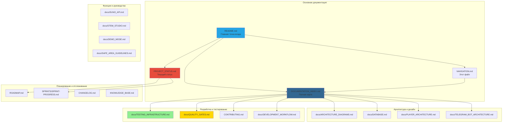

# 📚 Полное руководство по навигации и перекрёстным ссылкам

**Последнее обновление:** 2024-06-24  
**Статус:** ✅ Комплексный | **Файлов:** 100+ взаимосвязанных

---

## 🔗 Центр навигации

Этот документ служит центральным узлом навигации для всей экосистемы документации MusicVerse AI. Используйте его для быстрого поиска любого документа, понимания связей между файлами и обнаружения связанных ресурсов.

---

## 🗺️ Обзор экосистемы документации

<div align="center">



</div>

---

## 📂 Навигация по категориям

### 🏠 Файлы корневого уровня

| Документ | Назначение | Статус | Связи |
|----------|-----------|--------|------|
| **[README.md](../README.md)** | Главная точка входа проекта | ✅ Актуален | Все доки |
| **[DOCUMENTATION_INDEX.md](../DOCUMENTATION_INDEX.md)** | Полная карта документации | ✅ Обновлён | Все доки |
| **[CLAUDE.md](../CLAUDE.md)** | Инструкции для Claude Code | ✅ Актуален | Разработка |
| **[CHANGELOG.md](../CHANGELOG.md)** | История версий | ✅ Активен | Все изменения |
| **[CONTRIBUTING.md](../CONTRIBUTING.md)** | Руководство по контрибуции | ✅ Активен | Разработка |
| **[LICENSE](../LICENSE)** | Лицензия MIT | ✅ Стабилен | Юридические |
| **[PROJECT_STATUS.md](../PROJECT_STATUS.md)** | Текущий статус проекта | ✅ Обновлён | Планирование |
| **[ROADMAP.md](../ROADMAP.md)** | Дорожная карта развития | ✅ Активен | Планирование |

---

### 📊 Статус и планирование

| Документ | Описание | Статус | Последнее обновление |
|----------|-------------|--------|-------------------|
| **[PROJECT_STATUS.md](../PROJECT_STATUS.md)** | 🎯 **Комплексный статус проекта** | ✅ Обновлён | 2024-06-24 |
| **[docs/PROGRESS.md](docs/PROGRESS.md)** | Трекер прогресса проекта | ✅ **НОВЫЙ** | 2024-06-24 |
| **[ROADMAP.md](../ROADMAP.md)** | Дорожная карта | ✅ Активен | 2024-06-24 |
| **[SPRINTS/SPRINT-PROGRESS.md](../SPRINTS/SPRINT-PROGRESS.md)** | Прогресс спринтов (35 завершено) | ✅ Завершён | 2024-06-24 |
| **[SPRINTS/BACKLOG.md](../SPRINTS/BACKLOG.md)** | Бэклог продукта | ✅ Активен | 2024-06-24 |
| **[SPRINTS/FUTURE_WORK_PLAN_2026.md](../SPRINTS/FUTURE_WORK_PLAN_2026.md)** | Планы на Q2 2026 | ✅ Активен | 2024-06-24 |
| **[SPRINTS/IMPROVEMENT_PLAN_2026.md](../SPRINTS/IMPROVEMENT_PLAN_2026.md)** | Приоритеты улучшений | ✅ Активен | 2024-06-24 |

---

### 🏗️ Архитектура системы

| Документ | Описание | Статус | Связи |
|----------|-------------|--------|------|
| **[docs/ARCHITECTURE_DIAGRAMS.md](docs/ARCHITECTURE_DIAGRAMS.md)** | Визуальные системные диаграммы | ✅ Комплексный | Вся архитектура |
| **[docs/DATABASE.md](docs/DATABASE.md)** | Схема базы данных и ERD | ✅ Детальный | Backend |
| **[docs/PLAYER_ARCHITECTURE.md](docs/PLAYER_ARCHITECTURE.md)** | Архитектура аудио плеера | ✅ Полный | Аудио |
| **[docs/TELEGRAM_BOT_ARCHITECTURE.md](docs/TELEGRAM_BOT_ARCHITECTURE.md)** | Архитектура бота | ✅ Актуален | Telegram |
| **[docs/PROJECT_SPECIFICATION.md](docs/PROJECT_SPECIFICATION.md)** | Спецификация проекта | ✅ Детальный | Планирование |
| **[docs/SUNO_API.md](docs/SUNO_API.md)** | Интеграция Suno AI | ✅ Актуален | API |

---

### 🧪 Тестирование и качество

| Документ | Описание | Статус | Связи |
|----------|-------------|--------|------|
| **[docs/TESTING_INFRASTRUCTURE.md](docs/TESTING_INFRASTRUCTURE.md)** | Полная настройка тестирования | ✅ **НОВЫЙ** | Качество |
| **[docs/QUALITY_GATES.md](docs/QUALITY_GATES.md)** | Стандарты качества | ✅ **НОВЫЙ** | Quality |
| **[docs/PERFORMANCE.md](docs/PERFORMANCE.md)** | Отслеживание производительности | ✅ Активен | Мониторинг |
| **[tests/e2e/](../tests/e2e/)** | 62+ E2E тестов | ✅ Комплексное | Тестирование |
| **[tests/integration/](../tests/integration/)** | API integration тесты | ✅ Хорошее | Тестирование |

---

### 📱 Мобильная и Telegram документация

| Документ | Описание | Статус | Связи |
|----------|-------------|--------|------|
| **[docs/SAFE_AREA_GUIDELINES.md](docs/SAFE_AREA_GUIDELINES.md)** | Руководство по безопасным зонам | ✅ Mobile-optimized | Mobile |
| **[docs/TELEGRAM_MINI_APP_FEATURES.md](docs/TELEGRAM_MINI_APP_FEATURES.md)** | Функции Mini App | ✅ Актуален | Telegram |
| **[docs/mobile/OPTIMIZATION_ROADMAP_2026.md](docs/mobile/OPTIMIZATION_ROADMAP_2026.md)** | План оптимизации мобильных | ✅ Активен | Mobile |
| **[SPRINTS/completed/SPRINT-029-TELEGRAM-MOBILE-OPTIMIZATION.md](../SPRINTS/completed/SPRINT-029-TELEGRAM-MOBILE-OPTIMIZATION.md)** | Mobile оптимизация спринт | ✅ Завершён | Mobile |

---

### 🎵 Документация функций

| Документ | Описание | Статус | Связи |
|----------|-------------|--------|------|
| **[docs/STEM_STUDIO.md](docs/STEM_STUDIO.md)** | Функции Stem Studio | ✅ Обновлён | Функции |
| **[docs/DEMO_MODE.md](docs/DEMO_MODE.md)** | Документация гостевого режима | ✅ Актуален | Функции |
| **[docs/KNOWN_ISSUES.md](docs/KNOWN_ISSUES.md)** | Известные проблемы и обходные пути | ✅ Архив | Поддержка |

---

### 🛠️ Рабочий процесс

| Документ | Описание | Статус | Связи |
|----------|-------------|--------|------|
| **[CONTRIBUTING.md](../CONTRIBUTING.md)** | Руководство по контрибуции | ✅ Активен | Разработка |
| **[docs/DEVELOPMENT_WORKFLOW.md](docs/DEVELOPMENT_WORKFLOW.md)** | Рабочий процесс | ✅ Комплексный | Разработка |
| **[docs/ONBOARDING.md](docs/ONBOARDING.md)** | Гайд для новых разработчиков | ✅ Актуален | Обучение |
| **[CLAUDE.md](../CLAUDE.md)** | Инструкции Claude Code | ✅ Актуален | Разработка |

---

### 🗺️ Records архитектурных решений

| Record | Тема | Статус | Связи |
|--------|-------|--------|------|
| **[ADR-001: Technology Stack](../ADR/ADR-001-technology-stack.md)** | Выбор технологий | ✅ Принято | Архитектура |
| **[ADR-002: Frontend Architecture](../ADR/ADR-002-frontend-architecture.md)** | Frontend архитектура | ✅ Принято | Frontend |
| **[ADR-003: Performance Optimization](../ADR/ADR-003-performance-optimization.md)** | Оптимизация производительности | ✅ Принято | Производительность |
| **[ADR-004: Error Handling](../ADR/ADR-004-error-handling.md)** | Архитектура обработки ошибок | ✅ Принято | Ошибки |
| **[ADR-005: State Machine](../ADR/ADR-005-state-machine.md)** | Архитектура состояний | ✅ Принято | State |
| **[ADR-006: Audio Context](../ADR/ADR-006-audio-context.md)** | Type-safe аудио контекст | ✅ Принято | Аудио |
| **[ADR-011: Unified Studio](../ADR/ADR-011-unified-studio.md)** | Архитектура unified студии | ✅ Принято | Studio |

---

### 📋 Технические спецификации

| Спецификация | Описание | Статус | Связи |
|---------------|-------------|--------|------|
| **[specs/001-mobile-ui-redesign/](../specs/001-mobile-ui-redesign/)** | Mobile UI редизайн | ✅ Завершён | Mobile |
| **[specs/031-mobile-studio-v2](../specs/031-mobile-studio-v2/)** | Mobile студия V2 | ✅ Активен | Studio |
| **[specs/032-professional-ui/](../specs/032-professional-ui/)** | Professional UI | ✅ Активен | UI |

---

## 🔄 Матрица перекрёстных ссылок

### По типу документа

| Тип | Документы | Ключевые файлы |
|-----|----------|---------------|
| **📖 Руководства** | 15+ | README.md, CONTRIBUTING.md, ONBOARDING.md |
| **🏗️ Архитектура** | 12+ | ARCHITECTURE_DIAGRAMS.md, DATABASE.md, ADR/* |
| **📊 Статус** | 8+ | PROJECT_STATUS.md, ROADMAP.md, SPRINT-PROGRESS.md |
| **🧪 Тестирование** | 6+ | TESTING_INFRASTRUCTURE.md, QUALITY_GATES.md |
| **📱 Мобильное** | 10+ | SAFE_AREA_GUIDELINES.md, MOBILE/* |
| **🎵 Функции** | 8+ | SUNO_API.md, STEM_STUDIO.md, DEMO_MODE.md |

### По технологическому фокусу

| Фокус | Основные доки | Связанные доки |
|-------|-------------|---------------|
| **React/TypeScript** | CLAUDE.md, DEVELOPMENT_WORKFLOW.md | ADR-002, ADR-006 |
| **Аудио** | PLAYER_ARCHITECTURE.md, SUNO_API.md | ADR-006, STEM_STUDIO.md |
| **Мобильное** | SAFE_AREA_GUIDELINES.md, mobile/* | specs/031, ADR-011 |
| **База данных** | DATABASE.md | ADR-001 |
| **Тестирование** | TESTING_INFRASTRUCTURE.md, QUALITY_GATES.md | tests/* |
| **Telegram** | TELEGRAM_BOT_ARCHITECTURE.md, TELEGRAM_MINI_APP_FEATURES.md | ADR-001 |

---

## 🔍 Поиск и открытие

### Найти документы по...

#### ...теме
- **Архитектура** → Секция "Архитектура системы"
- **Тестирование** → Секция "Тестирование и качество"
- **Мобильное** → Секция "Мобильная и Telegram"
- **Функции** → Секция "Документация функций"

#### ...статусу
- **✅ Актуальный/Активный** → Последние обновлённые файлы
- **🔄 В разработке** → specs/, SPRINTS/ директории
- **📜 Архив** → KNOWN_ISSUES.md, SPRINTS/completed/

#### ...формату
- **📊 Прогресс** → docs/PROGRESS.md
- **🗺️ Навигация** → docs/NAVIGATION.md (этот файл)
- **📖 Руководства** -> DEVELOPMENT_WORKFLOW.md, ONBOARDING.md
- **🧪 Тестирование** -> docs/TESTING_INFRASTRUCTURE.md, QUALITY_GATES.md

---

## 🎯 Паттерны быстрого доступа

### Общие пути навигации

**1. Онбординг нового разработчика**
```
README.md 
  → CONTRIBUTING.md 
  → docs/ONBOARDING.md 
  → docs/DEVELOPMENT_WORKFLOW.md
```

**2. Понимание архитектуры**
```
DOCUMENTATION_INDEX.md 
  → docs/ARCHITECTURE_DIAGRAMS.md 
  → docs/DATABASE.md 
  → ADR/* (relevant ADRs)
```

**3. Мобильная разработка**
```
docs/SAFE_AREA_GUIDELINES.md 
  → docs/mobile/OPTIMIZATION_ROADMAP_2026.md
  → SPRINTS/completed/SPRINT-029-*
  → specs/031-mobile-studio-v2/
```

**4. Реализация тестирования**
```
docs/TESTING_INFRASTRUCTURE.md
  → docs/QUALITY_GATES.md
  → tests/e2e/*.spec.ts (примеры)
  → README.md (секция запуска тестов)
```

**5. Разработка функций**
```
ROADMAP.md 
  → SPRINTS/SPRINT-PROGRESS.md
  → specs/* (соответствующая спецификация)
  → docs/DEVELOPMENT_WORKFLOW.md
```

---

## 🔗 Внешние ссылки

### GitHub ресурсы
- **🏠 Репозиторий:** [github.com/HOW2AI-AGENCY/aimusicverse](https://github.com/HOW2AI-AGENCY/aimusicverse)
- **🐛 Issues:** [GitHub Issues](https://github.com/HOW2AI-AGENCY/aimusicverse/issues)
- **💡 Discussions:** [GitHub Discussions](https://github.com/HOW2AI-AGENCY/aimusicverse/discussions)
- **🔄 Pull Requests:** [GitHub PRs](https://github.com/HOW2AI-AGENCY/aimusicverse/pulls)
- **🎯 Actions:** [GitHub Actions](https://github.com/HOW2AI-AGENCY/aimusicverse/actions)

### Внешние сервисы
- **🤖 Telegram Bot:** [t.me/AIMusicVerseBot](https://t.me/AIMusicVerseBot)
- **📢 Новости:** [t.me/AIMusicVerse](https://t.me/AIMusicVerse)
- **🎵 Suno AI:** [suno.ai](https://suno.ai/)
- **🗄️ Supabase:** [supabase.com](https://supabase.com/)

---

## 📝 Организация файлов

### Структура директорий
```
aimusicverse/
├── README.md                          # Главная точка входа
├── CLAUDE.md                          # Инструкции Claude Code
├── DOCUMENTATION_INDEX.md             # Полная карта docs
├── PROJECT_STATUS.md                  # Текущий статус
├── docs/PROGRESS.md                   # Трекер прогресса
├── ROADMAP.md                         # Планы развития
├── CHANGELOG.md                       # История версий
├── CONTRIBUTING.md                    # Руководство по контрибуции
│
├── docs/                              # 100+ файлов документации
│   ├── NAVIGATION.md                  # Этот файл
│   ├── ARCHITECTURE_DIAGRAMS.md      # Системные диаграммы
│   ├── DATABASE.md                    # Схема БД
│   ├── TESTING_INFRASTRUCTURE.md     # Настройка тестирования
│   ├── QUALITY_GATES.md              # Стандарты качества
│   └── ...                           # Другая документация
│
├── ADR/                              # Architecture Decision Records
│   ├── ADR-001-technology-stack.md
│   ├── ADR-002-frontend-architecture.md
│   └── ...                           # 7 ADRs всего
│
├── specs/                            # Технические спецификации
│   ├── 001-mobile-ui-redesign/
│   ├── 031-mobile-studio-v2/
│   └── 032-professional-ui/
│
├── SPRINTS/                          # Документация спринтов
│   ├── SPRINT-PROGRESS.md            # Трекинг спринтов
│   ├── BACKLOG.md                    # Бэклог продукта
│   ├── FUTURE_WORK_PLAN_2026.md      # Планы Q2 2026
│   └── completed/                    # 35 завершённых спринтов
│
└── tests/                            # Тестовые файлы
    ├── e2e/                         # 62+ E2E тестов
    ├── unit/                        # 27+ unit тестов
    └── integration/                 # API integration тесты
```

---

## 🎯 Стандарты документации

### Заголовок шаблон
Все файлы документации должны включать:
- Заголовок с соответствующим emoji
- Дата последнего обновления
- Status badge
- Быстрые навигационные ссылки
- Таблица связанных документов

### Footer шаблон
Все файлы документации должны включать:
- Секция дополнительных ресурсов
- Ссылки на сообщество и поддержку
- Ресурсы для разработчиков
- Секция быстрых ссылок
- Ссылка "В начало" (back to top)

### Руководство по перекрёстным ссылкам
- Используйте относительные пути для внутренних ссылок
- Используйте абсолютные URL для внешних ссылок
- Включайте таблицу связанных документов в заголовки
- Добавляйте секции "Смотрите также" для связанных тем
- Используйте согласованные соглашения об именовании

---

## 📊 Метрики документации

<div align="center">

| Метрика | Значение | Статус |
|---------|----------|--------|
| **Всего файлов документации** | 100+ | ✅ Комплексный |
| **Архитектурные доки** | 12+ | ✅ Хорошо задокументировано |
| **Доки тестирования** | 6+ | ✅ Хорошее покрытие |
| **Мобильные доки** | 10+ | ✅ Mobile-focused |
| **Доки функций** | 8+ | ✅ Полный |
| **ADR records** | 7 | ✅ Решения отслеживаются |
| **Технические спецификации** | 3 | ✅ Активны |
| **Sprint доки** | 35+ | ✅ Комплексный |
| **Перекрёстные ссылки** | 200+ | ✅ Хорошо связано |

</div>

---

## 🔧 Руководство по поддержке

### Регулярные обновления
- **Еженедельно:** Обновлять прогресс спринтов, статус проекта
- **Ежемесячно:** Обзор и обновление roadmap, changelog
- **Ежеквартально:** Комплексный аудит документации
- **По необходимости:** Обновлять документацию функций, архитектуры

### Критерии качества
- ✅ Все ссылки работают
- ✅ Перекрёстные ссылки точны
- ✅ Status бейджи актуальны
- ✅ Даты обновлены
- ✅ Форматирование согласовано
- ✅ Таблицы правильно отформатированы

---

## 🎓 Пути обучения

### Для новых разработчиков
1. Начните с [README.md](../README.md)
2. Прочитайте [CONTRIBUTING.md](../CONTRIBUTING.md)
3. Изучите [docs/ONBOARDING.md](docs/ONBOARDING.md)
4. Ознакомьтесь с [docs/DEVELOPMENT_WORKFLOW.md](docs/DEVELOPMENT_WORKFLOW.md)
5. Изучите [docs/ARCHITECTURE_DIAGRAMS.md](docs/ARCHITECTURE_DIAGRAMS.md)

### Для мобильных разработчиков
1. Изучите [docs/SAFE_AREA_GUIDELINES.md](docs/SAFE_AREA_GUIDELINES.md)
2. Изучите [docs/mobile/OPTIMIZATION_ROADMAP_2026.md](docs/mobile/OPTIMIZATION_ROADMAP_2026.md)
3. Ознакомьтесь с [specs/031-mobile-studio-v2/](specs/031-mobile-studio-v2/)
4. Изучите [SPRINTS/completed/SPRINT-029-*](../SPRINTS/completed/)

### Для QA инженеров
1. Прочитайте [docs/TESTING_INFRASTRUCTURE.md](docs/TESTING_INFRASTRUCTURE.md)
2. Изучите [docs/QUALITY_GATES.md](docs/QUALITY_GATES.md)
3. Изучите примеры в [tests/e2e/](../tests/e2e/)
4. Прочитайте [CONTRIBUTING.md](../CONTRIBUTING.md) секцию тестирования

---

## 📞 Поддержка документации

### Нужна помощь?
- 📖 **Не можете найти что-то?** Проверьте [DOCUMENTATION_INDEX.md](../DOCUMENTATION_INDEX.md)
- 🐛 **Нашли ошибку?** [Сообщите о проблеме](https://github.com/HOW2AI-AGENCY/aimusicverse/issues/new?template=documentation)
- 💡 **Есть идея?** [Запрос функции](https://github.com/HOW2AI-AGENCY/aimusicverse/issues/new?template=feature_request)
- 📧 **Прямой контакт:** [docs@musicverse.ai](mailto:docs@musicverse.ai)

---

<div align="center">

## 🔗 Быстрые ссылки

| Ресурс | Ссылка |
|----------|------|
| **🏠 Домашняя страница** | [README.md](../README.md) |
| **📚 Индекс docs** | [DOCUMENTATION_INDEX.md](../DOCUMENTATION_INDEX.md) |
| **📊 Статус проекта** | [PROJECT_STATUS.md](../PROJECT_STATUS.md) |
| **🗺️ Дорожная карта** | [ROADMAP.md](../ROADMAP.md) |
| **🧪 Тестирование** | [docs/TESTING_INFRASTRUCTURE.md](docs/TESTING_INFRASTRUCTURE.md) |
| **✅ Качество** | [docs/QUALITY_GATES.md](docs/QUALITY_GATES.md) |

**Сделано с ❤️ командой MusicVerse AI Team**

*Последнее обновление: 2024-06-24*

</div>