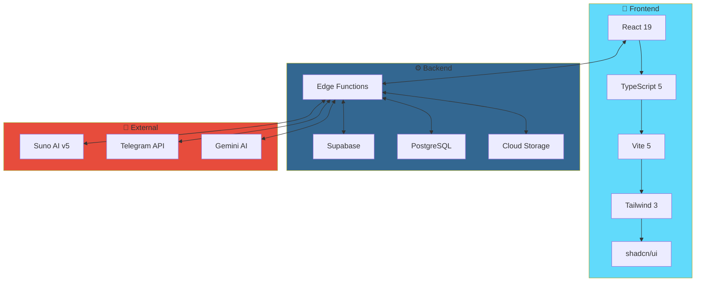
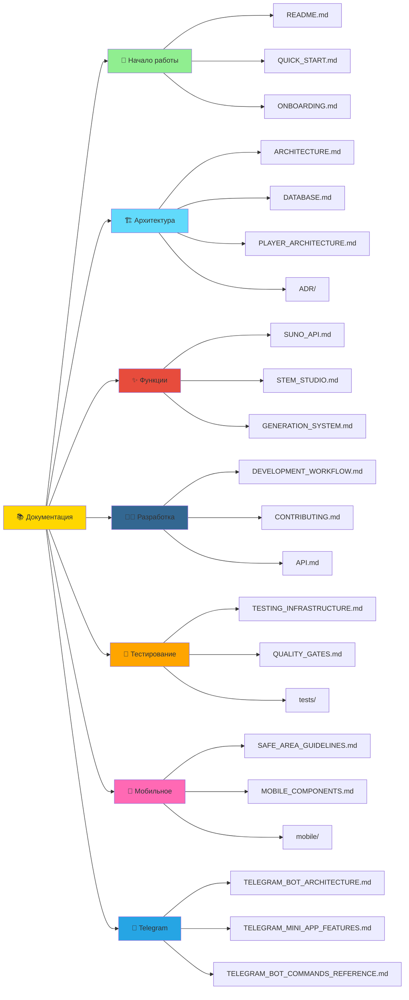
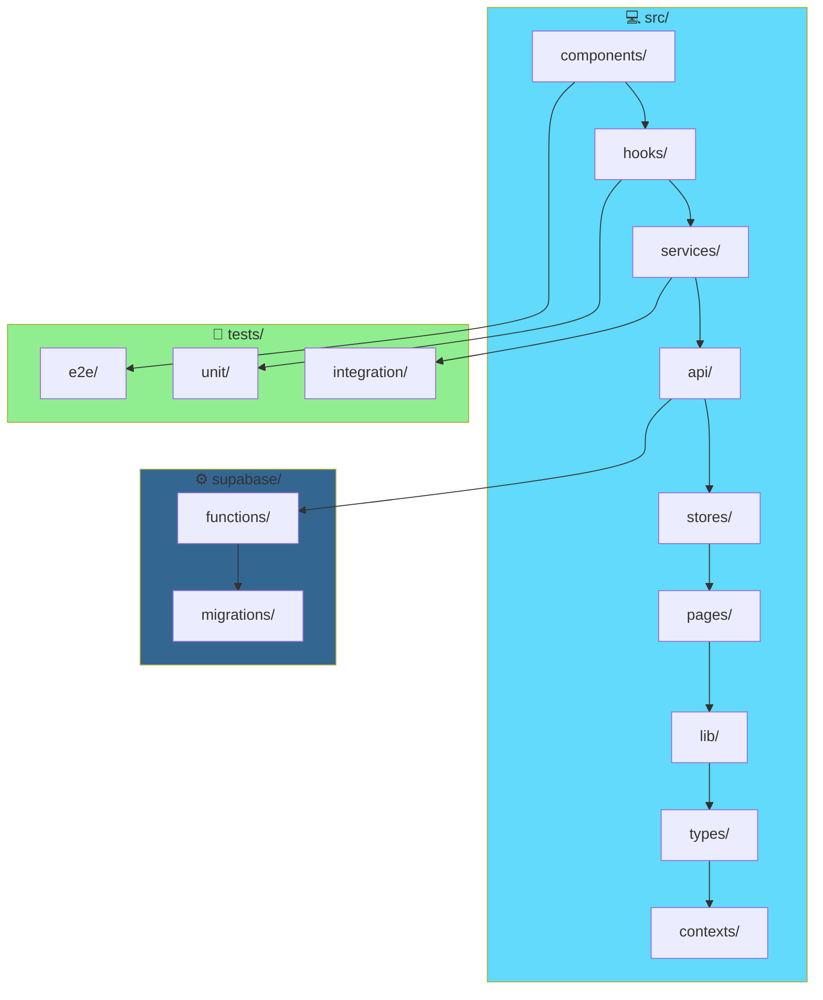
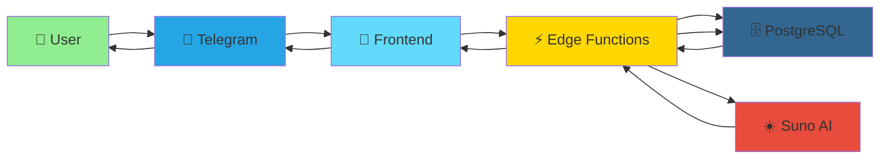
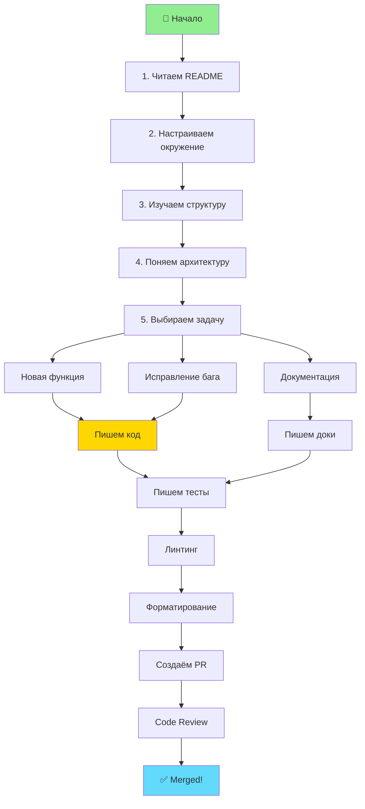

# 🧭 Навигация по репозиторию MusicVerse AI

**Последнее обновление:** 25 июня 2026  
**Версия:** 1.0.0 | **Статус:** ✅ Production Ready

---

## 🎯 Быстрая навигация

### 📚 Основные документы

| Документ                                                  | Назначение                    | Для кого     |
| --------------------------------------------------------- | ----------------------------- | ------------ |
| **[README.md](../README.md)**                             | 🎯 Главная точка входа        | Все          |
| **[CONTRIBUTING.md](../CONTRIBUTING.md)**                 | 🤝 Руководство по контрибуции | Разработчики |
| **[REPOSITORY_STRUCTURE.md](../REPOSITORY_STRUCTURE.md)** | 📁 Структура репозитория      | Разработчики |
| **[DOCUMENTATION_INDEX.md](../DOCUMENTATION_INDEX.md)**   | 📚 Полный индекс документации | Все          |
| **[PROJECT_STATUS.md](../PROJECT_STATUS.md)**             | 📊 Текущий статус проекта     | Все          |
| **[ROADMAP.md](../ROADMAP.md)**                           | 🗺️ Дорожная карта             | Все          |

---

## 🗺️ Навигационные карты

### 🏗️ Архитектурная карта



**Подробнее:** [docs/ARCHITECTURE_DIAGRAMS.md](ARCHITECTURE_DIAGRAMS.md)

---

### 📂 Карта документации



---

### 💻 Карта кода



---

## 🎯 Пути навигации

### 🚀 Для новых разработчиков

**Цель:** Быстро вникнуть в проект и начать контрибьютить

```
1. README.md (обзор проекта)
   ↓
2. CONTRIBUTING.md (как контрибьютить)
   ↓
3. docs/ONBOARDING.md (онбординг)
   ↓
4. REPOSITORY_STRUCTURE.md (структура кода)
   ↓
5. docs/DEVELOPMENT_WORKFLOW.md (рабочий процесс)
   ↓
6. docs/ARCHITECTURE_DIAGRAMS.md (архитектура)
   ↓
7. Готов к разработке! 🎉
```

**Время:** ~2-3 часа

---

### 🏗️ Для архитекторов

**Цель:** Понять архитектурные решения и систему

```
1. docs/ARCHITECTURE_DIAGRAMS.md (общая архитектура)
   ↓
2. ADR/ (архитектурные решения)
   ↓
3. docs/DATABASE.md (схема БД)
   ↓
4. docs/PLAYER_ARCHITECTURE.md (архитектура плеера)
   ↓
5. docs/TELEGRAM_BOT_ARCHITECTURE.md (архитектура бота)
   ↓
6. supabase/functions/ (Edge Functions)
   ↓
7. Полное понимание системы! 🧠
```

**Время:** ~4-6 часов

---

### 📱 Для мобильных разработчиков

**Цель:** Разработка и оптимизация мобильного UI

```
1. docs/SAFE_AREA_GUIDELINES.md (Safe Area)
   ↓
2. docs/MOBILE_COMPONENTS.md (мобильные компоненты)
   ↓
3. docs/mobile/OPTIMIZATION_ROADMAP_2026.md (план)
   ↓
4. specs/031-mobile-studio-v2/ (спецификация)
   ↓
5. src/components/mobile/ (компоненты)
   ↓
6. Готов к мобильной разработке! 📱
```

**Время:** ~2-3 часа

---

### 🧪 Для QA инженеров

**Цель:** Понимание тестирования и quality gates

```
1. docs/TESTING_INFRASTRUCTURE.md (инфраструктура)
   ↓
2. docs/QUALITY_GATES.md (стандарты качества)
   ↓
3. tests/ (примеры тестов)
   ↓
4. docs/PERFORMANCE_OPTIMIZATION.md (производительность)
   ↓
5. Готов к тестированию! 🧪
```

**Время:** ~2 часа

---

### 🎵 Для разработчиков функций

**Цель:** Разработка конкретной функции

#### Генерация музыки

```
1. docs/SUNO_API.md (Suno AI интеграция)
   ↓
2. docs/GENERATION_SYSTEM.md (система генерации)
   ↓
3. src/services/generationService.ts (сервис)
   ↓
4. src/components/generate/ (компоненты)
   ↓
5. supabase/functions/generate/ (Edge Functions)
   ↓
6. Готов к генерации! 🎹
```

#### Аудио плеер

```
1. docs/PLAYER_ARCHITECTURE.md (архитектура)
   ↓
2. src/services/audioService.ts (сервис)
   ↓
3. src/components/player/ (компоненты)
   ↓
4. src/hooks/useAudioPlayer.ts (хук)
   ↓
5. Готов к плееру! 🎧
```

#### Unified Studio

```
1. docs/STEM_STUDIO.md (Stem Studio)
   ↓
2. ADR-011-UNIFIED-STUDIO-ARCHITECTURE.md (ADR)
   ↓
3. src/components/studio/ (компоненты)
   ↓
4. supabase/functions/studio/ (функции)
   ↓
5. Готов к студии! 🎛️
```

---

## 🔍 Поиск информации

### По типу информации

| Что нужно?                | Где искать?                                                       |
| ------------------------- | ----------------------------------------------------------------- |
| **Как запустить проект?** | [README.md](../README.md#-быстрый-старт)                          |
| **Как контрибьютить?**    | [CONTRIBUTING.md](../CONTRIBUTING.md)                             |
| **Архитектура системы?**  | [docs/ARCHITECTURE_DIAGRAMS.md](ARCHITECTURE_DIAGRAMS.md)         |
| **Схема базы данных?**    | [docs/DATABASE.md](DATABASE.md)                                   |
| **API документация?**     | [docs/API.md](API.md)                                             |
| **Как писать тесты?**     | [docs/TESTING_INFRASTRUCTURE.md](TESTING_INFRASTRUCTURE.md)       |
| **Мобильные guidelines?** | [docs/SAFE_AREA_GUIDELINES.md](SAFE_AREA_GUIDELINES.md)           |
| **Telegram интеграция?**  | [docs/TELEGRAM_BOT_ARCHITECTURE.md](TELEGRAM_BOT_ARCHITECTURE.md) |
| **Производительность?**   | [docs/PERFORMANCE_OPTIMIZATION.md](PERFORMANCE_OPTIMIZATION.md)   |
| **Известные проблемы?**   | [docs/KNOWN_ISSUES.md](KNOWN_ISSUES.md)                           |

### По компоненту/функции

| Компонент/Функция     | Документация                                                      | Код                            |
| --------------------- | ----------------------------------------------------------------- | ------------------------------ |
| **Аудио плеер**       | [docs/PLAYER_ARCHITECTURE.md](PLAYER_ARCHITECTURE.md)             | `src/components/player/`       |
| **Генерация музыки**  | [docs/SUNO_API.md](SUNO_API.md)                                   | `src/components/generate/`     |
| **Библиотека треков** | [docs/GENERATION_SYSTEM.md](GENERATION_SYSTEM.md)                 | `src/components/library/`      |
| **Stem Studio**       | [docs/STEM_STUDIO.md](STEM_STUDIO.md)                             | `src/components/studio/`       |
| **Геймификация**      | [docs/CREATIVE_TOOLS.md](CREATIVE_TOOLS.md)                       | `src/components/gamification/` |
| **Telegram Bot**      | [docs/TELEGRAM_BOT_ARCHITECTURE.md](TELEGRAM_BOT_ARCHITECTURE.md) | `supabase/functions/`          |

### По технологии

| Технология         | Документация                                                          | Примеры кода      |
| ------------------ | --------------------------------------------------------------------- | ----------------- |
| **React**          | [docs/DEVELOPMENT_WORKFLOW.md](DEVELOPMENT_WORKFLOW.md)               | `src/components/` |
| **TypeScript**     | [CONTRIBUTING.md#typescript](../CONTRIBUTING.md#typescript)           | `src/**/*.ts`     |
| **Tailwind**       | [docs/DESIGN_SYSTEM_COMPREHENSIVE.md](DESIGN_SYSTEM_COMPREHENSIVE.md) | `*.tsx`           |
| **Supabase**       | [docs/DATABASE.md](DATABASE.md)                                       | `supabase/`       |
| **Zustand**        | [docs/ARCHITECTURE_DIAGRAMS.md](ARCHITECTURE_DIAGRAMS.md)             | `src/stores/`     |
| **TanStack Query** | [docs/HOOKS_REFERENCE.md](HOOKS_REFERENCE.md)                         | `src/hooks/`      |

---

## 📊 Навигационные диаграммы

### Диаграмма потоков данных



**Подробнее:** [docs/AUDIO_UPLOAD_FLOW.md](AUDIO_UPLOAD_FLOW.md)

---

### Диаграмма разработки



---

## 🎓 Образовательные пути

### Путь 1: Полный разработчик (4-6 недель)

**Неделя 1-2: Фундамент**

- [README.md](../README.md) — Обзор
- [CONTRIBUTING.md](../CONTRIBUTING.md) — Процесс
- [docs/ONBOARDING.md](ONBOARDING.md) — Онбординг
- [REPOSITORY_STRUCTURE.md](../REPOSITORY_STRUCTURE.md) — Структура

**Неделя 3-4: Архитектура**

- [docs/ARCHITECTURE_DIAGRAMS.md](ARCHITECTURE_DIAGRAMS.md) — Архитектура
- [docs/DATABASE.md](DATABASE.md) — База данных
- [ADR/](../ADR/) — Архитектурные решения

**Неделя 5-6: Практика**

- [docs/DEVELOPMENT_WORKFLOW.md](DEVELOPMENT_WORKFLOW.md) — Workflow
- [docs/TESTING_INFRASTRUCTURE.md](TESTING_INFRASTRUCTURE.md) — Тесты
- Первый PR! 🎉

---

### Путь 2: Мобильный разработчик (2-3 недели)

**Неделя 1: Основы**

- [docs/SAFE_AREA_GUIDELINES.md](SAFE_AREA_GUIDELINES.md) — Safe Area
- [docs/MOBILE_COMPONENTS.md](MOBILE_COMPONENTS.md) — Компоненты
- [docs/mobile/OPTIMIZATION_ROADMAP_2026.md](mobile/OPTIMIZATION_ROADMAP_2026.md) — План

**Неделя 2: Практика**

- [specs/031-mobile-studio-v2/](../specs/031-mobile-studio-v2/) — Спецификация
- `src/components/mobile/` — Компоненты

**Неделя 3: Оптимизация**

- [docs/PERFORMANCE_OPTIMIZATION.md](PERFORMANCE_OPTIMIZATION.md) — Оптимизация
- Вклад в мобильные фичи! 📱

---

### Путь 3: Backend разработчик (2-3 недели)

**Неделя 1: Основы**

- [docs/DATABASE.md](DATABASE.md) — База данных
- [docs/API.md](API.md) — API
- `supabase/functions/` — Edge Functions

**Неделя 2: Архитектура**

- [docs/TELEGRAM_BOT_ARCHITECTURE.md](TELEGRAM_BOT_ARCHITECTURE.md) — Бот
- [docs/SUNO_API.md](SUNO_API.md) — Suno интеграция

**Неделя 3: Практика**

- Создание Edge Function
- Вклад в бэкенд! ⚙️

---

## 📋 Чеклисты навигации

### ✅ Первый день

- [ ] Прочитал README.md
- [ ] Понял структуру проекта (REPOSITORY_STRUCTURE.md)
- [ ] Установил проект локально (CONTRIBUTING.md)
- [ ] Запустил проект (`npm run dev`)
- [ ] Запустил тесты (`npm test`)
- [ ] Изучил ARCHITECTURE_DIAGRAMS.md
- [ ] Нашёл интересующую задачу в SPRINTS/BACKLOG.md

### ✅ Первая неделя

- [ ] Изучил CONTRIBUTING.md полностью
- [ ] Понял workflow (DEVELOPMENT_WORKFLOW.md)
- [ ] Изучил кодод-стайл (CONTRIBUTING.md#стиль-кода)
- [ ] Создал первый PR
- [ ] Прошёл code review
- [ ] PR был merged! 🎉

### ✅ Первый месяц

- [ ] Внёс 5+ merged PRs
- [ ] Изучил ключевые компоненты
- [ ] Понял архитектурные решения (ADR)
- [ ] Написал тесты для своих фич
- [ ] Обновил документацию
- [ ] Стал активным контрибьютором! 🌟

---

## 🎯 Быстрые ссылки

### По популярности

| 🔥 Популярность | Документ                                                    | Описание            |
| --------------- | ----------------------------------------------------------- | ------------------- |
| ⭐⭐⭐⭐⭐      | [README.md](../README.md)                                   | Главная страница    |
| ⭐⭐⭐⭐⭐      | [CONTRIBUTING.md](../CONTRIBUTING.md)                       | Как контрибьютить   |
| ⭐⭐⭐⭐⭐      | [DOCUMENTATION_INDEX.md](../DOCUMENTATION_INDEX.md)         | Индекс документации |
| ⭐⭐⭐⭐        | [docs/ARCHITECTURE_DIAGRAMS.md](ARCHITECTURE_DIAGRAMS.md)   | Архитектура         |
| ⭐⭐⭐⭐        | [docs/DEVELOPMENT_WORKFLOW.md](DEVELOPMENT_WORKFLOW.md)     | Workflow            |
| ⭐⭐⭐⭐        | [docs/TESTING_INFRASTRUCTURE.md](TESTING_INFRASTRUCTURE.md) | Тесты               |
| ⭐⭐⭐          | [docs/SAFE_AREA_GUIDELINES.md](SAFE_AREA_GUIDELINES.md)     | Mobile              |
| ⭐⭐⭐          | [docs/SUNO_API.md](SUNO_API.md)                             | Suno AI             |

### По обновляемости

| 📅 Частота           | Документы                                     |
| -------------------- | --------------------------------------------- |
| **Ежедневно**        | PROJECT_STATUS.md, SPRINTS/SPRINT-PROGRESS.md |
| **Еженедельно**      | CHANGELOG.md, docs/PROGRESS.md                |
| **Ежемесячно**       | ROADMAP.md, README.md                         |
| **По необходимости** | docs/_.md, ADR/_.md                           |

---

## 🆘 Нужна помощь?

### Где искать ответы?

1. **📖 Документация** → Начните с [DOCUMENTATION_INDEX.md](../DOCUMENTATION_INDEX.md)
2. **🔍 Поиск** → Используйте Ctrl+Shift+F в IDE
3. **💬 Discussions** → [GitHub Discussions](https://github.com/HOW2AI-AGENCY/aimusicverse/discussions)
4. **🐛 Issues** → [GitHub Issues](https://github.com/HOW2AI-AGENCY/aimusicverse/issues)
5. **📧 Email** → [team@musicverse.ai](mailto:team@musicverse.ai)

### Частые вопросы

**Q: Где найти информацию о компоненте X?**  
A: Ищите в `src/components/` и соответствующем docs файле.

**Q: Как работает генерация музыки?**  
A: Начните с [docs/SUNO_API.md](SUNO_API.md) и [docs/GENERATION_SYSTEM.md](GENERATION_SYSTEM.md).

**Q: Как добавить новую функцию?**  
A: Следуйте [CONTRIBUTING.md](../CONTRIBUTING.md) и [docs/DEVELOPMENT_WORKFLOW.md](DEVELOPMENT_WORKFLOW.md).

**Q: Где посмотреть статус проекта?**  
A: [PROJECT_STATUS.md](../PROJECT_STATUS.md) и [docs/PROGRESS.md](PROGRESS.md).

---

## 📱 Мобильная навигация

### Жесты и shortcuts

| Действие                  | Где              |
| ------------------------- | ---------------- |
| **Поиск по файлам**       | Ctrl+P (VS Code) |
| **Поиск по тексту**       | Ctrl+Shift+F     |
| **Переход к определению** | F12              |
| **Найти все references**  | Shift+F12        |
| **Переименовать**         | F2               |
| **Форматирование**        | Shift+Alt+F      |

### Быстрые переходы в коде

```typescript
// Из компонента к хуку
import { useTelegram } from "@/hooks/useTelegram";

// Из компонента к сервису
import { generationService } from "@/services/generationService";

// Из компонента к store
import { usePlayerStore } from "@/stores/usePlayerStore";

// Из компонента к типу
import type { Track } from "@/types/track";
```

---

## 🎯 Заключение

Эта навигационная карта поможет вам:

✅ **Быстро находить** нужную информацию  
✅ **Понимать структуру** проекта  
✅ **Эффективно контрибьютить**  
✅ **Изучать архитектуру**  
✅ **Развиваться** как разработчик

**Главное правило:** Не бойтесь исследовать! Код и документация — ваши лучшие друзья. 🚀

---

<div align="center">

**Счастливого программирования!** 🎵💻

_Последнее обновление: 25 июня 2026_

[🔝 В начало](#-навигация-по-репозиторию-musicverse-ai)

</div>
