# 🗂️ Visual Navigation Index

**Интерактивная карта документации MusicVerse AI**

---

## 📊 Диаграмма навигации по документам

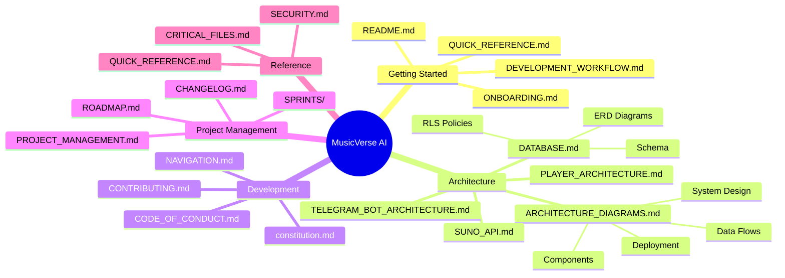

---

## 🎯 По типу задачи

### 🚀 Хочу начать работу

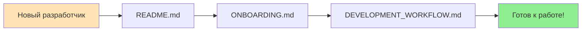

**Документы:**
1. [README.md](../README.md) - Обзор проекта
2. [ONBOARDING.md](../ONBOARDING.md) - Настройка окружения
3. [DEVELOPMENT_WORKFLOW.md](../DEVELOPMENT_WORKFLOW.md) - Процесс разработки
4. [QUICK_REFERENCE.md](./QUICK_REFERENCE.md) - Быстрый справочник

### 🏗️ Хочу понять архитектуру

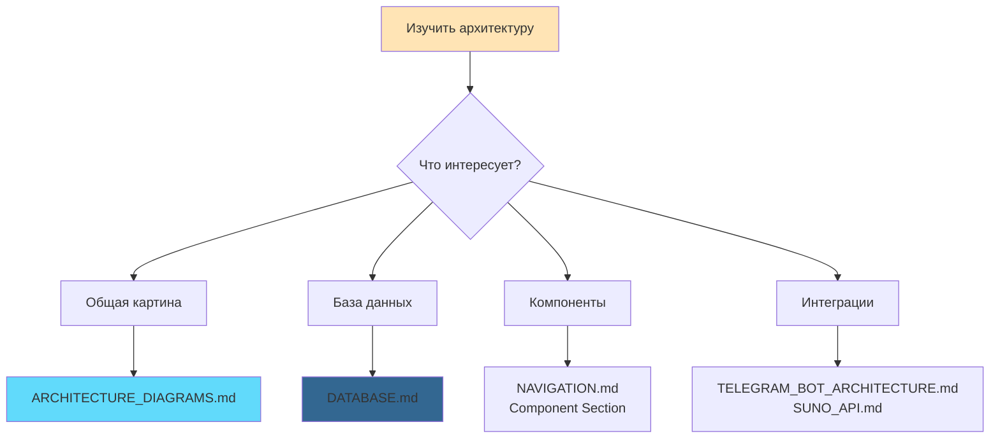

**Документы:**
1. [ARCHITECTURE_DIAGRAMS.md](./ARCHITECTURE_DIAGRAMS.md) - Визуальные схемы
2. [DATABASE.md](./DATABASE.md) - Схема БД
3. [PLAYER_ARCHITECTURE.md](./PLAYER_ARCHITECTURE.md) - Плеер
4. [SECTION_REPLACEMENT.md](./SECTION_REPLACEMENT.md) - Замена секций
5. [TELEGRAM_BOT_ARCHITECTURE.md](./TELEGRAM_BOT_ARCHITECTURE.md) - Telegram бот
6. [SUNO_API.md](./SUNO_API.md) - Suno интеграция

### 💻 Хочу написать код

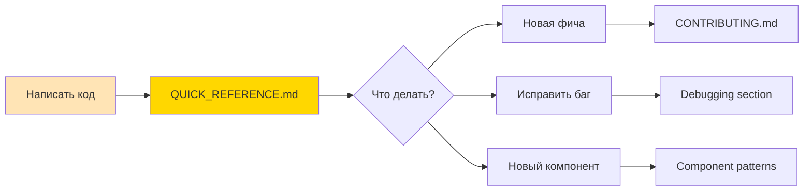

**Документы:**
1. [QUICK_REFERENCE.md](./QUICK_REFERENCE.md) - Быстрые рецепты
2. [CONTRIBUTING.md](../CONTRIBUTING.md) - Гайд по контрибуции
3. [constitution.md](../constitution.md) - Стандарты кода
4. [NAVIGATION.md](../NAVIGATION.md) - Где что находится

### 📋 Хочу управлять проектом

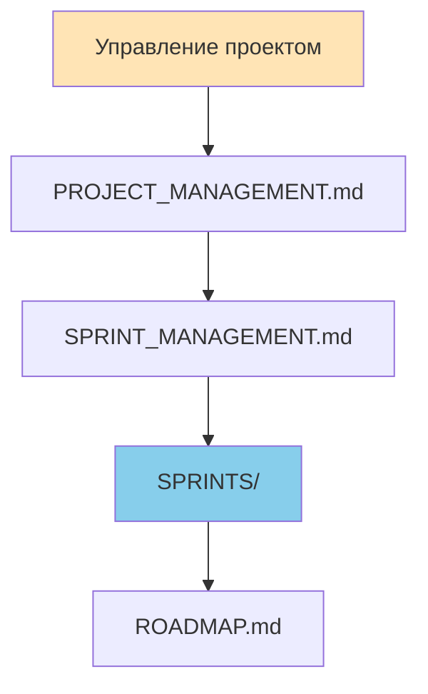

**Документы:**
1. [PROJECT_MANAGEMENT.md](../PROJECT_MANAGEMENT.md) - Управление
2. [SPRINT_MANAGEMENT.md](../SPRINT_MANAGEMENT.md) - Спринты
3. [SPRINTS/](../SPRINTS/) - Задачи спринтов
4. [ROADMAP.md](../ROADMAP.md) - Дорожная карта
5. [CHANGELOG.md](../CHANGELOG.md) - История изменений

---

## 📚 По уровню детализации

### 🔍 Уровень 1: Обзор (5 минут чтения)

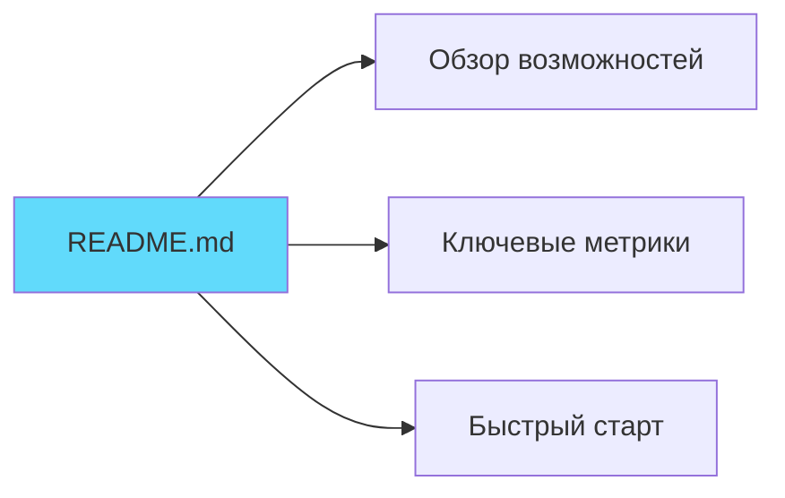

**Для кого:** Новички, менеджеры, инвесторы

### 🔎 Уровень 2: Архитектура (30 минут чтения)

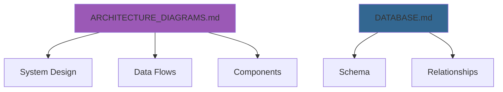

**Для кого:** Архитекторы, тимлиды, senior разработчики

### 🔬 Уровень 3: Детали (несколько часов)

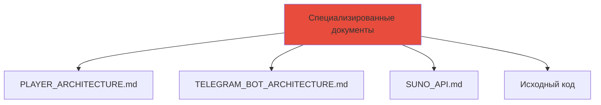

**Для кого:** Разработчики, работающие с конкретными модулями

---

## 🎨 По технологии

### Frontend (React)

| Документ | Что внутри |
|----------|------------|
| [ARCHITECTURE_DIAGRAMS.md § Frontend](./ARCHITECTURE_DIAGRAMS.md#frontend-архитектура) | Component hierarchy, State management |
| [NAVIGATION.md § Components](../NAVIGATION.md#-ключевые-компоненты) | Component organization |
| [QUICK_REFERENCE.md § UI](./QUICK_REFERENCE.md#-стили-и-ui) | UI patterns, styles |

### Backend (PostgreSQL + Edge Functions)

| Документ | Что внутри |
|----------|------------|
| [DATABASE.md](./DATABASE.md) | Full schema, RLS, indexes |
| [ARCHITECTURE_DIAGRAMS.md § Backend](./ARCHITECTURE_DIAGRAMS.md#backend-архитектура) | Edge Functions, Database architecture |
| [QUICK_REFERENCE.md § Database](./QUICK_REFERENCE.md#-работа-с-данными) | Query patterns, optimization |

### Telegram Integration

| Документ | Что внутри |
|----------|------------|
| [TELEGRAM_BOT_ARCHITECTURE.md](./TELEGRAM_BOT_ARCHITECTURE.md) | Bot architecture, commands, webhooks |
| [ARCHITECTURE_DIAGRAMS.md § Telegram](./ARCHITECTURE_DIAGRAMS.md#общая-архитектура-системы) | Integration flows |

### AI Services (Suno, Gemini)

| Документ | Что внутри |
|----------|------------|
| [SUNO_API.md](./SUNO_API.md) | Music generation API |
| [ARCHITECTURE_DIAGRAMS.md § AI](./ARCHITECTURE_DIAGRAMS.md#потоки-данных) | AI integration flows |

---

## 🔗 Связанные документы

### Визуальная карта связей

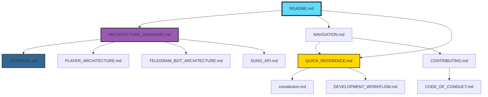

---

## 📱 Быстрый доступ по функциям

### Генерация музыки

```
1. User Flow: ARCHITECTURE_DIAGRAMS.md § Music Generation Flow
2. Technical: SUNO_API.md
3. Database: DATABASE.md § tracks, track_versions
4. Components: NAVIGATION.md § GenerateSheet
```

### Плеер

```
1. Architecture: PLAYER_ARCHITECTURE.md
2. State: ARCHITECTURE_DIAGRAMS.md § Player State Machine
3. Components: NAVIGATION.md § Player Components
4. Quick Start: QUICK_REFERENCE.md § Audio Problems
```

### Плейлисты

```
1. Flow: ARCHITECTURE_DIAGRAMS.md § Playlist Creation Flow
2. Database: DATABASE.md § playlists, playlist_tracks
3. Components: NAVIGATION.md § Playlist Components
```

### Stem Studio

```
1. Architecture: ARCHITECTURE_DIAGRAMS.md § Stem Studio
2. Section Replacement: SECTION_REPLACEMENT.md
3. Database: DATABASE.md § track_stems, track_change_log
4. Components: NAVIGATION.md § Stem Studio
```

### Telegram бот

```
1. Architecture: TELEGRAM_BOT_ARCHITECTURE.md
2. Integration: ARCHITECTURE_DIAGRAMS.md § Telegram Integration
3. Commands: TELEGRAM_BOT_ARCHITECTURE.md § Commands
```

---

## 🆘 Решение проблем

### Не могу найти нужную информацию

1. Начните с [README.md](../README.md)
2. Используйте [QUICK_REFERENCE.md](./QUICK_REFERENCE.md) для частых задач
3. Смотрите [NAVIGATION.md](../NAVIGATION.md) для навигации по коду
4. Проверьте [ARCHITECTURE_DIAGRAMS.md](./ARCHITECTURE_DIAGRAMS.md) для визуализации

### Хочу понять как работает X

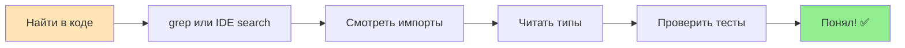

**Инструменты:**
- `grep -r "functionName" src/`
- IDE: Go to Definition (F12)
- GitHub search
- Tests: `*.test.tsx` файлы

### Документация устарела

1. Создайте issue на GitHub
2. Или отправьте PR с исправлением
3. Укажите дату обновления в header

---

## 📊 Статистика документации

| Категория | Документов | Диаграмм | Строк кода в примерах |
|-----------|------------|----------|----------------------|
| Getting Started | 4 | 5 | ~200 |
| Architecture | 6 | 25+ | ~500 |
| Development | 5 | 8 | ~1000 |
| Reference | 3 | 3 | ~300 |
| **Всего** | **18+** | **40+** | **~2000** |

---

## 🎯 Рекомендуемый порядок изучения

### Для новых разработчиков

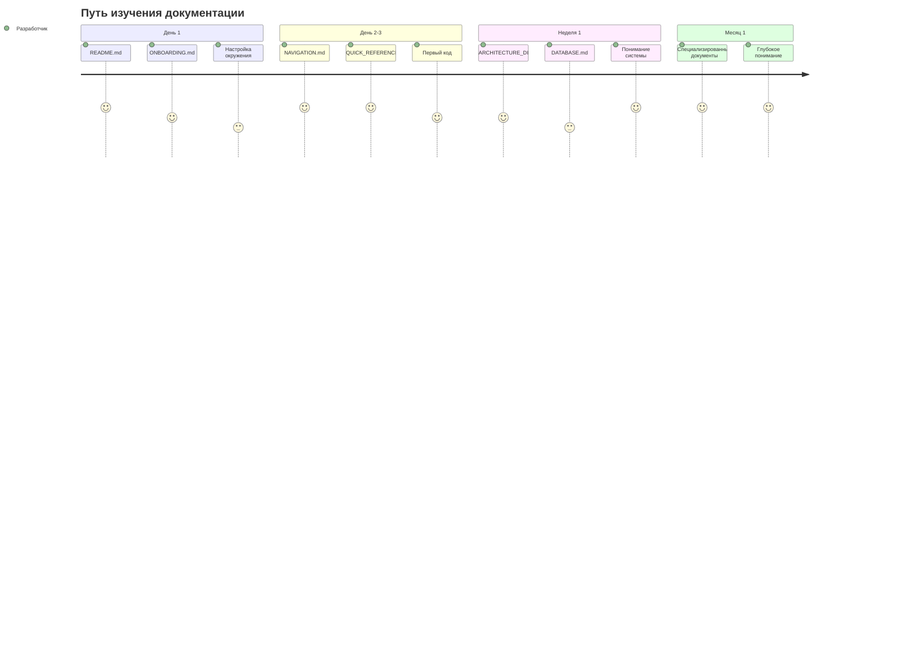

### Для архитекторов

1. [README.md](../README.md) - Обзор
2. [ARCHITECTURE_DIAGRAMS.md](./ARCHITECTURE_DIAGRAMS.md) - Полная архитектура
3. [DATABASE.md](./DATABASE.md) - Схема данных
4. Специализированные документы по интересующим модулям

### Для менеджеров

1. [README.md](../README.md) - Возможности и метрики
2. [ROADMAP.md](../ROADMAP.md) - Планы развития
3. [PROJECT_MANAGEMENT.md](../PROJECT_MANAGEMENT.md) - Процессы
4. [CHANGELOG.md](../CHANGELOG.md) - История

---

## 🔄 Обновление документации

Эта документация обновляется с каждым значительным изменением проекта.

**Последние обновления:**
- 2025-12-08: Добавлены визуальные диаграммы и навигация
- 2025-12-05: Обновлена схема БД
- 2025-12-03: Комплексный аудит

**Как внести изменения:**
1. Найдите соответствующий документ
2. Внесите изменения
3. Обновите дату в header
4. Создайте PR

---

**Поддерживается:** MusicVerse AI Team  
**Обратная связь:** [GitHub Issues](https://github.com/HOW2AI-AGENCY/aimusicverse/issues)
