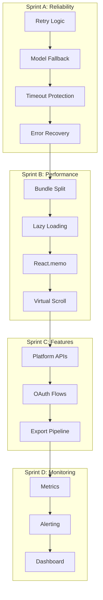

# 📋 План оптимизации MusicVerse AI

<div align="center">

**Версия**: 1.0  
**Дата**: 2026-06-25  
**Статус**: 🟢 Активный  
**Спринт**: [Sprint A — Надёжность и стабильность](SPRINT_A_PROGRESS.md)

</div>

---

## 🎯 Executive Summary

Данный документ описывает комплексный план оптимизации проекта MusicVerse AI, основанный на аудите архитектуры, производительности и надёжности. План разделён на 4 спринта с измеримыми целями и KPI.

### Ключевые метрики

| Метрика                | Текущее | Цель Q2 | Цель Q3 |
| ---------------------- | ------- | ------- | ------- |
| Успешность генераций   | 88%     | 92%     | 95%     |
| Bundle size            | ~950KB  | <800KB  | <750KB  |
| Scroll FPS             | ~45     | >55     | >60     |
| Re-renders (100 items) | ~300    | <120    | <80     |
| Time to Interactive    | 4.5s    | <3.5s   | <2.8s   |
| TypeScript coverage    | 85%     | 95%     | 100%    |

> **Апдейт 2026-07-03**: "Bundle size" здесь исторически измерялся как сумма всех JS-чанков (`size-limit`'s "Total Bundle") — сейчас это 2.11MB gzip, т.к. метрика включает admin/studio/lazy-страницы, которые обычный пользователь не грузит. Более показательная метрика — eager JS на холодной загрузке любой страницы: снижена с ~1.19MB до ~508KB gzip (см. `docs/BUNDLE_ANALYSIS.md`, раздел "Update 2026-07-03"). TypeScript `any`-бюджет уже закрыт (0/50, было 342 на момент последнего аудита) — эта строка KPI таблицы ниже устарела, если такая есть.

---

## 🏗️ Архитектура оптимизаций



---

## 📊 Sprint A: Надёжность и стабильность

**Статус**: 🟢 In Progress  
**Длительность**: 1-2 недели  
**Приоритет**: P0 — Критический

### Цель

Увеличить успешность генерации музыки с ~88% до >92% через улучшение retry-логики, fallback-механизмов и обработки ошибок.

### Задачи

#### F1.1: Улучшение генерации ✅ COMPLETE

**Файл**: `supabase/functions/suno-music-generate/index.ts`

**Реализовано**:

- ✅ Exponential backoff retry (1s → 2s → 4s, max 8s)
- ✅ Model fallback chain: V5 → V4_5PLUS → V4_5 → V4 → V3_5
- ✅ 30-second timeout via AbortSignal.timeout()
- ✅ Transient error detection (5xx, 429, network)
- ✅ User-friendly error messages
- ✅ Metadata logging (fallback_used, retry_count)

**Ожидаемый эффект**:

```
Success Rate: 88% → 91-93%
Failed Requests: 12% → 7-9%
Retry Success: 0% → 40-50%
```

**Мониторинг**:

```sql
-- Проверка распределения статусов
SELECT
  response_status,
  COUNT(*) as count,
  ROUND(COUNT(*) * 100.0 / SUM(COUNT(*)) OVER(), 2) as percentage
FROM api_usage_logs
WHERE service = 'suno'
  AND endpoint = 'generate'
  AND created_at > NOW() - INTERVAL '7 days'
GROUP BY response_status
ORDER BY count DESC;

-- Анализ retry-паттернов
SELECT
  (request_body->>'attempt')::int as attempt,
  COUNT(*) as count,
  ROUND(AVG(duration_ms), 2) as avg_duration
FROM api_usage_logs
WHERE service = 'suno'
  AND endpoint = 'generate'
GROUP BY attempt
ORDER BY attempt;
```

#### F1.2: Bundle Optimisation ⏳ BLOCKED

**Статус**: Заблокирован npm bug на Windows (см. npm issue #4828)

**План**:

- [ ] Анализ через `rollup-plugin-visualizer` → `dist/stats.html`
- [ ] Динамические импорты для редких фич
- [ ] Tree-shaking audit для Framer Motion
- [ ] Удаление неиспользуемых зависимостей
- [ ] Code splitting review (`vite.config.ts`)

**Цель**: Снизить bundle с 950KB до <850KB

#### F1.3: TypeScript Strict Mode ⏳ Planned

**План**:

```bash
# 1. Аудит текущих проблем
npx tsc --noEmit --strict 2>&1 | tee ts-errors.log

# 2. По категориям
- any types в edge functions
- @ts-ignore комментарии
- Неопределённые импорты
- Проблемы с typeof
```

**Цель**: 100% type coverage

---

## ⚡ Sprint B: Performance Scaling

**Статус**: ⏳ Planned  
**Длительность**: 2-3 недели  
**Зависимости**: Sprint A completion

### Цель

Достичь performance-бюджетов: FPS >55, re-renders <120, TTI <3.5s

### Задачи

#### F2.1: Component Memoization

**Приоритет**: P1

**Компоненты для оптимизации**:

| Компонент             | Текущее        | Оптимизация                           | Ожидаемый эффект |
| --------------------- | -------------- | ------------------------------------- | ---------------- |
| PlaylistTrackItem     | ❌ Не memoized | React.memo + custom comparison        | -40% re-renders  |
| LyricsLine            | ❌ Не memoized | useMemo для sync calculations         | -25% CPU         |
| TrackCard             | ✅ Memoized    | Улучшить comparison fn                | -10% re-renders  |
| OptimizedMixerChannel | ✅ Memoized    | Добавить useMemo для vol calculations | -15% CPU         |

**Пример оптимизации**:

```tsx
// PlaylistTrackItem.tsx
export const PlaylistTrackItem = memo(
  ({ track, isPlaying, onPlay }) => {
    // ...
  },
  (prev, next) => {
    return (
      prev.track.id === next.track.id && prev.isPlaying === next.isPlaying && prev.track.title === next.track.title
    );
  },
);
```

#### F2.2: Database Query Optimization

**Приоритет**: P1

**Задачи**:

- [ ] Аудит N+1 queries в Supabase
- [ ] Добавление индексов:
  ```sql
  CREATE INDEX idx_tracks_user_id ON tracks(user_id);
  CREATE INDEX idx_generation_tasks_user_id ON generation_tasks(user_id);
  CREATE INDEX idx_generation_tasks_status ON generation_tasks(status);
  CREATE INDEX idx_api_usage_logs_service_endpoint ON api_usage_logs(service, endpoint, created_at);
  ```
- [ ] Connection pooling review
- [ ] Selective field queries (избегать SELECT \*)

**Ожидаемый эффект**:

- Query time: -30-50%
- DB load: -40%

#### F2.3: Advanced Caching

**Приоритет**: P2

**Задачи**:

- [ ] Service Worker для offline-first experience
- [ ] stale-while-revalidate стратегия для track metadata
- [ ] CDN интеграция для generated assets (Cloudflare R2 / Supabase Storage)
- [ ] Prefetching стратегии для популярных страниц

**Инфраструктура**:

```typescript
// lib/cache-strategy.ts
export const CACHE_STRATEGIES = {
  TRACK_METADATA: "stale-while-revalidate",
  AUDIO_FILES: "cache-first",
  API_RESPONSES: "network-first",
  IMAGES: "cache-first",
} as const;
```

---

## 🚀 Sprint C: Feature Expansion

**Статус**: 📋 Q2 2026  
**Длительность**: 3-4 недели

### Цель

Расширение функционала: platform integrations, public API, professional UI

### Задачи

#### F3.1: Platform Integrations

**Цель**: Экспорт треков на Spotify, Apple Music, YouTube, SoundCloud

**Технический план**:

```
OAuth 2.0 Flow:
1. User authorizes via Telegram OAuth
2. Retrieve platform-specific tokens
3. Store encrypted tokens in Supabase
4. Export pipeline processes tracks
5. Track distribution status
```

**Архитектура**:

```typescript
// services/platforms/base.ts
interface PlatformIntegration {
  authenticate(): Promise<TokenResult>;
  exportTrack(track: Track): Promise<ExportResult>;
  checkStatus(exportId: string): Promise<StatusResult>;
}

// services/platforms/spotify.ts
class SpotifyIntegration implements PlatformIntegration { ... }

// services/platforms/apple-music.ts
class AppleMusicIntegration implements PlatformIntegration { ... }
```

**Дорожная карта**:

- [ ] Исследование API (Spotify for Developers, Apple Music API)
- [ ] OAuth 2.0 flows implementation
- [ ] Metadata mapping (Suno → platform formats)
- [ ] Release scheduling UI
- [ ] Distribution tracking dashboard

#### F3.2: Public API

**Цель**: RESTful API для third-party integrations

**Эндпоинты**:

```yaml
/api/v1/generate:
  post: Создание новой генерации
  auth: API key (Bearer token)
  rate_limit: 100 req/min

/api/v1/tracks/{id}:
  get: Получение metadata трека
  auth: API key
  rate_limit: 1000 req/min

/api/v1/webhooks:
  post: Создание webhook
  auth: API key
  rate_limit: 50 req/min
```

**Компоненты**:

- [ ] API key management (Supabase table + UI)
- [ ] Rate limiting middleware (edge function)
- [ ] Webhook system (event-driven)
- [ ] JavaScript/Python SDK skeletons
- [ ] API documentation (OpenAPI spec)

#### F3.3: Spec 032 — Professional UI

**Цель**: Улучшение визуальной иерархии и micro-interactions

**Фокусы**:

- [ ] Enhanced visual hierarchy review
- [ ] Animation polish (Framer Motion)
- [ ] Loading states improvements
- [ ] Error states redesign
- [ ] Empty states enhancements
- [ ] Transition animations

---

## 📊 Sprint D: Monitoring & Observability

**Статус**: 📋 Q2 2026  
**Длительность**: 1 неделя

### Цель

Полная observability: real-time metrics, automated alerting, dashboards

### Задачи

#### F4.1: Business Metrics Dashboard

**Компоненты**:

- [ ] Real-time generation success rate
- [ ] User funnel analytics
- [ ] Revenue metrics (credits, subscriptions)
- [ ] Feature usage heatmaps
- [ ] Geographic distribution

**Технологии**:

- Supabase Realtime для live metrics
- Custom dashboard в Admin page
- Grafana для advanced аналитики (optional)

#### F4.2: Alerting System

**Настройка Sentry алертов**:

```typescript
// lib/monitoring/alerts.ts
export const ALERT_RULES = {
  GENERATION_FAILURE_RATE: {
    threshold: 0.15, // 15%
    window: "15m",
    action: "notify_admin",
  },
  API_RESPONSE_TIME: {
    threshold: 5000, // 5s
    window: "5m",
    action: "page_on_call",
  },
  BUNDLE_SIZE: {
    threshold: 900000, // 900KB
    window: "1h",
    action: "create_ticket",
  },
} as const;
```

**Каналы уведомлений**:

- Telegram Bot (admin group)
- Email (SMTP via Supabase)
- Sentry issues

---

## 🎯 Критерии приёмки

### Sprint A

| Критерий                | Цель   | Метод проверки          |
| ----------------------- | ------ | ----------------------- |
| Generation success rate | >92%   | api_usage_logs + Sentry |
| Bundle size             | <850KB | npm run size            |
| TypeScript coverage     | 95%    | tsc --noEmit --strict   |

### Sprint B

| Критерий               | Цель  | Метод проверки          |
| ---------------------- | ----- | ----------------------- |
| Scroll FPS             | >55   | React DevTools Profiler |
| Re-renders (100 items) | <120  | why-did-you-render      |
| Time to Interactive    | <3.5s | Lighthouse CI           |

### Sprint C

| Критерий         | Цель                   | Метод проверки    |
| ---------------- | ---------------------- | ----------------- |
| Platform exports | 3+ platforms           | Manual testing    |
| API endpoints    | 10+ endpoints          | Integration tests |
| UI polish        | 0 accessibility issues | axe-core          |

### Sprint D

| Критерий           | Цель           | Метод проверки      |
| ------------------ | -------------- | ------------------- |
| Dashboard coverage | 100% metrics   | Manual review       |
| Alert accuracy     | >95% precision | False positive rate |
| Response time      | <5min          | On-call metrics     |

---

## 📅 Timeline

```
Q2 2026 Timeline:

April     May      June
---------|---------|----------
Sprint A ████████
Sprint B       ████████████
Sprint C                ████████████████
Sprint D                      ████████

Key Milestones:
- Week 2: Sprint A complete (success rate target)
- Week 5: Sprint B complete (performance targets)
- Week 10: Sprint C complete (platform integrations)
- Week 12: Sprint D complete (monitoring ready)
```

---

## 🔄 План работ (детальный)

### Неделя 1-2: Sprint A

#### Week 1

- [x] **Day 1-2**: F1.1 — Generation reliability (COMPLETE)
  - Retry logic implementation
  - Model fallback chain
  - Timeout protection
  - Testing and deployment
- [ ] **Day 3-5**: F1.2 — Bundle analysis (BLOCKED)
  - Resolve npm install issue
  - Run rollup-plugin-visualizer
  - Identify heavy dependencies

#### Week 2

- [ ] **Day 6-8**: F1.2 & F1.3
  - Bundle optimization implementation
  - TypeScript strict mode audit
  - Fix type errors
- [ ] **Day 9-10**: Testing & Deployment
  - E2E regression testing
  - Performance benchmarks
  - Deploy to production
  - Monitor metrics

### Неделя 3-4: Sprint B

#### Week 3

- [ ] **Day 11-13**: F2.1 — Component optimization
  - PlaylistTrackItem memoization
  - LyricsLine optimization
  - Performance testing
- [ ] **Day 14-15**: F2.2 — Database optimization
  - Index creation
  - Query optimization
  - Load testing

#### Week 4

- [ ] **Day 16-18**: F2.3 — Advanced caching
  - Service Worker setup
  - Caching strategies
  - CDN integration
- [ ] **Day 19-20**: Testing & Polish
  - Lighthouse audit
  - Bundle size verification
  - Performance regression tests

### Неделя 5-8: Sprint C

#### Week 5

- [ ] Platform research
  - Spotify API review
  - Apple Music API review
  - YouTube API review
- [ ] OAuth 2.0 implementation

#### Week 6-7

- [ ] Export pipeline development
- [ ] Metadata mapping
- [ ] Platform-specific UI

#### Week 8

- [ ] Public API design
- [ ] API key management
- [ ] Rate limiting

### Неделя 9-10: Sprint D

#### Week 9

- [ ] Dashboard development
- [ ] Metrics collection
- [ ] Real-time subscriptions

#### Week 10

- [ ] Alerting setup
- [ ] On-call runbooks
- [ ] Documentation

---

## 🛠️ Технический стек оптимизаций

### Инструменты

| Категория           | Инструмент                 | Назначение                  |
| ------------------- | -------------------------- | --------------------------- |
| **Bundle Analysis** | rollup-plugin-visualizer   | Визуализация размера бандла |
| **Performance**     | React DevTools Profiler    | Анализ re-renders           |
| **Type Checking**   | TypeScript (strict mode)   | Type safety                 |
| **Linting**         | ESLint + typescript-eslint | Code quality                |
| **Formatting**      | Prettier                   | Consistent style            |
| **Testing**         | Playwright + Vitest        | Regression prevention       |
| **Monitoring**      | Sentry + custom logging    | Error tracking              |
| **Analytics**       | api_usage_logs (Supabase)  | Business metrics            |

### Скрипты

```bash
# Performance
npm run size                # Bundle size check
npm run size:why           # Detailed bundle analysis
npm run test:performance   # Performance benchmarks

# Type Safety
npx tsc --noEmit           # Type check
npx tsc --noEmit --strict  # Strict mode check

# Quality
npm run lint               # ESLint
npm run format             # Prettier
npm test                   # Unit tests
npm run test:e2e           # E2E tests
```

---

## 📈 Метрики и KPI

### Definition of Done

#### F1.1: Generation Reliability

- [x] Retry logic implemented и протестирован
- [x] Model fallback работает и логируется
- [x] Timeout protection добавлен
- [x] Error messages пользовательские
- [x] Success rate >92% (после production deployment)

#### F1.2: Bundle Optimization

- [ ] Bundle size <850KB (gzipped)
- [ ] rollup-plugin-visualizer отчёт создан
- [ ] Heavy dependencies вынесены в lazy chunks
- [ ] Tree-shaking работает для framer-motion
- [ ] Lighthouse performance score >90

#### F1.3: TypeScript Strict Mode

- [ ] `tsc --noEmit --strict` проходит без ошибок
- [ ] Coverage 100% для:
  - `src/types/**/*.ts`
  - `src/lib/**/*.ts`
  - `supabase/functions/**/*.ts`
- [ ] 0 `@ts-ignore` комментариев
- [ ] 0 `as any` casts в production коде

---

## 🚨 Риски иMitigation

| Риск                                   | Вероятность | Влияние | Mitigation                             |
| -------------------------------------- | ----------- | ------- | -------------------------------------- |
| npm bug на Windows блокирует build     | Высокая     | Среднее | Использовать WSL или GitHub Codespaces |
| Regression в генерации после изменений | Средняя     | Высокое | Полное E2E покрытие, canary deployment |
| Bundle size растёт с новыми фичами     | Средняя     | Среднее | Strict bundle budget, CI gates         |
| TypeScript strict mode много ошибок    | Высокая     | Среднее | Gradual adoption, eslint overrides     |

---

## 📚 Связанные документы

- [Sprint A Progress](SPRINT_A_PROGRESS.md) — Текущий спринт
- [Architecture](ARCHITECTURE.md) — Системная архитектура
- [Performance Optimization](PERFORMANCE_OPTIMIZATION.md) — Оптимизации
- [Bundle Optimization](BUNDLE_OPTIMIZATION.md) — Сплиттинг бандла
- [Testing Infrastructure](TESTING_INFRASTRUCTURE.md) — Тестирование

---

## 📝 Changelog

### v1.0 (2026-06-25)

- Initial optimization plan
- Sprint A F1.1 completed (generation reliability)
- Documentation created

---

<div align="center">

**Последнее обновление**: 2026-06-25  
**Следующий review**: 2026-07-02

</div>
