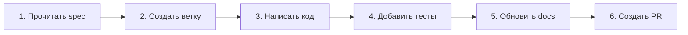

# ⚡ Quick Reference Guide - MusicVerse AI

**Last Updated:** 2025-12-08

Быстрый справочник для навигации по проекту и решения частых задач.

---

## 🗺️ Быстрая навигация

### Я хочу...

| Задача | Куда идти |
|--------|-----------|
| **Начать работу с проектом** | [README.md](../README.md) → [ONBOARDING.md](../ONBOARDING.md) |
| **Понять архитектуру** | [ARCHITECTURE_DIAGRAMS.md](./ARCHITECTURE_DIAGRAMS.md) |
| **Изучить схему БД** | [DATABASE.md](./DATABASE.md) |
| **Настроить окружение** | [DEVELOPMENT_WORKFLOW.md](../DEVELOPMENT_WORKFLOW.md) |
| **Внести изменения** | [CONTRIBUTING.md](../CONTRIBUTING.md) |
| **Понять навигацию по коду** | [NAVIGATION.md](../NAVIGATION.md) |

---

## 🎯 Частые задачи

### Добавить новую фичу



**Чеклист:**
- [ ] Создана ветка `feature/название-фичи`
- [ ] Код соответствует стандартам (см. [constitution.md](../constitution.md))
- [ ] Добавлены TypeScript типы
- [ ] Написаны тесты (coverage > 80%)
- [ ] Обновлена документация
- [ ] Нет console.log (используйте logger)
- [ ] Прошли линтеры и билд

### Исправить баг

1. **Воспроизвести** проблему локально
2. **Найти** место в коде:
   - Используйте `grep` или IDE поиск
   - Проверьте логи в `src/lib/logger.ts`
3. **Исправить** минимальными изменениями
4. **Добавить тест** для предотвращения регрессии
5. **Создать PR** с описанием fix

### Добавить UI компонент

```
src/components/
├── ui/                    # Базовые компоненты (shadcn)
│   └── новый-компонент.tsx
├── feature-name/          # Feature-specific компоненты
│   └── FeatureComponent.tsx
```

**Шаблон:**
```typescript
import { cn } from "@/lib/utils";

interface MyComponentProps {
  variant?: "default" | "outline";
  children: React.ReactNode;
}

export const MyComponent = ({ 
  variant = "default",
  children 
}: MyComponentProps) => {
  return (
    <div className={cn(
      "base-classes",
      variant === "outline" && "outline-classes"
    )}>
      {children}
    </div>
  );
};
```

### Добавить новую страницу

1. Создать файл в `src/pages/NewPage.tsx`
2. Добавить маршрут в `src/App.tsx`:
   ```typescript
   <Route path="/new-page" element={<NewPage />} />
   ```
3. Добавить в навигацию (если нужно):
   - `src/components/BottomNavigation.tsx`
   - `src/components/NavigationMenuSheet.tsx`

### Создать кастомный хук

```typescript
// src/hooks/useMyFeature.ts
import { useQuery } from "@tanstack/react-query";
import { supabase } from "@/integrations/supabase/client";
import { logger } from "@/lib/logger";

export const useMyFeature = (param: string) => {
  return useQuery({
    queryKey: ["myFeature", param],
    queryFn: async () => {
      try {
        const { data, error } = await supabase
          .from("table_name")
          .select("*")
          .eq("field", param);
        
        if (error) throw error;
        return data;
      } catch (error) {
        logger.error("Error in useMyFeature", { error, param });
        throw error;
      }
    },
    staleTime: 30_000,
    gcTime: 10 * 60_000,
  });
};
```

### Добавить Edge Function

1. Создать в `supabase/functions/my-function/index.ts`
2. Добавить типы в `supabase/functions/_shared/types.ts`
3. Деплой происходит автоматически при push

**Шаблон:**
```typescript
import { serve } from "https://deno.land/std@0.168.0/http/server.ts";
import { createClient } from "https://esm.sh/@supabase/supabase-js@2";

serve(async (req) => {
  try {
    const { param } = await req.json();
    
    const supabase = createClient(
      Deno.env.get("SUPABASE_URL") ?? "",
      Deno.env.get("SUPABASE_SERVICE_ROLE_KEY") ?? ""
    );
    
    // Your logic here
    
    return new Response(
      JSON.stringify({ success: true }),
      { headers: { "Content-Type": "application/json" } }
    );
  } catch (error) {
    return new Response(
      JSON.stringify({ error: error.message }),
      { status: 500 }
    );
  }
});
```

---

## 🔍 Поиск по коду

### Найти где используется компонент

```bash
# Найти импорты компонента
grep -r "import.*TrackCard" src/

# Найти все использования
grep -r "<TrackCard" src/
```

### Найти все хуки

```bash
find src/hooks -name "use*.ts*"
```

### Найти Edge Functions

```bash
ls -la supabase/functions/
```

### Поиск по типам

```bash
# Найти определение типа
grep -r "interface Track" src/

# Найти использования типа
grep -r ": Track" src/
```

---

## 📊 Работа с данными

### Добавить новую таблицу

1. Создать миграцию в Lovable interface
2. Обновить типы (автоматически)
3. Добавить RLS политики
4. Обновить [DATABASE.md](./DATABASE.md)

### Создать индекс

```sql
-- Обычный индекс
CREATE INDEX idx_tracks_user_id ON tracks(user_id);

-- Composite индекс
CREATE INDEX idx_tracks_user_public 
ON tracks(user_id, is_public, created_at DESC);

-- Partial индекс
CREATE INDEX idx_tracks_public 
ON tracks(created_at DESC) 
WHERE is_public = true;

-- GIN индекс для JSONB
CREATE INDEX idx_metadata 
ON table_name USING GIN(metadata);
```

### Оптимизировать запрос

```typescript
// ❌ BAD: N+1 queries
tracks.forEach(async (track) => {
  const likes = await fetchLikes(track.id);
});

// ✅ GOOD: Batch query
const trackIds = tracks.map(t => t.id);
const likes = await fetchLikesBatch(trackIds);
```

---

## 🎨 Стили и UI

### Использовать дизайн-токены

```typescript
// ✅ GOOD: Использование Tailwind классов
<div className="bg-background text-foreground border-border">

// ❌ BAD: Прямые цвета
<div style={{ backgroundColor: "#1a1a1a" }}>
```

### Адаптивный дизайн

```typescript
<div className="
  grid 
  grid-cols-1 
  md:grid-cols-2 
  lg:grid-cols-3 
  gap-4
">
```

### Анимации с Framer Motion

```typescript
import { motion } from "framer-motion";

<motion.div
  initial={{ opacity: 0, y: 20 }}
  animate={{ opacity: 1, y: 0 }}
  exit={{ opacity: 0, y: -20 }}
  transition={{ duration: 0.3 }}
>
  {children}
</motion.div>
```

---

## 🧪 Тестирование

### Запустить тесты

```bash
# Все тесты
npm test

# Specific файл
npm test -- TrackCard.test.tsx

# Watch mode
npm test -- --watch

# Coverage
npm test -- --coverage
```

### Написать тест

```typescript
import { render, screen } from "@testing-library/react";
import { TrackCard } from "./TrackCard";

describe("TrackCard", () => {
  it("renders track title", () => {
    render(<TrackCard track={mockTrack} />);
    expect(screen.getByText("Track Title")).toBeInTheDocument();
  });
  
  it("calls onPlay when clicked", async () => {
    const onPlay = vi.fn();
    render(<TrackCard track={mockTrack} onPlay={onPlay} />);
    
    await userEvent.click(screen.getByRole("button"));
    expect(onPlay).toHaveBeenCalledWith(mockTrack);
  });
});
```

---

## 🐛 Отладка

### Проблемы с аудио

1. Проверьте `GlobalAudioProvider`
2. Проверьте `playerStore` state
3. Проверьте console errors (Network tab)
4. См. [PLAYER_ARCHITECTURE.md](./PLAYER_ARCHITECTURE.md)

### Проблемы с данными

1. Проверьте RLS политики
2. Проверьте auth context
3. Проверьте TanStack Query DevTools
4. Проверьте Supabase logs

### Проблемы с Telegram

1. Проверьте `TelegramContext`
2. Проверьте initData validation
3. Проверьте bot webhook logs
4. См. [TELEGRAM_BOT_ARCHITECTURE.md](./TELEGRAM_BOT_ARCHITECTURE.md)

### Debug логи

```typescript
import { logger } from "@/lib/logger";

// Разные уровни
logger.debug("Debug info", { data });
logger.info("Info message", { userId });
logger.warn("Warning", { issue });
logger.error("Error occurred", { error });

// В production console.log отключен, используйте logger
```

---

## 🚀 Deployment

### Pre-deployment Checklist

- [ ] Все тесты проходят
- [ ] Нет lint ошибок
- [ ] Build успешен
- [ ] Нет console.log
- [ ] Обновлена документация
- [ ] Проверены security vulnerabilities

### Automatic Deployment

Push в ветку `main` → Автоматический deploy в production

### Manual Deployment

```bash
# Build локально
npm run build

# Preview production build
npm run preview
```

---

## 📚 Полезные команды

### Development

```bash
npm run dev              # Запустить dev сервер
npm run build            # Production build
npm run preview          # Preview build
npm run lint             # Запустить ESLint
npm run format           # Форматировать с Prettier
npm test                 # Запустить тесты
```

### Git

```bash
git checkout -b feature/my-feature   # Новая ветка
git add .                            # Stage изменения
git commit -m "feat: добавил фичу"  # Commit
git push origin feature/my-feature   # Push
```

### Database (через Lovable)

```bash
# Миграции применяются автоматически
# Используйте Lovable interface для создания миграций
```

---

## 🔗 Связанные документы

- [README.md](../README.md) - Главная страница
- [NAVIGATION.md](../NAVIGATION.md) - Полная навигация
- [ARCHITECTURE_DIAGRAMS.md](./ARCHITECTURE_DIAGRAMS.md) - Визуальные схемы
- [CONTRIBUTING.md](../CONTRIBUTING.md) - Гайд по контрибуции
- [constitution.md](../constitution.md) - Стандарты проекта

---

**Нашли ошибку?** Обновите этот документ через PR! 🙏
