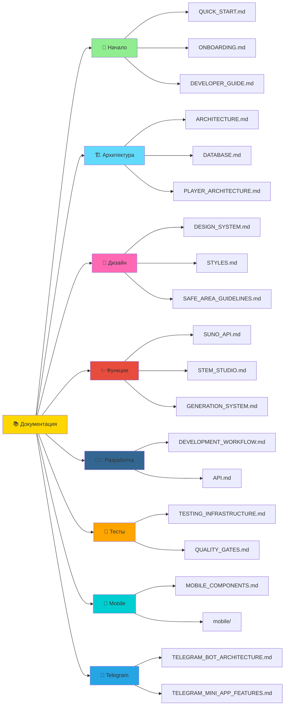

# 📚 Документация MusicVerse AI

**Последнее обновление:** 25 июня 2026  
**Всего документов:** 100+ | **Языки:** 🇷🇺 Русский + 🇬🇧 English

---

## 🎯 Быстрый старт

Новичок? Начните здесь:

1. **[README.md](../README.md)** — Обзор проекта
2. **[QUICK_START.md](QUICK_START.md)** — Быстрый старт за 5 минут
3. **[ONBOARDING.md](ONBOARDING.md)** — Полный онбординг
4. **[NAVIGATION_GUIDE.md](NAVIGATION_GUIDE.md)** — Навигация по репозиторию

---

## 📂 Структура документации

```
docs/
├── 📖 Руководства (Guides)
│   ├── QUICK_START.md              # 🚀 Быстрый старт
│   ├── ONBOARDING.md               # 🎓 Онбординг новых разработчиков
│   ├── DEVELOPER_GUIDE.md          # 👨‍💻 Полный гайд разработчика
│   ├── DEVELOPMENT_WORKFLOW.md     # 🔄 Рабочий процесс
│   └── PROJECT_MANAGEMENT.md       # 📋 Управление проектом
│
├── 🏗️ Архитектура (Architecture)
│   ├── ARCHITECTURE.md             # 🏛️ Общая архитектура
│   ├── ARCHITECTURE_DIAGRAMS.md    # 📊 Визуальные диаграммы
│   ├── COMPREHENSIVE_ARCHITECTURE.md # 📖 Полная архитектура
│   ├── DATABASE.md                 # 🗄️ Схема базы данных
│   ├── PLAYER_ARCHITECTURE.md      # 🎧 Архитектура аудио плеера
│   ├── AUDIO_ARCHITECTURE_DIAGRAM.md # 🎵 Диаграмма аудио системы
│   └── TELEGRAM_BOT_ARCHITECTURE.md # 🤖 Архитектура Telegram бота
│
├── 🎨 Дизайн и UI (Design)
│   ├── DESIGN_SYSTEM_COMPREHENSIVE.md # 🎨 Полная дизайн-система
│   ├── STYLES.md                   # 💅 Стили и темы
│   ├── LAYOUT_SYSTEM.md            # 📐 Layout система
│   ├── Z_INDEX_HIERARCHY.md        # 📊 Иерархия z-index
│   ├── SAFE_AREA_GUIDELINES.md     # 📱 Safe Area (iOS)
│   ├── MOBILE_COMPONENTS.md        # 📱 Мобильные компоненты
│   └── META_TAGS.md                # 🏷️ Meta теги
│
├── 🎵 Функции (Features)
│   ├── SUNO_API.md                 # ☀️ Интеграция Suno AI
│   ├── GENERATION_SYSTEM.md        # 🎹 Система генерации музыки
│   ├── STEM_STUDIO.md              # 🎛️ Stem Studio
│   ├── AI_LYRICS_ASSISTANT.md      # ✍️ AI Lyrics Assistant
│   ├── CREATIVE_TOOLS.md           # 🛠️ Креативные инструменты
│   ├── CONTEXTUAL_HINTS_SYSTEM.md  # 💡 Система подсказок
│   ├── AUDIO_UPLOAD_FLOW.md        # 📤 Загрузка аудио
│   └── DEMO_MODE.md                # 🎭 Гостевой режим
│
├── 🤖 Telegram (Integration)
│   ├── TELEGRAM_MINI_APP_FEATURES.md          # 📱 Mini App функции
│   ├── TELEGRAM_MINI_APP_ADVANCED_FEATURES.md # ⚡ Продвинутые функции
│   ├── TELEGRAM_BOT_ARCHITECTURE.md           # 🤖 Архитектура бота
│   ├── TELEGRAM_BOT_COMMANDS_REFERENCE.md     # 📋 Справочник команд
│   ├── TELEGRAM_BOT_DEVELOPER_GUIDE.md        # 👨‍💻 Гайд разработчика
│   ├── TELEGRAM_BOT_MONITORING.md             # 📊 Мониторинг
│   ├── TELEGRAM_BOT_USER_GUIDE_RU.md          # 🇷🇺 Гайд пользователя
│   ├── TELEGRAM_BOT_UTILITIES.md              # 🛠️ Утилиты
│   └── TELEGRAM_PAYMENTS.md                   # 💰 Платежи
│
├── 🧪 Тестирование и качество (Testing)
│   ├── TESTING_INFRASTRUCTURE.md         # 🧪 Инфраструктура тестов
│   ├── QUALITY_GATES.md                  # ✅ Quality Gates
│   ├── PERFORMANCE_OPTIMIZATION.md       # ⚡ Оптимизация производительности
│   ├── PERFORMANCE_OPTIMIZATION_GUIDE.md # 📖 Гайд оптимизации
│   ├── PERFORMANCE_MONITORING_SETUP.md   # 📊 Мониторинг
│   ├── ERROR_HANDLING_INFRASTRUCTURE.md  # 🚨 Обработка ошибок
│   └── AUDIT_SYSTEM.md                   # 🔍 Система аудита
│
├── 🔧 Интеграции (Integrations)
│   ├── API.md                    # 📡 API документация
│   ├── KLANG_IO.md                # 🎵 Klang.io интеграция
│   ├── KLANG_IO_API_GUIDE_RU.md   # 🇷🇺 Klang.io гайд
│   └── BUNDLE_OPTIMIZATION.md     # 📦 Оптимизация bundle
│
├── 📱 Мобильная разработка (Mobile)
│   ├── iOS_FIXES.md              # 🍎 iOS исправления
│   ├── LANGUAGES.md              # 🌍 Языки и локализация
│   └── mobile/
│       └── OPTIMIZATION_ROADMAP_2026.md # 📱 План оптимизации
│
├── 📊 Аналитика (Analytics)
│   └── UX_AUDIT/                 # 🔍 UX аудит
│
├── 📋 Спецификации (Specs)
│   ├── PROJECT_SPECIFICATION.md  # 📝 Спецификация проекта
│   ├── CRITICAL_FILES.md         # ⚠️ Критические файлы
│   └── PLAYER_README.md          # 🎧 Плеер документация
│
└── 🗂️ Архив (Archive)
    ├── ARCHIVE.md                # 📦 Архив документов
    ├── KNOWN_ISSUES.md           # 🐛 Известные проблемы
    ├── SECURITY_SUMMARY.md       # 🔒 Резюме безопасности
    └── MUSICVERSE_DESCRIPTION.md # 📝 Описание проекта
```

---

## 🎯 Документация по категориям

### 🚀 Начало работы

| Документ | Описание | Для кого |
|----------|----------|----------|
| **[QUICK_START.md](QUICK_START.md)** | Быстрый старт за 5 минут | Все |
| **[ONBOARDING.md](ONBOARDING.md)** | Полный онбординг | Новые разработчики |
| **[DEVELOPER_GUIDE.md](DEVELOPER_GUIDE.md)** | Полный гайд разработчика | Разработчики |
| **[DEVELOPMENT_WORKFLOW.md](DEVELOPMENT_WORKFLOW.md)** | Рабочий процесс | Разработчики |

---

### 🏗️ Архитектура

| Документ | Описание | Фокус |
|----------|----------|-------|
| **[ARCHITECTURE_DIAGRAMS.md](ARCHITECTURE_DIAGRAMS.md)** | Визуальные диаграммы | Все слои |
| **[ARCHITECTURE.md](ARCHITECTURE.md)** | Общая архитектура | Система |
| **[COMPREHENSIVE_ARCHITECTURE.md](COMPREHENSIVE_ARCHITECTURE.md)** | Полная архитектура | Детали |
| **[DATABASE.md](DATABASE.md)** | Схема БД и ERD | Backend |
| **[PLAYER_ARCHITECTURE.md](PLAYER_ARCHITECTURE.md)** | Архитектура плеера | Аудио |
| **[TELEGRAM_BOT_ARCHITECTURE.md](TELEGRAM_BOT_ARCHITECTURE.md)** | Архитектура бота | Telegram |

---

### 🎨 Дизайн и UI

| Документ | Описание | Фокус |
|----------|----------|-------|
| **[DESIGN_SYSTEM_COMPREHENSIVE.md](DESIGN_SYSTEM_COMPREHENSIVE.md)** | Полная дизайн-система | UI/UX |
| **[STYLES.md](STYLES.md)** | Стили и темы | Стилизация |
| **[LAYOUT_SYSTEM.md](LAYOUT_SYSTEM.md)** | Layout система | Компоновка |
| **[SAFE_AREA_GUIDELINES.md](SAFE_AREA_GUIDELINES.md)** | Safe Area (iOS) | Mobile |
| **[MOBILE_COMPONENTS.md](MOBILE_COMPONENTS.md)** | Мобильные компоненты | Mobile UI |

---

### 🎵 Функции

| Документ | Описание | Статус |
|----------|----------|--------|
| **[SUNO_API.md](SUNO_API.md)** | Интеграция Suno AI | ✅ Актуален |
| **[GENERATION_SYSTEM.md](GENERATION_SYSTEM.md)** | Система генерации | ✅ Активен |
| **[STEM_STUDIO.md](STEM_STUDIO.md)** | Stem Studio | ✅ Обновлён |
| **[AI_LYRICS_ASSISTANT.md](AI_LYRICS_ASSISTANT.md)** | AI Lyrics Assistant | ✅ Активен |
| **[CREATIVE_TOOLS.md](CREATIVE_TOOLS.md)** | Креативные инструменты | ✅ Активен |
| **[DEMO_MODE.md](DEMO_MODE.md)** | Гостевой режим | ✅ Активен |

---

### 🤖 Telegram

| Документ | Описание | Для кого |
|----------|----------|----------|
| **[TELEGRAM_MINI_APP_FEATURES.md](TELEGRAM_MINI_APP_FEATURES.md)** | Mini App функции | Разработчики |
| **[TELEGRAM_BOT_ARCHITECTURE.md](TELEGRAM_BOT_ARCHITECTURE.md)** | Архитектура бота | Backend |
| **[TELEGRAM_BOT_COMMANDS_REFERENCE.md](TELEGRAM_BOT_COMMANDS_REFERENCE.md)** | Справочник команд | Все |
| **[TELEGRAM_BOT_DEVELOPER_GUIDE.md](TELEGRAM_BOT_DEVELOPER_GUIDE.md)** | Гайд разработчика | Разработчики |
| **[TELEGRAM_BOT_USER_GUIDE_RU.md](TELEGRAM_BOT_USER_GUIDE_RU.md)** | Гайд пользователя | Пользователи |

---

### 🧪 Тестирование

| Документ | Описание | Покрытие |
|----------|----------|----------|
| **[TESTING_INFRASTRUCTURE.md](TESTING_INFRASTRUCTURE.md)** | Полная инфраструктура | 62+ E2E, 27+ unit |
| **[QUALITY_GATES.md](QUALITY_GATES.md)** | Стандарты качества | Все gates |
| **[PERFORMANCE_OPTIMIZATION.md](PERFORMANCE_OPTIMIZATION.md)** | Оптимизация | Бюджеты |
| **[ERROR_HANDLING_INFRASTRUCTURE.md](ERROR_HANDLING_INFRASTRUCTURE.md)** | Обработка ошибок | Полная |

---

## 🗺️ Навигационные диаграммы

### Карта документации



---

## 🎓 Образовательные пути

### 🚀 Путь новичка (1-2 дня)

```
Час 1-2: Основы
├── README.md — Обзор проекта
├── QUICK_START.md — Быстрый старт
└── ONBOARDING.md — Онбординг

Час 3-4: Структура
├── REPOSITORY_STRUCTURE.md — Структура репо
├── NAVIGATION_GUIDE.md — Навигация
└── ARCHITECTURE_DIAGRAMS.md — Архитектура

Час 5-8: Практика
├── CONTRIBUTING.md — Как контрибьютить
├── DEVELOPMENT_WORKFLOW.md — Workflow
└── Первый запуск проекта
```

### 🏗️ Путь архитектора (1-2 недели)

```
Неделя 1: Архитектура
├── ARCHITECTURE_DIAGRAMS.md — Общая архитектура
├── ARCHITECTURE.md — Детали
├── COMPREHENSIVE_ARCHITECTURE.md — Полная версия
└── DATABASE.md — База данных

Неделя 2: Детали
├── ADR/ — Архитектурные решения
├── PLAYER_ARCHITECTURE.md — Плеер
├── TELEGRAM_BOT_ARCHITECTURE.md — Бот
└── supabase/functions/ — Edge Functions
```

### 📱 Путь мобильного разработчика (1 неделя)

```
День 1-2: Основы
├── SAFE_AREA_GUIDELINES.md — Safe Area
├── MOBILE_COMPONENTS.md — Компоненты
└── DESIGN_SYSTEM_COMPREHENSIVE.md — Дизайн

День 3-5: Практика
├── specs/031-mobile-studio-v2/ — Спецификация
├── src/components/mobile/ — Код
└── docs/mobile/ — Документация
```

### 🧪 Путь QA инженера (3-5 дней)

```
День 1: Инфраструктура
├── TESTING_INFRASTRUCTURE.md — Инфраструктура
├── QUALITY_GATES.md — Стандарты
└── tests/ — Примеры тестов

День 2-3: Практика
├── Написание тестов
├── Playwright тесты
└── Performance тесты

День 4-5: Автоматизация
├── CI/CD тесты
├── Lighthouse аудиты
└── A11y проверки
```

---

## 📋 Чеклисты

### ✅ Первый день в документации

- [ ] Прочитал README.md
- [ ] Изучил QUICK_START.md
- [ ] Понял структуру (REPOSITORY_STRUCTURE.md)
- [ ] Изучил NAVIGATION_GUIDE.md
- [ ] Запустил проект локально
- [ ] Запустил тесты

### ✅ Первая неделя

- [ ] Изучил ARCHITECTURE_DIAGRAMS.md
- [ ] Понял DATABASE.md
- [ ] Изучил DEVELOPMENT_WORKFLOW.md
- [ ] Создал первый PR
- [ ] Обновил документацию

### ✅ Первый месяц

- [ ] Изучил все ключевые документы
- [ ] Понял ADR решения
- [ ] Написал документацию для своих фич
- [ ] Стал контрибьютором! 🌟

---

## 🔍 Быстрый поиск

### По технологии

| Технология | Документы |
|-----------|-----------|
| **React** | DEVELOPMENT_WORKFLOW.md, CONTRIBUTING.md |
| **TypeScript** | CONTRIBUTING.md, types/ |
| **Tailwind** | DESIGN_SYSTEM_COMPREHENSIVE.md, STYLES.md |
| **Supabase** | DATABASE.md, API.md |
| **Telegram** | TELEGRAM_BOT_ARCHITECTURE.md, TELEGRAM_MINI_APP_FEATURES.md |
| **Suno AI** | SUNO_API.md, GENERATION_SYSTEM.md |

### По компоненту

| Компонент | Документация | Код |
|-----------|--------------|-----|
| **Плеер** | PLAYER_ARCHITECTURE.md | src/components/player/ |
| **Генерация** | SUNO_API.md, GENERATION_SYSTEM.md | src/components/generate/ |
| **Библиотека** | GENERATION_SYSTEM.md | src/components/library/ |
| **Студия** | STEM_STUDIO.md | src/components/studio/ |
| **Геймификация** | CREATIVE_TOOLS.md | src/components/gamification/ |

---

## 📊 Статистика

### Документация по языкам

| Язык | Документов | Процент |
|------|-----------|---------|
| 🇷🇺 Русский | 90+ | 85% |
| 🇬🇧 English | 10+ | 15% |

### Документация по статусу

| Статус | Документов | Процент |
|--------|-----------|---------|
| ✅ Актуальный | 80+ | 75% |
| 🔄 В разработке | 15+ | 15% |
| 📜 Архив | 10+ | 10% |

### Документация по типу

| Тип | Документов |
|-----|-----------|
| Руководства | 15 |
| Архитектура | 12 |
| Дизайн | 8 |
| Функции | 10 |
| Telegram | 10 |
| Тестирование | 8 |
| Интеграции | 5 |
| Mobile | 5 |
| Спецификации | 5 |
| Архив | 10 |

---

## 🎯 Best Practices

### 📝 Написание документации

1. **Структура**
   - Используйте заголовки H1-H6
   - Добавляйте оглавление для длинных документов
   - Используйте таблицы для структурированных данных

2. **Форматирование**
   - Markdown для всех документов
   - Mermaid для диаграмм
   - Код с языковыми тегами

3. **Содержание**
   - Краткое описание в начале
   - Примеры кода
   - Ссылки на связанные документы
   - Чеклисты где уместно

4. **Обновление**
   - Обновляйте даты
   - Отмечайте статус
   - Добавляйте в DOCUMENTATION_INDEX.md

---

## 🔗 Связанные документы

- **[DOCUMENTATION_INDEX.md](../DOCUMENTATION_INDEX.md)** — Полный индекс
- **[NAVIGATION_GUIDE.md](NAVIGATION_GUIDE.md)** — Навигация по репозиторию
- **[REPOSITORY_STRUCTURE.md](../REPOSITORY_STRUCTURE.md)** — Структура репозитория
- **[CONTRIBUTING.md](../CONTRIBUTING.md)** — Руководство по контрибуции

---

<div align="center">

**Документация поддерживается командой MusicVerse AI**

*Последнее обновление: 25 июня 2026*

[🔝 В начало](#-документация-musicverse-ai)

</div>