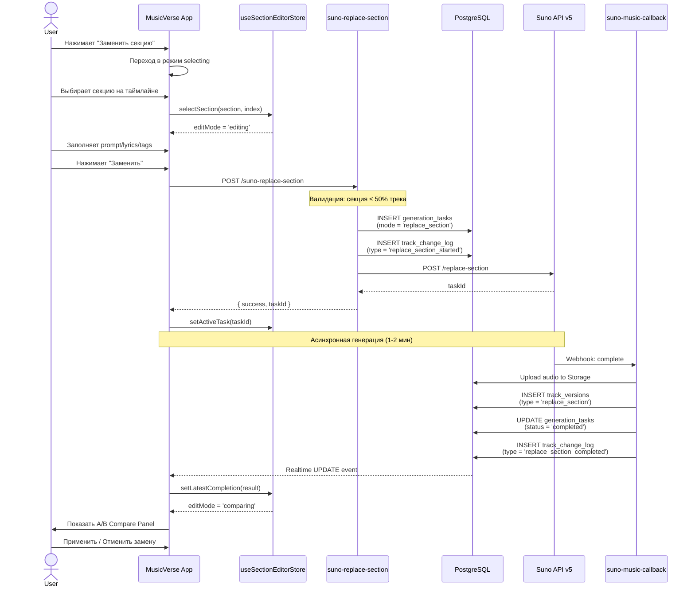
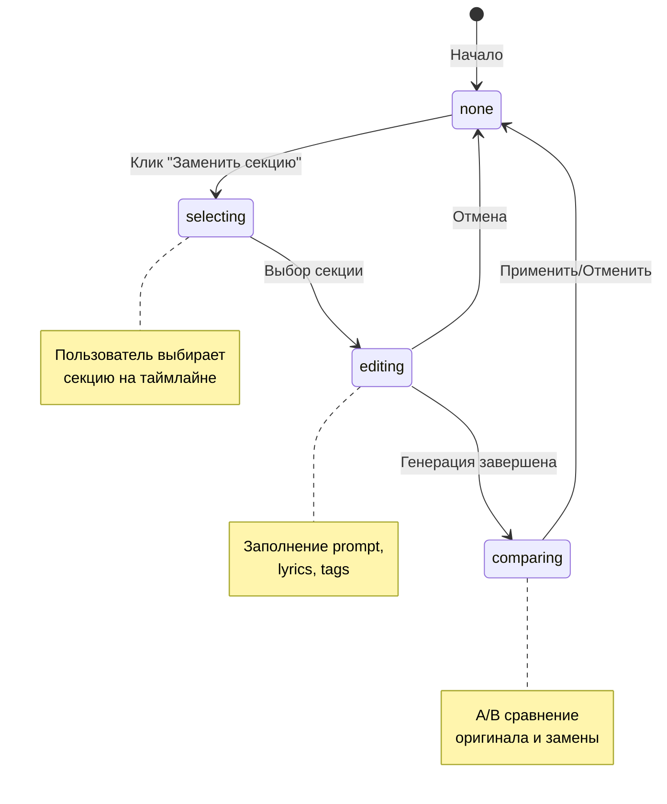

# 🎛️ Замена секций в Stem Studio

## Обзор

Функция замены секций позволяет перегенерировать отдельные фрагменты трека с новыми параметрами, сохраняя остальные части оригинала. Это мощный инструмент для тонкой настройки AI-сгенерированной музыки.

---

## 📊 Архитектура системы



---

## 🗂️ Структура данных

### generation_tasks
```sql
-- Запись о задаче замены секции
{
  id: uuid,
  track_id: uuid,
  user_id: uuid,
  generation_mode: 'replace_section',
  prompt: 'more energetic, with electric guitar',
  status: 'pending' | 'processing' | 'completed' | 'failed',
  suno_task_id: 'task_xxx',
  audio_clips: [...],
  telegram_chat_id: bigint
}
```

### track_change_log
```sql
-- Лог начала замены (хранит timing)
{
  change_type: 'replace_section_started',
  metadata: {
    infillStartS: 30.5,
    infillEndS: 45.2,
    taskId: 'task_xxx',
    originalAudioId: 'audio_yyy'
  }
}

-- Лог завершения замены (хранит результат)
{
  change_type: 'replace_section_completed',
  version_id: uuid,
  metadata: {
    taskId: 'task_xxx',
    audioUrl: 'https://...',
    versionLabel: 'C',
    infillStartS: 30.5,
    infillEndS: 45.2
  }
}
```

### track_versions
```sql
-- Новая версия с замененной секцией
{
  track_id: uuid,
  audio_url: 'https://storage/.../replace_xxx.mp3',
  version_type: 'replace_section',
  version_label: 'C',
  is_primary: false,
  metadata: {
    suno_id: 'xxx',
    replace_section: true,
    original_task_id: uuid
  }
}
```

---

## 🧩 Компоненты

### Frontend

| Компонент | Путь | Назначение |
|-----------|------|------------|
| `SectionEditorPanel` | `stem-studio/SectionEditorPanel.tsx` | Desktop панель редактирования |
| `SectionEditorMobile` | `stem-studio/SectionEditorMobile.tsx` | Mobile sheet редактирования |
| `SectionTimelineVisualization` | `stem-studio/SectionTimelineVisualization.tsx` | Визуализация секций на таймлайне |
| `MobileSectionTimeline` | `stem-studio/MobileSectionTimeline.tsx` | Mobile версия таймлайна |
| `QuickComparePanel` | `stem-studio/QuickComparePanel.tsx` | Desktop A/B сравнение |
| `QuickCompareMobile` | `stem-studio/QuickCompareMobile.tsx` | Mobile A/B сравнение |
| `ReplacementHistoryPanel` | `stem-studio/ReplacementHistoryPanel.tsx` | История всех замен |
| `ReplacementProgressIndicator` | `stem-studio/ReplacementProgressIndicator.tsx` | Индикатор прогресса в header |
| `SectionComparePanel` | `stem-studio/SectionComparePanel.tsx` | Детальное сравнение версий |

### Hooks

| Hook | Путь | Назначение |
|------|------|------------|
| `useSectionEditorStore` | `stores/useSectionEditorStore.ts` | Zustand store для состояния редактора |
| `useReplaceSectionMutation` | `hooks/useReplaceSectionMutation.ts` | React Query mutation для API |
| `useReplaceSectionRealtime` | `hooks/useReplaceSectionRealtime.ts` | Realtime подписка на обновления |
| `useReplacedSections` | `hooks/useReplacedSections.ts` | Запрос истории замен |
| `useSectionDetection` | `hooks/useSectionDetection.ts` | Детекция секций по lyrics |

### Edge Functions

| Функция | Путь | Назначение |
|---------|------|------------|
| `suno-replace-section` | `supabase/functions/suno-replace-section/` | Инициация замены через Suno API |
| `suno-music-callback` | `supabase/functions/suno-music-callback/` | Обработка callback от Suno |

---

## 🔄 Жизненный цикл состояния



### Zustand Store State

```typescript
interface SectionEditorState {
  // Режим работы
  editMode: 'none' | 'selecting' | 'editing' | 'comparing';
  
  // Выбранная секция
  selectedSection: DetectedSection | null;
  selectedSectionIndex: number | null;
  customRange: { start: number; end: number } | null;
  
  // Поля редактирования
  editedLyrics: string;
  prompt: string;
  tags: string;
  
  // Прогресс
  activeTaskId: string | null;
  latestCompletion: ReplacementResult | null;
}
```

---

## 🎯 Детекция секций

Секции определяются автоматически на основе синхронизированных lyrics:

```typescript
// useSectionDetection.ts
const SECTION_PATTERNS = [
  /^\[(?:verse|куплет)/i,
  /^\[(?:chorus|припев)/i,
  /^\[(?:bridge|бридж)/i,
  /^\[(?:outro|аутро)/i,
  /^\[(?:intro|интро)/i,
  /^\[(?:pre-chorus|предприпев)/i,
];

// Результат
interface DetectedSection {
  label: string;       // "Verse 1", "Chorus", etc.
  startTime: number;   // Начало в секундах
  endTime: number;     // Конец в секундах
  lyrics: string;      // Текст секции
}
```

---

## ⚡ API Suno Replace Section

### Endpoint
```
POST https://api.sunoapi.org/api/v1/generate/replace-section
```

### Request
```json
{
  "taskId": "original_task_id",
  "audioId": "original_audio_id",
  "prompt": "new lyrics or style description",
  "tags": "rock, energetic, guitar",
  "title": "Track Title",
  "infillStartS": 30.5,
  "infillEndS": 45.2,
  "callBackUrl": "https://xxx.supabase.co/functions/v1/suno-music-callback"
}
```

### Ограничения
- Секция ≤ 50% от длины трека
- Требуется `suno_id` и `suno_task_id` оригинального трека
- Callback приходит через 1-2 минуты

---

## 📱 UX Flow

### Desktop
1. Пользователь открывает Stem Studio для трека
2. Нажимает кнопку "Заменить" в header
3. Таймлайн переходит в режим выбора секций
4. Клик на секции открывает inline панель редактирования
5. После заполнения формы — запуск генерации
6. Progress indicator в header показывает статус
7. При завершении — A/B compare panel с контролами воспроизведения

### Mobile
1. Те же шаги, но:
   - Секции выбираются в horizontal scroll timeline
   - Редактирование в bottom sheet
   - A/B сравнение в fullscreen sheet

---

## 🔔 Уведомления

### In-App
- Toast "Замена секции запущена" (при старте)
- Toast "Секция заменена" (при завершении)
- Notification в колокольчике

### Telegram
```
🎵 Секция трека успешно заменена! Версия C

[Открыть в студии] - deep link на /studio/{trackId}
```

---

## 🐛 Troubleshooting

| Проблема | Причина | Решение |
|----------|---------|---------|
| Кнопка "Заменить" не появляется | Нет `suno_id` / `suno_task_id` | Только треки сгенерированные через Suno |
| Секции не определяются | Нет синхронизированных lyrics | Требуется трек с timestamps |
| Compare panel пустой | Потеряны timing данные | Проверить track_change_log |
| Ошибка 400 от Suno | Секция > 50% трека | Уменьшить выделенный диапазон |

---

## 📈 Метрики

Отслеживаются через `track_change_log`:
- Количество замен на трек
- Успешность генераций
- Популярные prompt presets
- Средняя длительность секций

---

## 🔮 Будущие улучшения

- [ ] Отмена активной генерации
- [ ] Множественные замены в очереди
- [ ] Preview before apply (сшивка оригинала + замены)
- [ ] A/B/C/... сравнение нескольких версий
- [ ] Undo/Redo история замен
- [ ] AI-подсказки для prompt
