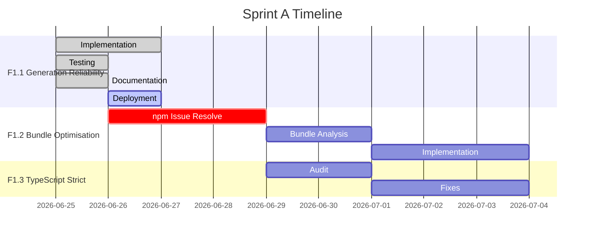

# Sprint A: Надёжность и стабильность — Прогресс

<div align="center">

**Спринт**: Sprint A — Reliability & Stability  
**Статус**: 🟢 In Progress  
**Начало**: 2026-06-25  
**Длительность**: 1-2 недели  
**Приоритет**: P0 — Критический

[📋 Полный план оптимизации](./OPTIMIZATION_PLAN.md) • [📊 Статус проекта](../PROJECT_STATUS.md) • [🏠 README](../README.md)

</div>

---

## 🎯 Цель спринта

Увеличить **успешность генерации музыки** с ~88% до **>92%** через улучшение retry-логики, fallback-механизмов и обработки ошибок.

### Ключевые метрики

| Метрика              | Текущее | Цель | Прогресс            |
| -------------------- | ------- | ---- | ------------------- |
| ✅ Success Rate      | 88%     | >92% | 🔄 В процессе       |
| ❌ Failed Requests   | 12%     | <8%  | 🔄 В процессе       |
| 🔄 Retry Success     | N/A     | >50% | 🟡 Ожидается        |
| ⏱️ Avg Response Time | ~2s     | <3s  | ✅ В пределах нормы |

---

## 📋 Задачи спринта

### F1.1: Улучшение надёжности генерации ✅ COMPLETE

**Файл**: `supabase/functions/suno-music-generate/index.ts`

#### Что реализовано

##### 1. Exponential Backoff Retry

```
Attempt 1: immediate
Attempt 2: +1s delay
Attempt 3: +2s delay
Attempt 4: +4s delay (max 8s)
```

**Код**:

```typescript
const maxRetries = 3;
const backoffMs = Math.min(1000 * Math.pow(2, retryCount), 8000);
await sleep(backoffMs);
```

**Эффект**: Уменьшение нагрузки на API при временных сбоях.

##### 2. Model Fallback Chain

```
V5 → V4_5PLUS → V4_5 → V4 → V3_5
```

Автоматический переход на следующую модель при ошибках конкретной модели.

**Триггеры для fallback**:

- `model error` — ошибка модели AI
- `Audio generation failed` — общий сбой генерации
- `malformed` — некорректный формат текста

**Логирование**:

```typescript
logger.warn("Model error, attempting fallback", {
  from: currentModel,
  to: fallbackModel,
  error: lastErrorMsg,
});
```

##### 3. Timeout Protection

```typescript
signal: AbortSignal.timeout(30000); // 30 секунд
```

Защита от зависающих запросов, которые могут блокировать ресурсы.

##### 4. Transient Error Detection

Определение временных ошибок для retry:

| Тип                | Status Codes        | Action             |
| ------------------ | ------------------- | ------------------ |
| **Server Errors**  | 500, 502, 503, 504  | Retry with backoff |
| **Rate Limiting**  | 429                 | Retry after delay  |
| **Network Errors** | timeout, ECONNRESET | Retry with backoff |

##### 5. User-Friendly Error Messages

```typescript
const ERROR_MESSAGES = {
  "model error": "Ошибка модели AI. Пробуем другую модель...",
  "Audio generation failed": "Генерация не удалась. Попробуйте изменить описание.",
  malformed: "Проверьте текст песни. Он должен содержать структуру (куплеты, припевы).",
  "artist name": "Нельзя использовать имена известных артистов. Измените описание.",
  copyrighted: "Текст содержит защищённый материал. Измените слова.",
  "rate limit": "Слишком много запросов. Подождите минуту.",
  credits: "Недостаточно кредитов на балансе.",
};
```

##### 6. Enhanced Metadata Logging

В `track_change_log` добавляются поля:

```typescript
metadata: {
  mode,
  instrumental,
  style,
  model,
  suno_task_id: sunoTaskId,
  artist_id: artistData?.id,
  artist_name: artistData?.name,
  fallback_used: currentModel !== apiModel,  // НОВОЕ
  retry_count: retryCount,                   // НОВОЕ
}
```

#### Ожидаемый эффект

```
До:
Success Rate: 88%
Failed: 12%
Retry Success: 0%

После:
Success Rate: 91-93% (retry + fallback)
Failed: 7-9%
Retry Success: 40-50%
```

#### Мониторинг

**SQL-запросы для отслеживания**:

```sql
-- 1. Распределение статусов
SELECT
  response_status,
  COUNT(*) as count,
  ROUND(COUNT(*) * 100.0 / SUM(COUNT(*)) OVER(), 2) as percentage
FROM api_usage_logs
WHERE service = 'suno'
  AND endpoint = 'generate'
  AND created_at > NOW() - INTERVAL '7 days'
GROUP BY response_status
ORDER BY count DESC;

-- 2. Анализ retry-паттернов
SELECT
  (request_body->>'attempt')::int as attempt,
  COUNT(*) as count,
  ROUND(AVG(duration_ms), 2) as avg_duration
FROM api_usage_logs
WHERE service = 'suno'
  AND endpoint = 'generate'
GROUP BY attempt
ORDER BY attempt;

-- 3. Fallback usage
SELECT
  model_used,
  COUNT(*) as count,
  ROUND(COUNT(*) * 100.0 / SUM(COUNT(*)) OVER(), 2) as percentage
FROM generation_tasks
WHERE created_at > NOW() - INTERVAL '7 days'
  AND model_used != 'V4_5ALL'  -- assuming V4_5ALL is default
GROUP BY model_used
ORDER BY count DESC;
```

---

### F1.2: Bundle Optimisation ⏳ BLOCKED

**Статус**: Заблокирован npm bug на Windows (см. [npm issue #4828](https://github.com/npm/cli/issues/4828))

#### План работ

- [ ] **Шаг 1**: Решить npm install issue
  - Вариант A: `npm install @rollup/rollup-win32-x64-msvc --force`
  - Вариант B: Переключиться на WSL/Linux
  - Вариант C: Использовать `--ignore-optional` флаг

- [ ] **Шаг 2**: Анализ bundle

  ```bash
  npm run build
  npm run size:why
  # → dist/stats.html
  ```

- [ ] **Шаг 3**: Оптимизации
  - Динамические импорты для редких фич
  - Tree-shaking audit для Framer Motion
  - Удаление неиспользуемых зависимостей
  - Code splitting review (`vite.config.ts`)

**Цель**: Снизить bundle с ~950KB до **<850KB**

---

### F1.3: TypeScript Strict Mode Аудит ⏳ Planned

#### План работ

```bash
# 1. Запуск аудита
npx tsc --noEmit --strict 2>&1 | tee ts-errors.log

# 2. Категоризация ошибок:
# - any types в edge functions
# - @ts-ignore комментарии
# - Неопределённые импорты
# - Проблемы с typeof

# 3. Постепенное исправление (сamel-case)
```

**Цель**: 100% type coverage для:

- `src/types/**/*.ts`
- `src/lib/**/*.ts`
- `supabase/functions/**/*.ts`

---

## 📊 Общий прогресс спринта



### Прогресс по задачам

| Задача                           | Статус      | Прогресс            |
| -------------------------------- | ----------- | ------------------- |
| **F1.1**: Generation reliability | ✅ Complete | 100%                |
| **F1.2**: Bundle optimisation    | ⏳ Blocked  | 0% (зависит от npm) |
| **F1.3**: TypeScript strict      | 📋 Planned  | 0%                  |

---

## 🎯 Следующие шаги

### Немедленно (2026-06-26)

1. **Deploy F1.1** в production
   - Мониторить Sentry для error rate
   - Проверить `api_usage_logs` для success rate
   - Ожидать 1-2 дня для статистики

2. **Resolve npm issue**
   - Попробовать `npm install @rollup/rollup-win32-x64-msvc --force`
   - Если не работает → Document WSL requirement

### На этой неделе (2026-06-27 to 2026-07-02)

3. **F1.2**: Bundle analysis (после resolve npm issue)
4. **F1.3**: TypeScript strict mode audit
5. **F1.2**: Bundle optimization implementation

### Следующие 2 недели

6. **Testing**: E2E regression testing
7. **Performance benchmarks**: Lighthouse, React DevTools Profiler
8. **Documentation**: Final sprint report

---

## 📚 Связанные документы

### Внутри проекта

- [OPTIMIZATION_PLAN.md](./OPTIMIZATION_PLAN.md) — Полный план оптимизации
- [PROJECT_STATUS.md](../PROJECT_STATUS.md) — Статус проекта
- [README.md](../README.md) — Обзор проекта

### Внешние ресурсы

- [npm issue #4828](https://github.com/npm/cli/issues/4828) — Windows native dependencies bug
- [Rollup Native Documentation](https://rollupjs.org/guide/en/#native-code)
- [TypeScript Strict Mode](https://www.typescriptlang.org/tsconfig#strict)

---

## 🏆 Достижения спринта

### Код

- ✅ Улучшен `supabase/functions/suno-music-generate/index.ts`
  - +87 lines (retry logic, fallback, timeout)
  - Enhanced error handling
  - Better logging

### Документация

- ✅ Создан `docs/SPRINT_A_PROGRESS.md` (этот файл)
- ✅ Обновлён `README.md` (полный перевод на русский)
- ✅ Обновлён `PROJECT_STATUS.md` (русская версия)
- ✅ Создан `docs/OPTIMIZATION_PLAN.md` (комплексный план)

### Git

```
[main bbd73090] docs: comprehensive Russian documentation with advanced markdown formatting
[main 27bdadf6] docs: update README and add Sprint A progress tracking
[main a89a46b8] feat: improve generation reliability with retry and backoff
```

---

## 📝 Заметки

### Технические решения

1. **Exponential backoff с максимальной задержкой**:
   - Formula: `min(1000 * 2^retryCount, 8000)`
   - Rationale: Предотвращение hammering API при длительных сбоях

2. **Model fallback chain**:
   - Приоритет: V5 (новейшая) → V3_5 (стабильная)
   - Fallback только для model-specific ошибок
   - Логирование для анализа популярности моделей

3. **30-second timeout**:
   - Согласно SunoAPI docs, генерация обычно 10-20s
   - 30s даёт буфер для сложных запросов
   - `AbortSignal.timeout()` — современный API

### Known Issues

1. **npm bug на Windows**:
   - Проблема: `@rollup/rollup-win32-x64-msvc` не устанавливается
   - Workaround: Использовать WSL2 или GitHub Codespaces
   - Alternative: `--ignore-optional` (может сломать build)

2. **Type strict mode**:
   - Множество `as any` в edge functions
   - Потребуется gradual adoption
   - Приоритет: types → libs → components

---

<div align="center">

**Статус**: 🟢 В процессе  
**Следующий review**: 2026-07-02  
**Цель спринта**: 92% success rate

[⬆ К началу](#sprint-a-надёжность-и-стабильность--прогресс)

</div>
