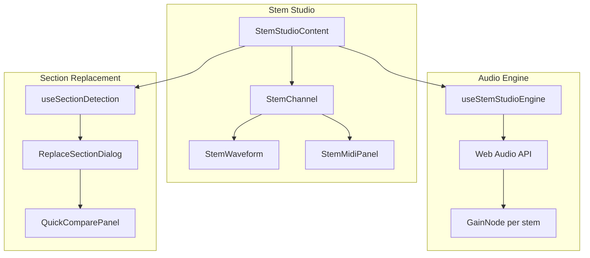
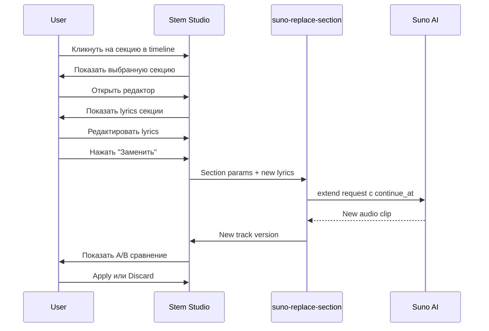

# 🎛️ Stem Studio

Профессиональный инструмент для работы со стемами (отдельными дорожками) треков.

## Возможности

### Разделение на стемы
- **Vocals** - вокальная партия
- **Drums** - ударные
- **Bass** - бас
- **Guitar** - гитара
- **Piano** - клавишные
- **Other** - остальные инструменты

### Микширование
- Индивидуальная громкость каждого стема
- Mute/Solo для каждой дорожки
- Master volume
- Синхронное воспроизведение всех стемов

### MIDI транскрипция
- Конвертация аудио в MIDI
- 4 модели: MT3, ByteDance Piano, Basic Pitch, ISMIR2021
- Автоматический выбор модели по типу стема
- Сохранение в Supabase Storage

### Замена секций
- Автоопределение секций (Verse, Chorus, Bridge, etc.)
- Редактирование lyrics выбранной секции
- A/B сравнение оригинала и замены
- История версий

## Архитектура



## Компоненты

### Frontend

**`src/components/stem-studio/StemStudioContent.tsx`**
- Основной контейнер студии
- Координация всех стемов
- Master controls

**`src/components/stem-studio/StemChannel.tsx`**
- Отдельный канал для каждого стема
- Volume slider, mute, solo buttons
- MIDI button

**`src/components/stem-studio/StemWaveform.tsx`**
- Визуализация волновой формы (wavesurfer.js)
- Seek by click
- Progress indicator

**`src/components/stem-studio/StemMidiPanel.tsx`**
- Piano Roll визуализация
- MIDI playback через Tone.js
- Export functionality

### Hooks

**`src/hooks/audio/useStemStudioEngine.ts`**
- Web Audio API управление
- Effect chains (EQ, Compressor, Reverb)
- Синхронизация стемов

**`src/hooks/studio/useSectionDetection.ts`**
- Парсинг lyrics для определения секций
- Levenshtein distance для матчинга
- Поддержка RU/EN тегов

**`src/hooks/studio/useSectionEditor.ts`**
- Zustand store для редактора секций
- Состояние выбора и редактирования

## Workflow: Замена секции



## API: Разделение на стемы

```typescript
// Запрос разделения
const { data } = await supabase.functions.invoke('suno-separate-stems', {
  body: {
    trackId: 'uuid',
    audioUrl: 'https://...',
    mode: 'full' // или 'basic' для 2 стемов
  }
});

// Структура стема в БД
interface TrackStem {
  id: string;
  track_id: string;
  stem_type: 'vocals' | 'drums' | 'bass' | 'guitar' | 'piano' | 'other';
  audio_url: string;
  separation_mode: 'full' | 'basic';
}
```

## API: MIDI транскрипция

```typescript
// Запрос транскрипции
const { data } = await supabase.functions.invoke('stem-to-midi', {
  body: {
    stemId: 'uuid',
    audioUrl: 'https://...',
    model: 'mt3' // mt3, bytedance, basic-pitch, ismir2021
  }
});

// Результат сохраняется как track_version с типом 'midi'
```

## Синхронизация стемов

```typescript
// Drift detection и коррекция
const SYNC_THRESHOLD = 0.1; // 100ms

useEffect(() => {
  const checkSync = () => {
    const masterTime = audioRefs.current[0]?.currentTime || 0;
    
    audioRefs.current.forEach((audio, i) => {
      if (i === 0) return;
      const drift = Math.abs(audio.currentTime - masterTime);
      
      if (drift > SYNC_THRESHOLD) {
        audio.currentTime = masterTime;
      }
    });
  };
  
  const interval = setInterval(checkSync, 500);
  return () => clearInterval(interval);
}, []);
```

## Mobile оптимизация

- Компактные компоненты: MobileStudioHeader, MobileMasterVolume
- Tab-based interface для разных функций
- 44px+ touch targets
- Gesture controls для timeline
- Haptic feedback

## Best Practices

1. **Синхронизация**: Всегда проверять drift между стемами
2. **Memory**: Освобождать AudioContext при unmount
3. **Lazy loading**: Загружать стемы по требованию
4. **Caching**: Кэшировать waveform данные
5. **Error handling**: Graceful degradation при ошибках API
