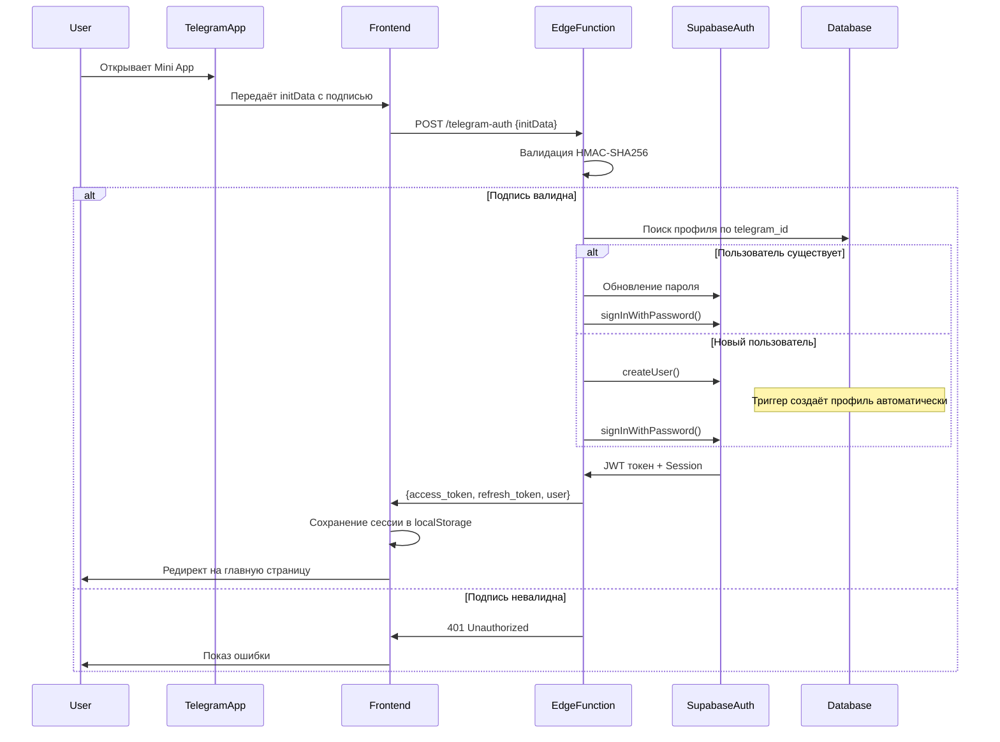

# Telegram Mini App Integration Guide

## Содержание

1. [Обзор системы](#обзор-системы)
2. [Архитектура авторизации](#архитектура-авторизации)
3. [Telegram Mini App API](#telegram-mini-app-api)
4. [Интеграция с устройством](#интеграция-с-устройством)
5. [Safe Area и адаптация UI](#safe-area-и-адаптация-ui)
6. [Настройка проекта](#настройка-проекта)
7. [Troubleshooting](#troubleshooting)

---

## Обзор системы

MusicVerse - это Telegram Mini App для создания музыки с помощью AI. Приложение интегрируется с Telegram через Web App SDK и использует Supabase Auth для управления сессиями.

### Основные компоненты

- **Frontend**: React + TypeScript + Vite
- **Backend**: Supabase Edge Functions (Lovable Cloud)
- **Auth**: Telegram OAuth через Supabase Auth
- **Database**: PostgreSQL (Supabase)
- **Storage**: Supabase Storage

---

## Архитектура авторизации

### OAuth Flow



### Компоненты аутентификации

#### 1. TelegramContext (`src/contexts/TelegramContext.tsx`)

Управляет Telegram Web App SDK и предоставляет данные пользователя:

```typescript
interface TelegramContextType {
  webApp: TelegramWebApp | null;
  user: TelegramUser | null;
  platform: string;
  initData: string;
  isInitialized: boolean;
  isDevelopmentMode: boolean;
  
  // Methods
  showMainButton: (text: string, onClick: () => void) => void;
  hideMainButton: () => void;
  showBackButton: (onClick: () => void) => void;
  hideBackButton: () => void;
  hapticFeedback: (type: 'light' | 'medium' | 'heavy') => void;
  close: () => void;
  expand: () => void;
  ready: () => void;
}
```

**Ключевые возможности:**
- Инициализация Telegram Web App SDK
- Получение данных пользователя из `initDataUnsafe`
- Поддержка Development Mode (без Telegram)
- Применение темы Telegram к приложению

#### 2. useAuth Hook (`src/hooks/useAuth.tsx`)

Центральный хук для управления аутентификацией:

```typescript
interface AuthResult {
  user: User | null;
  session: Session | null;
  hasProfile: boolean;
  error: string | null;
}

const useAuth = () => {
  const { user, session, loading, isAuthenticated } = useAuthState();
  const authenticateWithTelegram = async (): Promise<AuthResult>;
  const logout = async (): Promise<void>;
  
  return {
    user,
    session,
    loading,
    isAuthenticated,
    authenticateWithTelegram,
    logout
  };
};
```

**Режимы работы:**

- **Production Mode** (на кастомном домене):
  - Вызывает Edge Function `/telegram-auth`
  - Передаёт `initData` из Telegram
  - Получает JWT токен от Supabase
  
- **Development Mode** (на `*.lovable.dev` или `localhost`):
  - Использует email/password (`dev@test.com` / `devpassword123`)
  - Создаёт mock данные пользователя
  - Автоматический sign-up при первом запуске

#### 3. telegram-auth Edge Function

**Путь:** `supabase/functions/telegram-auth/index.ts`

**Основная логика:**

```typescript
export default async (req: Request) => {
  // 1. Валидация HMAC-SHA256
  const initData = await req.text();
  const isValid = validateTelegramData(initData, TELEGRAM_BOT_TOKEN);
  if (!isValid) return new Response('Invalid signature', { status: 401 });

  // 2. Парсинг данных пользователя
  const userData = parseInitData(initData);
  
  // 3. Поиск существующего профиля
  const { data: existingProfile } = await supabase
    .from('profiles')
    .select('user_id')
    .eq('telegram_id', userData.id)
    .single();

  // 4. Создание или обновление пользователя
  if (existingProfile) {
    // Обновление пароля существующего пользователя
    await supabase.auth.admin.updateUserById(existingProfile.user_id, {
      password: generatedPassword
    });
  } else {
    // Создание нового пользователя (триггер создаст профиль)
    await supabase.auth.admin.createUser({
      email: `telegram_${userData.id}@telegram.user`,
      password: generatedPassword,
      user_metadata: userData
    });
  }

  // 5. Вход и генерация JWT
  const { data: authData } = await supabase.auth.signInWithPassword({
    email: `telegram_${userData.id}@telegram.user`,
    password: generatedPassword
  });

  return new Response(JSON.stringify(authData), {
    headers: { 'Content-Type': 'application/json', ...corsHeaders }
  });
};
```

**Валидация подписи (HMAC-SHA256):**

```typescript
function validateTelegramData(initData: string, botToken: string): boolean {
  const params = new URLSearchParams(initData);
  const hash = params.get('hash');
  params.delete('hash');
  
  // Сортировка параметров
  const sortedParams = Array.from(params.entries())
    .sort(([a], [b]) => a.localeCompare(b))
    .map(([key, value]) => `${key}=${value}`)
    .join('\n');
  
  // Вычисление HMAC-SHA256
  const secretKey = createHmac('sha256', 'WebAppData')
    .update(botToken)
    .digest();
  
  const calculatedHash = createHmac('sha256', secretKey)
    .update(sortedParams)
    .digest('hex');
  
  return hash === calculatedHash;
}
```

#### 4. Database Schema

**profiles table:**

```sql
CREATE TABLE public.profiles (
  id UUID PRIMARY KEY DEFAULT gen_random_uuid(),
  user_id UUID NOT NULL REFERENCES auth.users(id) ON DELETE CASCADE,
  telegram_id BIGINT NOT NULL UNIQUE,
  first_name TEXT NOT NULL,
  last_name TEXT,
  username TEXT,
  language_code TEXT,
  photo_url TEXT,
  created_at TIMESTAMPTZ NOT NULL DEFAULT NOW(),
  updated_at TIMESTAMPTZ NOT NULL DEFAULT NOW()
);

-- RLS Policies
ALTER TABLE public.profiles ENABLE ROW LEVEL SECURITY;

CREATE POLICY "Users can view their own profile"
  ON public.profiles FOR SELECT
  USING (auth.uid() = user_id);

CREATE POLICY "Users can update their own profile"
  ON public.profiles FOR UPDATE
  USING (auth.uid() = user_id);
```

**Триггер автоматического создания профиля:**

```sql
CREATE OR REPLACE FUNCTION public.handle_new_user()
RETURNS TRIGGER AS $$
BEGIN
  INSERT INTO public.profiles (
    user_id, telegram_id, first_name, last_name, 
    username, language_code, photo_url
  )
  VALUES (
    NEW.id,
    (NEW.raw_user_meta_data->>'telegram_id')::bigint,
    NEW.raw_user_meta_data->>'first_name',
    NEW.raw_user_meta_data->>'last_name',
    NEW.raw_user_meta_data->>'username',
    NEW.raw_user_meta_data->>'language_code',
    NEW.raw_user_meta_data->>'photo_url'
  )
  ON CONFLICT (telegram_id) DO UPDATE SET
    first_name = EXCLUDED.first_name,
    last_name = EXCLUDED.last_name,
    username = EXCLUDED.username,
    updated_at = NOW();
  RETURN NEW;
END;
$$ LANGUAGE plpgsql SECURITY DEFINER SET search_path = public;

CREATE TRIGGER on_auth_user_created
  AFTER INSERT ON auth.users
  FOR EACH ROW
  EXECUTE FUNCTION public.handle_new_user();
```

---

## Telegram Mini App API

### Доступные методы и возможности

#### 1. Viewport (Экран)

**Управление размером и safe areas:**

```typescript
const webApp = window.Telegram.WebApp;

// Развернуть на весь экран
webApp.expand();

// Получить размеры viewport
const viewportHeight = webApp.viewportHeight;
const viewportStableHeight = webApp.viewportStableHeight;
const isExpanded = webApp.isExpanded;

// Safe Area Insets (для iOS с нотчем)
// Доступно через CSS переменные:
// --tg-safe-area-inset-top
// --tg-safe-area-inset-bottom
// --tg-safe-area-inset-left
// --tg-safe-area-inset-right
```

**CSS для адаптации к Safe Area:**

```css
.app-container {
  padding-top: env(safe-area-inset-top);
  padding-bottom: env(safe-area-inset-bottom);
  padding-left: env(safe-area-inset-left);
  padding-right: env(safe-area-inset-right);
}

/* Или через CSS переменные Telegram */
.header {
  padding-top: var(--tg-safe-area-inset-top, 0px);
}
```

#### 2. Theme (Тема)

**Получение цветов темы:**

```typescript
const themeParams = webApp.themeParams;

// Доступные цвета:
themeParams.bg_color            // Фон приложения
themeParams.text_color          // Основной текст
themeParams.hint_color          // Второстепенный текст
themeParams.link_color          // Ссылки
themeParams.button_color        // Кнопки
themeParams.button_text_color   // Текст на кнопках
themeParams.secondary_bg_color  // Вторичный фон
```

**Установка цветов:**

```typescript
// Цвет header'а
webApp.setHeaderColor('bg_color'); // или 'secondary_bg_color'
webApp.setHeaderColor('#FF0000'); // Или hex (с v6.10)

// Цвет фона
webApp.setBackgroundColor('bg_color');
webApp.setBackgroundColor('#FFFFFF'); // Или hex

// Цвет нижней панели (bottom bar)
webApp.setBottomBarColor('bg_color');
webApp.setBottomBarColor('#000000');
```

#### 3. MainButton (Главная кнопка)

**Кнопка внизу экрана:**

```typescript
const MainButton = webApp.MainButton;

// Установка текста
MainButton.setText('Создать трек');

// Показать/скрыть
MainButton.show();
MainButton.hide();

// Включить/отключить
MainButton.enable();
MainButton.disable();

// Изменение цвета
MainButton.color = '#FF0000';
MainButton.textColor = '#FFFFFF';

// Прогресс-индикатор
MainButton.showProgress(false); // false = кнопка остаётся активной
MainButton.hideProgress();

// Обработчик клика
MainButton.onClick(() => {
  console.log('MainButton clicked');
});

// Удалить обработчик
MainButton.offClick(callback);

// Проверка состояния
MainButton.isVisible;
MainButton.isActive;
MainButton.isProgressVisible;
```

#### 4. BackButton (Кнопка назад)

**Кнопка в header'е:**

```typescript
const BackButton = webApp.BackButton;

// Показать/скрыть
BackButton.show();
BackButton.hide();

// Обработчик клика
BackButton.onClick(() => {
  // Навигация назад
  window.history.back();
});

// Удалить обработчик
BackButton.offClick(callback);

// Проверка состояния
BackButton.isVisible;
```

#### 5. HapticFeedback (Вибрация)

**Тактильная обратная связь:**

```typescript
const HapticFeedback = webApp.HapticFeedback;

// Impact - удар (для кнопок, переключателей)
HapticFeedback.impactOccurred('light');   // Лёгкий
HapticFeedback.impactOccurred('medium');  // Средний
HapticFeedback.impactOccurred('heavy');   // Сильный
HapticFeedback.impactOccurred('rigid');   // Жёсткий
HapticFeedback.impactOccurred('soft');    // Мягкий

// Notification - уведомление (для результатов действий)
HapticFeedback.notificationOccurred('error');   // Ошибка
HapticFeedback.notificationOccurred('success'); // Успех
HapticFeedback.notificationOccurred('warning'); // Предупреждение

// Selection - изменение выбора (для прокрутки, свайпов)
HapticFeedback.selectionChanged();
```

**Рекомендации по использованию:**
- `light/medium` - для обычных кнопок
- `heavy` - для важных действий
- `success` - после успешного завершения
- `error` - при ошибках
- `selectionChanged` - при навигации по списку

#### 6. Popup (Всплывающие окна)

**Показ модальных окон:**

```typescript
// Простое уведомление
webApp.showAlert('Трек успешно создан!', () => {
  console.log('Alert closed');
});

// Подтверждение
webApp.showConfirm('Удалить этот трек?', (confirmed) => {
  if (confirmed) {
    // Удаление
  }
});

// Кастомное popup
webApp.showPopup({
  title: 'Выбор действия',
  message: 'Что вы хотите сделать с треком?',
  buttons: [
    { id: 'edit', type: 'default', text: 'Редактировать' },
    { id: 'share', type: 'default', text: 'Поделиться' },
    { id: 'delete', type: 'destructive', text: 'Удалить' },
    { type: 'cancel' }
  ]
}, (buttonId) => {
  if (buttonId === 'delete') {
    // Удаление
  } else if (buttonId === 'share') {
    // Шаринг
  }
});
```

**Типы кнопок:**
- `default` - обычная кнопка
- `destructive` - деструктивное действие (красная)
- `ok` - подтверждение (синяя)
- `close` - закрыть
- `cancel` - отмена

#### 7. Cloud Storage

**Сохранение данных в облаке Telegram:**

```typescript
// Сохранить данные
webApp.CloudStorage.setItem('key', 'value', (error, success) => {
  if (success) {
    console.log('Saved');
  }
});

// Получить данные
webApp.CloudStorage.getItem('key', (error, value) => {
  console.log(value);
});

// Получить несколько значений
webApp.CloudStorage.getItems(['key1', 'key2'], (error, values) => {
  console.log(values); // { key1: 'value1', key2: 'value2' }
});

// Удалить
webApp.CloudStorage.removeItem('key', (error, success) => {
  console.log('Removed');
});

// Получить все ключи
webApp.CloudStorage.getKeys((error, keys) => {
  console.log(keys); // ['key1', 'key2', ...]
});
```

**Лимиты:**
- До 1024 ключей
- До 4096 байт на значение
- Синхронизация между устройствами пользователя

#### 8. QR Code Scanner

**Сканирование QR-кодов:**

```typescript
webApp.showScanQrPopup({
  text: 'Отсканируйте QR-код'
}, (data) => {
  if (data) {
    console.log('Scanned:', data);
    webApp.closeScanQrPopup();
  }
});

// Закрыть сканер
webApp.closeScanQrPopup();
```

#### 9. Links & Navigation

**Открытие ссылок:**

```typescript
// Открыть ссылку в браузере
webApp.openLink('https://example.com');

// Открыть Telegram ссылку
webApp.openTelegramLink('https://t.me/channel');

// Открыть Invoice (счёт на оплату)
webApp.openInvoice('invoice_link', (status) => {
  if (status === 'paid') {
    console.log('Payment successful');
  }
});
```

#### 10. Sharing

**Поделиться контентом:**

```typescript
// Поделиться URL в чат
webApp.shareToStory('https://example.com/track/123', {
  text: 'Послушайте мой новый трек!',
  widget_link: {
    url: 'https://example.com/track/123',
    name: 'Открыть трек'
  }
});
```

#### 11. Platform Info

**Информация о платформе:**

```typescript
const platform = webApp.platform;
// 'android' | 'ios' | 'macos' | 'tdesktop' | 'web' | 'weba' | 'unknown'

const version = webApp.version; // '6.0'

const colorScheme = webApp.colorScheme; // 'light' | 'dark'

const isClosingConfirmationEnabled = webApp.isClosingConfirmationEnabled;
webApp.enableClosingConfirmation(); // Показать подтверждение при закрытии
webApp.disableClosingConfirmation();
```

#### 12. Events

**Подписка на события:**

```typescript
// Изменение темы
webApp.onEvent('themeChanged', () => {
  console.log('Theme changed:', webApp.colorScheme);
});

// Изменение размера viewport
webApp.onEvent('viewportChanged', () => {
  console.log('Viewport changed:', webApp.viewportHeight);
});

// Подтверждение закрытия
webApp.onEvent('popupClosed', (event) => {
  console.log('Popup closed:', event);
});

// Отписка от события
webApp.offEvent('themeChanged', callback);
```

---

## Интеграция с устройством

### Доступные возможности по платформам

| Функция | iOS | Android | Desktop |
|---------|-----|---------|---------|
| HapticFeedback | ✅ | ✅ | ❌ |
| QR Scanner | ✅ | ✅ | ✅* |
| CloudStorage | ✅ | ✅ | ✅ |
| Safe Area | ✅ | ✅ | ❌ |
| Biometry | ✅ | ✅ | ❌ |
| Share to Story | ✅ | ✅ | ❌ |

*✅* - Камера компьютера

### Biometric Authentication (Touch ID / Face ID)

**Доступно с версии 7.2:**

```typescript
const BiometricManager = webApp.BiometricManager;

// Проверка доступности
if (BiometricManager.isInited && BiometricManager.isBiometricAvailable) {
  // Запросить разрешение
  BiometricManager.init(() => {
    if (BiometricManager.isBiometricAvailable) {
      // Аутентификация
      BiometricManager.authenticate({
        reason: 'Подтвердите доступ к треку'
      }, (success) => {
        if (success) {
          console.log('Authenticated');
        } else {
          console.log('Failed');
        }
      });
    }
  });
}

// Тип биометрии
BiometricManager.biometricType; // 'finger' | 'face' | 'unknown'

// Запрос доступа к биометрии
BiometricManager.requestAccess({
  reason: 'Для быстрого входа в приложение'
}, (granted) => {
  console.log('Access granted:', granted);
});
```

### Accelerometer & Gyroscope

**Доступ к датчикам устройства:**

```typescript
// Запрос доступа к акселерометру
webApp.requestAccelerometer(() => {
  console.log('Accelerometer access granted');
});

// Получение данных акселерометра
webApp.onEvent('accelerometerChanged', (data) => {
  console.log('Acceleration:', data.x, data.y, data.z);
});

// Запрос доступа к гироскопу
webApp.requestGyroscope(() => {
  console.log('Gyroscope access granted');
});

// Получение данных гироскопа
webApp.onEvent('gyroscopeChanged', (data) => {
  console.log('Rotation:', data.x, data.y, data.z);
});
```

---

## Safe Area и адаптация UI

### Проблема

На iOS устройствах с notch (вырез) и на Android с punch-hole камерами, системный UI (статус бар, навигация) может перекрывать контент приложения.

### Решение

#### 1. CSS Safe Area Insets

```css
/* Базовая адаптация */
:root {
  --safe-area-top: env(safe-area-inset-top, 0px);
  --safe-area-bottom: env(safe-area-inset-bottom, 0px);
  --safe-area-left: env(safe-area-inset-left, 0px);
  --safe-area-right: env(safe-area-inset-right, 0px);
}

/* Применение к основному контейнеру */
.app-container {
  padding-top: var(--safe-area-top);
  padding-bottom: var(--safe-area-bottom);
  padding-left: var(--safe-area-left);
  padding-right: var(--safe-area-right);
  
  /* Минимальные отступы для устройств без notch */
  padding-top: max(var(--safe-area-top), 12px);
  padding-bottom: max(var(--safe-area-bottom), 12px);
}

/* Header с учётом safe area */
.header {
  position: fixed;
  top: 0;
  left: 0;
  right: 0;
  padding-top: var(--safe-area-top);
  background: var(--tg-theme-bg-color);
  z-index: 1000;
}

/* Контент с отступом от header */
.content {
  margin-top: calc(56px + var(--safe-area-top));
  padding-bottom: calc(80px + var(--safe-area-bottom));
}

/* Bottom Navigation */
.bottom-nav {
  position: fixed;
  bottom: 0;
  left: 0;
  right: 0;
  padding-bottom: var(--safe-area-bottom);
  background: var(--tg-theme-bg-color);
}
```

#### 2. Telegram CSS Variables

Telegram предоставляет собственные CSS переменные:

```css
:root {
  /* Safe area insets */
  --tg-safe-area-inset-top: 44px;    /* iOS notch */
  --tg-safe-area-inset-bottom: 34px; /* iOS home indicator */
  --tg-safe-area-inset-left: 0px;
  --tg-safe-area-inset-right: 0px;
  
  /* Viewport */
  --tg-viewport-height: 100vh;
  --tg-viewport-stable-height: 100vh;
  
  /* Theme colors */
  --tg-theme-bg-color: #ffffff;
  --tg-theme-text-color: #000000;
  --tg-theme-hint-color: #999999;
  --tg-theme-link-color: #2481cc;
  --tg-theme-button-color: #2481cc;
  --tg-theme-button-text-color: #ffffff;
  --tg-theme-secondary-bg-color: #f1f1f1;
}
```

#### 3. JavaScript Detection

```typescript
// В TelegramContext
useEffect(() => {
  if (!webApp) return;
  
  // Применить safe area через CSS переменные
  const root = document.documentElement;
  
  // iOS safe areas
  const safeAreaTop = webApp.safeAreaInset?.top || 0;
  const safeAreaBottom = webApp.safeAreaInset?.bottom || 0;
  
  root.style.setProperty('--safe-top', `${safeAreaTop}px`);
  root.style.setProperty('--safe-bottom', `${safeAreaBottom}px`);
  
  // Развернуть приложение на весь экран
  webApp.expand();
  
  // Установить цвета
  webApp.setHeaderColor('secondary_bg_color');
  webApp.setBackgroundColor('bg_color');
}, [webApp]);
```

#### 4. React Component Example

```tsx
export const AppLayout = ({ children }: { children: React.ReactNode }) => {
  const { webApp } = useTelegram();
  
  useEffect(() => {
    if (webApp?.expand) {
      webApp.expand();
    }
  }, [webApp]);
  
  return (
    <div className="app-layout">
      <style>{`
        .app-layout {
          min-height: 100vh;
          padding-top: env(safe-area-inset-top);
          padding-bottom: env(safe-area-inset-bottom);
        }
        
        .app-header {
          position: sticky;
          top: env(safe-area-inset-top);
          z-index: 100;
        }
        
        .app-content {
          padding: 16px;
          padding-bottom: calc(80px + env(safe-area-inset-bottom));
        }
      `}</style>
      
      <header className="app-header">
        {/* Header content */}
      </header>
      
      <main className="app-content">
        {children}
      </main>
    </div>
  );
};
```

---

## Настройка проекта

### 1. Создание Telegram бота

```bash
# Найти @BotFather в Telegram и создать бота
/newbot
# Следовать инструкциям

# Получить Bot Token
/mybots -> выбрать бота -> API Token

# Настроить Mini App
/mybots -> выбрать бота -> Bot Settings -> Menu Button
# Установить Web App URL: https://yourdomain.com
```

### 2. Настройка Lovable Cloud

1. **Добавить TELEGRAM_BOT_TOKEN в секреты:**
   - Открыть Cloud Dashboard
   - Перейти в Secrets
   - Добавить `TELEGRAM_BOT_TOKEN`

2. **Проверить Edge Function:**
   ```bash
   # Edge Function автоматически развёрнута
   # URL: https://ygmvthybdrqymfsqifmj.supabase.co/functions/v1/telegram-auth
   ```

3. **Настроить Supabase Auth:**
   - Email Confirm: OFF (для тестирования)
   - Auto Confirm: ON
   - Redirect URLs: добавить домены приложения

### 3. Тестирование

#### Development Mode (локально)

```typescript
// useAuth автоматически использует dev режим
// на localhost и *.lovable.dev

// Mock данные:
user = {
  id: 123456789,
  first_name: "Dev",
  last_name: "User",
  username: "devuser"
}
```

#### Production Mode (Telegram)

1. Открыть бота в Telegram
2. Нажать на Menu Button (внизу)
3. Mini App откроется с реальными данными
4. Проверить логи Edge Function при необходимости

---

## Troubleshooting

### 1. "Hash validation failed"

**Причина:** Неверная подпись HMAC-SHA256

**Решение:**
- Проверить `TELEGRAM_BOT_TOKEN` в секретах
- Убедиться, что `initData` не модифицирована
- Проверить время на сервере (max 5 минут разница)

```typescript
// Проверка в логах Edge Function
console.log('Received initData:', initData);
console.log('Bot token configured:', !!TELEGRAM_BOT_TOKEN);
console.log('Hash from Telegram:', params.get('hash'));
console.log('Calculated hash:', calculatedHash);
```

### 2. "No initData available"

**Причина:** Приложение открыто не через Telegram

**Решение:**
- Использовать Development Mode для тестирования
- Открыть через Telegram Mini App в production

### 3. "Profile already exists"

**Причина:** Конфликт при создании профиля (устранено в последней версии)

**Решение:**
- Обновлённая Edge Function удаляет orphaned profiles автоматически
- Триггер `handle_new_user` создаёт профили без дублирования

### 4. Safe Area не работает

**Причина:** Приложение не развёрнуто на весь экран

**Решение:**
```typescript
useEffect(() => {
  if (window.Telegram?.WebApp) {
    window.Telegram.WebApp.expand();
    window.Telegram.WebApp.ready();
  }
}, []);
```

### 5. Кнопки не кликабельны

**Причина:** Контент перекрывает safe area

**Решение:**
```css
.clickable-area {
  padding-top: max(env(safe-area-inset-top), 12px);
  margin-top: 0;
}
```

### 6. Тёмная тема не применяется

**Причина:** CSS переменные не используются

**Решение:**
```css
/* Использовать Telegram theme variables */
background: var(--tg-theme-bg-color);
color: var(--tg-theme-text-color);
```

---

## Best Practices

### 1. Всегда используйте HapticFeedback

```typescript
// При нажатии на кнопки
button.onClick(() => {
  webApp.HapticFeedback.impactOccurred('light');
  handleAction();
});

// При успехе/ошибке
try {
  await createTrack();
  webApp.HapticFeedback.notificationOccurred('success');
} catch (error) {
  webApp.HapticFeedback.notificationOccurred('error');
}
```

### 2. Используйте MainButton для основных действий

```typescript
// Показать MainButton только когда нужно
useEffect(() => {
  if (canSubmit) {
    webApp.MainButton.setText('Создать');
    webApp.MainButton.show();
    webApp.MainButton.enable();
    
    const handler = () => handleSubmit();
    webApp.MainButton.onClick(handler);
    
    return () => {
      webApp.MainButton.offClick(handler);
      webApp.MainButton.hide();
    };
  }
}, [canSubmit]);
```

### 3. Развёртывайте на весь экран

```typescript
// При инициализации
webApp.expand();
webApp.ready();

// Применить тему
webApp.setHeaderColor('secondary_bg_color');
webApp.setBackgroundColor('bg_color');
```

### 4. Обрабатывайте закрытие приложения

```typescript
// Показать подтверждение при закрытии
if (hasUnsavedChanges) {
  webApp.enableClosingConfirmation();
} else {
  webApp.disableClosingConfirmation();
}
```

### 5. Адаптация под платформу

```typescript
const platform = webApp.platform;

if (platform === 'ios') {
  // iOS-специфичная логика
  // Например, дополнительные отступы для notch
} else if (platform === 'android') {
  // Android-специфичная логика
}
```

### 6. Используйте CloudStorage для персистентности

```typescript
// Сохранить настройки пользователя
webApp.CloudStorage.setItem('settings', JSON.stringify(settings));

// Восстановить при следующем запуске
webApp.CloudStorage.getItem('settings', (error, value) => {
  if (value) {
    setSettings(JSON.parse(value));
  }
});
```

---

## Ссылки

- [Telegram Bot API](https://core.telegram.org/bots/api)
- [Telegram Web App API](https://core.telegram.org/bots/webapps)
- [Supabase Auth](https://supabase.com/docs/guides/auth)
- [Lovable Cloud Documentation](https://docs.lovable.dev/features/cloud)
