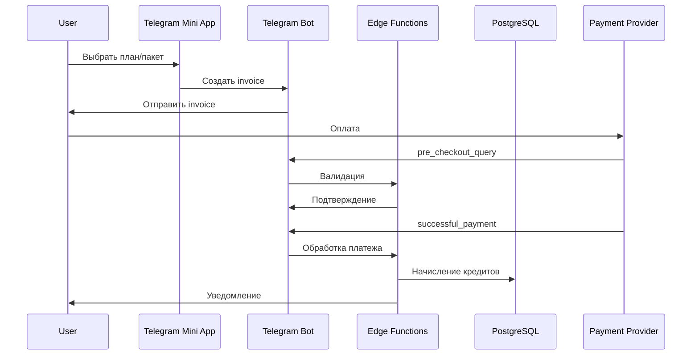

# Telegram Payments Integration

## Обзор

MusicVerse планирует интеграцию платежей через Telegram Payments API для монетизации приложения.

## Архитектура



## Telegram Payments API

### Создание Invoice

```typescript
// Edge Function: create-invoice
const invoice = {
  title: "100 кредитов MusicVerse",
  description: "Пакет кредитов для генерации музыки",
  payload: JSON.stringify({ 
    userId: user_id, 
    productId: "credits_100",
    amount: 100 
  }),
  provider_token: Deno.env.get("TELEGRAM_PAYMENT_TOKEN"),
  currency: "RUB",
  prices: [{ label: "100 кредитов", amount: 19900 }], // в копейках
  max_tip_amount: 10000,
  suggested_tip_amounts: [5000, 10000],
  start_parameter: "buy_credits",
  photo_url: "https://...",
  photo_width: 512,
  photo_height: 512,
  need_name: false,
  need_phone_number: false,
  need_email: false,
  need_shipping_address: false,
  is_flexible: false,
};

await bot.api.createInvoiceLink(invoice);
```

### Pre-checkout Query

```typescript
// В telegram-bot edge function
if (update.pre_checkout_query) {
  const { id, invoice_payload } = update.pre_checkout_query;
  
  try {
    const payload = JSON.parse(invoice_payload);
    // Валидация: пользователь существует, продукт доступен
    const isValid = await validatePayment(payload);
    
    if (isValid) {
      await bot.api.answerPreCheckoutQuery(id, { ok: true });
    } else {
      await bot.api.answerPreCheckoutQuery(id, { 
        ok: false, 
        error_message: "Ошибка валидации платежа" 
      });
    }
  } catch (e) {
    await bot.api.answerPreCheckoutQuery(id, { 
      ok: false, 
      error_message: "Внутренняя ошибка сервера" 
    });
  }
}
```

### Successful Payment

```typescript
// В telegram-bot edge function
if (message.successful_payment) {
  const payment = message.successful_payment;
  const payload = JSON.parse(payment.invoice_payload);
  
  // Начисление кредитов
  await supabase.rpc('add_credits', {
    p_user_id: payload.userId,
    p_amount: payload.amount,
    p_action_type: 'purchase',
    p_description: `Покупка ${payload.amount} кредитов`,
    p_metadata: {
      telegram_payment_id: payment.telegram_payment_charge_id,
      provider_payment_id: payment.provider_payment_charge_id,
      currency: payment.currency,
      total_amount: payment.total_amount
    }
  });
  
  // Уведомление пользователя
  await bot.api.sendMessage(message.chat.id, 
    `✅ Спасибо за покупку!\n\n` +
    `💰 Начислено: ${payload.amount} кредитов\n` +
    `📝 ID транзакции: ${payment.telegram_payment_charge_id}`
  );
}
```

## Продукты

### Пакеты кредитов

| ID | Название | Кредиты | Цена (RUB) | Бонус |
|----|----------|---------|------------|-------|
| credits_50 | Стартовый | 50 | 99 | - |
| credits_100 | Базовый | 100 | 199 | - |
| credits_300 | Популярный | 300 | 499 | +50 |
| credits_1000 | Про | 1000 | 1499 | +200 |

### Подписки

| ID | Название | Кредиты/мес | Цена/мес | Особенности |
|----|----------|-------------|----------|-------------|
| sub_pro | Pro | 500 | 499 | Приоритетная очередь, HD качество |
| sub_premium | Premium | 2000 | 1499 | + Commercial use, API access |

## Mini App Integration

```typescript
// Открыть платёжную форму в Mini App
const openPayment = async (productId: string) => {
  const response = await fetch('/api/create-invoice', {
    method: 'POST',
    body: JSON.stringify({ productId })
  });
  
  const { invoiceLink } = await response.json();
  
  // Открыть invoice в Telegram
  Telegram.WebApp.openInvoice(invoiceLink, (status) => {
    if (status === 'paid') {
      // Обновить UI, показать celebration
      refetchCredits();
      showRewardCelebration();
    } else if (status === 'failed') {
      toast.error('Платёж не прошёл');
    }
  });
};
```

## Безопасность

1. **Валидация payload** - проверка подписи и соответствия данных
2. **Идемпотентность** - предотвращение двойного начисления
3. **Аудит** - логирование всех транзакций в `credit_transactions`
4. **Rate limiting** - защита от abuse

## База данных

```sql
-- Добавление полей для платежей
ALTER TABLE credit_transactions
ADD COLUMN telegram_payment_id TEXT,
ADD COLUMN provider_payment_id TEXT,
ADD COLUMN payment_status TEXT DEFAULT 'completed';

-- Индекс для поиска по payment_id
CREATE INDEX idx_credit_transactions_payment 
ON credit_transactions(telegram_payment_id);
```

## Настройка

1. Получить `TELEGRAM_PAYMENT_TOKEN` от @BotFather
2. Добавить токен в секреты Supabase
3. Настроить webhook для получения payment updates
4. Протестировать с тестовыми картами

## Тестирование

Telegram предоставляет тестовые карты:
- `4242 4242 4242 4242` - успешный платёж
- `4000 0000 0000 0002` - отклонённый платёж

## TODO

- [ ] Создать Edge Function `create-invoice`
- [ ] Добавить обработку `pre_checkout_query` в telegram-bot
- [ ] Добавить обработку `successful_payment` в telegram-bot
- [ ] Создать UI компоненты для покупки кредитов
- [ ] Добавить страницу истории платежей
- [ ] Интегрировать с gamification системой
