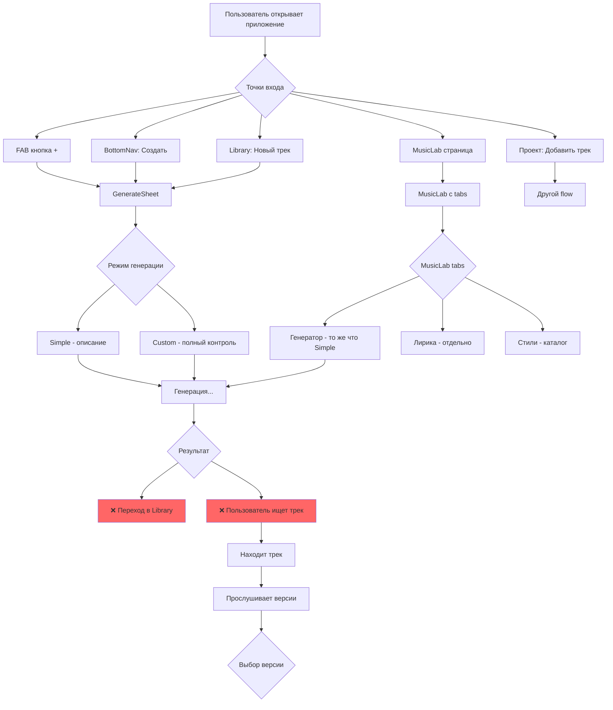
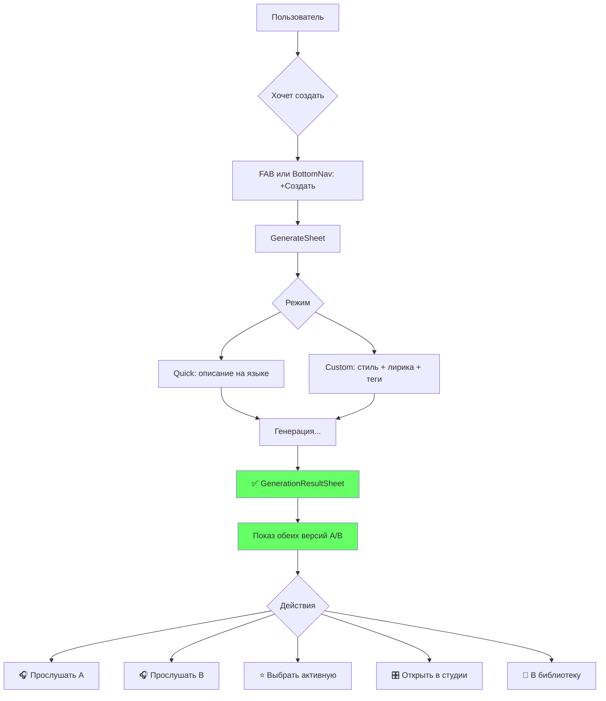
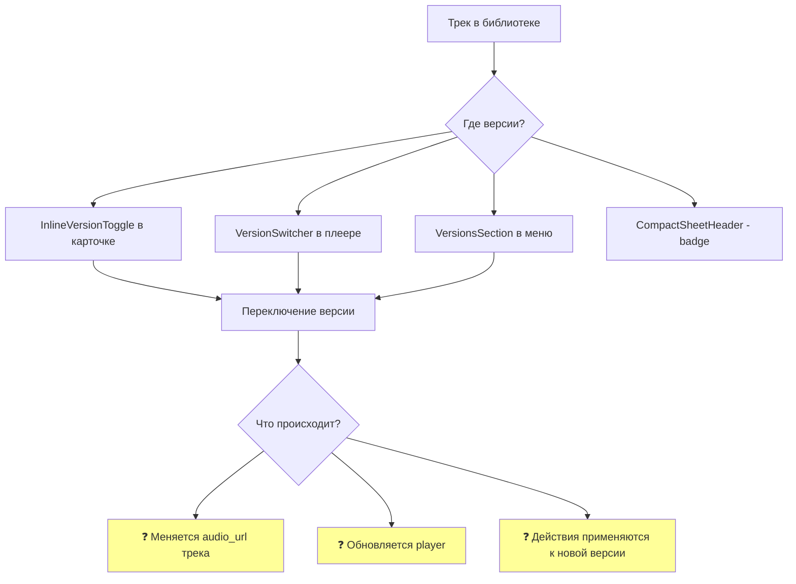
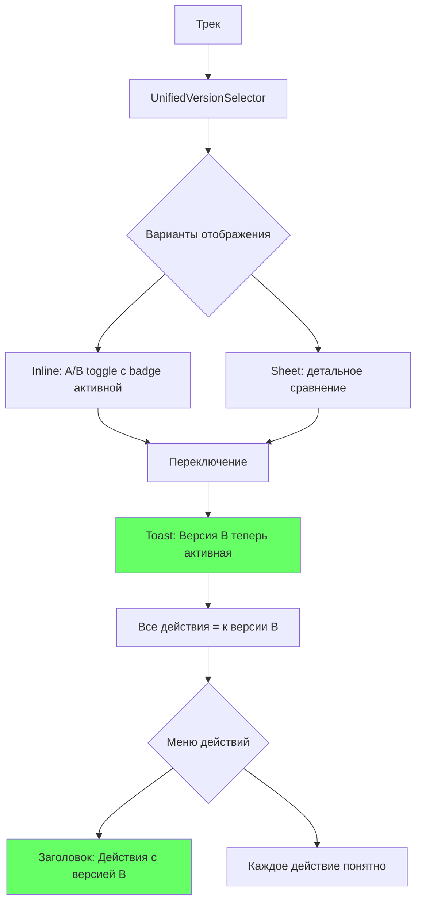
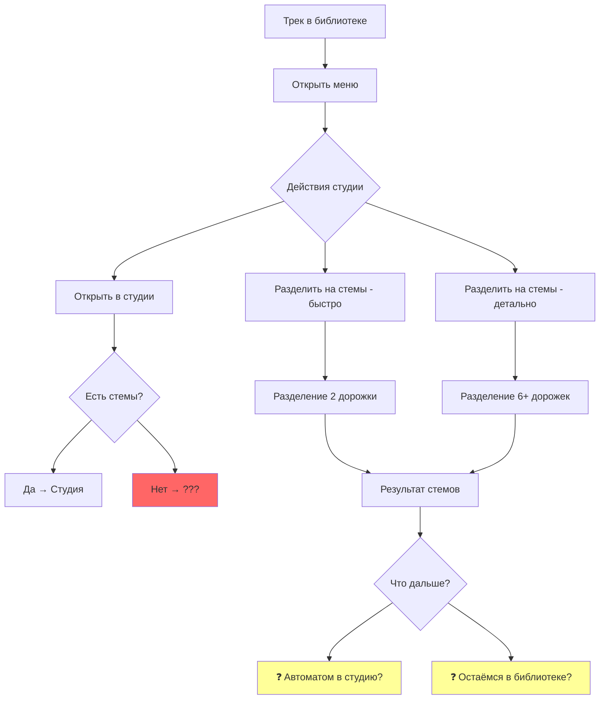
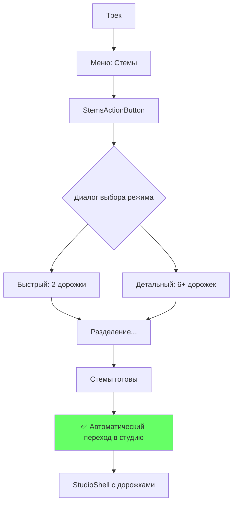
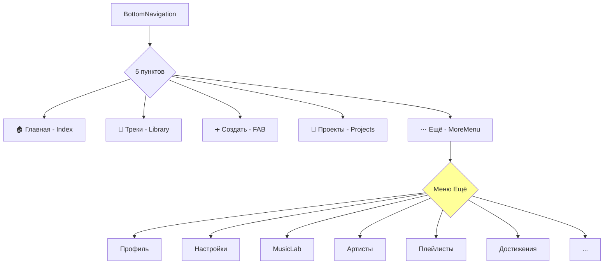

# User Flows Audit - MusicVerse AI

## Обзор

Документация текущих пользовательских путей для выявления проблем и упрощения интерфейса.

---

## 1. Flow генерации трека

### Текущее состояние (ПРОБЛЕМЫ)

### Проблемы текущего flow:

1. **5 точек входа** — пользователь не знает где начать
2. **После генерации** — перенаправление в Library, потеря контекста
3. **Поиск трека** — пользователь должен сам найти только что созданный трек
4. **MusicLab дублирует** — та же функциональность, что и GenerateSheet

### Целевое состояние (УПРОЩЁННОЕ)

---

## 2. Flow работы с версиями

### Текущее состояние

### Проблемы:

1. **4 разных компонента** для одной функции
2. **Неясно что такое "активная версия"** — пользователь не понимает
3. **Нет подтверждения** что версия переключена
4. **Действия в меню** не показывают к какой версии применяются

### Целевое состояние

---

## 3. Flow перехода в студию

### Текущее состояние

### Проблемы:

1. **3 разных действия** для входа в студию
2. **Неясно нужны ли стемы** для студии
3. **После разделения стемов** — что дальше?
4. **"Открыть в студии"** — работает только если есть стемы?

### Целевое состояние (после Quick Win 2)

---

## 4. Flow навигации

### Текущее состояние

### Проблемы:

1. **Меню "Ещё"** — слишком много пунктов
2. **MusicLab** — дублирует функционал генерации
3. **Проекты** — редко используемая функция на главной навигации

---

## 5. Рекомендации по упрощению

### Приоритет 1: Post-Generation Flow

- [ ] Создать `GenerationResultSheet` — показ результата сразу после генерации
- [ ] Добавить прослушивание версий A/B
- [ ] Кнопка "Выбрать активную"
- [ ] Кнопка "В студию"

### Приоритет 2: Унификация версий

- [x] Badge активной версии в `CompactSheetHeader`
- [ ] Создать `UnifiedVersionSelector` компонент
- [ ] Заменить все 4 компонента на один

### Приоритет 3: Студия

- [x] Объединить stems_simple и stems_detailed (`StemsActionButton`)
- [ ] Автоматический переход в студию после разделения стемов
- [ ] Упростить StudioShell (разбить на подкомпоненты)

### Приоритет 4: Навигация

- [ ] Убрать MusicLab из навигации (функционал в GenerateSheet)
- [ ] Перенести "Проекты" в профиль или Library
- [ ] Упростить меню "Ещё"

---

## Метрики для отслеживания

| Метрика | Текущее | Цель |
|---------|---------|------|
| Время до первой генерации | ? | < 30 сек |
| % дошедших до студии | ? | > 40% |
| Кол-во кликов до генерации | 3-5 | 2 |
| Кол-во кликов до студии | 5-7 | 3 |

---

*Документ создан: 2026-01-17*
*Статус: Phase 1 Audit*
