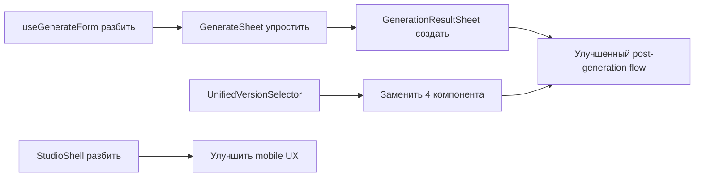

# Component Audit - MusicVerse AI

## Обзор

Аудит ключевых компонентов для выявления дублирования и сложности.

---

## 1. Генерация

### GenerateSheet.tsx

**Путь:** `src/components/GenerateSheet.tsx`
**Строк:** ~600
**Статус:** ⚠️ Требует рефакторинга

**Проблемы:**
- Слишком много логики в одном файле
- Обрабатывает 2 режима (было 3)
- Смешивает UI и бизнес-логику

**Рекомендации:**
- Вынести режимы в отдельные компоненты
- Использовать composition pattern
- State management через hook

### useGenerateForm.ts

**Путь:** `src/hooks/generation/useGenerateForm.ts`
**Строк:** ~900
**Статус:** 🔴 Критично сложный

**Проблемы:**
- 900 строк — слишком много для одного хука
- Много условной логики
- Сложно тестировать

**Рекомендации:**
- Разбить на несколько хуков:
  - `useGenerationState` — состояние формы
  - `useGenerationSubmit` — отправка
  - `useGenerationResult` — обработка результата
  - `usePromptHistory` — история промптов

### Компоненты формы генерации

**Путь:** `src/components/generate-form/`
**Файлов:** 40+

**Ключевые компоненты:**
- `GenerateFormSimple.tsx` — простой режим ✅
- `GenerateFormCustom.tsx` — кастомный режим ✅
- `CollapsibleFormHeader.tsx` — переключатель режимов ✅ (обновлён)
- `GenerationWizard/` — удалён ✅

---

## 2. Версии треков

### Компоненты версий

| Компонент | Путь | Назначение | Статус |
|-----------|------|------------|--------|
| `InlineVersionToggle` | `library/` | Toggle A/B в карточке | ✅ Работает |
| `VersionSwitcher` | `library/` | Переключатель в плеере | ⚠️ Дублирует |
| `VersionsSection` | `track-actions/sections/` | Секция в меню | ⚠️ Дублирует |
| `CompactSheetHeader` | `track-actions/` | Badge версии | ✅ Обновлён |

**Рекомендация:** Создать `UnifiedVersionSelector` и заменить все

### Хуки версий

| Хук | Путь | Назначение |
|-----|------|------------|
| `useTrackVersions` | `hooks/` | Fetch версий |
| `useVersionSwitcher` | `hooks/` | Логика переключения |
| `useActiveVersion` | `hooks/` | Активная версия |
| `useTrackVersionManagement` | `hooks/` | CRUD версий |

**Статус:** Хорошая структура, но можно объединить

---

## 3. Студия

### StudioShell.tsx

**Путь:** `src/components/studio/unified/StudioShell.tsx`
**Строк:** 1835
**Статус:** 🔴 Критично сложный

**Проблемы:**
- 1835 строк — СЛИШКОМ МНОГО
- Смешивает layout, state, логику
- Сложная mobile/desktop логика
- Много inline стилей

**Рекомендации по разбиению:**

```
StudioShell/
├── index.tsx (main orchestrator, ~200 lines)
├── StudioHeader.tsx (header + navigation)
├── StudioTabs.tsx (tab navigation)
├── StudioContent.tsx (main content area)
├── StudioSidebar.tsx (sidebar panels)
├── StudioMobileLayout.tsx (mobile specific)
├── StudioDesktopLayout.tsx (desktop specific)
└── hooks/
    ├── useStudioLayout.ts
    ├── useStudioNavigation.ts
    └── useStudioKeyboard.ts
```

### useUnifiedStudioStore.ts

**Путь:** `src/stores/useUnifiedStudioStore.ts`
**Статус:** ✅ Хорошая структура

Store уже хорошо организован, нужно:
- Перенести больше логики из StudioShell сюда
- Добавить селекторы для производительности

---

## 4. Навигация

### BottomNavigation.tsx

**Путь:** `src/components/navigation/BottomNavigation.tsx`
**Статус:** ⚠️ Требует упрощения

**Текущие пункты:**
1. Главная
2. Треки
3. +Создать
4. Проекты
5. Ещё

**Рекомендация:** 
- Убрать "Проекты" (перенести в Library)
- 4 пункта: Главная, Библиотека, +Создать, Профиль

### MoreMenuSheet.tsx

**Путь:** `src/components/navigation/MoreMenuSheet.tsx`
**Статус:** ⚠️ Слишком много пунктов

**Рекомендация:**
- Оставить только: Настройки, Помощь, О приложении
- Остальное перенести в соответствующие разделы

---

## 5. Действия с треками

### UnifiedTrackSheet.tsx

**Путь:** `src/components/track-actions/UnifiedTrackSheet.tsx`
**Статус:** ✅ Хорошая структура

Использует секции:
- `PlaybackSection` — воспроизведение
- `VersionsSection` — версии
- `StudioActions` — студия/стемы ✅ Обновлён
- `SocialSection` — социальные действия
- `ManageSection` — управление

### StemsActionButton.tsx

**Путь:** `src/components/track-actions/sections/StemsActionButton.tsx`
**Статус:** ✅ Новый компонент

Объединяет stems_simple и stems_detailed в один flow с диалогом выбора.

---

## 6. Приоритеты рефакторинга

### 🔴 Критичные (Phase 2-3)

1. **useGenerateForm.ts** — разбить на 4 хука
2. **StudioShell.tsx** — разбить на 6+ компонентов

### ⚠️ Важные (Phase 4-5)

3. **GenerateSheet.tsx** — упростить, добавить result sheet
4. **Версии** — создать UnifiedVersionSelector
5. **BottomNavigation** — упростить до 4 пунктов

### ✅ Выполнено

- [x] Удалён Wizard режим генерации
- [x] StemsActionButton — объединение stem actions
- [x] CompactSheetHeader — badge активной версии

---

## 7. Зависимости для рефакторинга



---

*Документ создан: 2026-01-17*
*Статус: Phase 1 Audit*
