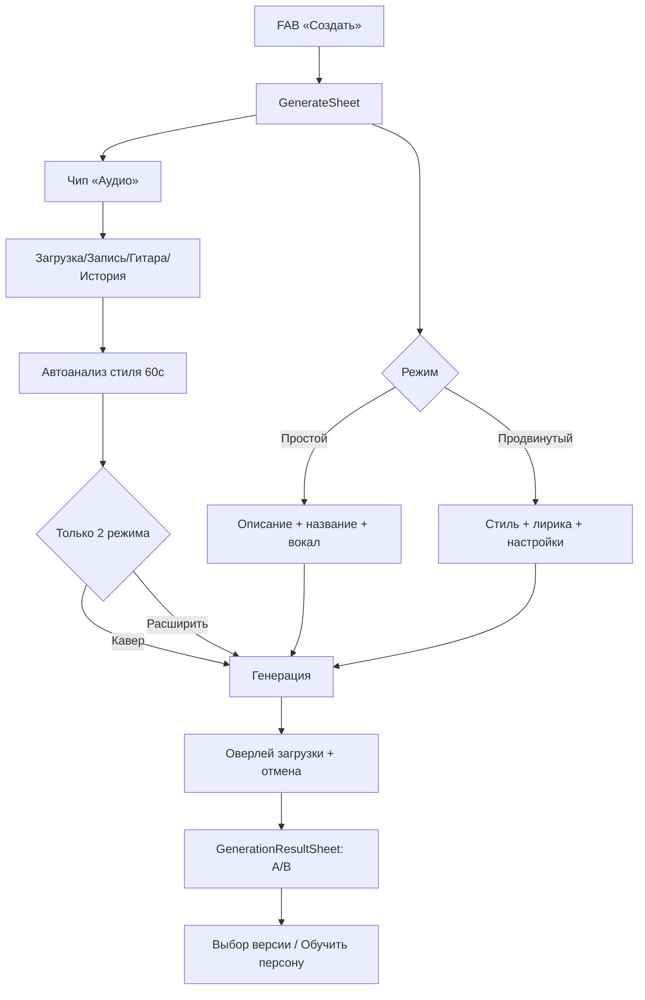
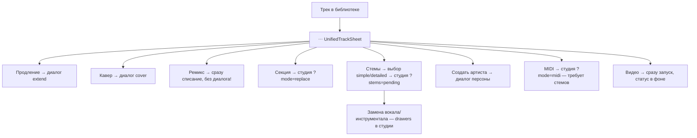
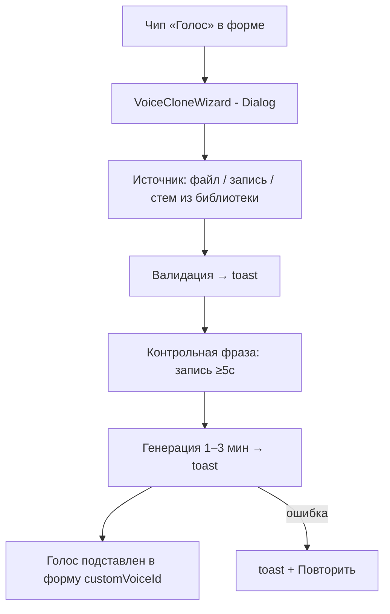

# UX-аудит: генерация музыки, обработка треков, клонирование голоса

**Дата:** 2026-07-04
**Метод:** анализ кода интерфейса (GenerateSheet, AudioActionDialog, UnifiedTrackSheet, GenerationResultSheet, VoiceCloneWizard, Unified Studio Mobile, BottomNavigation/NavigationShell, useTrackActionsState, trackActionConditions)
**Формат:** персоны → карты путей → точки трения → приоритизированный план улучшений

---

## 1. Карта текущего функционала

### 1.1. Точки входа

| Вход | Компонент | Что открывает |
|---|---|---|
| FAB «Создать» в нижней навигации | `BottomNavigation.tsx` | `GenerateSheet` (bottom sheet, 95dvh) |
| Меню трека (⋯) | `UnifiedTrackSheet.tsx` | ~20 действий в 5 группах |
| Студия | `/studio-v2/track/:id` | стемы, секции, MIDI, микшер |
| Телеграм-бот | `/generate`, `/cover`, `/extend` + deep links | Mini App с `startapp`-параметром |
| После генерации | `GenerationResultSheet` (в `MainLayout`) | выбор версии A/B, обучение персоны |

### 1.2. Форма генерации (`GenerateSheet`)

- **Два режима:** «Простой» (описание ≤500 симв., название, тумблер вокала, AI-boost, каталог стилей) и «Продвинутый» (название, стиль, лирика + чат-ассистент, расширенные настройки: negative tags, пол вокала, style weight, weirdness, audio weight, кастомный голос, публичность). Мастер (wizard) был удалён «for UX simplification».
- **Строка референсов — 4 чипа:** Аудио → `AudioActionDialog`, Голос → `VoiceCloneWizard`, Персона → выбор AI-артиста, Проект → привязка к проекту.
- **`AudioActionDialog`:** загрузка (≤20 МБ) / запись / гитарный режим / история из облака → **автоматический** анализ стиля (60 с таймаут) → после анализа появляются **только два** режима: `cover | extend` (`AudioActionModeTabsSection.tsx`, `type AudioMode = "cover" | "extend"`).
- **Хорошо сделано:** цена в CTA («Сгенерировать — N кредитов»), предупреждение о балансе, черновики (авто + Telegram SecondaryButton), подтверждение закрытия при несохранённых данных, отмена генерации, keyboard-aware футер, haptic.

### 1.3. Действия над готовым треком (`UnifiedTrackSheet`)

| Группа | Действия | Реализация |
|---|---|---|
| Студия | Студия, Секция, Стемы (simple/detailed) | навигация в `/studio-v2/track/:id` (+`?mode=replace`, `?stems=pending`) |
| Создать | Обложка, Кавер, Расширить, Ремикс, Видео, Вокал | диалоги `cover`/`extend`/`addVocals`; **Ремикс и Видео — one-tap без диалога** |
| Экспорт | MP3, WAV, Стемы, Telegram, Ссылка, Плейлист, Проект | скачивание/шаринг |
| Качество | HD Audio (upscale 48kHz) | one-tap |
| Управление | Детали, Скрыть/Открыть, Удалить | диалоги |

Условная видимость (`trackActionConditions.ts`): «Вокал» — только для инструментала; «Инструментал» — только для трека с вокалом; MIDI/ноты — только после стемов; «Стемы» скрываются после первого разделения.

### 1.4. Студия (Unified Studio Mobile)

Разделение на стемы, замена секций, микшер, MIDI-транскрипция, лирика, версии. В гриде действий (`MobileActionsContent.tsx`) **три кнопки-заглушки**: «Обрезать», «Ремикс», «Аранжировка» → toast «Функция в разработке»; «Удалить проект» → тоже заглушка.

### 1.5. Клонирование голоса (`VoiceCloneWizard`)

Источник (загрузка / запись / вокальные стемы из библиотеки, ≥5 с) → валидация → **контрольная фраза** (запись ≥5 с) → генерация 1–3 мин → голос автоматически подставляется в форму (`customVoiceId`). Статусы — через toast-уведомления. Компонент — `Dialog` (не Drawer/BottomSheet).

---

## 2. Персоны

### P1. «Аня» — новичок из Telegram (60–70% аудитории)
- **Контекст:** пришла по ссылке из чата, впервые видит приложение, телефон, 2 минуты внимания.
- **Цель:** «сделать песню про подругу на день рождения» за один заход.
- **Поведение:** пользуется только простым режимом; не знает слов «стемы», «персона», «weirdness».
- **Боли:** страх потратить кредиты впустую; не понимает, куда делся трек после генерации; попапы онбординга (welcome bonus через 1 с, подсказка «Создать» через 3 с, геймификация через 2 с) конкурируют друг с другом.
- **Критерий успеха:** первый трек ≤3 мин от входа, поделилась в чат.

### P2. «Дмитрий» — автор песен / хобби-музыкант
- **Контекст:** пишет тексты, приходит 2–3 раза в неделю, средняя техническая грамотность.
- **Цель:** контролируемый результат — свой текст, свой стиль, итерации.
- **Поведение:** продвинутый режим, лирика-ассистент, черновики, сравнение версий A/B, кавер/расширение для итераций.
- **Боли:** не различает «Кавер» / «Ремикс» / «Создать похожий» — что из них сохранит мелодию, а что стиль? Ремикс запускается в один тап без вопросов и тратит кредиты; результат «появится в библиотеке» без ссылки.
- **Критерий успеха:** довёл трек до финальной версии ≤5 итераций, понимая цену каждой.

### P3. «Сергей» — музыкант с инструментом (гитарист/клавишник)
- **Контекст:** имеет свои демо-записи и инструменталы; хочет «дописать» их с помощью AI.
- **Цель:** загрузить свой инструментал и добавить AI-вокал; записать риф и получить трек в его стиле.
- **Поведение:** гитарный режим записи, аудио-референсы, стемы, MIDI.
- **Боли:** **главный разрыв ментальной модели** — в форме генерации после загрузки аудио есть только «Кавер | Расширить»; «добавить вокал к моему инструменталу» из формы не находится (эта функция живёт в меню уже сгенерированного трека и в студии, причём для загруженного извне аудио — практически недостижима).
- **Критерий успеха:** путь «моя запись → трек с вокалом» очевиден с первого экрана.

### P4. «Лера» — контент-мейкер
- **Контекст:** ведёт канал, нужен фоновый трек + обложка + видео + быстрый шаринг.
- **Цель:** от идеи до поста ≤10 минут.
- **Поведение:** простой режим → обложка → видео → «Отправить в Telegram».
- **Боли:** «Видео» запускается без предпросмотра параметров и цены; статус создания видео виден только если заново открыть меню трека; нет единого «центра задач» для длинных операций (стемы, видео, HD, клон голоса).
- **Критерий успеха:** видит прогресс всех фоновых задач в одном месте, получает уведомление о готовности.

### P5. «Макс» — продюсер / power user (донор выручки)
- **Контекст:** платящий пользователь, глубоко работает со студией: стемы → замена вокала → микс → MIDI → экспорт WAV.
- **Цель:** максимум контроля, минимум кликов на повторяющихся операциях.
- **Поведение:** студия, детальные стемы, клон голоса, персоны, HD.
- **Боли:** кнопки-заглушки в студии («Обрезать», «Ремикс», «Аранжировка») подрывают доверие; меню трека из ~20 пунктов заставляет искать; фичи «исчезают» из меню (Вокал/Инструментал/MIDI) без объяснения, почему.
- **Критерий успеха:** цепочка «стемы → замена → экспорт» без тупиков и с понятными зависимостями.

---

## 3. Карты путей пользователя (текущее состояние)

### 3.1. Генерация трека

**Ожидание пользователя (7 сценариев) vs реальность:**

| Сценарий из ментальной модели | Есть в форме генерации? | Где на самом деле |
|---|---|---|
| 1. Простой промпт | ✅ Простой режим | — |
| 2. Промпт + лирика + настройки | ✅ Продвинутый режим | — |
| 3. Кавер (аудио-референс) | ✅ через чип «Аудио» | — |
| 4. Продление | ✅ через чип «Аудио» | — |
| 5. Смена стиля | ❌ | частично = «Кавер»; «Ремикс» в меню трека — без ввода стиля |
| 6. Добавить вокал к инструменталу | ❌ | только меню готового трека (если трек распознан как инструментал) / студия |
| 7. Добавить инструментал к вокалу | ❌ | только меню готового трека / студия |

### 3.2. Обработка сгенерированного трека

**Точки трения:** плата без подтверждения (Ремикс, Видео, HD — цена нигде не показана до запуска); зависимость «MIDI требует стемов» видна только через исчезновение кнопки; после запуска стемов/видео пользователь выпадает из контекста — прогресс живёт в toast.

### 3.3. Клонирование голоса

**Точки трения:** шаг «контрольная фраза» неожиданен — нет объяснения зачем до начала процесса; статусы только в toast (исчезают); используется `Dialog` вместо мобильного bottom sheet (нарушение собственного гайдлайна №11 из CLAUDE.md); если пользователь закрыл диалог во время генерации — непонятно, где найти результат (есть `/voices`, но из wizard'а ссылки нет).

---

## 4. Сводный список проблем

| # | Проблема | Персоны | Серьёзность |
|---|---|---|---|
| U1 | Разрыв ментальной модели: смена стиля / добавление вокала / инструментала недоступны из формы генерации; `AudioMode` = только `cover \| extend` | P3, P2 | 🔴 Критично |
| U2 | Платные действия без подтверждения и цены: Ремикс (`handleRemix` — one-tap), Видео, HD, Стемы, Кавер/Расширение из меню трека | Все | 🔴 Критично |
| U3 | Нет единого центра фоновых задач: стемы/видео/HD/клон голоса — статусы разбросаны по toast и бейджам | P4, P5 | 🔴 Критично |
| U4 | Меню трека: ~20 действий, перекрывающаяся терминология (Кавер/Ремикс/Создать похожий), нет иерархии по частоте | P2, P5 | 🟠 Высокая |
| U5 | Условная видимость скрывает фичи без объяснения (Вокал, Инструментал, MIDI, Стемы исчезают) | P3, P5 | 🟠 Высокая |
| U6 | Автоанализ аудио запускается до выбора намерения; выбор действия появляется только после анализа | P3 | 🟠 Высокая |
| U7 | Кнопки-заглушки в студии («Обрезать», «Ремикс», «Аранжировка», «Удалить проект») → toast «в разработке» | P5 | 🟠 Высокая |
| U8 | Клон голоса: Dialog на мобиле, toast-статусы, нет объяснения контрольной фразы, нет пути к результату при закрытии | P3, P5 | 🟡 Средняя |
| U9 | Онбординг: 3 конкурирующих попапа в первые секунды (welcome bonus 1с, hint 3с, геймификация 2с) | P1 | 🟡 Средняя |
| U10 | Дублирование потоков: кавер/расширение из формы (unified form) и из меню трека (отдельные диалоги) — разный UX одной операции | P2 | 🟡 Средняя |
| U11 | «Ремикс» отправляет `Remix of {prompt}` с тем же стилем — пользователь не может задать новый стиль (а это и есть «смена стиля») | P2, P3 | 🟠 Высокая |

---

## 5. План улучшения интерфейса

### Этап 1 — P0: доверие и прозрачность (1 спринт)

**1.1. Единый диалог подтверждения платного действия** (закрывает U2)
- Новый компонент `ActionCostConfirmSheet` (по паттерну `MobileBottomSheet`): название действия, что получится, цена в кредитах, баланс, CTA.
- Подключить ко всем one-tap действиям: `remix`, `generate_video`, `upscale_hd`, `stems_simple/detailed`, `generate_cover` в `useTrackActionsState.executeAction`.
- Опция «не спрашивать снова» для power users (localStorage).

**1.2. Intent-first в `AudioActionDialog`** (закрывает U1, U6)
- Шаг 1 — выбор намерения ДО анализа: «Кавер», «Продолжить», «Сменить стиль», «Добавить вокал», «Добавить инструментал» (5 карточек с описанием).
- Расширить `AudioMode` до `"cover" | "extend" | "restyle" | "add_vocals" | "add_instrumental"`; для двух последних — маппинг на существующие edge-функции (suno-add-vocals / suno-add-instrumental), как в студийных drawers.
- Анализ запускать после выбора намерения (для «добавить вокал» — сразу проверка на инструментальность).

**1.3. «Ремикс» → «Сменить стиль» с вводом стиля** (закрывает U11)
- Вместо fire-and-forget открывать мини-форму: поле нового стиля (+ каталог стилей), цена, подтверждение.

### Этап 2 — P1: навигация и статусы (1–2 спринта)

**2.1. Центр задач** (закрывает U3)
- Расширить существующий `useActiveGenerations` + `GenerationProgressBadge` до общего реестра фоновых задач (генерация, стемы, видео, HD, клон голоса, персона).
- Экран/шторка «Задачи»: список с прогрессом, тап → к результату. Бейдж на FAB уже есть — вести туда.

**2.2. Реструктуризация `UnifiedTrackSheet`** (закрывает U4, U5)
- Верхний ряд: 3–4 контекстных действия по частоте (Играть далее уже в хедере; Студия, Кавер, Поделиться).
- Недоступные действия показывать disabled с подписью-причиной («MIDI — сначала разделите на стемы», «Вокал — только для инструментала») вместо скрытия; использовать уже существующий `getDisabledTooltip`.
- Терминологический глоссарий в UI: подпись-описание под каждым действием группы «Создать» (как в `MODE_CONFIG.desc`).

**2.3. Заглушки студии** (закрывает U7)
- Убрать «Обрезать»/«Ремикс»/«Аранжировка» из грида или пометить бейджем «Скоро» + приглашение в waitlist; кнопка без функции хуже отсутствия кнопки.

**2.4. Voice Clone UX** (закрывает U8)
- `Dialog` → `Drawer`/`MobileBottomSheet` на мобиле (гайдлайн №11).
- Стартовый экран wizard'а: 3 шага с иконками («Источник → Контрольная фраза → Готовый голос»), объяснение зачем нужна фраза.
- Inline-степпер статусов вместо toast; при закрытии во время генерации — тост со ссылкой на `/voices`.

### Этап 3 — P2: сценарии и онбординг (2+ спринта)

**3.1. Сценарные пресеты на входе в GenerateSheet**
- Над формой — горизонтальные карточки-сценарии: «Песня по описанию», «Из моей записи», «Добавить вокал», «Клонировать голос». Тап предзаполняет режим/открывает нужный диалог. Это сшивает 7 пользовательских сценариев с фактическими потоками.

**3.2. Оркестратор онбординга** (закрывает U9)
- Очередь попапов с приоритетами и паузами (welcome bonus → после первого трека hint → после первого чек-ина геймификация). Один попап на сессию.

**3.3. Унификация cover/extend** (закрывает U10)
- Действия «Кавер»/«Расширить» из меню трека открывают тот же `GenerateSheet` с предзаполненным референсом (трек уже в облаке), вместо отдельных диалогов.

**3.4. Метрики для контроля (уже есть `useFeatureUsageTracking`)**
- Funnel: открытие формы → заполнение → генерация → прослушивание A/B → выбор версии.
- Доля отказов на диалоге подтверждения цены (сигнал о ценовосприятии).
- Time-to-first-track для новых пользователей (цель ≤3 мин).
- Доля пользователей, нашедших «добавить вокал» после intent-first (цель: рост с ~0).

---

## 6. Что уже сделано хорошо (сохранить)

- Цена и баланс в CTA формы генерации; предупреждение при нехватке кредитов.
- Черновики с автосохранением + Telegram SecondaryButton; подтверждение закрытия.
- `GenerationResultSheet` с A/B сразу после генерации (без ухода в библиотеку) + обучение персоны из результата.
- Отмена генерации (Sprint 055 P0-4), haptic-обратная связь повсюду, keyboard-aware форма.
- Гитарный режим записи с распознаванием аккордов и выбором «стиль/аудио».
- Библиотека вокальных стемов как источник для клона голоса — сильная связка функций.
