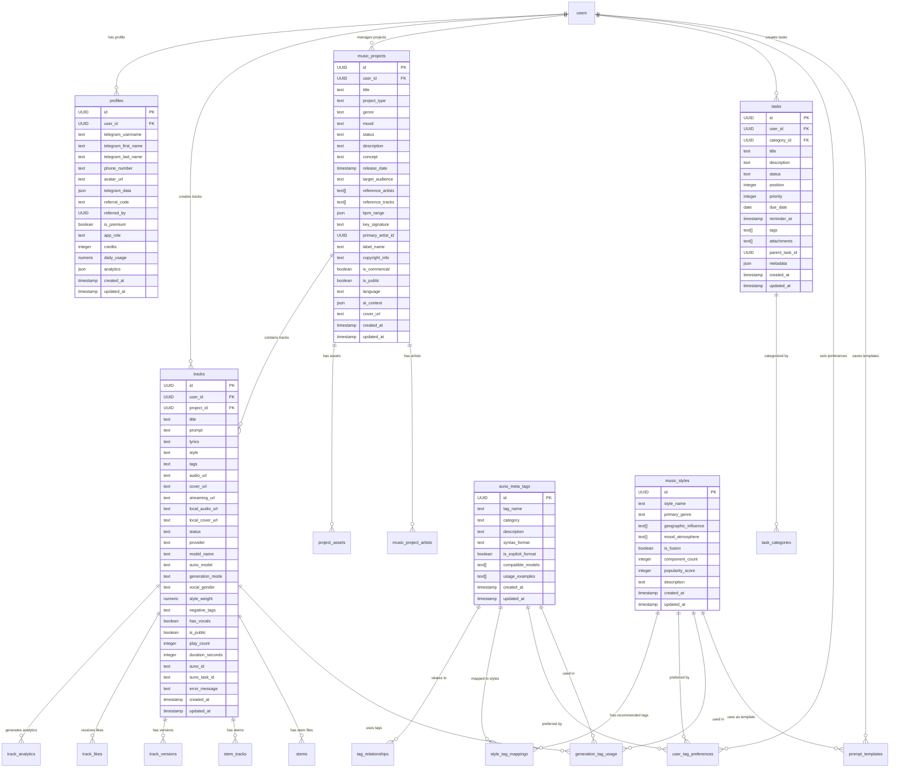
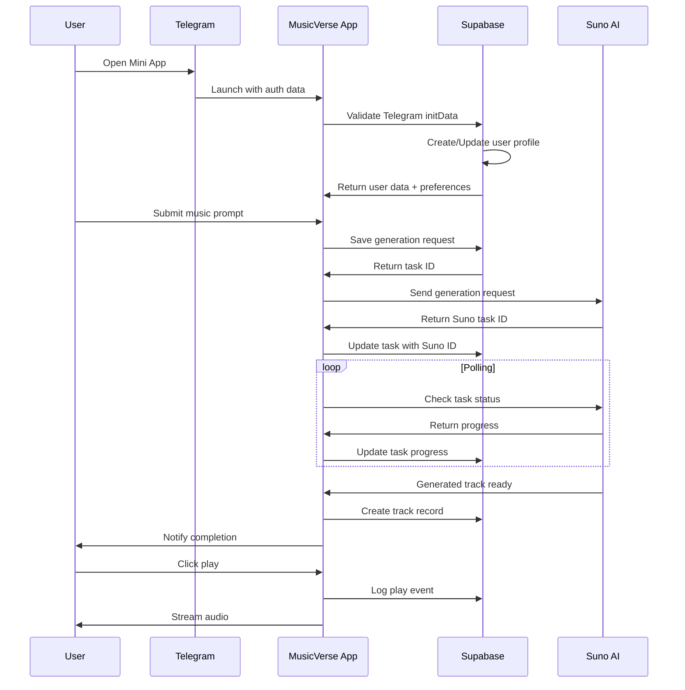

# 🎵 MusicVerse AI - Comprehensive Data Structure Diagram

## 📊 Overview

MusicVerse AI is a sophisticated music generation platform built with React, TypeScript, and PostgreSQL. The application integrates with Suno AI for music generation and Telegram Mini App for user interaction.

## 🏗️ Core Architecture

### Frontend Stack
- **Framework**: React 19 with TypeScript
- **State Management**: TanStack Query (React Query)
- **UI Components**: Radix UI + Tailwind CSS
- **Authentication**: Telegram Web App + Supabase Auth
- **Styling**: Tailwind CSS with shadcn/ui components

### Backend Stack
- **Database**: PostgreSQL with Supabase
- **Authentication**: Supabase Auth with Telegram integration
- **Storage**: Supabase Storage for audio files
- **Functions**: Edge functions for processing

## 📈 Database Schema & Entity Relationships



## 🔗 Key Relationships & Dependencies

### User Management
- **Telegram Integration**: Users authenticate via Telegram Web App
- **Profiles**: Each user has a profile with subscription status and credits
- **Role System**: Admin, Moderator, User roles with different permissions

### Music Generation Pipeline
1. **Input Processing**: User provides prompt + optional tags + style preferences
2. **Tag System**: 174+ meta-tags categorized into 10 categories
3. **Style System**: 277+ music styles with geographic/mood influences
4. **AI Integration**: Suno API v5 for music generation
5. **Track Management**: Generated tracks stored with analytics

### Project Organization
- **Music Projects**: Groups tracks into albums/EPs
- **Task Management**: Kanban-style task system for project management
- **Asset Management**: Cover art, stems, and project files

## 🎯 Core Data Models

### Track Model
```typescript
interface Track {
  id: string;
  user_id: string;
  project_id?: string;
  title?: string;
  prompt: string;
  lyrics?: string;
  style?: string;
  tags?: string;
  audio_url?: string;
  cover_url?: string;
  status: string; // 'generating' | 'completed' | 'failed'
  provider?: string; // 'suno'
  model_name?: string; // 'chirp-v4', 'chirp-crow', etc.
  duration_seconds?: number;
  suno_task_id?: string;
  is_public?: boolean;
  play_count?: number;
  created_at: string;
}
```

### Project Model
```typescript
interface Project {
  id: string;
  user_id: string;
  title: string;
  project_type: 'single' | 'ep' | 'album' | 'ost' | 'background_music' | 'jingle' | 'compilation' | 'mixtape';
  genre?: string;
  mood?: string;
  status?: string;
  description?: string;
  concept?: string;
  release_date?: string;
  reference_artists?: string[];
  reference_tracks?: string[];
  bpm_range?: any;
  key_signature?: string;
  cover_url?: string;
  is_public?: boolean;
  is_commercial?: boolean;
}
```

### User Preferences Model
```typescript
interface UserPreferences {
  tag_id: string;
  style_id?: string;
  usage_count: number;
  is_favorite: boolean;
  last_used_at?: string;
}
```

## 🔄 Data Flow Architecture



## 📊 Analytics & Insights

### Track Analytics
- Play counts, likes, and user engagement
- Tag usage patterns and preferences
- Generation success rates by model/style

### User Analytics
- Daily usage tracking
- Credit consumption patterns
- Feature adoption rates

### System Analytics
- API usage and response times
- Error rates and retry patterns
- Resource utilization

## 🔐 Security & Access Control

### Row Level Security (RLS)
- User data isolation
- Public vs private content management
- Admin role-based access

### Authentication
- Telegram Web App validation
- Session management
- Secure API access

## 🚀 Performance Optimizations

### Database Indexes
- User-specific queries
- Tag and style filtering
- Analytics aggregations

### Caching Strategy
- User preferences caching
- Public content caching
- API response caching

### Query Optimization
- TanStack Query stale time: 5 minutes
- Pagination for large datasets
- Selective revalidation

## 📁 File Structure Integration

### Key Directories
- `src/hooks/`: Data fetching and state management
- `src/services/`: External service integrations
- `src/components/`: Reusable UI components
- `src/pages/`: Main application pages
- `src/integrations/`: Third-party integrations
- `src/types/`: TypeScript type definitions

### Database Migrations
- `supabase/migrations/`: Schema evolution
- `supabase/functions/`: Edge functions
- `public/`: Static assets and images

This comprehensive data structure provides the foundation for MusicVerse AI's sophisticated music generation and management capabilities, supporting both individual user experiences and collaborative music creation workflows.
