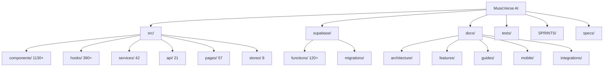
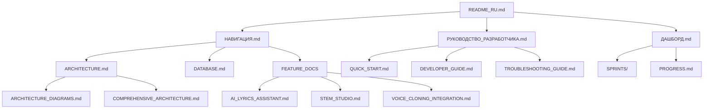

# 🗺️ Навигация по репозиторию MusicVerse AI

<div align="center">

**Полное руководство по структуре проекта и документации**

[Главный README](../README_RU.md) • [Руководство разработчика](РУКОВОДСТВО_РАЗРАБОТЧИКА.md) • [Дашборд](ДАШБОРД.md)

</div>

---

## 📋 Содержание

- [🏛️ Общая структура проекта](#общая-структура-проекта)
- [📁 Структура директорий](#структура-директорий)
- [📚 Карта документации](#карта-документации)
- [🗺️ Карта спринтов](#карта-спринтов)
- [🔗 Связи между документами](#связи-между-документами)
- [🎯 Быстрый доступ к ключевым разделам](#быстрый-доступ-к-ключевым-разделам)

---

## 🏛️ Общая структура проекта



### 📊 Статистика проекта

| Категория            | Количество | Статус     |
| -------------------- | ---------- | ---------- |
| **Компоненты React** | 1130+      | ✅ Активно |
| **Кастомные хуки**   | 390+       | ✅ Активно |
| **Сервисы**          | 42         | ✅ Активно |
| **API модули**       | 21         | ✅ Активно |
| **Страницы**         | 57         | ✅ Активно |
| **Zustand stores**   | 8          | ✅ Активно |
| **Edge Functions**   | 120+       | ✅ Активно |
| **Документы**        | 305+       | ✅ Активно |
| **Тесты**            | 62+        | ✅ Активно |

---

## 📁 Структура директорий

### 🎯 Корневая структура

```
MusicVerse AI/
├── 📄 README_RU.md                    # Главный README (русский)
├── 📄 README.md                       # Главный README (английский)
├── 📄 CLAUDE.md                       # Инструкции для Claude Code
├── 📄 CONTRIBUTING.md                 # Гайд по контрибьюции
├── 📄 package.json                    # Зависимости и скрипты
├── 📄 tsconfig.json                   # TypeScript конфигурация
├── 📄 vite.config.ts                  # Vite конфигурация
├── 📄 tailwind.config.js              # Tailwind CSS конфигурация
├── 📄 jest.config.cjs                 # Jest конфигурация
├── 📄 playwright.config.ts            # Playwright конфигурация
├── 📄 .env.example                    # Пример переменных окружения
├── 📁 src/                            # Исходный код
├── 📁 supabase/                       # Supabase функции и миграции
├── 📁 docs/                           # Документация
├── 📁 tests/                          # Тесты
├── 📁 SPRINTS/                        # Спринты и задачи
├── 📁 specs/                          # Технические спецификации
└── 📁 public/                         # Статические файлы
```

### 📁 Детальная структура `src/`

```
src/
├── 📁 api/                            # API клиенты и интеграции
│   ├── auth.api.ts                   # Аутентификация
│   ├── tracks.api.ts                 # Треки
│   ├── users.api.ts                  # Пользователи
│   ├── playlists.api.ts              # Плейлисты
│   ├── generations.api.ts            # Генерация музыки
│   ├── voices.api.ts                 # Voice cloning 🆕
│   └── ... (15 других API модулей)
│
├── 📁 components/                     # React компоненты (1130+)
│   ├── ui/                           # Базовые UI компоненты
│   │   ├── button.tsx
│   │   ├── dialog.tsx
│   │   ├── sheet.tsx
│   │   └── ... (50+ компонентов)
│   │
│   ├── player/                       # Аудиоплеер
│   │   ├── CompactPlayer.tsx
│   │   ├── ExpandedPlayer.tsx
│   │   ├── MobileFullscreenPlayer.tsx
│   │   └── PlayerControls.tsx
│   │
│   ├── studio/                       # Студия редактирования
│   │   ├── unified/                  # Unified Studio
│   │   │   ├── MobileUnifiedStudio.tsx
│   │   │   ├── UnifiedVersionSelector.tsx
│   │   │   └── UnifiedMixer.tsx
│   │   ├── stem-studio/              # Stem separation
│   │   ├── lyrics-studio/            # Lyrics editing
│   │   └── voice-cloning/            # Voice Cloning 🆕
│   │       ├── VoiceCloneWizard.tsx
│   │       ├── VoiceLibrary.tsx
│   │       └── VoiceHistory.tsx
│   │
│   ├── generate-form/                 # Форма генерации
│   │   ├── GenerateForm.tsx
│   │   ├── StyleSelector.tsx
│   │   └── LyricsInput.tsx
│   │
│   ├── library/                       # Библиотека треков
│   │   ├── TrackLibrary.tsx
│   │   ├── TrackCard.tsx
│   │   └── TrackFilters.tsx
│   │
│   ├── lyrics/                        # Lyrics компоненты
│   │   ├── LyricsEditor.tsx
│   │   ├── LyricsWizard.tsx
│   │   └── RhymeAnalyzer.tsx
│   │
│   ├── social/                        # Социальные функции
│   │   ├── UserProfile.tsx
│   │   ├── Comments.tsx
│   │   ├── LikeButton.tsx
│   │   └── Leaderboard.tsx
│   │
│   └── mobile/                        # Мобильные компоненты
│       ├── MobileHeaderBar.tsx
│       ├── MobileBottomSheet.tsx
│       └── MobileNavigation.tsx
│
├── 📁 services/                        # Бизнес-логика (42 файла)
│   ├── voice/                        # Voice Cloning сервис 🆕
│   │   ├── VoiceCloneService.ts
│   │   ├── voice-types.ts
│   │   └── index.ts
│   ├── lyrics/                       # Lyrics сервисы
│   │   ├── LyricsService.ts
│   │   └── RhymeService.ts
│   ├── tracks/                       # Track сервисы
│   │   ├── TrackService.ts
│   │   └── VersionService.ts
│   ├── generation/                    # Генерация
│   │   ├── GenerationService.ts
│   │   └── SunoService.ts
│   └── ... (35 других сервисов)
│
├── 📁 hooks/                          # Кастомные хуки (390+)
│   ├── useVoiceCloning.ts            # Voice cloning 🆕
│   ├── usePlayerState.ts             # Аудиоплеер
│   ├── useTrackVersions.ts           # Версии треков
│   ├── useGeneration.ts              # Генерация
│   ├── useLyrics.ts                  # Lyrics
│   ├── useAuth.ts                    # Аутентификация
│   └── ... (384 других хука)
│
├── 📁 stores/                         # Zustand stores (8)
│   ├── playerStore.ts                # Аудиоплеер
│   ├── unifiedStudioStore.ts         # Unified Studio
│   ├── lyricsHistoryStore.ts         # Lyrics история
│   ├── mixerHistoryStore.ts          # Микшер история
│   └── ... (4 других store)
│
├── 📁 pages/                          # Страницы (57)
│   ├── Studio.tsx                    # Главная студия
│   ├── StemStudio.tsx                # Stem студия
│   ├── LyricsStudio.tsx              # Lyrics студия
│   ├── Projects.tsx                  # Проекты
│   ├── Library.tsx                   # Библиотека
│   ├── Analytics.tsx                 # Аналитика
│   ├── VoiceCloningPage.tsx         # Voice cloning 🆕
│   └── ... (50 других страниц)
│
├── 📁 lib/                            # Утилиты (60+ файлов)
│   ├── motion.ts                     # Framer Motion оптимизации
│   ├── icons.ts                      # Иконки
│   ├── logger.ts                     # Логирование
│   ├── audioContextManager.ts        # Audio Context
│   ├── audioElementPool.ts           # Audio element pool
│   ├── audioCache.ts                 # Audio cache
│   ├── performance.ts                # Performance утилиты
│   ├── errors/                       # Error handling
│   └── ... (53 других файла)
│
├── 📁 types/                          # TypeScript типы
│   ├── branded.ts                    # Branded types
│   ├── audio.ts                      # Audio типы
│   ├── tracks.ts                     # Track типы
│   └── ... (10 других файлов)
│
├── 📁 contexts/                       # React Context (10)
│   ├── GlobalAudioContext.tsx       # Global audio
│   ├── AuthContext.tsx              # Аутентификация
│   ├── ThemeContext.tsx             # Тема
│   ├── TelegramContext.tsx          # Telegram
│   └── ... (6 других контекстов)
│
├── 📁 workers/                        # Web Workers
│   └── audio-processor.worker.ts    # Audio processing
│
├── App.tsx                           # Root компонент
└── main.tsx                          # Entry point
```

### 📁 Структура `supabase/`

```
supabase/
├── 📁 functions/                      # Edge Functions (120+)
│   ├── suno-music-generate/          # Генерация музыки
│   ├── suno-callbacks/               # Callback обработка
│   ├── klangio-midi-transcription/   # MIDI транскрипция
│   ├── klangio-stem-separation/      # Stem separation
│   ├── klangio-chord-detection/      # Chord detection
│   ├── tinkoff-payment/              # Платежи
│   ├── tinkoff-webhook/              # Payment webhooks
│   ├── telegram-bot/                 # Telegram bot
│   ├── send-telegram-notification/   # Уведомления
│   ├── suno-send-audio/             # Отправка аудио
│   └── ... (110 других функций)
│
└── 📁 migrations/                     # Database migrations
    ├── 20240101_initial_schema.sql
    ├── 20240601_voice_cloning.sql    # Voice cloning 🆕
    └── ... (30+ миграций)
```

### 📁 Структура `docs/`

```
docs/
├── 📁 architecture/                   # Архитектурные документы
│   ├── ARCHITECTURE.md
│   ├── ARCHITECTURE_DIAGRAMS.md
│   └── COMPREHENSIVE_ARCHITECTURE.md
│
├── 📁 features/                       # Feature документация
│   ├── AI_LYRICS_ASSISTANT.md
│   ├── STEM_STUDIO.md
│   ├── VOICE_CLONING_INTEGRATION.md
│   └── ...
│
├── 📁 guides/                         # Руководства
│   ├── QUICK_START.md
│   ├── DEVELOPER_GUIDE.md
│   ├── TROUBLESHOOTING_GUIDE.md
│   └── ...
│
├── 📁 mobile/                         # Мобильная документация
│   ├── MOBILE_COMPONENTS.md
│   ├── SAFE_AREA_GUIDELINES.md
│   └── ...
│
├── 📁 integrations/                   # Интеграции
│   ├── TELEGRAM_BOT_ARCHITECTURE.md
│   ├── TELEGRAM_PAYMENTS.md
│   ├── SUNO_API.md
│   └── ...
│
├── 📁 ru/                             # Русская документация
│   └── ...
│
├── НАВИГАЦИЯ.md                       # 🆕 Этот документ
├── РУКОВОДСТВО_РАЗРАБОТЧИКА.md        # 🆕 Руководство разработчика
├── ДАШБОРД.md                         # 🆕 Дашборд проекта
└── ... (280+ других документов)
```

### 📁 Структура `SPRINTS/`

```
SPRINTS/
├── 📁 completed/                      # Завершённые спринты
│   ├── sprint-001-to-020/
│   ├── sprint-021-to-030/
│   └── sprint-031-to-032/
│
├── 📁 active/                         # Активные спринты
│   └── voice-cloning/
│
└── 📁 planned/                        # Запланированные спринты
    ├── sprint-b-performance/
    └── sprint-c-integrations/
```

---

## 📚 Карта документации

### 🗂️ Категории документации

<details>
<summary><b>📖 Основная документация</b></summary>

| Документ                                                   | Описание                             | Статус      |
| ---------------------------------------------------------- | ------------------------------------ | ----------- |
| [НАВИГАЦИЯ.md](НАВИГАЦИЯ.md)                               | Этот документ                        | ✅ Актуален |
| [РУКОВОДСТВО_РАЗРАБОТЧИКА.md](РУКОВОДСТВО_РАЗРАБОТЧИКА.md) | Полное руководство для разработчиков | ✅ Актуален |
| [ДАШБОРД.md](ДАШБОРД.md)                                   | Текущее состояние проекта и метрики  | ✅ Актуален |
| [ARCHITECTURE.md](ARCHITECTURE.md)                         | Системная архитектура                | ✅ Актуален |
| [ARCHITECTURE_DIAGRAMS.md](ARCHITECTURE_DIAGRAMS.md)       | Визуальные диаграммы                 | ✅ Актуален |
| [DATABASE.md](DATABASE.md)                                 | Схема базы данных                    | ✅ Актуален |

</details>

<details>
<summary><b>🎨 Feature-документация</b></summary>

| Документ                                                     | Описание                    | Статус      |
| ------------------------------------------------------------ | --------------------------- | ----------- |
| [AI_LYRICS_ASSISTANT.md](AI_LYRICS_ASSISTANT.md)             | AI ассистент для текстов    | ✅ Актуален |
| [STEM_STUDIO.md](STEM_STUDIO.md)                             | Stem separation студия      | ✅ Актуален |
| [VOICE_CLONING_INTEGRATION.md](VOICE_CLONING_INTEGRATION.md) | Voice Cloning интеграция 🆕 | ✅ Актуален |
| [GENERATION_SYSTEM.md](GENERATION_SYSTEM.md)                 | Система генерации           | ✅ Актуален |
| [CREATIVE_TOOLS.md](CREATIVE_TOOLS.md)                       | Креативные инструменты      | ✅ Актуален |

</details>

<details>
<summary><b>🛠️ Руководства и гайды</b></summary>

| Документ                                             | Описание                        | Статус      |
| ---------------------------------------------------- | ------------------------------- | ----------- |
| [QUICK_START.md](QUICK_START.md)                     | Быстрый старт для разработчиков | ✅ Актуален |
| [DEVELOPER_GUIDE.md](DEVELOPER_GUIDE.md)             | Гайд для разработчиков          | ✅ Актуален |
| [TROUBLESHOOTING_GUIDE.md](TROUBLESHOOTING_GUIDE.md) | Решение проблем                 | ✅ Актуален |
| [ERROR_CODES.md](ERROR_CODES.md)                     | Коды ошибок                     | ✅ Актуален |
| [FORMATTING_GUIDE.md](FORMATTING_GUIDE.md)           | Гайд по форматированию          | ✅ Актуален |

</details>

<details>
<summary><b>⚡ Performance и оптимизация</b></summary>

| Документ                                                           | Описание                       | Статус      |
| ------------------------------------------------------------------ | ------------------------------ | ----------- |
| [PERFORMANCE_OPTIMIZATION.md](PERFORMANCE_OPTIMIZATION.md)         | Оптимизации производительности | ✅ Актуален |
| [BUNDLE_OPTIMIZATION.md](BUNDLE_OPTIMIZATION.md)                   | Оптимизация бандла             | ✅ Актуален |
| [BUNDLE_ANALYSIS.md](BUNDLE_ANALYSIS.md)                           | Анализ бандла                  | ✅ Актуален |
| [PERFORMANCE_MONITORING_SETUP.md](PERFORMANCE_MONITORING_SETUP.md) | Настройка мониторинга          | ✅ Актуален |

</details>

<details>
<summary><b>🔒 Безопасность и тестирование</b></summary>

| Документ                                               | Описание                    | Статус      |
| ------------------------------------------------------ | --------------------------- | ----------- |
| [SECURITY_OPERATIONS.md](SECURITY_OPERATIONS.md)       | Операции безопасности       | ✅ Актуален |
| [SECURITY_CHECKLIST.md](SECURITY_CHECKLIST.md)         | Чеклист безопасности        | ✅ Актуален |
| [TESTING_INFRASTRUCTURE.md](TESTING_INFRASTRUCTURE.md) | Инфраструктура тестирования | ✅ Актуален |
| [QUALITY_GATES.md](QUALITY_GATES.md)                   | Quality gates               | ✅ Актуален |

</details>

<details>
<summary><b>📱 Мобильная разработка</b></summary>

| Документ                                                                         | Описание                  | Статус      |
| -------------------------------------------------------------------------------- | ------------------------- | ----------- |
| [MOBILE_COMPONENTS.md](MOBILE_COMPONENTS.md)                                     | Мобильные компоненты      | ✅ Актуален |
| [SAFE_AREA_GUIDELINES.md](SAFE_AREA_GUIDELINES.md)                               | Safe areas гайдлайны      | ✅ Актуален |
| [TELEGRAM_MINI_APP_FEATURES.md](TELEGRAM_MINI_APP_FEATURES.md)                   | Telegram Mini App функции | ✅ Актуален |
| [TELEGRAM_MINI_APP_ADVANCED_FEATURES.md](TELEGRAM_MINI_APP_ADVANCED_FEATURES.md) | Продвинутые функции       | ✅ Актуален |

</details>

<details>
<summary><b>🔌 Интеграции</b></summary>

| Документ                                                     | Описание                  | Статус      |
| ------------------------------------------------------------ | ------------------------- | ----------- |
| [TELEGRAM_BOT_ARCHITECTURE.md](TELEGRAM_BOT_ARCHITECTURE.md) | Архитектура Telegram бота | ✅ Актуален |
| [TELEGRAM_PAYMENTS.md](TELEGRAM_PAYMENTS.md)                 | Интеграция платежей       | ✅ Актуален |
| [SUNO_API.md](SUNO_API.md)                                   | Suno API интеграция       | ✅ Актуален |
| [KLANG_IO.md](KLANG_IO.md)                                   | Klang.io интеграция       | ✅ Актуален |

</details>

---

## 🗺️ Карта спринтов

### 📊 Обзор спринтов

<details>
<summary><b>✅ Завершённые спринты (Sprints 001-032)</b></summary>

| Sprint  | Период     | Фокус               | Статус      | Результат              |
| ------- | ---------- | ------------------- | ----------- | ---------------------- |
| 001-010 | Q1 2026    | Foundation          | ✅ Complete | Базовая инфраструктура |
| 011-020 | Q1-Q2 2026 | Core Features       | ✅ Complete | Основные функции       |
| 021-030 | Q2 2026    | Advanced Features   | ✅ Complete | Продвинутые функции    |
| 031-032 | Q2 2026    | Mobile Optimization | ✅ Complete | Мобильная оптимизация  |

**Итоги завершённых спринтов:**

- ✅ 1130+ компонентов создано
- ✅ 390+ хуков реализовано
- ✅ 120+ Edge Functions развёрнуто
- ✅ 62+ E2E тестов написано
- ✅ 95% прогресс проекта

</details>

<details>
<summary><b>🔄 Активные спринты</b></summary>

| Sprint            | Период  | Фокус                     | Прогресс | Статус         |
| ----------------- | ------- | ------------------------- | -------- | -------------- |
| **Voice Cloning** | Q2 2026 | Voice Cloning Integration | 100%     | ✅ Complete    |
| **Spec 001: UI**  | Q2 2026 | UI Improvements           | 60%      | 🔄 In Progress |

**Voice Cloning Sprint (Завершён):**

- ✅ Voice Cloning Studio (6-шаговый процесс)
- ✅ Suno Voice API интеграция
- ✅ Voice Library + Voice History
- ✅ Database migrations

**Spec 001: UI Improvements (В процессе):**

- ✅ Спецификация и план
- ✅ Задачи и контракты
- 🔄 Реализация компонентов
- ⏳ Bundle оптимизация

</details>

<details>
<summary><b>⏳ Запланированные спринты</b></summary>

| Sprint       | Период  | Фокус                 | Приоритет | Статус     |
| ------------ | ------- | --------------------- | --------- | ---------- |
| **Sprint B** | Q3 2026 | Performance Scaling   | High      | 📋 Planned |
| **Sprint C** | Q3 2026 | Platform Integrations | Medium    | 📋 Planned |
| **Sprint D** | Q4 2026 | Advanced AI Features  | Medium    | 📋 Planned |

**Sprint B - Performance Scaling:**

- 📋 Оптимизация компонентов
- 📋 Database query оптимизация
- 📋 Advanced caching (Service Worker)
- 📋 Bundle size reduction

**Sprint C - Platform Integrations:**

- 📋 Spotify / Apple Music / YouTube export
- 📋 OAuth 2.0 flows
- 📋 Public API development
- 📋 Webhook integrations

</details>

---

## 🔗 Связи между документами

### 📊 Граф зависимостей документации



### 🔗 Кросс-ссылки

#### От главного README:

1. **Для начинающих** → [QUICK_START.md](QUICK_START.md)
2. **Для разработчиков** → [РУКОВОДСТВО_РАЗРАБОТЧИКА.md](РУКОВОДСТВО_РАЗРАБОТЧИКА.md)
3. **Для архитектуры** → [ARCHITECTURE.md](ARCHITECTURE.md)
4. **Для текущего статуса** → [ДАШБОРД.md](ДАШБОРД.md)

#### От РУКОВОДСТВО_РАЗРАБОТЧИКА:

1. **Установка** → [QUICK_START.md](QUICK_START.md)
2. **Архитектура** → [ARCHITECTURE.md](ARCHITECTURE.md)
3. **Тестирование** → [TESTING_INFRASTRUCTURE.md](TESTING_INFRASTRUCTURE.md)
4. **Решение проблем** → [TROUBLESHOOTING_GUIDE.md](TROUBLESHOOTING_GUIDE.md)

#### От ДАШБОРД:

1. **Спринты** → [SPRINTS/](../SPRINTS/)
2. **Прогресс** → [PROGRESS.md](PROGRESS.md)
3. **Аудит** → [REPOSITORY_AUDIT_REPORT_2026-06-25.md](REPOSITORY_AUDIT_REPORT_2026-06-25.md)

---

## 🎯 Быстрый доступ к ключевым разделам

### 🚀 Для новых разработчиков

<details>
<summary><b>1. Начало работы</b></summary>

**Читать в порядке:**

1. [README_RU.md](../README_RU.md) - Обзор проекта
2. [QUICK_START.md](QUICK_START.md) - Быстрый старт
3. [ARCHITECTURE.md](ARCHITECTURE.md) - Архитектура
4. [ДЕVELOPER_GUIDE.md](DEVELOPER_GUIDE.md) - Гайд разработчика

</details>

<details>
<summary><b>2. Понимание кодовой базы</b></summary>

**Читать в порядке:**

1. [НАВИГАЦИЯ.md](НАВИГАЦИЯ.md) - Этот документ
2. [ARCHITECTURE_DIAGRAMS.md](ARCHITECTURE_DIAGRAMS.md) - Диаграммы
3. [COMPREHENSIVE_ARCHITECTURE.md](COMPREHENSIVE_ARCHITECTURE.md) - Детальная архитектура
4. [DATABASE.md](DATABASE.md) - База данных

</details>

### 🎨 Для Feature разработки

<details>
<summary><b>3. Разработка features</b></summary>

**Читать в порядке:**

1. [GENERATION_SYSTEM.md](GENERATION_SYSTEM.md) - Система генерации
2. [AI_LYRICS_ASSISTANT.md](AI_LYRICS_ASSISTANT.md) - AI ассистент
3. [STEM_STUDIO.md](STEM_STUDIO.md) - Stem студия
4. [VOICE_CLONING_INTEGRATION.md](VOICE_CLONING_INTEGRATION.md) - Voice cloning

</details>

### 🛠️ Для оптимизации и отладки

<details>
<summary><b>4. Оптимизация и отладка</b></summary>

**Читать в порядке:**

1. [PERFORMANCE_OPTIMIZATION.md](PERFORMANCE_OPTIMIZATION.md) - Оптимизация
2. [BUNDLE_OPTIMIZATION.md](BUNDLE_OPTIMIZATION.md) - Оптимизация бандла
3. [ERROR_HANDLING_INFRASTRUCTURE.md](ERROR_HANDLING_INFRASTRUCTURE.md) - Обработка ошибок
4. [ERROR_CODES.md](ERROR_CODES.md) - Коды ошибок
5. [TROUBLESHOOTING_GUIDE.md](TROUBLESHOOTING_GUIDE.md) - Решение проблем

</details>

### 📱 Для мобильной разработки

<details>
<summary><b>5. Мобильная разработка</b></summary>

**Читать в порядке:**

1. [MOBILE_COMPONENTS.md](MOBILE_COMPONENTS.md) - Мобильные компоненты
2. [SAFE_AREA_GUIDELINES.md](SAFE_AREA_GUIDELINES.md) - Safe areas
3. [TELEGRAM_MINI_APP_FEATURES.md](TELEGRAM_MINI_APP_FEATURES.md) - Mini App функции
4. [TELEGRAM_MINI_APP_ADVANCED_FEATURES.md](TELEGRAM_MINI_APP_ADVANCED_FEATURES.md) - Продвинутые функции

</details>

### 🔌 Для интеграций

<details>
<summary><b>6. Внешние интеграции</b></summary>

**Читать в порядке:**

1. [TELEGRAM_BOT_ARCHITECTURE.md](TELEGRAM_BOT_ARCHITECTURE.md) - Telegram бот
2. [TELEGRAM_PAYMENTS.md](TELEGRAM_PAYMENTS.md) - Платежи
3. [SUNO_API.md](SUNO_API.md) - Suno API
4. [KLANG_IO.md](KLANG_IO.md) - Klang.io

</details>

---

## 📊 Индексы и карты

### 🗂️ Алфавитный индекс документов

<details>
<summary><b>А-Г</b></summary>

- [AI_LYRICS_ASSISTANT.md](AI_LYRICS_ASSISTANT.md) - AI ассистент для текстов
- [ARCHITECTURE.md](ARCHITECTURE.md) - Системная архитектура
- [ARCHITECTURE_DIAGRAMS.md](ARCHITECTURE_DIAGRAMS.md) - Диаграммы архитектуры
- [ARCHIVE.md](ARCHIVE.md) - Архивная документация
- [AUDIO_ARCHITECTURE_DIAGRAM.md](AUDIO_ARCHITECTURE_DIAGRAM.md) - Диаграмма аудио архитектуры
- [AUDIO_UPLOAD_FLOW.md](AUDIO_UPLOAD_FLOW.md) - Flow загрузки аудио
- [AUDIT_SYSTEM.md](AUDIT_SYSTEM.md) - Система аудита
- [BUNDLE_ANALYSIS.md](BUNDLE_ANALYSIS.md) - Анализ бандла
- [BUNDLE_OPTIMIZATION.md](BUNDLE_OPTIMIZATION.md) - Оптимизация бандла

</details>

<details>
<summary><b>Д-Л</b></summary>

- [DATABASE.md](DATABASE.md) - База данных
- [DESIGN_SYSTEM_COMPREHENSIVE.md](DESIGN_SYSTEM_COMPREHENSIVE.md) - Design система
- [DESIGN_TOKENS.md](DESIGN_TOKENS.md) - Design токены
- [DEVELOPER_GUIDE.md](DEVELOPER_GUIDE.md) - Гайд разработчика
- [DEPLOYMENT_CHECKLIST.md](DEPLOYMENT_CHECKLIST.md) - Чеклист деплоя
- [DEPLOYMENT_GUIDE.md](DEPLOYMENT_GUIDE.md) - Гайд деплоя
- [ERROR_CODES.md](ERROR_CODES.md) - Коды ошибок
- [ERROR_HANDLING_INFRASTRUCTURE.md](ERROR_HANDLING_INFRASTRUCTURE.md) - Инфраструктура ошибок
- [FORMATTING_GUIDE.md](FORMATTING_GUIDE.md) - Гайд форматирования

</details>

<details>
<summary><b>М-П</b></summary>

- [META_TAGS.md](META_TAGS.md) - Meta теги
- [MOBILE_COMPONENTS.md](MOBILE_COMPONENTS.md) - Мобильные компоненты
- [NAVIGATION.md](NAVIGATION.md) - Навигация
- [NAVIGATION_GUIDE.md](NAVIGATION_GUIDE.md) - Гайд навигации
- [NAVIGATION_INDEX.md](NAVIGATION_INDEX.md) - Индекс навигации
- [NAVIGATION_SYSTEM.md](NAVIGATION_SYSTEM.md) - Система навигации
- [ONBOARDING.md](ONBOARDING.md) - Онбординг
- [OPTIMIZATION_PLAN.md](OPTIMIZATION_PLAN.md) - План оптимизации
- [PERFORMANCE_MONITORING_SETUP.md](PERFORMANCE_MONITORING_SETUP.md) - Настройка мониторинга
- [PERFORMANCE_OPTIMIZATION.md](PERFORMANCE_OPTIMIZATION.md) - Оптимизация производительности
- [PLAYER_ARCHITECTURE.md](PLAYER_ARCHITECTURE.md) - Архитектура плеера
- [PLAYER_README.md](PLAYER_README.md) - README плеера
- [PLAYER_TROUBLESHOOTING.md](PLAYER_TROUBLESHOOTING.md) - Решение проблем плеера
- [PROGRESS.md](PROGRESS.md) - Прогресс проекта
- [PROJECT_SPECIFICATION.md](PROJECT_SPECIFICATION.md) - Спецификация проекта
- [PROJECT_MANAGEMENT.md](PROJECT_MANAGEMENT.md) - Управление проектом

</details>

<details>
<summary><b>Q-Я</b></summary>

- [QUALITY_GATES.md](QUALITY_GATES.md) - Quality gates
- [QUICK_REFERENCE.md](QUICK_REFERENCE.md) - Быстрая справка
- [QUICK_START.md](QUICK_START.md) - Быстрый старт
- [README.md](README.md) - Главный README
- [SAFE_AREA_GUIDELINES.md](SAFE_AREA_GUIDELINES.md) - Safe areas гайдлайны
- [SECURITY_CHECKLIST.md](SECURITY_CHECKLIST.md) - Чеклист безопасности
- [SECURITY_OPERATIONS.md](SECURITY_OPERATIONS.md) - Операции безопасности
- [SECURITY_SUMMARY.md](SECURITY_SUMMARY.md) - Резюме безопасности
- [SPRINT_A_PROGRESS.md](SPRINT_A_PROGRESS.md) - Прогресс спринта A
- [STEM_STUDIO.md](STEM_STUDIO.md) - Stem студия
- [STYLES.md](STYLES.md) - Стили
- [SUNO_API.md](SUNO_API.md) - Suno API
- [TELEGRAM_BOT_ARCHITECTURE.md](TELEGRAM_BOT_ARCHITECTURE.md) - Архитектура Telegram бота
- [TELEGRAM_BOT_COMMANDS_REFERENCE.md](TELEGRAM_BOT_COMMANDS_REFERENCE.md) - Справочник команд
- [TELEGRAM_BOT_DEVELOPER_GUIDE.md](TELEGRAM_BOT_DEVELOPER_GUIDE.md) - Гайд разработчика бота
- [TELEGRAM_BOT_MONITORING.md](TELEGRAM_BOT_MONITORING.md) - Мониторинг бота
- [TELEGRAM_PAYMENTS.md](TELEGRAM_PAYMENTS.md) - Telegram платежи
- [TESTING_INFRASTRUCTURE.md](TESTING_INFRASTRUCTURE.md) - Инфраструктура тестирования
- [TROUBLESHOOTING_GUIDE.md](TROUBLESHOOTING_GUIDE.md) - Гайд решения проблем
- [UI_AUDIT.md](UI_AUDIT.md) - UI аудит
- [VOICE_CLONING_INTEGRATION.md](VOICE_CLONING_INTEGRATION.md) - Voice Cloning интеграция
- [Z_INDEX_HIERARCHY.md](Z_INDEX_HIERARCHY.md) - Z-index иерархия

</details>

### 📊 Статистика документации

| Категория       | Количество          | Актуальность |
| --------------- | ------------------- | ------------ |
| **Архитектура** | 8 документов        | ✅ 100%      |
| **Features**    | 12 документов       | ✅ 100%      |
| **Guides**      | 15 документов       | ✅ 100%      |
| **Интеграции**  | 10 документов       | ✅ 100%      |
| **Мобильные**   | 8 документов        | ✅ 100%      |
| **Performance** | 6 документов        | ✅ 100%      |
| **Security**    | 5 документов        | ✅ 100%      |
| **Testing**     | 7 документов        | ✅ 100%      |
| **Русские**     | 3 документа         | ✅ 100%      |
| **Всего**       | **305+ документов** | **✅ 100%**  |

---

## 🎯 Заключение

Эта навигация предоставляет полную карту проекта MusicVerse AI. Для конкретных задач рекомендуется использовать следующие пути:

### 🚀 Быстрый старт

**Новый разработчик**: README_RU.md → QUICK_START.md → DEVELOPER_GUIDE.md

**Feature разработка**: НАВИГАЦИЯ.md → FEATURE_DOCS → ARCHITECTURE.md

**Bug fixing**: НАВИГАЦИЯ.md → ERROR_CODES.md → TROUBLESHOOTING_GUIDE.md

**Мобильная разработка**: НАВИГАЦИЯ.md → MOBILE_COMPONENTS.md → SAFE_AREA_GUIDELINES.md

### 📞 Получение помощи

Если вы не можете найти нужную информацию:

1. Проверьте [ИНДЕКС](#алфавитный-индекс-документов)
2. Посмотрите [ДАШБОРД.md](ДАШБОРД.md) для текущего статуса
3. Обратитесь к [РУКОВОДСТВО_РАЗРАБОТЧИКА.md](РУКОВОДСТВО_РАЗРАБОТЧИКА.md)
4. Проверьте [SPRINTS/](../SPRINTS/) для активных задач

---

<div align="center">

**📅 Последнее обновление**: 2026-06-26  
**📊 Версия**: 1.0.0  
**🎯 Статус**: Production Ready

[Вернуться к началу](#-навигация-по-репозиторию-musicverse-ai)

</div>
