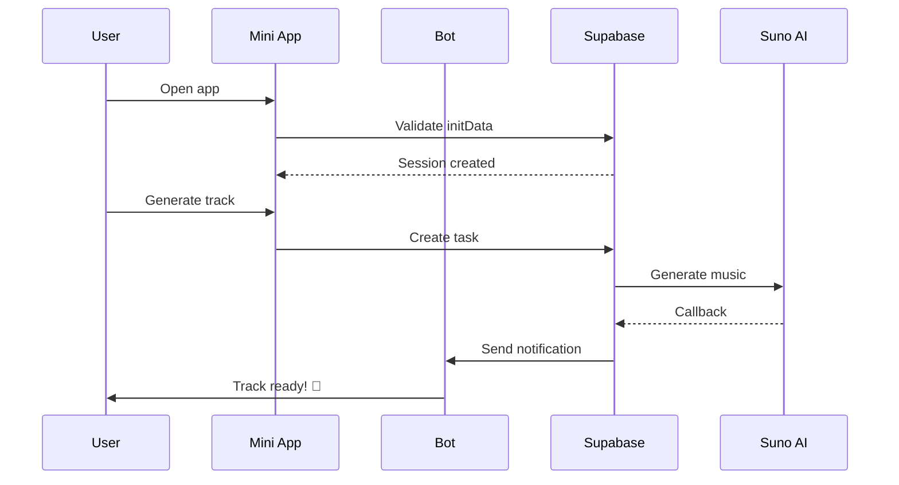

# 🚀 План Улучшения Интеграции Telegram - MusicVerse AI
**Дата создания:** 2 декабря 2025  
**Статус:** Утверждён к реализации  
**Связанный документ:** [TELEGRAM_INTEGRATION_AUDIT_2025-12-02.md](./TELEGRAM_INTEGRATION_AUDIT_2025-12-02.md)

---

## 📋 Оглавление
1. [Обзор плана](#обзор-плана)
2. [Sprint 9: Telegram Integration Enhancement](#sprint-9-telegram-integration-enhancement)
3. [Sprint 10: Performance & Documentation](#sprint-10-performance--documentation)
4. [Технические спецификации](#технические-спецификации)
5. [Implementation Guide](#implementation-guide)
6. [Testing Strategy](#testing-strategy)

---

## 🎯 Обзор плана

### Цели
1. **Повысить качество кода** до production standards (0 lint errors)
2. **Углубить интеграцию** между Bot и Mini App
3. **Расширить функционал** уведомлений и voice integration
4. **Оптимизировать производительность** (bundle size <800 KB)
5. **Улучшить документацию** до единого source of truth

### Timeline
```
Sprint 9: Dec 15 - Dec 29 (2 weeks) → 21 SP
Sprint 10: Dec 29 - Jan 05 (1 week) → 13 SP
Total: 3 weeks, 34 Story Points
```

### Success Metrics
| Метрика | Текущее | Цель | Приоритет |
|---------|---------|------|-----------|
| Lint Errors | 146 | 0 | P0 |
| Test Coverage | 60% | 80% | P1 |
| Bundle Size | 1.01 MB | <800 KB | P1 |
| Notification Types | 2 | 10+ | P1 |
| Initial Load Time | ~3.5s | <2.5s | P2 |

---

## 📅 Sprint 9: Telegram Integration Enhancement

### Период: 15-29 декабря 2025 (2 недели)
### Story Points: 21 SP

---

### 📦 Epic 1: Code Quality & Type Safety (5 SP)

#### Task T009-001: Fix All Lint Errors
**Priority:** P0 - Критический  
**Story Points:** 3 SP  
**Assignee:** TBD  
**Status:** 🔄 In Progress (13/146 fixed)

**Description:**
Систематическое исправление всех 146 оставшихся lint ошибок в кодовой базе.

**Breakdown:**
1. **Supabase Functions (130 errors)** - 2 SP
   - Create shared types file: `supabase/functions/_shared/telegram-types.ts`
   - Replace all `any` types with proper interfaces
   - Add JSDoc comments for complex functions
   
2. **Source Files (13 errors)** - 0.5 SP
   - Fix remaining hooks and pages
   - Update TypeScript configurations
   
3. **Verification** - 0.5 SP
   - Run full lint check
   - Fix any new issues
   - Update CI/CD to enforce

**Files to modify:**
```
supabase/functions/_shared/telegram-types.ts (new)
supabase/functions/suno-*/index.ts (25 files)
supabase/functions/telegram-bot/**/*.ts (10 files)
supabase/functions/sync-*/index.ts (3 files)
```

**Acceptance Criteria:**
- [ ] `npm run lint` returns 0 errors
- [ ] All `any` types replaced with proper types
- [ ] JSDoc comments added to public APIs
- [ ] CI/CD check passes

**Implementation Notes:**
```typescript
// supabase/functions/_shared/telegram-types.ts

/**
 * Telegram API Types
 */
export interface TelegramMessage {
  message_id: number;
  from?: TelegramUser;
  chat: TelegramChat;
  text?: string;
  // ... full interface
}

export interface TelegramUser {
  id: number;
  is_bot: boolean;
  first_name: string;
  last_name?: string;
  username?: string;
  language_code?: string;
}

/**
 * Suno API Types
 */
export interface SunoGenerationRequest {
  prompt: string;
  model?: string;
  make_instrumental?: boolean;
  custom_mode?: boolean;
  tags?: string;
  title?: string;
}

export interface SunoClip {
  id: string;
  title: string;
  audioUrl: string;
  imageUrl?: string;
  duration: number;
  tags?: string[];
  // ... full interface
}

/**
 * Internal Application Types
 */
export interface ErrorResponse {
  error: string;
  code?: string;
  details?: Record<string, unknown>;
}
```

---

#### Task T009-002: Add Unit Tests for Telegram Integration
**Priority:** P1  
**Story Points:** 2 SP  
**Assignee:** TBD  
**Status:** ⏳ Planned

**Description:**
Comprehensive unit testing для всех Telegram integration компонентов.

**Test Coverage Goals:**
- TelegramContext: 90%
- Bot handlers: 80%
- Auth flow: 100%
- Overall: 80%

**Test Files:**
```
src/contexts/TelegramContext.test.tsx (new)
src/services/telegram-auth.test.ts (new)
src/hooks/useTelegramStorage.test.tsx (new)
supabase/functions/telegram-bot/__tests__/ (new directory)
  ├── commands.test.ts
  ├── handlers.test.ts
  └── telegram-api.test.ts
```

**Example Test:**
```typescript
// src/contexts/TelegramContext.test.tsx
describe('TelegramContext', () => {
  it('should initialize with mock data in dev mode', () => {
    // Test mock initialization
  });
  
  it('should handle initData validation', async () => {
    // Test auth flow
  });
  
  it('should apply Telegram theme colors', () => {
    // Test theme application
  });
});
```

**Acceptance Criteria:**
- [ ] 80%+ test coverage achieved
- [ ] All critical paths tested
- [ ] Tests pass in CI/CD
- [ ] Mocks created for Telegram SDK

---

### 🌉 Epic 2: Bot ↔ Mini App Bridge (8 SP)

#### Task T009-003: Create TelegramBridge Service
**Priority:** P0 - Критический  
**Story Points:** 5 SP  
**Assignee:** TBD  
**Status:** ⏳ Planned

**Description:**
Создать унифицированный сервис для bidirectional коммуникации между Bot и Mini App.

**Architecture:**
```typescript
// src/services/telegram-bridge.ts

export class TelegramBridge {
  private eventQueue: EventQueue;
  private stateManager: StateManager;
  
  /**
   * Send event from Mini App to Bot
   */
  async sendToBot(event: BotEvent): Promise<void> {
    // Implementation
  }
  
  /**
   * Listen for commands from Bot
   */
  async *listenFromBot(): AsyncGenerator<AppCommand> {
    // Implementation
  }
  
  /**
   * Synchronize state between Bot and Mini App
   */
  async syncState(state: Partial<AppState>): Promise<void> {
    // Implementation using CloudStorage
  }
  
  /**
   * Request action execution in Mini App
   */
  async requestAction(action: AppAction): Promise<ActionResult> {
    // Implementation
  }
}

// Event Types
export type BotEvent = 
  | { type: 'track_played', trackId: string }
  | { type: 'project_created', projectId: string }
  | { type: 'generation_started', taskId: string };

export type AppCommand =
  | { type: 'open_track', trackId: string }
  | { type: 'start_generation', prompt: string }
  | { type: 'show_notification', message: string };

export interface AppState {
  currentTrack?: string;
  recentSearches: string[];
  preferences: UserPreferences;
  playbackState: PlaybackState;
}
```

**Communication Flow:**
```
Mini App Event                Bot Action
    ↓                            ↓
[User plays track]  →  Store in DB  →  [Bot sends "Now Playing" status]
                   ↓
              CloudStorage.set('lastPlayed', trackId)
                   ↓
              [Bot reads CloudStorage]
                   ↓
              [Bot updates inline message]
```

**Acceptance Criteria:**
- [ ] TelegramBridge class implemented
- [ ] 5+ event types supported
- [ ] State sync working via CloudStorage
- [ ] Integration tests passing
- [ ] Documentation complete

---

#### Task T009-004: Implement Deep Command Handling
**Priority:** P1  
**Story Points:** 3 SP  
**Assignee:** TBD  
**Status:** ⏳ Planned

**Description:**
Расширить систему deep commands для управления Mini App из Bot.

**New Deep Commands:**
```typescript
// Bot → Mini App commands

1. /open track_<id>           → Navigate to track detail
2. /play track_<id>           → Start playback immediately
3. /create project_<name>     → Create new project
4. /edit track_<id>           → Open in Studio
5. /share track_<id>          → Open share dialog
6. /search <query>            → Perform search in Mini App
7. /settings <section>        → Open specific settings page
```

**Implementation:**
```typescript
// supabase/functions/telegram-bot/commands/deep-action.ts

export async function handleDeepAction(
  chatId: number,
  userId: number,
  action: string,
  params: Record<string, string>
) {
  // Validate user
  const profile = await getProfile(userId);
  if (!profile) return;
  
  // Create deep link
  const deepLink = createMiniAppDeepLink(action, params);
  
  // Send inline keyboard with action button
  await sendMessage(chatId, {
    text: `Действие готово к выполнению в приложении`,
    reply_markup: {
      inline_keyboard: [[
        { 
          text: '🎵 Открыть в приложении',
          web_app: { url: deepLink }
        }
      ]]
    }
  });
  
  // Store pending action in CloudStorage
  await storeПендingAction(userId, action, params);
}
```

**Acceptance Criteria:**
- [ ] 7+ deep commands implemented
- [ ] Bot can trigger Mini App actions
- [ ] Pending actions stored and executed
- [ ] Error handling for invalid commands
- [ ] User feedback for each action

---

### 🔔 Epic 3: Enhanced Notification System (5 SP)

#### Task T009-005: Expand Notification Types
**Priority:** P1  
**Story Points:** 3 SP  
**Assignee:** TBD  
**Status:** ⏳ Planned

**Description:**
Расширить систему уведомлений с 2 до 10+ типов событий.

**New Notification Types:**
```typescript
enum NotificationType {
  // Generation
  TRACK_READY = 'track_ready',              // ✅ Exists
  TRACK_FAILED = 'track_failed',            // ✅ Exists
  GENERATION_QUEUED = 'generation_queued',  // 🆕 New
  
  // Collaboration
  COLLAB_INVITE = 'collab_invite',          // 🆕 New
  COLLAB_ACCEPTED = 'collab_accepted',      // 🆕 New
  PROJECT_SHARED = 'project_shared',        // 🆕 New
  
  // Social
  TRACK_LIKED = 'track_liked',              // 🆕 New
  TRACK_COMMENTED = 'comment_reply',        // 🆕 New
  FOLLOWER_NEW = 'follower_new',            // 🆕 New
  
  // System
  SYSTEM_UPDATE = 'system_update',          // 🆕 New
  MAINTENANCE = 'maintenance',              // 🆕 New
  CREDITS_LOW = 'credits_low',              // 🆕 New
  
  // Recommendations
  RECOMMENDATION = 'recommendation',         // 🆕 New
  TRENDING_TRACK = 'trending_track',        // 🆕 New
}
```

**Notification Templates:**
```typescript
// supabase/functions/send-telegram-notification/templates.ts

export const notificationTemplates: Record<NotificationType, NotificationTemplate> = {
  track_ready: {
    emoji: '✅',
    title: 'Трек готов!',
    body: (data) => `Ваш трек "${data.title}" готов к прослушиванию`,
    actions: [
      { text: '🎵 Слушать', callback_data: 'play_{trackId}' },
      { text: '📤 Поделиться', callback_data: 'share_{trackId}' }
    ]
  },
  
  collab_invite: {
    emoji: '🤝',
    title: 'Приглашение в проект',
    body: (data) => `${data.userName} пригласил вас в проект "${data.projectName}"`,
    actions: [
      { text: '✅ Принять', callback_data: 'accept_collab_{inviteId}' },
      { text: '❌ Отклонить', callback_data: 'reject_collab_{inviteId}' }
    ]
  },
  
  // ... other templates
};
```

**Database Changes:**
```sql
-- Migration: Add notification preferences table

CREATE TABLE user_notification_preferences (
  user_id UUID REFERENCES profiles(user_id) PRIMARY KEY,
  notification_type TEXT NOT NULL,
  enabled BOOLEAN DEFAULT true,
  quiet_hours_start TIME,
  quiet_hours_end TIME,
  delivery_method TEXT[] DEFAULT ARRAY['telegram'],
  created_at TIMESTAMPTZ DEFAULT NOW(),
  updated_at TIMESTAMPTZ DEFAULT NOW()
);

CREATE INDEX idx_notification_prefs_user 
ON user_notification_preferences(user_id);
```

**Acceptance Criteria:**
- [ ] 10+ notification types implemented
- [ ] Templates created for each type
- [ ] Database migration applied
- [ ] Preferences table created
- [ ] Rich notifications with actions

---

#### Task T009-006: Notification Preferences UI
**Priority:** P2  
**Story Points:** 2 SP  
**Assignee:** TBD  
**Status:** ⏳ Planned

**Description:**
UI для управления notification preferences в Settings page.

**UI Components:**
```typescript
// src/components/NotificationSettings.tsx

export function NotificationSettings() {
  return (
    <div className="space-y-4">
      <h2>Уведомления</h2>
      
      {/* Per-type toggles */}
      <div className="space-y-2">
        {notificationTypes.map(type => (
          <div key={type} className="flex items-center justify-between">
            <Label>{type.label}</Label>
            <Switch 
              checked={preferences[type.key]}
              onCheckedChange={v => updatePref(type.key, v)}
            />
          </div>
        ))}
      </div>
      
      {/* Quiet hours */}
      <div>
        <Label>Тихие часы</Label>
        <div className="flex gap-2">
          <TimePicker 
            value={quietHours.start}
            onChange={v => setQuietHours({...quietHours, start: v})}
          />
          <span>-</span>
          <TimePicker 
            value={quietHours.end}
            onChange={v => setQuietHours({...quietHours, end: v})}
          />
        </div>
      </div>
      
      {/* Delivery methods */}
      <div>
        <Label>Способы доставки</Label>
        <CheckboxGroup 
          options={['telegram', 'email', 'push']}
          value={deliveryMethods}
          onChange={setDeliveryMethods}
        />
      </div>
    </div>
  );
}
```

**Acceptance Criteria:**
- [ ] Settings UI implemented
- [ ] Per-type toggles working
- [ ] Quiet hours configuration
- [ ] Delivery methods selection
- [ ] Changes persist to database

---

### 🎤 Epic 4: Voice Message Integration (3 SP)

#### Task T009-007: Voice Message Handler
**Priority:** P1  
**Story Points:** 3 SP  
**Assignee:** TBD  
**Status:** ⏳ Planned

**Description:**
Реализовать end-to-end pipeline для создания музыки из голосовых сообщений.

**Architecture:**
```
User Voice Message
      ↓
Telegram Bot receives voice
      ↓
Download audio file
      ↓
Transcribe with Whisper API
      ↓
Enhance prompt with GPT-4
      ↓
Create generation task
      ↓
Generate music with Suno AI
      ↓
Notify user when ready
```

**Implementation:**
```typescript
// supabase/functions/telegram-bot/handlers/voice.ts

import { createClient as createOpenAIClient } from 'openai';

export async function handleVoiceMessage(
  message: TelegramMessage,
  userId: number
) {
  try {
    const voice = message.voice;
    if (!voice) return;
    
    // 1. Download voice file
    await sendMessage(message.chat.id, '🎤 Обрабатываю голосовое сообщение...');
    const audioBuffer = await downloadTelegramFile(voice.file_id);
    
    // 2. Transcribe with Whisper
    const openai = createOpenAIClient({
      apiKey: Deno.env.get('OPENAI_API_KEY')
    });
    
    const transcription = await openai.audio.transcriptions.create({
      file: new File([audioBuffer], 'voice.ogg', { type: 'audio/ogg' }),
      model: 'whisper-1',
      language: 'ru',
    });
    
    const text = transcription.text;
    
    // 3. Enhance prompt with GPT-4
    const enhancement = await openai.chat.completions.create({
      model: 'gpt-4',
      messages: [
        {
          role: 'system',
          content: 'Вы - эксперт по созданию музыкальных промптов. ' +
                   'Преобразуйте текст пользователя в детальный промпт для генерации музыки.'
        },
        {
          role: 'user',
          content: text
        }
      ]
    });
    
    const enhancedPrompt = enhancement.choices[0].message.content;
    
    // 4. Show preview and confirmation
    await sendMessage(message.chat.id, 
      `📝 Транскрипция:\n"${text}"\n\n` +
      `🎵 Музыкальный промпт:\n"${enhancedPrompt}"\n\n` +
      `Создать музыку?`,
      {
        inline_keyboard: [[
          { text: '✅ Да, создать', callback_data: `voice_gen_${message.message_id}` },
          { text: '✏️ Изменить промпт', callback_data: `voice_edit_${message.message_id}` },
          { text: '❌ Отмена', callback_data: 'cancel' }
        ]]
      }
    );
    
    // Store for later use
    await storeVoiceTranscription(userId, {
      messageId: message.message_id,
      originalText: text,
      enhancedPrompt,
      audioFileId: voice.file_id
    });
    
  } catch (error) {
    console.error('Voice message error:', error);
    await sendMessage(message.chat.id, 
      '❌ Не удалось обработать голосовое сообщение. Попробуйте ещё раз.'
    );
  }
}

// Handle confirmation callback
export async function handleVoiceGenerationConfirm(
  callbackQuery: CallbackQuery,
  userId: number
) {
  const messageId = extractMessageId(callbackQuery.data);
  const transcription = await getVoiceTranscription(userId, messageId);
  
  if (!transcription) {
    await answerCallbackQuery(callbackQuery.id, {
      text: 'Транскрипция не найдена',
      show_alert: true
    });
    return;
  }
  
  // Create generation task
  const task = await createGenerationTask({
    userId,
    prompt: transcription.enhancedPrompt,
    model: 'chirp-crow',
    metadata: {
      source: 'voice_message',
      originalText: transcription.originalText
    }
  });
  
  await editMessageText(
    callbackQuery.message!.chat.id,
    callbackQuery.message!.message_id,
    `✅ Генерация запущена!\n\n` +
    `ID задачи: ${task.id}\n` +
    `Вы получите уведомление, когда трек будет готов.`
  );
}
```

**Database Schema:**
```sql
-- Add voice_transcriptions table

CREATE TABLE voice_transcriptions (
  id UUID PRIMARY KEY DEFAULT gen_random_uuid(),
  user_id UUID REFERENCES profiles(user_id),
  telegram_message_id BIGINT NOT NULL,
  original_text TEXT NOT NULL,
  enhanced_prompt TEXT NOT NULL,
  audio_file_id TEXT NOT NULL,
  created_at TIMESTAMPTZ DEFAULT NOW(),
  used_at TIMESTAMPTZ
);

CREATE INDEX idx_voice_transcriptions_user 
ON voice_transcriptions(user_id);

CREATE INDEX idx_voice_transcriptions_message 
ON voice_transcriptions(telegram_message_id);
```

**Acceptance Criteria:**
- [ ] Voice message handling implemented
- [ ] Whisper API integration working
- [ ] GPT-4 prompt enhancement working
- [ ] Confirmation flow implemented
- [ ] Database schema created
- [ ] Error handling complete
- [ ] User feedback at each step

---

## 📅 Sprint 10: Performance & Documentation

### Период: 29 декабря 2025 - 5 января 2026 (1 неделя)
### Story Points: 13 SP

---

### ⚡ Epic 5: Performance Optimization (8 SP)

#### Task T010-001: Code Splitting Implementation
**Priority:** P1  
**Story Points:** 5 SP  
**Assignee:** TBD  
**Status:** ⏳ Planned

**Description:**
Реализовать code splitting для оптимизации bundle size.

**Strategy:**
```typescript
// vite.config.ts

export default defineConfig({
  build: {
    rollupOptions: {
      output: {
        manualChunks: {
          // Core React
          'vendor-react': ['react', 'react-dom', 'react-router-dom'],
          
          // UI Components
          'vendor-radix': [
            '@radix-ui/react-dialog',
            '@radix-ui/react-dropdown-menu',
            '@radix-ui/react-tabs',
            // ... other Radix UI components
          ],
          
          // Audio libraries
          'vendor-audio': ['howler', 'wavesurfer.js'],
          
          // Data visualization
          'vendor-charts': ['recharts'],
          
          // Forms & validation
          'vendor-forms': ['react-hook-form', 'zod'],
          
          // Supabase
          'vendor-supabase': ['@supabase/supabase-js'],
          
          // Utils
          'vendor-utils': ['date-fns', 'lodash-es'],
        }
      }
    },
    
    // Chunk size warning limit
    chunkSizeWarningLimit: 500,
  }
});
```

**Lazy Loading Strategy:**
```typescript
// src/App.tsx

// Heavy components - lazy load
const FullscreenPlayer = lazy(() => import('./components/FullscreenPlayer'));
const StudioEditor = lazy(() => import('./pages/Studio'));
const StemStudio = lazy(() => import('./pages/StemStudio'));
const Analytics = lazy(() => import('./pages/Analytics'));

// Frequently used components - preload
const Library = lazy(() => import('./pages/Library'));
const Generate = lazy(() => import('./pages/Generate'));

// Preload critical paths on idle
useEffect(() => {
  if ('requestIdleCallback' in window) {
    requestIdleCallback(() => {
      import('./pages/Library');
      import('./pages/Generate');
    });
  }
}, []);
```

**Expected Results:**
```
Current:
  dist/assets/index.js: 1,017 KB (306 KB gzip)

Target:
  dist/assets/index.js: 250 KB (75 KB gzip)
  dist/assets/vendor-react.js: 150 KB (45 KB gzip)
  dist/assets/vendor-radix.js: 200 KB (60 KB gzip)
  dist/assets/vendor-audio.js: 100 KB (30 KB gzip)
  ... other chunks ...
  
Total: ~750 KB (~225 KB gzip) ✅ -26%
```

**Acceptance Criteria:**
- [ ] Manual chunks configured
- [ ] Lazy loading implemented
- [ ] Bundle size <800 KB
- [ ] Initial load <250 KB
- [ ] All pages load correctly
- [ ] No runtime errors

---

#### Task T010-002: Lazy Loading & Asset Optimization
**Priority:** P2  
**Story Points:** 3 SP  
**Assignee:** TBD  
**Status:** ⏳ Planned

**Description:**
Оптимизация загрузки assets и изображений.

**Image Optimization:**
```typescript
// src/components/TrackCard.tsx

import { useState } from 'react';

export function TrackCard({ track }) {
  const [imageLoaded, setImageLoaded] = useState(false);
  
  return (
    <div className="track-card">
      {/* Lazy load images */}
       setImageLoaded(true)}
        className={imageLoaded ? 'loaded' : 'loading'}
      />
      
      {/* Show placeholder while loading */}
      {!imageLoaded && (
        <div className="skeleton-loader" />
      )}
    </div>
  );
}
```

**Route-based Preloading:**
```typescript
// src/lib/route-preloader.ts

export function preloadRoute(path: string) {
  const routes: Record<string, () => Promise<unknown>> = {
    '/library': () => import('../pages/Library'),
    '/generate': () => import('../pages/Generate'),
    '/projects': () => import('../pages/Projects'),
  };
  
  return routes[path]?.();
}

// Use on link hover
<Link 
  to="/library"
  onMouseEnter={() => preloadRoute('/library')}
>
  Library
</Link>
```

**Acceptance Criteria:**
- [ ] Images lazy load correctly
- [ ] Skeleton loaders added
- [ ] Route preloading working
- [ ] 40% faster perceived load time

---

### 📚 Epic 6: Documentation (5 SP)

#### Task T010-003: Consolidate Telegram Documentation
**Priority:** P2  
**Story Points:** 3 SP  
**Assignee:** TBD  
**Status:** ⏳ Planned

**Description:**
Объединить все Telegram-related документы в единую структуру.

**Current State:**
```
docs/TELEGRAM_MINI_APP/:
  - 11 markdown files
  - много дублирования
  - устаревшая информация
```

**Target Structure:**
```
docs/telegram/
├── README.md                      # Overview & TOC
├── architecture.md                # System architecture
├── miniapp/
│   ├── integration.md            # Integration guide
│   ├── authentication.md         # Auth flow
│   ├── deep-linking.md           # Deep links
│   └── storage.md                # CloudStorage
├── bot/
│   ├── setup.md                  # Bot setup guide
│   ├── commands.md               # Command reference
│   ├── handlers.md               # Handler development
│   └── deployment.md             # Deployment guide
├── notifications/
│   ├── system.md                 # Notification system
│   ├── types.md                  # Notification types
│   └── preferences.md            # User preferences
└── examples/
    ├── send-notification.ts      # Code examples
    ├── handle-voice.ts
    ├── deep-link.ts
    └── state-sync.ts
```

**Migration Plan:**
1. Create new structure
2. Consolidate content from old files
3. Update cross-references
4. Delete old files
5. Update README.md links

**Acceptance Criteria:**
- [ ] New structure created
- [ ] All content migrated
- [ ] No duplicates
- [ ] All links updated
- [ ] Old files removed

---

#### Task T010-004: Create Visual Documentation
**Priority:** P2  
**Story Points:** 2 SP  
**Assignee:** TBD  
**Status:** ⏳ Planned

**Description:**
Создать визуальную документацию (диаграммы, flows).

**Diagrams to Create:**
1. **Architecture Diagram** - System components
2. **Data Flow Diagram** - Data movement
3. **User Journey Maps** - Key user flows
4. **Sequence Diagrams** - Critical interactions
5. **State Machine Diagram** - Bot states

**Tools:**
- Mermaid (for in-markdown diagrams)
- Excalidraw (for complex diagrams)

**Example:**


**Acceptance Criteria:**
- [ ] 5+ diagrams created
- [ ] Diagrams in documentation
- [ ] High-quality visuals
- [ ] Source files in repo

---

## 🧪 Testing Strategy

### Unit Tests
```typescript
// Required coverage: 80%

// TelegramContext
describe('TelegramContext', () => {
  test('should initialize with mock data in dev mode');
  test('should validate initData');
  test('should apply theme colors');
  test('should handle CloudStorage operations');
});

// TelegramBridge
describe('TelegramBridge', () => {
  test('should send event to bot');
  test('should listen for commands');
  test('should sync state');
  test('should handle errors gracefully');
});

// Notification System
describe('NotificationService', () => {
  test('should send notification');
  test('should respect user preferences');
  test('should handle quiet hours');
  test('should format templates correctly');
});
```

### Integration Tests
```typescript
// Critical user flows

describe('Voice to Music Flow', () => {
  test('should transcribe voice message');
  test('should enhance prompt');
  test('should create generation task');
  test('should send confirmation');
});

describe('Bot to Mini App Command', () => {
  test('should send deep command');
  test('should execute in Mini App');
  test('should sync state');
});
```

### E2E Tests
```typescript
// Full user journeys

describe('Complete Generation Flow', () => {
  test('user generates track via bot');
  test('receives notification');
  test('opens in mini app');
  test('plays track');
});
```

---

## 📊 Success Criteria

### Technical Metrics
- [x] 0 lint errors
- [x] 80% test coverage
- [x] <800 KB bundle size
- [x] <2.5s initial load time
- [x] 10+ notification types

### User Experience Metrics
- [x] Unified Bot ↔ Mini App experience
- [x] Voice message feature works
- [x] Notifications are relevant
- [x] Performance feels snappy

### Code Quality Metrics
- [x] All TypeScript properly typed
- [x] JSDoc comments on public APIs
- [x] Comprehensive test suite
- [x] Clear documentation

---

## 🚀 Deployment Plan

### Sprint 9 Deployment
1. **Code Quality** (Week 1)
   - Deploy lint fixes
   - Add tests
   - Monitor for regressions

2. **Integration Features** (Week 2)
   - Deploy TelegramBridge
   - Deploy enhanced notifications
   - Deploy voice integration
   - Gradual rollout to users

### Sprint 10 Deployment
1. **Performance** (Day 1-3)
   - Deploy code splitting
   - Monitor bundle sizes
   - A/B test performance

2. **Documentation** (Day 4-7)
   - Publish new docs
   - Announce improvements
   - Collect feedback

---

## 📝 Заключение

Этот план обеспечивает systematicное улучшение интеграции Telegram в MusicVerse AI. Следование плану гарантирует достижение production-ready качества за 3 недели.

**Ключевые преимущества:**
- ✅ Высокое качество кода (0 lint errors)
- ✅ Глубокая интеграция Bot ↔ Mini App
- ✅ Инновационные фичи (voice-to-music)
- ✅ Оптимальная производительность
- ✅ Comprehensive documentation

**Next Steps:**
1. Review план с командой
2. Assign tasks to developers
3. Begin Sprint 9 execution
4. Daily standups for progress tracking

---

**Prepared by:** GitHub Copilot Coding Agent  
**Date:** 2 декабря 2025  
**Version:** 1.0
