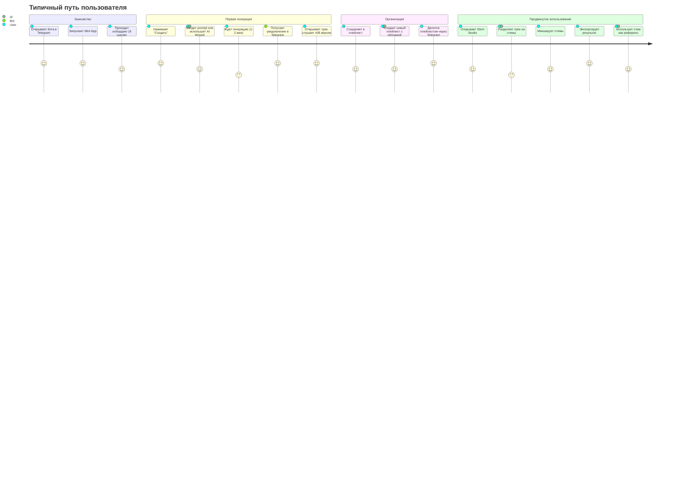

# 🎵 План развития и улучшения MusicVerse AI
## Комплексный анализ и стратегия развития платформы

**Дата создания:** 25 декабря 2025  
**Версия:** 1.0  
**Статус:** Активный план развития

---

## 📋 Содержание

1. [Резюме анализа](#резюме-анализа)
2. [Анализ текущего состояния](#анализ-текущего-состояния)
3. [Пользовательские сценарии](#пользовательские-сценарии)
4. [Мобильный интерфейс и навигация](#мобильный-интерфейс-и-навигация)
5. [План улучшения студийных функций](#план-улучшения-студийных-функций)
6. [Приоритизация и roadmap](#приоритизация-и-roadmap)
7. [Метрики успеха](#метрики-успеха)

---

## 🎯 Резюме анализа

### Ключевые показатели проекта

**Масштаб проекта:**
- 📄 **40 страниц** - полноценное веб-приложение
- 🧩 **830+ компонентов** - сложная архитектура
- ⚡ **94 Edge Functions** - мощный бэкенд
- 📱 **Telegram Mini App** - нативная интеграция
- 🎨 **Mobile-First дизайн** - оптимизация под мобильные устройства

**Текущий статус:**
- ✅ **80% готовности** (20/25 спринтов)
- ✅ **Health Score: 97/100** - отличное качество кода
- ✅ **~500KB bundle** - хорошая производительность
- ✅ **Suno AI v5** - последняя версия API

### Сильные стороны платформы

1. **🎼 Продвинутая генерация музыки**
   - A/B версионирование (2 варианта на каждую генерацию)
   - AI Lyrics Wizard (5-шаговая система)
   - 174+ мета-тегов, 277+ стилей
   - 75+ языков

2. **🎚️ Stem Studio**
   - Разделение треков на компоненты
   - Индивидуальное управление каждым стемом
   - Экспорт в различные форматы
   - Использование стемов как референсов

3. **📱 Отличная мобильная оптимизация**
   - Island Navigation (плавающая навигация)
   - Виртуализация списков (react-virtuoso)
   - Lazy loading изображений
   - Оптимизированные запросы (TanStack Query)

4. **🤖 AI интеграция**
   - Suno AI v5 для генерации
   - Gemini для анализа и улучшений
   - AI Lyrics Assistant
   - Автоматическая генерация обложек

5. **🎮 Геймификация**
   - Система наград и достижений
   - Ежедневные бонусы
   - Лидерборды
   - Прогрессия пользователя

---

## 🔍 Анализ текущего состояния

### 1. Архитектура приложения

#### Структура страниц (40 страниц)

**Основные разделы:**
```
Главная (/)
├── Discover/Featured контент
├── Quick Actions (Создать, Распознать)
├── Auto-Playlists по жанрам
├── Popular Creators
└── Professional Tools Hub

Создание (/generate)
├── Simple Mode
├── Custom Mode (полный контроль)
├── AI Lyrics Wizard
├── Reference Audio
└── Project Integration

Библиотека (/library)
├── Мои треки (Grid/List)
├── A/B версии
├── Фильтры и поиск
└── Swipe actions (mobile)

Проекты (/projects)
├── Project Management
├── Plan Tracks
├── Cloud Sync
└── Collaborative Features

Stem Studio (/studio/:trackId)
├── Multi-stem separation
├── Volume/Mute controls
├── Effects & Mixing
├── Export options
└── Mobile-optimized layout

Плейлисты (/playlists)
├── Мои плейлисты
├── Auto-playlists
├── Sharing
└── AI-generated covers

Сообщество
├── Artists (/artists)
├── Blog (/blog)
├── Community (/community)
└── Following Feed

Профиль
├── Мой профиль (/profile)
├── Публичный профиль (/profile/:userId)
├── Настройки (/settings)
└── Rewards (/rewards)

Дополнительно
├── Music Lab (/music-lab)
├── Guitar Studio (/guitar-studio)
├── Lyrics Studio (/lyrics-studio)
├── Professional Studio (/professional-studio)
├── Analytics (/analytics)
└── Admin панель (/admin/*)
```

#### Компонентная архитектура (830+ компонентов)

**Категории компонентов:**

1. **UI Primitives** (~50 компонентов)
   - shadcn/ui базовые компоненты
   - Custom UI элементы
   - Lazy-loading компоненты

2. **Player System** (~30 компонентов)
   - CompactPlayer
   - ExpandedPlayer
   - MobileFullscreenPlayer
   - Waveform visualization
   - Queue management

3. **Stem Studio** (~60 компонентов)
   - Модульная архитектура
   - Mobile/Desktop layouts
   - Effects panels
   - Timeline visualization
   - Section editor

4. **Generation Forms** (~40 компонентов)
   - GenerateSheet
   - AI Lyrics Wizard
   - Form fields и validation
   - Reference audio handling

5. **Library & Tracks** (~50 компонентов)
   - VirtualizedTrackList
   - TrackCard variations
   - Version switchers
   - Action menus

6. **Social & Gamification** (~30 компонентов)
   - Followers/Following
   - Likes & Comments
   - Achievement system
   - Leaderboards

7. **Navigation** (~20 компонентов)
   - BottomNavigation (Island style)
   - Sidebar (desktop)
   - MoreMenuSheet
   - Deep linking handlers

8. **Admin & Analytics** (~25 компонентов)
   - Dashboard
   - Moderation tools
   - Analytics charts
   - Feedback management

### 2. Технологический стек

**Frontend:**
```typescript
// Core
React 19              // Latest features
TypeScript 5          // Type safety
Vite                  // Fast builds

// State & Data
TanStack Query        // Server state (30s stale, 10min gc)
Zustand               // Client state (player, lyrics wizard)
React Router 6        // Navigation

// UI & Styling
Tailwind CSS          // Utility-first
shadcn/ui             // Component library
Framer Motion         // Animations (optimized)
react-virtuoso        // List virtualization

// Audio
wavesurfer.js         // Waveforms
Tone.js               // Audio processing
Web Audio API         // Low-level control

// Telegram
@twa-dev/sdk          // Mini App integration
```

**Backend (Lovable Cloud):**
```typescript
// Database
PostgreSQL            // Main database
Supabase              // Backend-as-a-Service
RLS (Row Level Security) // Security

// Functions
Edge Functions (Deno) // 94 функций
Supabase Realtime     // Live updates
Supabase Storage      // Media files

// AI Services
Suno AI v5            // Music generation
Gemini AI             // Analysis & enhancement
Klangio               // Audio analysis
```

### 3. Производительность

**Текущие метрики:**
- Bundle Size: ~500KB (хорошо)
- TTI (4G Mobile): ~4.5s (можно улучшить → цель <3s)
- List FPS: 45 (можно улучшить → цель >58)
- Lighthouse: TBD (цель >90)

**Оптимизации:**
- ✅ Lazy loading страниц
- ✅ Code splitting
- ✅ Virtualized lists
- ✅ Image lazy loading с blur placeholder
- ✅ Optimized queries (staleTime, gcTime)
- ✅ React.memo в ключевых местах
- ⚠️ Waveform generation блокирует UI (нужен Web Worker)
- ⚠️ Некоторые компоненты не memoized (StemChannel, TrackCard)

---

## 👥 Пользовательские сценарии

### Основной User Journey



### Сценарий 1: Новый пользователь

**Цель:** Создать первый трек за 5 минут

**Текущий флоу:**
1. Открытие бота → Mini App (10 сек)
2. Онбординг (2-3 мин)
3. Навигация к Generate (5 сек)
4. Ввод prompt (1 мин)
5. Ожидание генерации (1-2 мин)
6. Прослушивание результата (30 сек)

**Итого:** 5-7 минут ✅

**Проблемы:**
- ⚠️ Онбординг может быть слишком длинным (9 шагов)
- ⚠️ Новички не всегда понимают, что писать в prompt
- ⚠️ Нет примеров или шаблонов для быстрого старта

**Улучшения:**
- 💡 Сократить онбординг до 5 ключевых шагов
- 💡 Добавить Quick Start Templates (10-15 готовых промптов)
- 💡 Показывать популярные стили в реальном времени
- 💡 Gamification: награда за первый трек

### Сценарий 2: Активный создатель

**Цель:** Создать 5-10 треков в день, организовать в проекты

**Текущий флоу:**
1. Quick Actions на главной → Generate
2. Использует AI Lyrics Wizard для сложных треков
3. Сохраняет в Projects
4. Переключается между версиями A/B
5. Экспортирует лучшие

**Проблемы:**
- ⚠️ Нет batch generation (создать несколько треков одновременно)
- ⚠️ Lyrics Wizard теряет state при закрытии
- ⚠️ Нет undo/redo в Lyrics Wizard
- ⚠️ Счетчик символов включает структурные теги

**Улучшения:**
- 💡 Batch generation mode (очередь из 3-5 треков)
- 💡 LocalStorage persistence для Lyrics Wizard
- 💡 Undo/Redo история (последние 20 состояний)
- 💡 Правильный подсчет символов (без тегов)
- 💡 Quick duplicate track (создать вариацию существующего)

### Сценарий 3: Профессиональный продюсер

**Цель:** Использовать Stem Studio для продвинутой обработки

**Текущий флоу:**
1. Библиотека → выбор трека
2. Открыть Stem Studio
3. Разделение на стемы (ждать 1-2 мин)
4. Микширование стемов
5. Экспорт результата

**Проблемы:**
- ⚠️ AudioContext не всегда корректно управляется (memory leaks)
- ⚠️ Mobile ограничивает количество audio элементов (6-8)
- ⚠️ Waveform generation блокирует UI
- ⚠️ Нет keyboard shortcuts для быстрой работы
- ⚠️ Нет preset'ов для быстрого микширования

**Улучшения:**
- 💡 Audio element pooling для mobile
- 💡 Web Worker для waveform generation
- 💡 Keyboard shortcuts (S-solo, M-mute, числа-выбор стема)
- 💡 Mix presets (Pop, Rock, EDM, Cinematic)
- 💡 AI-powered mastering (автоматическая обработка)
- 💡 Undo/Redo для действий в студии

### Сценарий 4: Социальный пользователь

**Цель:** Делиться музыкой, находить единомышленников

**Текущий флоу:**
1. Создание/поиск музыки
2. Лайки и комментарии
3. Добавление в плейлисты
4. Sharing через Telegram (Stories, Messages)
5. Following других артистов

**Проблемы:**
- ⚠️ Нет collaborative editing (совместная работа)
- ⚠️ Нет listening parties (синхронное прослушивание)
- ⚠️ Нет challenges/contests
- ⚠️ Ограниченные социальные функции

**Улучшения:**
- 💡 Real-time collaborative editing в Stem Studio
- 💡 Live Listening Parties (синхронное прослушивание с друзьями)
- 💡 Weekly challenges (тематические конкурсы)
- 💡 Collaboration marketplace (найти соавторов)
- 💡 Community voting и featured треки

---

## 📱 Мобильный интерфейс и навигация

### Текущая навигация (Mobile-First)

**Island Navigation** (Плавающая навигация внизу экрана)
```
┌──────────────────────────────────────┐
│                                      │
│         Content Area                 │
│                                      │
│                                      │
└──────────────────────────────────────┘
┌──────────────────────────────────────┐
│  [Главная] [Треки] [➕] [Проекты] [≡]│ ← Island Nav
└──────────────────────────────────────┘
```

**Структура навигации:**
1. **Главная** - Discovery, Featured, Auto-playlists
2. **Треки** - Библиотека (Grid/List view)
3. **➕ Создать** - FAB (Floating Action Button)
4. **Проекты** - Project management
5. **≡ Ещё** - MoreMenuSheet с дополнительными разделами

**MoreMenuSheet содержит:**
```
Студии
├── Music Lab
├── Guitar Studio
└── Lyrics Studio

Сообщество
├── Блог
└── Авторы

Аккаунт
├── Мой профиль
├── Награды
└── Настройки

Администрирование (для админов)
├── Админ панель
├── Модерация
├── Аналитика
└── Обратная связь
```

### Сильные стороны мобильного UX

1. **✅ Island Navigation**
   - Современный дизайн
   - Плавающая навигация (не блокирует контент)
   - 5 элементов (оптимально для thumb zone)
   - FAB в центре (самое удобное место)
   - Анимации и haptic feedback

2. **✅ Touch-friendly компоненты**
   - Минимум 44x44px touch targets
   - Swipe actions (Play Next, Version Switch)
   - Pull-to-refresh
   - Long press для контекстных меню

3. **✅ Оптимизированная производительность**
   - Виртуализация длинных списков
   - Lazy loading компонентов
   - Optimistic updates (лайки, версии)
   - Smooth scrolling

4. **✅ Адаптация к клавиатуре (iOS)**
   - `useKeyboardAware` hook
   - Автоматическая подстройка scroll
   - Safe area insets

5. **✅ Telegram Native интеграция**
   - Портретная ориентация
   - Native sharing (Stories, Messages)
   - Deep linking
   - Settings button
   - Haptic feedback

### Проблемы и недостатки

#### 1. Дублирование мобильных компонентов

**Проблема:** Множество похожих компонентов для mobile

Примеры:
- `MobileActionsTab.tsx` [180 LOC]
- `MobileLyricsTab.tsx` [210 LOC]
- `MobilePlayerTab.tsx` [250 LOC]
- `MobileSectionsTab.tsx` [190 LOC]
- 7+ вариантов табов (всего ~1,340 LOC)

**Решение:** Создать универсальный `MobileTabBar` компонент
- Reduces code by ~59% (1,340 → 550 LOC)
- Единый API для всех табов
- Легче поддерживать

#### 2. Layout дублирование

**Проблема:**
- `TrackStudioMobileLayout.tsx` [450 LOC]
- `MobileStudioLayout.tsx` [320 LOC]
- Total: 770 LOC

**Решение:** Unified `MobileStudio.tsx` [350 LOC]
- Saves 420 LOC (-55%)
- Consistent UX

#### 3. Waveform блокирует UI

**Проблема:** Генерация waveform на main thread
- UI freezes на 200-500ms
- Особенно заметно на mobile

**Решение:** Web Worker для waveform
- Offload в background thread
- Показывать прогресс
- Кэшировать в IndexedDB

#### 4. Audio ограничения на iOS

**Проблема:** Safari ограничивает 6-8 audio элементов
- В Stem Studio может быть 8+ стемов
- Не все стемы воспроизводятся

**Решение:** Audio element pooling
- Динамическое создание/уничтожение
- Приоритизация активных стемов
- Virtualized audio elements

### План улучшения мобильного интерфейса

Уже есть подробный план: **MOBILE_OPTIMIZATION_SUMMARY.md**

**Ключевые цели:**
- Компоненты: 29 → 18 (-38%)
- LOC: ~5,925 → ~4,225 (-29%)
- Duplication: >15% → <5%
- TTI: ~4.5s → <3s (-33%)
- FPS: 45 → >58 (+29%)

**Timeline:** 4 недели
- Week 1: Foundation & Design System
- Week 2: Component consolidation
- Week 3: UX polish & gestures
- Week 4: Documentation & cleanup

---

## 🎚️ План улучшения студийных функций

### Текущее состояние Stem Studio

**Функционал:**
- ✅ Vocal/Instrumental separation
- ✅ Multi-stem mode (drums, bass, guitar, keys, etc.)
- ✅ Per-stem volume/mute controls
- ✅ Waveform visualization
- ✅ Export (MP3/WAV/ZIP)
- ✅ Use stem as reference
- ✅ Mobile-optimized layout

**Архитектура:**
- 60+ компонентов
- Модульная структура (core/, panels/, tabs/)
- Desktop & Mobile layouts
- Effects system
- Timeline visualization

### Приоритет 1: Критические улучшения (P0-P1)

#### 1.1 Audio Engine стабильность

**Проблемы:**
- Memory leaks от orphaned audio nodes
- Нет проверки AudioContext state
- Mobile audio limits (6-8 элементов)

**Решение:**
```typescript
// 1. AudioContext state machine
class AudioManager {
  private context: AudioContext | null = null;
  private nodes: Map<string, AudioNode> = new Map();
  
  async init() {
    if (this.context?.state === 'suspended') {
      await this.context.resume();
    }
    if (!this.context) {
      this.context = new AudioContext();
    }
  }
  
  cleanup() {
    this.nodes.forEach(node => node.disconnect());
    this.nodes.clear();
    this.context?.close();
  }
}

// 2. Audio element pooling
class AudioPool {
  private pool: HTMLAudioElement[] = [];
  private active: Set<HTMLAudioElement> = new Set();
  private maxSize = 6; // iOS limit
  
  acquire(): HTMLAudioElement {
    let audio = this.pool.pop();
    if (!audio && this.active.size < this.maxSize) {
      audio = new Audio();
    }
    if (audio) this.active.add(audio);
    return audio;
  }
  
  release(audio: HTMLAudioElement) {
    audio.pause();
    audio.src = '';
    this.active.delete(audio);
    this.pool.push(audio);
  }
}
```

**Файлы:**
- `src/lib/audioManager.ts` (создать)
- `src/lib/audioPool.ts` (создать)
- `src/hooks/studio/useStemStudioAudio.ts` (обновить)

**Приоритет:** P0 (Critical)
**Время:** 2-3 дня

#### 1.2 Waveform Web Worker

**Проблема:** UI freezes при генерации waveform

**Решение:**
```typescript
// waveformGenerator.worker.ts
self.onmessage = async (e) => {
  const { audioBuffer, width, height } = e.data;
  const peaks = extractPeaks(audioBuffer, width);
  const imageData = renderWaveform(peaks, width, height);
  self.postMessage({ imageData, peaks });
};

// useWaveform.ts
const { data: waveform, isLoading } = useQuery({
  queryKey: ['waveform', trackId],
  queryFn: async () => {
    const worker = new Worker(new URL('./worker.ts', import.meta.url));
    return new Promise((resolve) => {
      worker.postMessage({ audioBuffer, width, height });
      worker.onmessage = (e) => {
        resolve(e.data);
        worker.terminate();
      };
    });
  },
  staleTime: Infinity, // Never refetch
});
```

**Приоритет:** P1 (High)
**Время:** 2-3 дня

#### 1.3 Keyboard Shortcuts

**Функционал:**
```typescript
// Global shortcuts
Space         → Play/Pause
Arrow Left    → Seek -5s
Arrow Right   → Seek +5s
M             → Mute
F             → Fullscreen
L             → Like track
Q             → Queue panel

// Stem Studio shortcuts
S             → Solo selected stem
M             → Mute selected stem
1-9           → Select stem by number
Ctrl+Z        → Undo
Ctrl+Shift+Z  → Redo
Ctrl+E        → Export
Ctrl+S        → Save mix
```

**Реализация:**
```typescript
import { useHotkeys } from 'react-hotkeys-hook';

export function useStemStudioShortcuts(stemId: string) {
  useHotkeys('s', () => soloStem(stemId), { enableOnFormTags: false });
  useHotkeys('m', () => muteStem(stemId), { enableOnFormTags: false });
  useHotkeys('1-9', (e) => selectStem(e.key), { enableOnFormTags: false });
  // ...
}
```

**Приоритет:** P1 (High)
**Время:** 1 день

### Приоритет 2: Новые функции (P1-P2)

#### 2.1 AI-Powered Mastering

**Описание:** Автоматический мастеринг треков

**Функционал:**
- Анализ частотного спектра
- Автоматическая EQ, компрессия, лимитинг
- Presets: "Pop", "Rock", "EDM", "Cinematic", "Podcast"
- A/B comparison (original vs mastered)
- Reference track matching

**UI/UX:**
```
┌─────────────────────────────────────┐
│  🎚️ AI Mastering                    │
├─────────────────────────────────────┤
│                                     │
│  Preset: [Pop ▼]                    │
│                                     │
│  Loudness: ▓▓▓▓▓▓▓▓▓░ -14 LUFS     │
│  Stereo Width: ▓▓▓▓▓▓░░░░ 60%      │
│  Bass Boost: ▓▓▓░░░░░░░ 30%        │
│                                     │
│  [Preview Original] [Preview Master]│
│                                     │
│  [Apply Mastering]                  │
└─────────────────────────────────────┘
```

**Технологии:**
- Tone.js для audio processing
- ML model для анализа (TensorFlow.js)
- Replicate API для AI processing

**Приоритет:** P1 (High impact feature)
**Время:** 1 неделя

#### 2.2 Mix Presets & Templates

**Функционал:**
- Готовые пресеты микширования
- Save custom presets
- Share presets с сообществом
- Import/Export preset files

**Presets:**
```typescript
interface MixPreset {
  name: string;
  genre: string;
  stems: {
    [stemType: string]: {
      volume: number;      // 0-100
      pan: number;         // -100 to 100
      eq: {
        low: number;       // -12 to +12 dB
        mid: number;
        high: number;
      };
      reverb: number;      // 0-100
      delay: number;       // 0-100
    };
  };
}

// Example preset
const popMixPreset: MixPreset = {
  name: "Pop Vocals Up",
  genre: "pop",
  stems: {
    vocals: { volume: 85, pan: 0, eq: { low: 0, mid: 2, high: 3 } },
    drums: { volume: 70, pan: 0, eq: { low: 2, mid: 0, high: 1 } },
    bass: { volume: 75, pan: 0, eq: { low: 4, mid: 0, high: -2 } },
    // ...
  }
};
```

**UI:**
```
┌─────────────────────────────────────┐
│  📚 Mix Presets                      │
├─────────────────────────────────────┤
│  🎤 Pop Vocals Up                    │
│  🎸 Rock Guitar Focus                │
│  🎹 EDM Bass Heavy                   │
│  🎵 Cinematic Orchestral             │
│  ➕ Create Custom...                 │
└─────────────────────────────────────┘
```

**Приоритет:** P1
**Время:** 3-5 дней

#### 2.3 Collaborative Editing

**Описание:** Совместная работа в реальном времени

**Функционал:**
- Создание shared session
- Real-time sync изменений
- Live cursors (видно действия других)
- Permissions (viewer/editor/owner)
- Chat в студии
- Version control

**Технологии:**
- Supabase Realtime
- CRDT (Conflict-free Replicated Data Type)
- WebRTC для audio streaming (optional)

**UI:**
```
┌─────────────────────────────────────┐
│  👥 Collaboration (3 active)         │
├─────────────────────────────────────┤
│  👤 You (Owner)                      │
│  👤 John (Editing Drums)            │
│  👤 Anna (Listening)                │
│                                     │
│  [Invite] [Chat] [End Session]     │
└─────────────────────────────────────┘
```

**Приоритет:** P1 (Killer feature)
**Время:** 2-3 недели

#### 2.4 MIDI Editor

**Описание:** Полноценный MIDI редактор

**Функционал:**
- Piano roll
- Virtual instruments (piano, drums, synth, bass)
- Quantization
- Velocity editing
- Export/Import MIDI
- Integration с Stem Studio

**UI:**
```
┌─────────────────────────────────────┐
│  🎹 MIDI Editor                      │
├─────────────────────────────────────┤
│  [Piano Roll Canvas]                │
│  ┌──┬──┬──┬──┬──┬──┬──┬──┬──┬──┐  │
│  │  │▓▓│  │▓▓│  │  │▓▓│  │▓▓│  │  │
│  │▓▓│▓▓│▓▓│▓▓│▓▓│▓▓│▓▓│▓▓│▓▓│▓▓│  │
│  └──┴──┴──┴──┴──┴──┴──┴──┴──┴──┘  │
│                                     │
│  Instrument: [Piano ▼]              │
│  [Quantize] [Velocity] [Export]    │
└─────────────────────────────────────┘
```

**Технологии:**
- Tone.js для синтеза
- @tonejs/midi для parsing
- Canvas для piano roll

**Приоритет:** P2
**Время:** 3 недели

#### 2.5 Loop & Sample Library

**Функционал:**
- Библиотека готовых loops & samples
- Фильтры (BPM, key, genre, mood)
- Drag & drop в Studio
- Auto tempo matching
- Community-generated content

**Категории:**
- Drum loops (kick, snare, hi-hat patterns)
- Bass loops
- Synth loops
- Guitar riffs
- Vocal samples (one-shots, phrases)
- Sound effects

**UI:**
```
┌─────────────────────────────────────┐
│  📚 Sample Library                   │
├─────────────────────────────────────┤
│  🔍 Search: [drum loop]             │
│                                     │
│  Filters:                           │
│  Genre: [EDM ▼]                     │
│  BPM: [120-130]                     │
│  Key: [C Minor ▼]                   │
│                                     │
│  Results:                           │
│  ┌─────────────────────────────┐   │
│  │ 🥁 Hard Kick Loop           │   │
│  │    128 BPM · C Minor        │   │
│  │    [Preview] [Add]          │   │
│  └─────────────────────────────┘   │
└─────────────────────────────────────┘
```

**Приоритет:** P2
**Время:** 1 неделя

### Приоритет 3: UX улучшения (P2)

#### 3.1 Улучшенная визуализация

**Timeline с секциями:**
```
[Intro] [Verse 1] [Chorus] [Verse 2] [Chorus] [Bridge] [Outro]
├───────┼─────────┼────────┼─────────┼────────┼────────┼──────┤
0:00   0:15     0:45     1:15     1:45     2:15     2:45   3:15
```

**Frequency analyzer:**
- Real-time spectrum analyzer
- Separate для каждого стема
- Identify frequency conflicts

**Loudness meter:**
- LUFS meter
- Peak indicator
- Dynamic range visualization

#### 3.2 Undo/Redo система

**Функционал:**
- История всех действий (last 50)
- Undo/Redo с Ctrl+Z/Ctrl+Shift+Z
- Visual history timeline
- Snapshot comparison

**Реализация:**
```typescript
interface HistoryEntry {
  id: string;
  timestamp: number;
  action: string;
  state: MixState;
  thumbnail?: string;
}

class MixHistory {
  private entries: HistoryEntry[] = [];
  private currentIndex = -1;
  private maxSize = 50;
  
  push(action: string, state: MixState) {
    // Remove entries after current index
    this.entries = this.entries.slice(0, this.currentIndex + 1);
    
    // Add new entry
    this.entries.push({ id: uuid(), timestamp: Date.now(), action, state });
    
    // Limit size
    if (this.entries.length > this.maxSize) {
      this.entries.shift();
    }
    
    this.currentIndex = this.entries.length - 1;
  }
  
  undo(): MixState | null {
    if (this.currentIndex > 0) {
      this.currentIndex--;
      return this.entries[this.currentIndex].state;
    }
    return null;
  }
  
  redo(): MixState | null {
    if (this.currentIndex < this.entries.length - 1) {
      this.currentIndex++;
      return this.entries[this.currentIndex].state;
    }
    return null;
  }
}
```

#### 3.3 Context-aware tips

**Адаптивные подсказки:**
- Показывать tips в зависимости от действий пользователя
- "You might want to..." suggestions
- Learn mode (объяснения что делает каждый контрол)

**Примеры:**
- "Vocals sound muddy? Try reducing 200-500 Hz"
- "Bass clashing with kick? Try high-pass filter at 80 Hz"
- "Mix sounds narrow? Increase stereo width on pads"

#### 3.4 Quick Compare

**A/B comparison:**
- Быстрое сравнение "до/после"
- Split view (left-right comparison)
- Overlay mode (toggle between versions)

---

## 🗓️ Приоритизация и Roadmap

### Система приоритетов

**P0 - Critical (Блокеры):**
- Должны быть исправлены немедленно
- Влияют на стабильность/безопасность
- Блокируют основной функционал

**P1 - High (Важные улучшения):**
- Значительно улучшают UX
- Killer features
- Конкурентные преимущества

**P2 - Medium (Улучшения):**
- Nice to have
- Улучшают определенные workflows
- Не критичны

**P3 - Low (Будущее):**
- Долгосрочные планы
- Инновационные идеи
- Требуют больших ресурсов

### Q1 2026 (Январь-Март) - Стабилизация и Core Features

**Focus:** Исправление критических проблем и важные улучшения

**Must-have (P0-P1):**

1. **Исправление критических багов** [2 недели]
   - ✅ AudioContext management (3 дня)
   - ✅ Mobile audio limits / Audio pooling (2 дня)
   - ✅ Waveform Web Worker (2 дня)
   - ✅ Component memoization (2 дня)
   - ✅ Lyrics Wizard improvements (3 дня)

2. **Stem Studio улучшения** [2 недели]
   - ✅ Keyboard shortcuts (1 день)
   - ✅ Mix presets (3 дня)
   - ✅ AI-powered mastering (1 неделя)
   - ✅ Undo/Redo system (2 дня)

3. **Mobile optimization** [3 недели]
   - ✅ Component consolidation (2 недели)
   - ✅ Touch improvements (1 неделя)
   - Следовать плану из MOBILE_OPTIMIZATION_SUMMARY.md

4. **Security & Compliance** [1 неделя]
   - ✅ Security audit (3 дня)
   - ✅ GDPR compliance (если нужно) (2 дня)
   - ✅ Rate limiting review (1 день)

**Total effort:** 8-9 недель

**Метрики успеха:**
- Zero P0 bugs
- Mobile performance: TTI <3s, FPS >58
- User satisfaction: 4.5+/5
- Crash rate: <0.1%

---

### Q2 2026 (Апрель-Июнь) - Advanced Features & Monetization

**Focus:** Killer features и монетизация

**High Priority (P1-P2):**

1. **Collaborative Editing** [3 недели]
   - ✅ Real-time sync (1 неделя)
   - ✅ Permissions system (3 дня)
   - ✅ Chat integration (2 дня)
   - ✅ Testing & polish (1 неделя)

2. **MIDI Editor** [3 недели]
   - ✅ Piano roll (2 недели)
   - ✅ Virtual instruments (1 неделя)

3. **Loop & Sample Library** [1 неделя]
   - ✅ Library UI (2 дня)
   - ✅ Integration с Studio (2 дня)
   - ✅ Seeding initial content (1 день)

4. **Subscription Tiers** [1 неделя]
   - ✅ Free/Pro/Studio tiers
   - ✅ Payment integration (Telegram Stars)
   - ✅ Feature gating

5. **Export to Streaming Platforms** [1 неделя]
   - ✅ DistroKid API integration
   - ✅ Metadata editing
   - ✅ Distribution flow

6. **Internationalization** [1 неделя]
   - ✅ i18n setup (react-i18next)
   - ✅ Translation for 8 languages
   - ✅ Language switcher

7. **PWA & Service Worker** [3 дня]
   - ✅ Offline support
   - ✅ Background sync
   - ✅ Push notifications

**Total effort:** 10-12 недель

**Метрики успеха:**
- Collaborative sessions: 10% users
- Subscription conversion: 5-10%
- Export to streaming: 100+ tracks/month
- International users: 30%+

---

### Q3 2026 (Июль-Сентябрь) - Social & Community

**Focus:** Создание сообщества и engagement

**Medium Priority (P2):**

1. **Live Listening Parties** [1 неделя]
   - ✅ Synchronized playback
   - ✅ Real-time reactions
   - ✅ Voice chat integration

2. **Challenges & Contests** [3-5 дней]
   - ✅ Challenge creation
   - ✅ Submission & voting
   - ✅ Leaderboards

3. **Collaboration Marketplace** [3-5 дней]
   - ✅ Request posting
   - ✅ Matching system
   - ✅ Portfolio showcase

4. **Smart Playlists** [1 неделя]
   - ✅ AI recommendations
   - ✅ Mood-based playlists
   - ✅ Daily Mix

5. **AI Music Coach** [3-5 дней]
   - ✅ Track analysis
   - ✅ Feedback & suggestions
   - ✅ Learning path

6. **Social Media Auto-posting** [1 неделя]
   - ✅ Instagram/TikTok/Twitter integration
   - ✅ Video generation
   - ✅ Scheduling

7. **Advanced Analytics** [3-5 дней]
   - ✅ Dashboard enhancements
   - ✅ A/B testing framework
   - ✅ User insights

**Total effort:** 10-12 недель

**Метрики успеха:**
- Listening parties: 5% users
- Challenge participation: 20% users
- Social shares: 2x increase
- Engagement: 15% increase

---

### Q4 2026 (Октябрь-Декабрь) - Scale & Polish

**Focus:** Масштабирование и оптимизация

**Nice to have (P2-P3):**

1. **White Label для бизнеса** [2-3 недели]
   - ✅ Custom branding
   - ✅ Team management
   - ✅ API access

2. **Auto-tagging & Genre Detection** [3-5 дней]
   - ✅ ML анализ
   - ✅ Automatic metadata

3. **Telegram Bot Enhancements** [3-5 дней]
   - ✅ Voice messages → music
   - ✅ Group chat bot
   - ✅ Inline mode improvements

4. **Performance Optimization** [1 неделя]
   - ✅ Database optimization
   - ✅ Redis caching
   - ✅ Edge function optimization

5. **Multi-region Deployment** [2-3 недели]
   - ✅ EU region
   - ✅ APAC region
   - ✅ Edge caching

6. **Comprehensive Testing** [1-2 недели]
   - ✅ 80% coverage goal
   - ✅ E2E scenarios
   - ✅ Performance testing

7. **Documentation & Help Center** [1 неделя]
   - ✅ User guides
   - ✅ Video tutorials
   - ✅ API docs

**Total effort:** 10-12 недель

**Метрики успеха:**
- B2B clients: 5-10
- Global users: 50% outside primary region
- Test coverage: 80%+
- Help center: 50% reduction in support tickets

---

## 📊 Метрики успеха

### Technical Metrics

**Performance:**
```
Bundle Size:          ~500KB → <450KB (-10%)
TTI (4G Mobile):      ~4.5s → <3s (-33%)
FPS (Lists):          45 → >58 (+29%)
Lighthouse:           TBD → >90
Memory (Peak):        TBD → <100MB
Crash Rate:           TBD → <0.1%
```

**Code Quality:**
```
Components:           830 → TBD (после consolidation)
LOC (Mobile):         ~5,925 → ~4,225 (-29%)
Duplication:          >15% → <5%
Test Coverage:        TBD → 80%+
TypeScript Errors:    0 → 0 (maintain)
```

**Infrastructure:**
```
Edge Function Cold Start:  TBD → <300ms
Database Query Time:       TBD → p95 <100ms
API Response Time:         TBD → p95 <500ms
Uptime:                    TBD → 99.9%
```

### Product Metrics

**User Growth:**
```
MAU:                       TBD → +20% м/м
User Retention (D1/D7/D30): TBD → 60%/30%/15%
Churn Rate:                TBD → <5% monthly
New User Activation:       TBD → >70% (create first track)
```

**Engagement:**
```
Tracks Generated/User:     TBD → 10/month
Listening Time:            TBD → 30 min/session
Stem Studio Adoption:      TBD → 25% users
Social Interactions:       TBD → 5 actions/user/week
Daily Active Users:        TBD → 40% of MAU
```

**Revenue:**
```
Conversion to Paid:        TBD → 5-10%
MRR Growth:                TBD → +15% м/м
ARPU:                      TBD → $15-20
LTV:CAC Ratio:             TBD → >3:1
Subscription Retention:    TBD → >80% monthly
```

**Quality:**
```
Generation Success Rate:   TBD → >95%
App Crashes:               TBD → <0.1% sessions
User Satisfaction:         TBD → 4.5+/5
Support Tickets:           TBD → <5% users
NPS Score:                 TBD → >50
```

### Feature-Specific Metrics

**Stem Studio:**
```
Users Using Studio:        TBD → 25% of active users
Avg. Stems per Track:      TBD → 4-6
Export Success Rate:       TBD → >90%
Time in Studio:            TBD → 15 min/session
```

**Collaborative Editing:**
```
Collaborative Sessions:    Launch → 10% users in Q2
Avg. Collaborators:        Launch → 2-3 per session
Session Duration:          Launch → 30+ minutes
Conversion to Paid:        Launch → 15% (higher than avg)
```

**AI Features:**
```
AI Lyrics Wizard Usage:    TBD → 40% of generations
Mastering Usage:           Launch → 20% of exports
Auto-tagging Accuracy:     Launch → >80%
AI Coach Engagement:       Launch → 10% weekly
```

**Social:**
```
Shares per Track:          TBD → 0.5 average
Likes per Track:           TBD → 3 average
Comments per Track:        TBD → 1 average
Following Ratio:           TBD → 10 following / 5 followers
```

---

## 🚀 Quick Wins (можно сделать немедленно)

### Week 1: Low-hanging fruit

**Backend fixes:**
1. ✅ Fix Lyrics Wizard character count (30 min)
   - Filter structural tags ([Verse], [Chorus])
   - Show real character count

2. ✅ Add validation debouncing (30 min)
   - 300ms debounce для валидации
   - Prevent excessive re-renders

3. ✅ Type guards для section tags (45 min)
   - Validate [Verse], [Chorus], etc.
   - Показывать ошибки корректно

4. ✅ AudioContext state checks (45 min)
   - Check context.state before operations
   - Proper error handling

**UI improvements:**
5. ✅ Empty states для всех экранов (2-4 часа)
   - Helpful messaging
   - CTA buttons
   - Illustrations

6. ✅ Touch target audit (1-2 часа)
   - Ensure 44x44px minimum
   - Fix any violations

**Total:** 1-2 дня

### Week 2: Medium-impact improvements

1. ✅ Component memoization (1 день)
   - StemChannel, TrackCard
   - Custom comparison functions
   - Performance profiling

2. ✅ Advanced code splitting (1 день)
   - Component-level splitting
   - Dynamic imports для библиотек

3. ✅ Image optimization (1 день)
   - WebP with AVIF fallback
   - Responsive images (srcset)
   - CDN optimization

4. ✅ Keyboard shortcuts (1 день)
   - Global shortcuts (Space, Arrow keys)
   - Studio shortcuts (S, M, numbers)
   - Customizable bindings

5. ✅ Error handling standardization (2 дня)
   - AppError hierarchy
   - Unified error messages
   - Better error boundaries

**Total:** 1 неделя

---

## 💡 Инновационные идеи (Долгосрочное)

### AI-Powered Features

1. **AI Voice Cloning**
   - Клонирование голоса пользователя
   - Генерация песен своим голосом
   - Privacy-first подход

2. **AI Music Coach Pro**
   - Персональный AI тренер
   - Adaptive learning path
   - Real-time feedback
   - Homework с проверкой

3. **Style Transfer**
   - Применить стиль одного трека к другому
   - "Make it sound like X"
   - Genre transformation

### Social & Community

4. **Virtual Concerts**
   - Live performances в Telegram
   - Interactive audiences
   - Virtual venues
   - Ticketing через Stars

5. **Music NFTs**
   - Минтинг треков как NFT
   - Blockchain royalties
   - Limited editions

6. **Collaborative Albums**
   - Community-driven альбомы
   - Curated collections
   - Revenue sharing

### Professional Tools

7. **DAW Integration**
   - Ableton Live plugin
   - FL Studio integration
   - Export stems directly

8. **Hardware Integration**
   - MIDI controller support
   - DJ controller integration
   - External audio interface

9. **Advanced Mixing Console**
   - Full parametric EQ
   - Multiband compression
   - Side-chain compression
   - Automation lanes

### Platform Features

10. **Music Education Platform**
    - Interactive courses
    - Music theory lessons
    - Production tutorials
    - Certification program

11. **Marketplace for Services**
    - Hire mixing engineers
    - Mastering services
    - Cover art design
    - Video editing

12. **White Label API**
    - Embed generation в другие apps
    - Custom integrations
    - B2B partnerships

---

## ✅ Рекомендации по приоритизации

### Немедленно (сейчас)

1. **Критические баги (P0)** - 2-3 недели
   - AudioContext management
   - Mobile audio limits
   - Memory leaks

2. **Quick Wins** - 1-2 недели
   - Lyrics Wizard fixes
   - Component memoization
   - Empty states

### Ближайшие 3 месяца (Q1 2026)

3. **Stem Studio improvements** - 2 недели
   - Keyboard shortcuts
   - Mix presets
   - AI mastering

4. **Mobile optimization** - 3 недели
   - Component consolidation
   - Performance improvements
   - Touch UX

5. **Security & Testing** - 1 неделя
   - Security audit
   - Test coverage

### 3-6 месяцев (Q2 2026)

6. **Killer Features** - 10-12 недель
   - Collaborative editing
   - MIDI editor
   - Subscription tiers
   - Export to platforms

7. **Internationalization** - 1 неделя

8. **PWA** - 3 дня

### 6-12 месяцев (Q3-Q4 2026)

9. **Community features** - 10-12 недель
   - Listening parties
   - Challenges
   - Social enhancements

10. **Scale & Optimize** - 10-12 недель
    - Multi-region deployment
    - Performance optimization
    - White label

---

## 📝 Заключение

MusicVerse AI - это **амбициозная и технически сложная платформа** с огромным потенциалом.

**Ключевые сильные стороны:**
- ✅ Современный tech stack
- ✅ Отличная мобильная оптимизация
- ✅ Уникальные AI функции
- ✅ Глубокая Telegram интеграция

**Ключевые области для улучшения:**
- 🔧 Стабильность Stem Studio (audio engine)
- 🚀 Collaborative features
- 💰 Monetization strategy
- 🌍 Internationalization
- 📊 Analytics & insights

**Рекомендуемый фокус на 2026:**
1. **Q1:** Стабилизация + Mobile optimization
2. **Q2:** Killer features + Monetization
3. **Q3:** Community + Social
4. **Q4:** Scale + Polish

**Estimated total effort:** 40-50 недель (при команде 2-3 разработчика)

**Приоритетный подход позволит:**
- Быстро устранить критические проблемы (2-3 недели)
- Внедрить ключевые улучшения (3 месяца)
- Добавить killer features (6 месяцев)
- Масштабировать платформу (12 месяцев)

---

**Документ создан:** 25 декабря 2025  
**Автор:** GitHub Copilot (Claude)  
**Статус:** Ready for Review & Implementation

**Связанные документы:**
- [MOBILE_OPTIMIZATION_SUMMARY.md](MOBILE_OPTIMIZATION_SUMMARY.md)
- [ПЛАН_ДОРАБОТКИ.md](ПЛАН_ДОРАБОТКИ.md)
- [ROADMAP.md](ROADMAP.md)
- [NAVIGATION.md](NAVIGATION.md)
