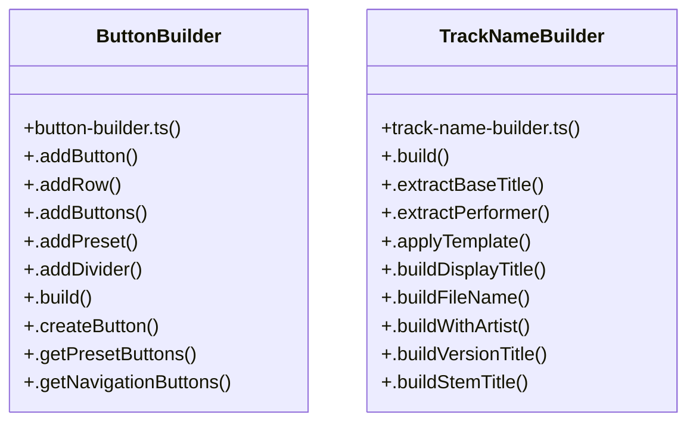

# Accessibility and Rhythm

> 477 nodes · cohesion 0.01

## Key Concepts

- [sendMessage()](file:///D:/.MUSICVERSE/aimusicverse/supabase/functions/telegram-bot/telegram-api.ts#L118) (136 connections)
- [telegram-api.ts](file:///D:/.MUSICVERSE/aimusicverse/supabase/functions/telegram-bot/telegram-api.ts#L1) (99 connections)
- [config.ts](file:///D:/.MUSICVERSE/aimusicverse/supabase/functions/telegram-bot/config.ts#L1) (82 connections)
- [supabase-client.ts](file:///D:/.MUSICVERSE/aimusicverse/supabase/functions/telegram-bot/core/supabase-client.ts#L1) (60 connections)
- [.build()](file:///D:/.MUSICVERSE/aimusicverse/supabase/functions/_shared/track-name-builder.ts#L93) (47 connections)
- [.addButton()](file:///D:/.MUSICVERSE/aimusicverse/supabase/functions/telegram-bot/utils/button-builder.ts#L43) (43 connections)
- [buildMessage()](file:///D:/.MUSICVERSE/aimusicverse/supabase/functions/telegram-bot/utils/message-formatter.ts#L311) (42 connections)
- [text-processor.ts](file:///D:/.MUSICVERSE/aimusicverse/supabase/functions/telegram-bot/utils/text-processor.ts#L1) (36 connections)
- [message-formatter.ts](file:///D:/.MUSICVERSE/aimusicverse/supabase/functions/telegram-bot/utils/message-formatter.ts#L1) (35 connections)
- [dynamic-menu.ts](file:///D:/.MUSICVERSE/aimusicverse/supabase/functions/telegram-bot/handlers/dynamic-menu.ts#L1) (29 connections)
- [button-builder.ts](file:///D:/.MUSICVERSE/aimusicverse/supabase/functions/telegram-bot/utils/button-builder.ts#L1) (29 connections)
- [telegram-config.ts](file:///D:/.MUSICVERSE/aimusicverse/supabase/functions/_shared/telegram-config.ts#L1) (28 connections)
- [handleDeepLink()](file:///D:/.MUSICVERSE/aimusicverse/supabase/functions/telegram-bot/handlers/deep-links.ts#L701) (27 connections)
- [active-menu-manager.ts](file:///D:/.MUSICVERSE/aimusicverse/supabase/functions/telegram-bot/core/active-menu-manager.ts#L1) (26 connections)
- [sendPhoto()](file:///D:/.MUSICVERSE/aimusicverse/supabase/functions/telegram-bot/telegram-api.ts#L181) (26 connections)
- [handleCommand()](file:///D:/.MUSICVERSE/aimusicverse/supabase/functions/telegram-bot/bot.ts#L107) (25 connections)
- [deep-links.ts](file:///D:/.MUSICVERSE/aimusicverse/supabase/functions/telegram-bot/handlers/deep-links.ts#L1) (25 connections)
- [handleDashboard()](file:///D:/.MUSICVERSE/aimusicverse/supabase/functions/telegram-bot/handlers/dashboard.ts#L107) (25 connections)
- [.addRow()](file:///D:/.MUSICVERSE/aimusicverse/supabase/functions/telegram-bot/utils/button-builder.ts#L52) (23 connections)
- [router.ts](file:///D:/.MUSICVERSE/aimusicverse/supabase/functions/telegram-bot/callbacks/router.ts#L1) (23 connections)
- [notifications.ts](file:///D:/.MUSICVERSE/aimusicverse/supabase/functions/telegram-bot/handlers/notifications.ts#L1) (22 connections)
- [getMenuImage()](file:///D:/.MUSICVERSE/aimusicverse/supabase/functions/telegram-bot/keyboards/menu-images.ts#L138) (22 connections)
- [navigation.ts](file:///D:/.MUSICVERSE/aimusicverse/supabase/functions/telegram-bot/handlers/navigation.ts#L1) (21 connections)
- [message-manager.ts](file:///D:/.MUSICVERSE/aimusicverse/supabase/functions/telegram-bot/utils/message-manager.ts#L1) (21 connections)
- [notification-digest.ts](file:///D:/.MUSICVERSE/aimusicverse/supabase/functions/telegram-bot/utils/notification-digest.ts#L1) (21 connections)
- *... and 452 more nodes in this community*

## Class Diagram

## Relationships

- No strong cross-community connections detected

## Source Files

- [D:\.MUSICVERSE\aimusicverse\supabase\functions\_shared\telegram-config.ts](file:///D:/.MUSICVERSE/aimusicverse/supabase/functions/_shared/telegram-config.ts)
- [D:\.MUSICVERSE\aimusicverse\supabase\functions\_shared\telegram-metadata.ts](file:///D:/.MUSICVERSE/aimusicverse/supabase/functions/_shared/telegram-metadata.ts)
- [D:\.MUSICVERSE\aimusicverse\supabase\functions\_shared\track-name-builder.ts](file:///D:/.MUSICVERSE/aimusicverse/supabase/functions/_shared/track-name-builder.ts)
- [D:\.MUSICVERSE\aimusicverse\supabase\functions\_shared\track-naming.ts](file:///D:/.MUSICVERSE/aimusicverse/supabase/functions/_shared/track-naming.ts)
- [D:\.MUSICVERSE\aimusicverse\supabase\functions\suno-music-callback\index.ts](file:///D:/.MUSICVERSE/aimusicverse/supabase/functions/suno-music-callback/index.ts)
- [D:\.MUSICVERSE\aimusicverse\supabase\functions\telegram-bot\bot.ts](file:///D:/.MUSICVERSE/aimusicverse/supabase/functions/telegram-bot/bot.ts)
- [D:\.MUSICVERSE\aimusicverse\supabase\functions\telegram-bot\callbacks\analyze.ts](file:///D:/.MUSICVERSE/aimusicverse/supabase/functions/telegram-bot/callbacks/analyze.ts)
- [D:\.MUSICVERSE\aimusicverse\supabase\functions\telegram-bot\callbacks\artists.ts](file:///D:/.MUSICVERSE/aimusicverse/supabase/functions/telegram-bot/callbacks/artists.ts)
- [D:\.MUSICVERSE\aimusicverse\supabase\functions\telegram-bot\callbacks\audio.ts](file:///D:/.MUSICVERSE/aimusicverse/supabase/functions/telegram-bot/callbacks/audio.ts)
- [D:\.MUSICVERSE\aimusicverse\supabase\functions\telegram-bot\callbacks\dynamic-menu.ts](file:///D:/.MUSICVERSE/aimusicverse/supabase/functions/telegram-bot/callbacks/dynamic-menu.ts)
- [D:\.MUSICVERSE\aimusicverse\supabase\functions\telegram-bot\callbacks\media.ts](file:///D:/.MUSICVERSE/aimusicverse/supabase/functions/telegram-bot/callbacks/media.ts)
- [D:\.MUSICVERSE\aimusicverse\supabase\functions\telegram-bot\callbacks\midi.ts](file:///D:/.MUSICVERSE/aimusicverse/supabase/functions/telegram-bot/callbacks/midi.ts)
- [D:\.MUSICVERSE\aimusicverse\supabase\functions\telegram-bot\callbacks\misc.ts](file:///D:/.MUSICVERSE/aimusicverse/supabase/functions/telegram-bot/callbacks/misc.ts)
- [D:\.MUSICVERSE\aimusicverse\supabase\functions\telegram-bot\callbacks\navigation.ts](file:///D:/.MUSICVERSE/aimusicverse/supabase/functions/telegram-bot/callbacks/navigation.ts)
- [D:\.MUSICVERSE\aimusicverse\supabase\functions\telegram-bot\callbacks\payments.ts](file:///D:/.MUSICVERSE/aimusicverse/supabase/functions/telegram-bot/callbacks/payments.ts)
- [D:\.MUSICVERSE\aimusicverse\supabase\functions\telegram-bot\callbacks\projects.ts](file:///D:/.MUSICVERSE/aimusicverse/supabase/functions/telegram-bot/callbacks/projects.ts)
- [D:\.MUSICVERSE\aimusicverse\supabase\functions\telegram-bot\callbacks\quick-actions.ts](file:///D:/.MUSICVERSE/aimusicverse/supabase/functions/telegram-bot/callbacks/quick-actions.ts)
- [D:\.MUSICVERSE\aimusicverse\supabase\functions\telegram-bot\callbacks\router.ts](file:///D:/.MUSICVERSE/aimusicverse/supabase/functions/telegram-bot/callbacks/router.ts)
- [D:\.MUSICVERSE\aimusicverse\supabase\functions\telegram-bot\callbacks\wizard.ts](file:///D:/.MUSICVERSE/aimusicverse/supabase/functions/telegram-bot/callbacks/wizard.ts)
- [D:\.MUSICVERSE\aimusicverse\supabase\functions\telegram-bot\commands\app.ts](file:///D:/.MUSICVERSE/aimusicverse/supabase/functions/telegram-bot/commands/app.ts)

## Audit Trail

- EXTRACTED: 1899 (62%)
- INFERRED: 1150 (38%)
- AMBIGUOUS: 0 (0%)

---

*Part of the graphify knowledge wiki. See [[index]] to navigate.*