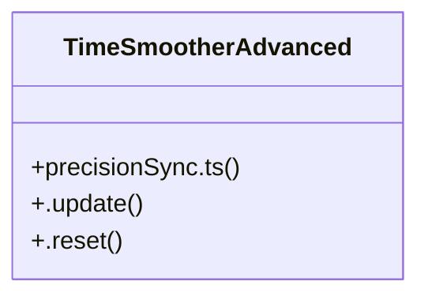

# Accessibility and Rhythm

> 476 nodes · cohesion 0.01

## Key Concepts

- [max](file:///D:/.MUSICVERSE/aimusicverse/src/components/studio/timeline/ProfessionalWaveformTimeline.tsx#L102) (92 connections)
- [ProfessionalWaveformTimeline.tsx](file:///D:/.MUSICVERSE/aimusicverse/src/components/studio/timeline/ProfessionalWaveformTimeline.tsx#L1) (44 connections)
- [rateLimiting.test.ts](file:///D:/.MUSICVERSE/aimusicverse/tests/unit/rateLimiting.test.ts#L1) (29 connections)
- [EnhancedSectionWaveform.tsx](file:///D:/.MUSICVERSE/aimusicverse/src/components/stem-studio/section-editor/EnhancedSectionWaveform.tsx#L1) (23 connections)
- [RhythmAnalyzer.tsx](file:///D:/.MUSICVERSE/aimusicverse/src/components/lyrics-workspace/ai-agent/results/RhythmAnalyzer.tsx#L1) (19 connections)
- [PromptKnobEnhanced.tsx](file:///D:/.MUSICVERSE/aimusicverse/src/components/prompt-dj/PromptKnobEnhanced.tsx#L1) (17 connections)
- [OptimizedWaveform.tsx](file:///D:/.MUSICVERSE/aimusicverse/src/components/studio/unified/OptimizedWaveform.tsx#L1) (16 connections)
- [a11y-utils.ts](file:///D:/.MUSICVERSE/aimusicverse/src/lib/a11y-utils.ts#L1) (16 connections)
- [ProgressBar.tsx](file:///D:/.MUSICVERSE/aimusicverse/src/components/player/ProgressBar.tsx#L1) (14 connections)
- [SectionWaveformPreview.tsx](file:///D:/.MUSICVERSE/aimusicverse/src/components/stem-studio/SectionWaveformPreview.tsx#L1) (14 connections)
- [PerformanceTab.tsx](file:///D:/.MUSICVERSE/aimusicverse/src/components/admin/PerformanceTab.tsx#L1) (13 connections)
- [TagBuilderPanel.tsx](file:///D:/.MUSICVERSE/aimusicverse/src/components/generate-form/TagBuilderPanel.tsx#L1) (13 connections)
- [ThemeContext.tsx](file:///D:/.MUSICVERSE/aimusicverse/src/contexts/ThemeContext.tsx#L1) (12 connections)
- [color-contrast.ts](file:///D:/.MUSICVERSE/aimusicverse/src/lib/color-contrast.ts#L1) (12 connections)
- [a11y.tsx](file:///D:/.MUSICVERSE/aimusicverse/src/lib/a11y.tsx#L1) (11 connections)
- [styleTagParser.ts](file:///D:/.MUSICVERSE/aimusicverse/src/lib/styleTagParser.ts#L1) (11 connections)
- [waveformGenerator.ts](file:///D:/.MUSICVERSE/aimusicverse/src/lib/waveformGenerator.ts#L1) (11 connections)
- [progress-bar.ts](file:///D:/.MUSICVERSE/aimusicverse/supabase/functions/telegram-bot/utils/progress-bar.ts#L1) (11 connections)
- [prettify.js](file:///D:/.MUSICVERSE/aimusicverse/coverage/lcov-report/prettify.js#L1) (10 connections)
- [sectionMatcher.ts](file:///D:/.MUSICVERSE/aimusicverse/src/lib/lyrics/sectionMatcher.ts#L1) (10 connections)
- [beatSnap.ts](file:///D:/.MUSICVERSE/aimusicverse/src/lib/audio/beatSnap.ts#L1) (9 connections)
- [precisionSync.ts](file:///D:/.MUSICVERSE/aimusicverse/src/lib/lyrics/precisionSync.ts#L1) (9 connections)
- [getContrastRatio()](file:///D:/.MUSICVERSE/aimusicverse/src/lib/color-contrast.ts#L50) (8 connections)
- [getLuminance()](file:///D:/.MUSICVERSE/aimusicverse/src/lib/color-contrast.ts#L36) (8 connections)
- [TrackHistoryItem.tsx](file:///D:/.MUSICVERSE/aimusicverse/src/components/prompt-dj/TrackHistoryItem.tsx#L1) (8 connections)
- *... and 451 more nodes in this community*

## Class Diagram

## Relationships

- [[Timer Management]] (2 shared connections)

## Source Files

- [D:\.MUSICVERSE\aimusicverse\coverage\lcov-report\prettify.js](file:///D:/.MUSICVERSE/aimusicverse/coverage/lcov-report/prettify.js)
- [D:\.MUSICVERSE\aimusicverse\public\waveform-worker.js](file:///D:/.MUSICVERSE/aimusicverse/public/waveform-worker.js)
- [D:\.MUSICVERSE\aimusicverse\src\components\admin\PerformanceTab.tsx](file:///D:/.MUSICVERSE/aimusicverse/src/components/admin/PerformanceTab.tsx)
- [D:\.MUSICVERSE\aimusicverse\src\components\admin\analytics\ForecastPanel.tsx](file:///D:/.MUSICVERSE/aimusicverse/src/components/admin/analytics/ForecastPanel.tsx)
- [D:\.MUSICVERSE\aimusicverse\src\components\admin\analytics\UserActivityHeatmap.tsx](file:///D:/.MUSICVERSE/aimusicverse/src/components/admin/analytics/UserActivityHeatmap.tsx)
- [D:\.MUSICVERSE\aimusicverse\src\components\analysis\StaffNotation.tsx](file:///D:/.MUSICVERSE/aimusicverse/src/components/analysis/StaffNotation.tsx)
- [D:\.MUSICVERSE\aimusicverse\src\components\blog\BlogPostCard.tsx](file:///D:/.MUSICVERSE/aimusicverse/src/components/blog/BlogPostCard.tsx)
- [D:\.MUSICVERSE\aimusicverse\src\components\generate-form\TagBuilderPanel.tsx](file:///D:/.MUSICVERSE/aimusicverse/src/components/generate-form/TagBuilderPanel.tsx)
- [D:\.MUSICVERSE\aimusicverse\src\components\lyrics-workspace\ai-agent\results\RhythmAnalyzer.tsx](file:///D:/.MUSICVERSE/aimusicverse/src/components/lyrics-workspace/ai-agent/results/RhythmAnalyzer.tsx)
- [D:\.MUSICVERSE\aimusicverse\src\components\mobile\forms\MobileNumberInput.tsx](file:///D:/.MUSICVERSE/aimusicverse/src/components/mobile/forms/MobileNumberInput.tsx)
- [D:\.MUSICVERSE\aimusicverse\src\components\performance\PerformanceDashboard.tsx](file:///D:/.MUSICVERSE/aimusicverse/src/components/performance/PerformanceDashboard.tsx)
- [D:\.MUSICVERSE\aimusicverse\src\components\player\ProgressBar.tsx](file:///D:/.MUSICVERSE/aimusicverse/src/components/player/ProgressBar.tsx)
- [D:\.MUSICVERSE\aimusicverse\src\components\prompt-dj\CompactVisualizer.tsx](file:///D:/.MUSICVERSE/aimusicverse/src/components/prompt-dj/CompactVisualizer.tsx)
- [D:\.MUSICVERSE\aimusicverse\src\components\prompt-dj\PromptKnobEnhanced.tsx](file:///D:/.MUSICVERSE/aimusicverse/src/components/prompt-dj/PromptKnobEnhanced.tsx)
- [D:\.MUSICVERSE\aimusicverse\src\components\prompt-dj\TrackHistoryItem.tsx](file:///D:/.MUSICVERSE/aimusicverse/src/components/prompt-dj/TrackHistoryItem.tsx)
- [D:\.MUSICVERSE\aimusicverse\src\components\stem-studio\SectionWaveformPreview.tsx](file:///D:/.MUSICVERSE/aimusicverse/src/components/stem-studio/SectionWaveformPreview.tsx)
- [D:\.MUSICVERSE\aimusicverse\src\components\stem-studio\section-editor\EnhancedSectionWaveform.tsx](file:///D:/.MUSICVERSE/aimusicverse/src/components/stem-studio/section-editor/EnhancedSectionWaveform.tsx)
- [D:\.MUSICVERSE\aimusicverse\src\components\studio\timeline\ProfessionalWaveformTimeline.tsx](file:///D:/.MUSICVERSE/aimusicverse/src/components/studio/timeline/ProfessionalWaveformTimeline.tsx)
- [D:\.MUSICVERSE\aimusicverse\src\components\studio\unified\MobileStudioPlayerBar.tsx](file:///D:/.MUSICVERSE/aimusicverse/src/components/studio/unified/MobileStudioPlayerBar.tsx)
- [D:\.MUSICVERSE\aimusicverse\src\components\studio\unified\OptimizedWaveform.tsx](file:///D:/.MUSICVERSE/aimusicverse/src/components/studio/unified/OptimizedWaveform.tsx)

## Audit Trail

- EXTRACTED: 1030 (84%)
- INFERRED: 190 (16%)
- AMBIGUOUS: 0 (0%)

---

*Part of the graphify knowledge wiki. See [[index]] to navigate.*