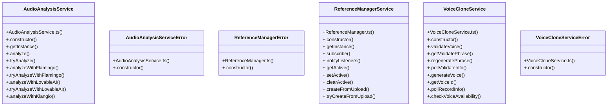

# Audio Context Management

> 118 nodes · cohesion 0.03

## Key Concepts

- [err](file:///D:/.MUSICVERSE/aimusicverse/supabase/functions/suno-voice-validate-info/index.ts#L52) (25 connections)
- [AudioAnalysisService](file:///D:/.MUSICVERSE/aimusicverse/src/services/unified-analysis/AudioAnalysisService.ts#L70) (22 connections)
- [ReferenceManagerService](file:///D:/.MUSICVERSE/aimusicverse/src/services/audio-reference/ReferenceManager.ts#L57) (22 connections)
- [ok](file:///D:/.MUSICVERSE/aimusicverse/tests/e2e/mobile-smoke.spec.ts#L210) (19 connections)
- [VoiceCloneService](file:///D:/.MUSICVERSE/aimusicverse/src/services/voice/VoiceCloneService.ts#L102) (16 connections)
- [.setActive()](file:///D:/.MUSICVERSE/aimusicverse/src/services/audio-reference/ReferenceManager.ts#L116) (15 connections)
- [.analyze()](file:///D:/.MUSICVERSE/aimusicverse/src/services/unified-analysis/AudioAnalysisService.ts#L89) (13 connections)
- [.routeToProviders()](file:///D:/.MUSICVERSE/aimusicverse/src/services/unified-analysis/AudioAnalysisService.ts#L471) (12 connections)
- [AudioDetailPanel.tsx](file:///D:/.MUSICVERSE/aimusicverse/src/components/cloud/AudioDetailPanel.tsx#L1) (11 connections)
- [NewStudioProjectPage.tsx](file:///D:/.MUSICVERSE/aimusicverse/src/pages/studio-v2/NewStudioProjectPage.tsx#L1) (11 connections)
- [.persistToDatabase()](file:///D:/.MUSICVERSE/aimusicverse/src/services/audio-reference/ReferenceManager.ts#L255) (11 connections)
- [PromptDJMidi.tsx](file:///D:/.MUSICVERSE/aimusicverse/src/components/prompt-dj/PromptDJMidi.tsx#L1) (9 connections)
- [VoiceCloneService.ts](file:///D:/.MUSICVERSE/aimusicverse/src/services/voice/VoiceCloneService.ts#L1) (9 connections)
- [.analyzeWithFlamingo()](file:///D:/.MUSICVERSE/aimusicverse/src/services/unified-analysis/AudioAnalysisService.ts#L149) (8 connections)
- [.analyzeWithKlangio()](file:///D:/.MUSICVERSE/aimusicverse/src/services/unified-analysis/AudioAnalysisService.ts#L287) (8 connections)
- [.analyzeWithLovableAI()](file:///D:/.MUSICVERSE/aimusicverse/src/services/unified-analysis/AudioAnalysisService.ts#L220) (8 connections)
- [.detectBPMLocal()](file:///D:/.MUSICVERSE/aimusicverse/src/services/unified-analysis/AudioAnalysisService.ts#L366) (8 connections)
- [.resolveAudioUrl()](file:///D:/.MUSICVERSE/aimusicverse/src/services/unified-analysis/AudioAnalysisService.ts#L397) (8 connections)
- [.getActive()](file:///D:/.MUSICVERSE/aimusicverse/src/services/audio-reference/ReferenceManager.ts#L90) (8 connections)
- [.updateAnalysis()](file:///D:/.MUSICVERSE/aimusicverse/src/services/audio-reference/ReferenceManager.ts#L557) (8 connections)
- [.createFromRecording()](file:///D:/.MUSICVERSE/aimusicverse/src/services/audio-reference/ReferenceManager.ts#L203) (7 connections)
- [.createFromUpload()](file:///D:/.MUSICVERSE/aimusicverse/src/services/audio-reference/ReferenceManager.ts#L156) (7 connections)
- [.getValidatePhrase()](file:///D:/.MUSICVERSE/aimusicverse/src/services/voice/VoiceCloneService.ts#L168) (7 connections)
- [.getVoiceId()](file:///D:/.MUSICVERSE/aimusicverse/src/services/voice/VoiceCloneService.ts#L344) (7 connections)
- [.handleError()](file:///D:/.MUSICVERSE/aimusicverse/src/services/voice/VoiceCloneService.ts#L595) (7 connections)
- *... and 93 more nodes in this community*

## Class Diagram

## Relationships

- No strong cross-community connections detected

## Source Files

- [D:\.MUSICVERSE\aimusicverse\src\components\analysis\AnalyzeButton.tsx](file:///D:/.MUSICVERSE/aimusicverse/src/components/analysis/AnalyzeButton.tsx)
- [D:\.MUSICVERSE\aimusicverse\src\components\cloud\AudioDetailPanel.tsx](file:///D:/.MUSICVERSE/aimusicverse/src/components/cloud/AudioDetailPanel.tsx)
- [D:\.MUSICVERSE\aimusicverse\src\components\prompt-dj\PromptDJMidi.tsx](file:///D:/.MUSICVERSE/aimusicverse/src/components/prompt-dj/PromptDJMidi.tsx)
- [D:\.MUSICVERSE\aimusicverse\src\pages\studio-v2\NewStudioProjectPage.tsx](file:///D:/.MUSICVERSE/aimusicverse/src/pages/studio-v2/NewStudioProjectPage.tsx)
- [D:\.MUSICVERSE\aimusicverse\src\services\audio-reference\ReferenceManager.ts](file:///D:/.MUSICVERSE/aimusicverse/src/services/audio-reference/ReferenceManager.ts)
- [D:\.MUSICVERSE\aimusicverse\src\services\audio-reference\cloud-audio.service.ts](file:///D:/.MUSICVERSE/aimusicverse/src/services/audio-reference/cloud-audio.service.ts)
- [D:\.MUSICVERSE\aimusicverse\src\services\unified-analysis\AudioAnalysisService.ts](file:///D:/.MUSICVERSE/aimusicverse/src/services/unified-analysis/AudioAnalysisService.ts)
- [D:\.MUSICVERSE\aimusicverse\src\services\voice\VoiceCloneService.ts](file:///D:/.MUSICVERSE/aimusicverse/src/services/voice/VoiceCloneService.ts)
- [D:\.MUSICVERSE\aimusicverse\supabase\functions\suno-voice-validate-info\index.ts](file:///D:/.MUSICVERSE/aimusicverse/supabase/functions/suno-voice-validate-info/index.ts)
- [D:\.MUSICVERSE\aimusicverse\tests\e2e\mobile-smoke.spec.ts](file:///D:/.MUSICVERSE/aimusicverse/tests/e2e/mobile-smoke.spec.ts)

## Audit Trail

- EXTRACTED: 332 (67%)
- INFERRED: 167 (33%)
- AMBIGUOUS: 0 (0%)

---

*Part of the graphify knowledge wiki. See [[index]] to navigate.*