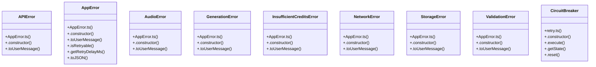

# Audio Context Management

> 121 nodes · cohesion 0.02

## Key Concepts

- [AudioCoverDialog.tsx](file:///D:/.MUSICVERSE/aimusicverse/src/components/AudioCoverDialog.tsx#L1) (26 connections)
- [AppError.ts](file:///D:/.MUSICVERSE/aimusicverse/src/lib/errors/AppError.ts#L1) (17 connections)
- [errorHandling.ts](file:///D:/.MUSICVERSE/aimusicverse/src/lib/errorHandling.ts#L1) (14 connections)
- [AddVocalsDrawer.tsx](file:///D:/.MUSICVERSE/aimusicverse/src/components/studio/unified/AddVocalsDrawer.tsx#L1) (13 connections)
- [errorReporting.ts](file:///D:/.MUSICVERSE/aimusicverse/src/lib/errorReporting.ts#L1) (13 connections)
- [toAppError()](file:///D:/.MUSICVERSE/aimusicverse/src/lib/errors/AppError.ts#L428) (11 connections)
- [reportError()](file:///D:/.MUSICVERSE/aimusicverse/src/lib/errorReporting.ts#L65) (11 connections)
- [retry.ts](file:///D:/.MUSICVERSE/aimusicverse/supabase/functions/telegram-bot/utils/retry.ts#L1) (8 connections)
- [retryWithBackoff()](file:///D:/.MUSICVERSE/aimusicverse/supabase/functions/telegram-bot/utils/retry.ts#L77) (8 connections)
- [handleSubmit()](file:///D:/.MUSICVERSE/aimusicverse/src/components/AudioCoverDialog.tsx#L177) (7 connections)
- [AppError](file:///D:/.MUSICVERSE/aimusicverse/src/lib/errors/AppError.ts#L138) (6 connections)
- [retry.ts](file:///D:/.MUSICVERSE/aimusicverse/src/lib/retry.ts#L1) (6 connections)
- [getEnhancedErrorInfo()](file:///D:/.MUSICVERSE/aimusicverse/src/lib/errorHandling.ts#L242) (6 connections)
- [displayError()](file:///D:/.MUSICVERSE/aimusicverse/src/lib/errorReporting.ts#L117) (6 connections)
- [tryCatch()](file:///D:/.MUSICVERSE/aimusicverse/src/lib/errors/AppError.ts#L402) (5 connections)
- [tryCatchSync()](file:///D:/.MUSICVERSE/aimusicverse/src/lib/errors/AppError.ts#L416) (5 connections)
- [showErrorWithRecovery()](file:///D:/.MUSICVERSE/aimusicverse/src/lib/errorHandling.ts#L571) (5 connections)
- [CircuitBreaker](file:///D:/.MUSICVERSE/aimusicverse/supabase/functions/telegram-bot/utils/retry.ts#L226) (5 connections)
- [.isRetryable()](file:///D:/.MUSICVERSE/aimusicverse/src/lib/errors/AppError.ts#L175) (4 connections)
- [.toUserMessage()](file:///D:/.MUSICVERSE/aimusicverse/src/lib/errors/AppError.ts#L363) (4 connections)
- [getRecoveryAction()](file:///D:/.MUSICVERSE/aimusicverse/src/lib/errorHandling.ts#L364) (4 connections)
- [isRetriableError()](file:///D:/.MUSICVERSE/aimusicverse/src/lib/errorHandling.ts#L308) (4 connections)
- [validatePromptForGeneration()](file:///D:/.MUSICVERSE/aimusicverse/src/lib/errorHandling.ts#L549) (4 connections)
- [shouldReport()](file:///D:/.MUSICVERSE/aimusicverse/src/lib/errorReporting.ts#L54) (4 connections)
- [retryFetch()](file:///D:/.MUSICVERSE/aimusicverse/supabase/functions/telegram-bot/utils/retry.ts#L139) (4 connections)
- *... and 96 more nodes in this community*

## Class Diagram

## Relationships

- [[User Achievements]] (1 shared connections)

## Source Files

- [D:\.MUSICVERSE\aimusicverse\src\components\AudioCoverDialog.tsx](file:///D:/.MUSICVERSE/aimusicverse/src/components/AudioCoverDialog.tsx)
- [D:\.MUSICVERSE\aimusicverse\src\components\studio\unified\AddVocalsDrawer.tsx](file:///D:/.MUSICVERSE/aimusicverse/src/components/studio/unified/AddVocalsDrawer.tsx)
- [D:\.MUSICVERSE\aimusicverse\src\lib\errorHandling.ts](file:///D:/.MUSICVERSE/aimusicverse/src/lib/errorHandling.ts)
- [D:\.MUSICVERSE\aimusicverse\src\lib\errorReporting.ts](file:///D:/.MUSICVERSE/aimusicverse/src/lib/errorReporting.ts)
- [D:\.MUSICVERSE\aimusicverse\src\lib\errors\AppError.ts](file:///D:/.MUSICVERSE/aimusicverse/src/lib/errors/AppError.ts)
- [D:\.MUSICVERSE\aimusicverse\src\lib\errors\useErrorRecovery.ts](file:///D:/.MUSICVERSE/aimusicverse/src/lib/errors/useErrorRecovery.ts)
- [D:\.MUSICVERSE\aimusicverse\src\lib\retry.ts](file:///D:/.MUSICVERSE/aimusicverse/src/lib/retry.ts)
- [D:\.MUSICVERSE\aimusicverse\supabase\functions\telegram-bot\utils\retry.ts](file:///D:/.MUSICVERSE/aimusicverse/supabase/functions/telegram-bot/utils/retry.ts)

## Audit Trail

- EXTRACTED: 290 (85%)
- INFERRED: 51 (15%)
- AMBIGUOUS: 0 (0%)

---

*Part of the graphify knowledge wiki. See [[index]] to navigate.*