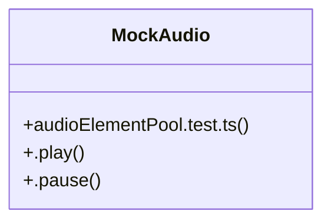

# Audio Context Management

> 93 nodes · cohesion 0.02

## Key Concepts

- [App.tsx](file:///D:/.MUSICVERSE/aimusicverse/src/App.tsx#L1) (71 connections)
- [audioElementPool.test.ts](file:///D:/.MUSICVERSE/aimusicverse/src/__tests__/audio/audioElementPool.test.ts#L1) (13 connections)
- [useReferrals.ts](file:///D:/.MUSICVERSE/aimusicverse/src/hooks/useReferrals.ts#L1) (6 connections)
- [useReferralStats()](file:///D:/.MUSICVERSE/aimusicverse/src/hooks/useReferrals.ts#L40) (4 connections)
- [MockAudio](file:///D:/.MUSICVERSE/aimusicverse/src/__tests__/audio/audioElementPool.test.ts#L26) (3 connections)
- [useReferralLink()](file:///D:/.MUSICVERSE/aimusicverse/src/hooks/useReferrals.ts#L206) (3 connections)
- [useReferralRewards()](file:///D:/.MUSICVERSE/aimusicverse/src/hooks/useReferrals.ts#L74) (3 connections)
- [Rewards](file:///D:/.MUSICVERSE/aimusicverse/src/App.tsx#L79) (2 connections)
- [stats](file:///D:/.MUSICVERSE/aimusicverse/src/__tests__/audio/audioElementPool.test.ts#L78) (2 connections)
- [useApplyReferralCode()](file:///D:/.MUSICVERSE/aimusicverse/src/hooks/useReferrals.ts#L112) (2 connections)
- [useShareReferral()](file:///D:/.MUSICVERSE/aimusicverse/src/hooks/useReferrals.ts#L218) (2 connections)
- [AdminAlerts](file:///D:/.MUSICVERSE/aimusicverse/src/App.tsx#L95) (1 connections)
- [AdminBot](file:///D:/.MUSICVERSE/aimusicverse/src/App.tsx#L92) (1 connections)
- [AdminBroadcast](file:///D:/.MUSICVERSE/aimusicverse/src/App.tsx#L94) (1 connections)
- [AdminDashboard](file:///D:/.MUSICVERSE/aimusicverse/src/App.tsx#L86) (1 connections)
- [AdminEconomy](file:///D:/.MUSICVERSE/aimusicverse/src/App.tsx#L89) (1 connections)
- [AdminFeedback](file:///D:/.MUSICVERSE/aimusicverse/src/App.tsx#L106) (1 connections)
- [AdminLayout](file:///D:/.MUSICVERSE/aimusicverse/src/App.tsx#L87) (1 connections)
- [AdminOverview](file:///D:/.MUSICVERSE/aimusicverse/src/App.tsx#L88) (1 connections)
- [AdminTariffs](file:///D:/.MUSICVERSE/aimusicverse/src/App.tsx#L99) (1 connections)
- [AdminTelegram](file:///D:/.MUSICVERSE/aimusicverse/src/App.tsx#L93) (1 connections)
- [AdminTracks](file:///D:/.MUSICVERSE/aimusicverse/src/App.tsx#L91) (1 connections)
- [AdminUsers](file:///D:/.MUSICVERSE/aimusicverse/src/App.tsx#L90) (1 connections)
- [AlbumView](file:///D:/.MUSICVERSE/aimusicverse/src/App.tsx#L153) (1 connections)
- [Analytics](file:///D:/.MUSICVERSE/aimusicverse/src/App.tsx#L85) (1 connections)
- *... and 68 more nodes in this community*

## Class Diagram

## Relationships

- No strong cross-community connections detected

## Source Files

- [D:\.MUSICVERSE\aimusicverse\src\App.tsx](file:///D:/.MUSICVERSE/aimusicverse/src/App.tsx)
- [D:\.MUSICVERSE\aimusicverse\src\__tests__\audio\audioElementPool.test.ts](file:///D:/.MUSICVERSE/aimusicverse/src/__tests__/audio/audioElementPool.test.ts)
- [D:\.MUSICVERSE\aimusicverse\src\hooks\useReferrals.ts](file:///D:/.MUSICVERSE/aimusicverse/src/hooks/useReferrals.ts)

## Audit Trail

- EXTRACTED: 186 (96%)
- INFERRED: 7 (4%)
- AMBIGUOUS: 0 (0%)

---

*Part of the graphify knowledge wiki. See [[index]] to navigate.*