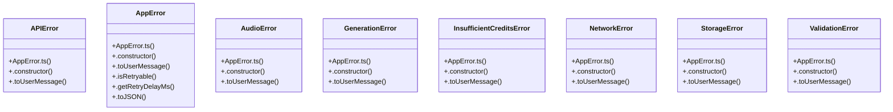

# Audio Context Management

> 154 nodes · cohesion 0.02

## Key Concepts

- [AudioCoverDialog.tsx](file:///D:/.MUSICVERSE/aimusicverse/src/components/AudioCoverDialog.tsx#L1) (29 connections)
- [AudioExtendDialog.tsx](file:///D:/.MUSICVERSE/aimusicverse/src/components/AudioExtendDialog.tsx#L1) (25 connections)
- [ExtendTrackDialog.tsx](file:///D:/.MUSICVERSE/aimusicverse/src/components/ExtendTrackDialog.tsx#L1) (19 connections)
- [AppError.ts](file:///D:/.MUSICVERSE/aimusicverse/src/lib/errors/AppError.ts#L1) (17 connections)
- [errorHandling.ts](file:///D:/.MUSICVERSE/aimusicverse/src/lib/errorHandling.ts#L1) (14 connections)
- [AddVocalsDrawer.tsx](file:///D:/.MUSICVERSE/aimusicverse/src/components/studio/unified/AddVocalsDrawer.tsx#L1) (13 connections)
- [AddVocalsDialog.tsx](file:///D:/.MUSICVERSE/aimusicverse/src/components/AddVocalsDialog.tsx#L1) (11 connections)
- [toAppError()](file:///D:/.MUSICVERSE/aimusicverse/src/lib/errors/AppError.ts#L569) (9 connections)
- [showGenerationError()](file:///D:/.MUSICVERSE/aimusicverse/src/lib/errorHandling.ts#L272) (9 connections)
- [handleSubmit()](file:///D:/.MUSICVERSE/aimusicverse/src/components/AudioCoverDialog.tsx#L189) (8 connections)
- [handleSubmit()](file:///D:/.MUSICVERSE/aimusicverse/src/components/AudioExtendDialog.tsx#L163) (7 connections)
- [handleSubmit()](file:///D:/.MUSICVERSE/aimusicverse/src/components/AddVocalsDialog.tsx#L44) (6 connections)
- [AppError](file:///D:/.MUSICVERSE/aimusicverse/src/lib/errors/AppError.ts#L253) (6 connections)
- [getEnhancedErrorInfo()](file:///D:/.MUSICVERSE/aimusicverse/src/lib/errorHandling.ts#L248) (6 connections)
- [validatePromptForGeneration()](file:///D:/.MUSICVERSE/aimusicverse/src/lib/errorHandling.ts#L782) (6 connections)
- [handleExtend()](file:///D:/.MUSICVERSE/aimusicverse/src/components/ExtendTrackDialog.tsx#L62) (5 connections)
- [handleSubmit()](file:///D:/.MUSICVERSE/aimusicverse/src/components/studio/unified/AddVocalsDrawer.tsx#L65) (4 connections)
- [tryCatch()](file:///D:/.MUSICVERSE/aimusicverse/src/lib/errors/AppError.ts#L545) (4 connections)
- [tryCatchSync()](file:///D:/.MUSICVERSE/aimusicverse/src/lib/errors/AppError.ts#L557) (4 connections)
- [isRetriableError()](file:///D:/.MUSICVERSE/aimusicverse/src/lib/errorHandling.ts#L312) (4 connections)
- [showErrorWithRecovery()](file:///D:/.MUSICVERSE/aimusicverse/src/lib/errorHandling.ts#L807) (4 connections)
- [APIError](file:///D:/.MUSICVERSE/aimusicverse/src/lib/errors/AppError.ts#L365) (3 connections)
- [.isRetryable()](file:///D:/.MUSICVERSE/aimusicverse/src/lib/errors/AppError.ts#L321) (3 connections)
- [AudioError](file:///D:/.MUSICVERSE/aimusicverse/src/lib/errors/AppError.ts#L427) (3 connections)
- [err()](file:///D:/.MUSICVERSE/aimusicverse/src/lib/errors/AppError.ts#L538) (3 connections)
- *... and 129 more nodes in this community*

## Class Diagram

## Relationships

- No strong cross-community connections detected

## Source Files

- [D:\.MUSICVERSE\aimusicverse\src\components\AddVocalsDialog.tsx](file:///D:/.MUSICVERSE/aimusicverse/src/components/AddVocalsDialog.tsx)
- [D:\.MUSICVERSE\aimusicverse\src\components\AudioCoverDialog.tsx](file:///D:/.MUSICVERSE/aimusicverse/src/components/AudioCoverDialog.tsx)
- [D:\.MUSICVERSE\aimusicverse\src\components\AudioExtendDialog.tsx](file:///D:/.MUSICVERSE/aimusicverse/src/components/AudioExtendDialog.tsx)
- [D:\.MUSICVERSE\aimusicverse\src\components\ExtendTrackDialog.tsx](file:///D:/.MUSICVERSE/aimusicverse/src/components/ExtendTrackDialog.tsx)
- [D:\.MUSICVERSE\aimusicverse\src\components\studio\unified\AddVocalsDrawer.tsx](file:///D:/.MUSICVERSE/aimusicverse/src/components/studio/unified/AddVocalsDrawer.tsx)
- [D:\.MUSICVERSE\aimusicverse\src\lib\errorHandling.ts](file:///D:/.MUSICVERSE/aimusicverse/src/lib/errorHandling.ts)
- [D:\.MUSICVERSE\aimusicverse\src\lib\errors\AppError.ts](file:///D:/.MUSICVERSE/aimusicverse/src/lib/errors/AppError.ts)

## Audit Trail

- EXTRACTED: 330 (86%)
- INFERRED: 53 (14%)
- AMBIGUOUS: 0 (0%)

---

*Part of the graphify knowledge wiki. See [[index]] to navigate.*