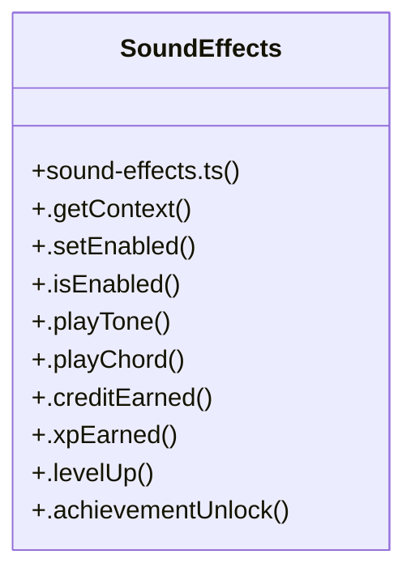

# Audio Context Management

> 101 nodes · cohesion 0.02

## Key Concepts

- [WaveformWithChords.tsx](file:///D:/.MUSICVERSE/aimusicverse/src/components/guitar/WaveformWithChords.tsx#L1) (33 connections)
- [SoundEffects](file:///D:/.MUSICVERSE/aimusicverse/src/lib/sound-effects.ts#L11) (19 connections)
- [.playTone()](file:///D:/.MUSICVERSE/aimusicverse/src/lib/sound-effects.ts#L35) (16 connections)
- [audioContextHelper.ts](file:///D:/.MUSICVERSE/aimusicverse/src/lib/audio/audioContextHelper.ts#L1) (9 connections)
- [useMobileAudioFallback.ts](file:///D:/.MUSICVERSE/aimusicverse/src/hooks/studio/useMobileAudioFallback.ts#L1) (7 connections)
- [createAudioContext()](file:///D:/.MUSICVERSE/aimusicverse/src/lib/audio/audioContextHelper.ts#L31) (6 connections)
- [useStudioOptimizations()](file:///D:/.MUSICVERSE/aimusicverse/src/hooks/studio/useStudioOptimizations.ts#L95) (6 connections)
- [generateWaveform()](file:///D:/.MUSICVERSE/aimusicverse/src/components/guitar/WaveformWithChords.tsx#L57) (6 connections)
- [safeCloseAudioContext()](file:///D:/.MUSICVERSE/aimusicverse/src/lib/audio/audioContextHelper.ts#L84) (5 connections)
- [useStudioAudioSetup()](file:///D:/.MUSICVERSE/aimusicverse/src/components/studio/unified/StudioShell/useStudioAudioSetup.ts#L34) (5 connections)
- [.getContext()](file:///D:/.MUSICVERSE/aimusicverse/src/lib/sound-effects.ts#L15) (4 connections)
- [detectAudioCapabilities()](file:///D:/.MUSICVERSE/aimusicverse/src/hooks/studio/useMobileAudioFallback.ts#L68) (4 connections)
- [useStudioAudioEngine()](file:///D:/.MUSICVERSE/aimusicverse/src/hooks/studio/useStudioAudioEngine.ts#L170) (4 connections)
- [useStudioMixer()](file:///D:/.MUSICVERSE/aimusicverse/src/hooks/studio/useStudioMixer.ts#L122) (4 connections)
- [getAudioContextClass()](file:///D:/.MUSICVERSE/aimusicverse/src/lib/audio/audioContextHelper.ts#L23) (3 connections)
- [.getAudioContext()](file:///D:/.MUSICVERSE/aimusicverse/src/lib/audio/AudioManager.ts#L330) (3 connections)
- [useDebouncedStemControls.ts](file:///D:/.MUSICVERSE/aimusicverse/src/hooks/studio/useDebouncedStemControls.ts#L1) (3 connections)
- [useMasterClock.ts](file:///D:/.MUSICVERSE/aimusicverse/src/hooks/studio/useMasterClock.ts#L1) (3 connections)
- [useStemAudioCache.ts](file:///D:/.MUSICVERSE/aimusicverse/src/hooks/studio/useStemAudioCache.ts#L1) (3 connections)
- [sound-effects.ts](file:///D:/.MUSICVERSE/aimusicverse/src/lib/sound-effects.ts#L1) (3 connections)
- [.isEnabled()](file:///D:/.MUSICVERSE/aimusicverse/src/lib/sound-effects.ts#L27) (3 connections)
- [useMobileAudioFallback()](file:///D:/.MUSICVERSE/aimusicverse/src/hooks/studio/useMobileAudioFallback.ts#L104) (3 connections)
- [useStudioEffectsEngine()](file:///D:/.MUSICVERSE/aimusicverse/src/hooks/studio/useStudioEffectsEngine.ts#L94) (3 connections)
- [closeStudioContext()](file:///D:/.MUSICVERSE/aimusicverse/src/lib/audio/audioContextHelper.ts#L100) (2 connections)
- [ensureAudioContextRunning()](file:///D:/.MUSICVERSE/aimusicverse/src/lib/audio/audioContextHelper.ts#L75) (2 connections)
- *... and 76 more nodes in this community*

## Class Diagram

## Relationships

- No strong cross-community connections detected

## Source Files

- [D:\.MUSICVERSE\aimusicverse\src\components\guitar\WaveformWithChords.tsx](file:///D:/.MUSICVERSE/aimusicverse/src/components/guitar/WaveformWithChords.tsx)
- [D:\.MUSICVERSE\aimusicverse\src\components\studio\unified\StudioShell\useStudioAudioSetup.ts](file:///D:/.MUSICVERSE/aimusicverse/src/components/studio/unified/StudioShell/useStudioAudioSetup.ts)
- [D:\.MUSICVERSE\aimusicverse\src\hooks\studio\useDebouncedStemControls.ts](file:///D:/.MUSICVERSE/aimusicverse/src/hooks/studio/useDebouncedStemControls.ts)
- [D:\.MUSICVERSE\aimusicverse\src\hooks\studio\useMasterClock.ts](file:///D:/.MUSICVERSE/aimusicverse/src/hooks/studio/useMasterClock.ts)
- [D:\.MUSICVERSE\aimusicverse\src\hooks\studio\useMobileAudioFallback.ts](file:///D:/.MUSICVERSE/aimusicverse/src/hooks/studio/useMobileAudioFallback.ts)
- [D:\.MUSICVERSE\aimusicverse\src\hooks\studio\useStemAudioCache.ts](file:///D:/.MUSICVERSE/aimusicverse/src/hooks/studio/useStemAudioCache.ts)
- [D:\.MUSICVERSE\aimusicverse\src\hooks\studio\useStudioAudioEngine.ts](file:///D:/.MUSICVERSE/aimusicverse/src/hooks/studio/useStudioAudioEngine.ts)
- [D:\.MUSICVERSE\aimusicverse\src\hooks\studio\useStudioEffectsEngine.ts](file:///D:/.MUSICVERSE/aimusicverse/src/hooks/studio/useStudioEffectsEngine.ts)
- [D:\.MUSICVERSE\aimusicverse\src\hooks\studio\useStudioMixer.ts](file:///D:/.MUSICVERSE/aimusicverse/src/hooks/studio/useStudioMixer.ts)
- [D:\.MUSICVERSE\aimusicverse\src\hooks\studio\useStudioOptimizations.ts](file:///D:/.MUSICVERSE/aimusicverse/src/hooks/studio/useStudioOptimizations.ts)
- [D:\.MUSICVERSE\aimusicverse\src\hooks\studio\useStudioPlayer.ts](file:///D:/.MUSICVERSE/aimusicverse/src/hooks/studio/useStudioPlayer.ts)
- [D:\.MUSICVERSE\aimusicverse\src\hooks\useOfflineStatus.ts](file:///D:/.MUSICVERSE/aimusicverse/src/hooks/useOfflineStatus.ts)
- [D:\.MUSICVERSE\aimusicverse\src\lib\audio\AudioManager.ts](file:///D:/.MUSICVERSE/aimusicverse/src/lib/audio/AudioManager.ts)
- [D:\.MUSICVERSE\aimusicverse\src\lib\audio\audioContextHelper.ts](file:///D:/.MUSICVERSE/aimusicverse/src/lib/audio/audioContextHelper.ts)
- [D:\.MUSICVERSE\aimusicverse\src\lib\sound-effects.ts](file:///D:/.MUSICVERSE/aimusicverse/src/lib/sound-effects.ts)

## Audit Trail

- EXTRACTED: 210 (82%)
- INFERRED: 47 (18%)
- AMBIGUOUS: 0 (0%)

---

*Part of the graphify knowledge wiki. See [[index]] to navigate.*