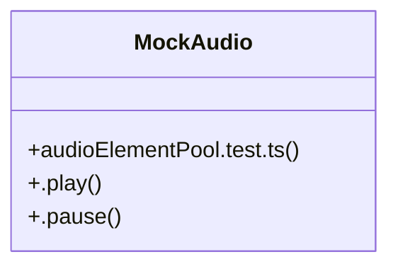

# Audio Effects

> 16 nodes · cohesion 0.12

## Key Concepts

- [audioElementPool.test.ts](file:///D:/.MUSICVERSE/aimusicverse/src/__tests__/audio/audioElementPool.test.ts#L1) (13 connections)
- [MockAudio](file:///D:/.MUSICVERSE/aimusicverse/src/__tests__/audio/audioElementPool.test.ts#L26) (3 connections)
- [a](file:///D:/.MUSICVERSE/aimusicverse/src/__tests__/audio/audioElementPool.test.ts#L68) (1 connections)
- [active](file:///D:/.MUSICVERSE/aimusicverse/src/__tests__/audio/audioElementPool.test.ts#L230) (1 connections)
- [b](file:///D:/.MUSICVERSE/aimusicverse/src/__tests__/audio/audioElementPool.test.ts#L69) (1 connections)
- [customPool](file:///D:/.MUSICVERSE/aimusicverse/src/__tests__/audio/audioElementPool.test.ts#L77) (1 connections)
- [defaultPool](file:///D:/.MUSICVERSE/aimusicverse/src/__tests__/audio/audioElementPool.test.ts#L89) (1 connections)
- [el](file:///D:/.MUSICVERSE/aimusicverse/src/__tests__/audio/audioElementPool.test.ts#L97) (1 connections)
- [el1](file:///D:/.MUSICVERSE/aimusicverse/src/__tests__/audio/audioElementPool.test.ts#L103) (1 connections)
- [el2](file:///D:/.MUSICVERSE/aimusicverse/src/__tests__/audio/audioElementPool.test.ts#L104) (1 connections)
- [i](file:///D:/.MUSICVERSE/aimusicverse/src/__tests__/audio/audioElementPool.test.ts#L110) (1 connections)
- [.pause()](file:///D:/.MUSICVERSE/aimusicverse/src/__tests__/audio/audioElementPool.test.ts#L42) (1 connections)
- [.play()](file:///D:/.MUSICVERSE/aimusicverse/src/__tests__/audio/audioElementPool.test.ts#L38) (1 connections)
- [pool](file:///D:/.MUSICVERSE/aimusicverse/src/__tests__/audio/audioElementPool.test.ts#L51) (1 connections)
- [same](file:///D:/.MUSICVERSE/aimusicverse/src/__tests__/audio/audioElementPool.test.ts#L82) (1 connections)
- [stats](file:///D:/.MUSICVERSE/aimusicverse/src/__tests__/audio/audioElementPool.test.ts#L78) (1 connections)

## Class Diagram

## Relationships

- No strong cross-community connections detected

## Source Files

- [D:\.MUSICVERSE\aimusicverse\src\__tests__\audio\audioElementPool.test.ts](file:///D:/.MUSICVERSE/aimusicverse/src/__tests__/audio/audioElementPool.test.ts)

## Audit Trail

- EXTRACTED: 30 (100%)
- INFERRED: 0 (0%)
- AMBIGUOUS: 0 (0%)

---

*Part of the graphify knowledge wiki. See [[index]] to navigate.*