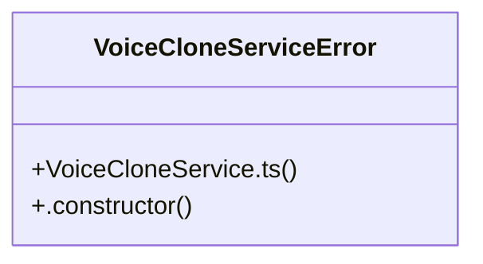

# Beat Evaluation

> 10 nodes · cohesion 0.22

## Key Concepts

- [VoiceCloneService.ts](file:///D:/.MUSICVERSE/aimusicverse/src/services/voice/VoiceCloneService.ts#L1) (9 connections)
- [getAudioDuration()](file:///D:/.MUSICVERSE/aimusicverse/src/services/voice/VoiceCloneService.ts#L718) (2 connections)
- [validateVoiceQuality()](file:///D:/.MUSICVERSE/aimusicverse/src/services/voice/VoiceCloneService.ts#L658) (2 connections)
- [VoiceCloneServiceError](file:///D:/.MUSICVERSE/aimusicverse/src/services/voice/VoiceCloneService.ts#L73) (2 connections)
- [createVoiceCloneService()](file:///D:/.MUSICVERSE/aimusicverse/src/services/voice/VoiceCloneService.ts#L644) (1 connections)
- [DEFAULT_CONFIG](file:///D:/.MUSICVERSE/aimusicverse/src/services/voice/VoiceCloneService.ts#L52) (1 connections)
- [ENDPOINTS](file:///D:/.MUSICVERSE/aimusicverse/src/services/voice/VoiceCloneService.ts#L60) (1 connections)
- [getRecommendedSegmentTimes()](file:///D:/.MUSICVERSE/aimusicverse/src/services/voice/VoiceCloneService.ts#L738) (1 connections)
- [__resultInternals](file:///D:/.MUSICVERSE/aimusicverse/src/services/voice/VoiceCloneService.ts#L766) (1 connections)
- [.constructor()](file:///D:/.MUSICVERSE/aimusicverse/src/services/voice/VoiceCloneService.ts#L80) (1 connections)

## Class Diagram

## Relationships

- No strong cross-community connections detected

## Source Files

- [D:\.MUSICVERSE\aimusicverse\src\services\voice\VoiceCloneService.ts](file:///D:/.MUSICVERSE/aimusicverse/src/services/voice/VoiceCloneService.ts)

## Audit Trail

- EXTRACTED: 21 (100%)
- INFERRED: 0 (0%)
- AMBIGUOUS: 0 (0%)

---

*Part of the graphify knowledge wiki. See [[index]] to navigate.*