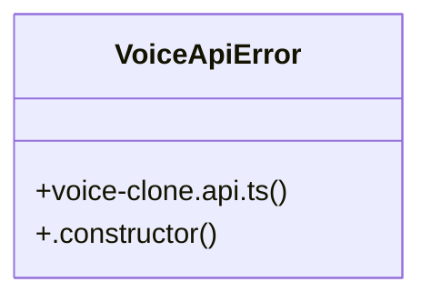

# Display Resolution

> 4 nodes · cohesion 0.50

## Key Concepts

- [voice-clone.api.ts](file:///D:/.MUSICVERSE/aimusicverse/src/api/voice-clone.api.ts#L1) (3 connections)
- [VoiceApiError](file:///D:/.MUSICVERSE/aimusicverse/src/api/voice-clone.api.ts#L6) (2 connections)
- [.constructor()](file:///D:/.MUSICVERSE/aimusicverse/src/api/voice-clone.api.ts#L8) (1 connections)
- [voiceCloneApi](file:///D:/.MUSICVERSE/aimusicverse/src/api/voice-clone.api.ts#L24) (1 connections)

## Class Diagram

## Relationships

- No strong cross-community connections detected

## Source Files

- [D:\.MUSICVERSE\aimusicverse\src\api\voice-clone.api.ts](file:///D:/.MUSICVERSE/aimusicverse/src/api/voice-clone.api.ts)

## Audit Trail

- EXTRACTED: 7 (100%)
- INFERRED: 0 (0%)
- AMBIGUOUS: 0 (0%)

---

*Part of the graphify knowledge wiki. See [[index]] to navigate.*