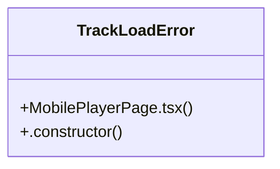

# File Upload

> 16 nodes · cohesion 0.14

## Key Concepts

- [MobilePlayerPage.tsx](file:///D:/.MUSICVERSE/aimusicverse/src/pages/MobilePlayerPage.tsx#L1) (14 connections)
- [navigate](file:///D:/.MUSICVERSE/aimusicverse/src/pages/MobilePlayerPage.tsx#L43) (3 connections)
- [handleBack()](file:///D:/.MUSICVERSE/aimusicverse/src/pages/MobilePlayerPage.tsx#L193) (2 connections)
- [handleCloseFullscreen()](file:///D:/.MUSICVERSE/aimusicverse/src/pages/MobilePlayerPage.tsx#L199) (2 connections)
- [TrackLoadError](file:///D:/.MUSICVERSE/aimusicverse/src/pages/MobilePlayerPage.tsx#L29) (2 connections)
- [currentMode](file:///D:/.MUSICVERSE/aimusicverse/src/pages/MobilePlayerPage.tsx#L185) (1 connections)
- [{
    data: track,
    isLoading,
    error,
  }](file:///D:/.MUSICVERSE/aimusicverse/src/pages/MobilePlayerPage.tsx#L48) (1 connections)
- [description](file:///D:/.MUSICVERSE/aimusicverse/src/pages/MobilePlayerPage.tsx#L240) (1 connections)
- [[hasStartedPlayback, setHasStartedPlayback]](file:///D:/.MUSICVERSE/aimusicverse/src/pages/MobilePlayerPage.tsx#L45) (1 connections)
- [{ playTrack, setPlayerMode }](file:///D:/.MUSICVERSE/aimusicverse/src/pages/MobilePlayerPage.tsx#L44) (1 connections)
- [reason](file:///D:/.MUSICVERSE/aimusicverse/src/pages/MobilePlayerPage.tsx#L231) (1 connections)
- [timer](file:///D:/.MUSICVERSE/aimusicverse/src/pages/MobilePlayerPage.tsx#L170) (1 connections)
- [title](file:///D:/.MUSICVERSE/aimusicverse/src/pages/MobilePlayerPage.tsx#L232) (1 connections)
- [{ trackId }](file:///D:/.MUSICVERSE/aimusicverse/src/pages/MobilePlayerPage.tsx#L42) (1 connections)
- [.constructor()](file:///D:/.MUSICVERSE/aimusicverse/src/pages/MobilePlayerPage.tsx#L33) (1 connections)
- [UUID_RE](file:///D:/.MUSICVERSE/aimusicverse/src/pages/MobilePlayerPage.tsx#L25) (1 connections)

## Class Diagram

## Relationships

- No strong cross-community connections detected

## Source Files

- [D:\.MUSICVERSE\aimusicverse\src\pages\MobilePlayerPage.tsx](file:///D:/.MUSICVERSE/aimusicverse/src/pages/MobilePlayerPage.tsx)

## Audit Trail

- EXTRACTED: 34 (100%)
- INFERRED: 0 (0%)
- AMBIGUOUS: 0 (0%)

---

*Part of the graphify knowledge wiki. See [[index]] to navigate.*