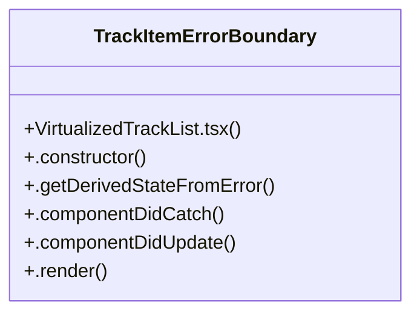

# Grid Interaction

> 33 nodes · cohesion 0.06

## Key Concepts

- [VirtualizedTrackList.tsx](file:///D:/.MUSICVERSE/aimusicverse/src/components/library/VirtualizedTrackList.tsx#L1) (27 connections)
- [TrackItemErrorBoundary](file:///D:/.MUSICVERSE/aimusicverse/src/components/library/VirtualizedTrackList.tsx#L17) (6 connections)
- [.componentDidCatch()](file:///D:/.MUSICVERSE/aimusicverse/src/components/library/VirtualizedTrackList.tsx#L30) (2 connections)
- [canPull](file:///D:/.MUSICVERSE/aimusicverse/src/components/library/VirtualizedTrackList.tsx#L249) (1 connections)
- [computeItemKey](file:///D:/.MUSICVERSE/aimusicverse/src/components/library/VirtualizedTrackList.tsx#L335) (1 connections)
- [containerRef](file:///D:/.MUSICVERSE/aimusicverse/src/components/library/VirtualizedTrackList.tsx#L241) (1 connections)
- [GridContainer](file:///D:/.MUSICVERSE/aimusicverse/src/components/library/VirtualizedTrackList.tsx#L83) (1 connections)
- [GridItemWrapper](file:///D:/.MUSICVERSE/aimusicverse/src/components/library/VirtualizedTrackList.tsx#L98) (1 connections)
- [handleGridEndReached](file:///D:/.MUSICVERSE/aimusicverse/src/components/library/VirtualizedTrackList.tsx#L403) (1 connections)
- [handleScroll()](file:///D:/.MUSICVERSE/aimusicverse/src/components/library/VirtualizedTrackList.tsx#L322) (1 connections)
- [handleTouchEnd](file:///D:/.MUSICVERSE/aimusicverse/src/components/library/VirtualizedTrackList.tsx#L294) (1 connections)
- [handleTouchMove](file:///D:/.MUSICVERSE/aimusicverse/src/components/library/VirtualizedTrackList.tsx#L272) (1 connections)
- [handleTouchStart](file:///D:/.MUSICVERSE/aimusicverse/src/components/library/VirtualizedTrackList.tsx#L259) (1 connections)
- [increaseViewportBy](file:///D:/.MUSICVERSE/aimusicverse/src/components/library/VirtualizedTrackList.tsx#L256) (1 connections)
- [[isPulling, setIsPulling]](file:///D:/.MUSICVERSE/aimusicverse/src/components/library/VirtualizedTrackList.tsx#L246) (1 connections)
- [isReady](file:///D:/.MUSICVERSE/aimusicverse/src/components/library/VirtualizedTrackList.tsx#L166) (1 connections)
- [[isRefreshing, setIsRefreshing]](file:///D:/.MUSICVERSE/aimusicverse/src/components/library/VirtualizedTrackList.tsx#L245) (1 connections)
- [loadingRef](file:///D:/.MUSICVERSE/aimusicverse/src/components/library/VirtualizedTrackList.tsx#L240) (1 connections)
- [log](file:///D:/.MUSICVERSE/aimusicverse/src/components/library/VirtualizedTrackList.tsx#L14) (1 connections)
- [MAX_PULL](file:///D:/.MUSICVERSE/aimusicverse/src/components/library/VirtualizedTrackList.tsx#L253) (1 connections)
- [observer](file:///D:/.MUSICVERSE/aimusicverse/src/components/library/VirtualizedTrackList.tsx#L379) (1 connections)
- [progress](file:///D:/.MUSICVERSE/aimusicverse/src/components/library/VirtualizedTrackList.tsx#L165) (1 connections)
- [PULL_THRESHOLD](file:///D:/.MUSICVERSE/aimusicverse/src/components/library/VirtualizedTrackList.tsx#L252) (1 connections)
- [[pullDistance, setPullDistance]](file:///D:/.MUSICVERSE/aimusicverse/src/components/library/VirtualizedTrackList.tsx#L244) (1 connections)
- [renderTrackItem](file:///D:/.MUSICVERSE/aimusicverse/src/components/library/VirtualizedTrackList.tsx#L337) (1 connections)
- *... and 8 more nodes in this community*

## Class Diagram

## Relationships

- No strong cross-community connections detected

## Source Files

- [D:\.MUSICVERSE\aimusicverse\src\components\library\VirtualizedTrackList.tsx](file:///D:/.MUSICVERSE/aimusicverse/src/components/library/VirtualizedTrackList.tsx)

## Audit Trail

- EXTRACTED: 64 (98%)
- INFERRED: 1 (2%)
- AMBIGUOUS: 0 (0%)

---

*Part of the graphify knowledge wiki. See [[index]] to navigate.*