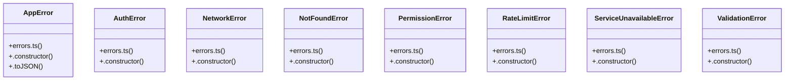

# LED Display Control

> 21 nodes · cohesion 0.11

## Key Concepts

- [errors.ts](file:///D:/.MUSICVERSE/aimusicverse/src/lib/errors.ts#L1) (11 connections)
- [logError()](file:///D:/.MUSICVERSE/aimusicverse/src/lib/errors.ts#L140) (5 connections)
- [AppError](file:///D:/.MUSICVERSE/aimusicverse/src/lib/errors.ts#L8) (3 connections)
- [isAppError()](file:///D:/.MUSICVERSE/aimusicverse/src/lib/errors.ts#L99) (3 connections)
- [.toJSON()](file:///D:/.MUSICVERSE/aimusicverse/src/lib/errors.ts#L25) (2 connections)
- [AuthError](file:///D:/.MUSICVERSE/aimusicverse/src/lib/errors.ts#L53) (2 connections)
- [getUserErrorMessage()](file:///D:/.MUSICVERSE/aimusicverse/src/lib/errors.ts#L106) (2 connections)
- [NetworkError](file:///D:/.MUSICVERSE/aimusicverse/src/lib/errors.ts#L44) (2 connections)
- [NotFoundError](file:///D:/.MUSICVERSE/aimusicverse/src/lib/errors.ts#L60) (2 connections)
- [PermissionError](file:///D:/.MUSICVERSE/aimusicverse/src/lib/errors.ts#L67) (2 connections)
- [RateLimitError](file:///D:/.MUSICVERSE/aimusicverse/src/lib/errors.ts#L74) (2 connections)
- [ServiceUnavailableError](file:///D:/.MUSICVERSE/aimusicverse/src/lib/errors.ts#L83) (2 connections)
- [ValidationError](file:///D:/.MUSICVERSE/aimusicverse/src/lib/errors.ts#L37) (2 connections)
- [.constructor()](file:///D:/.MUSICVERSE/aimusicverse/src/lib/errors.ts#L9) (1 connections)
- [.constructor()](file:///D:/.MUSICVERSE/aimusicverse/src/lib/errors.ts#L54) (1 connections)
- [.constructor()](file:///D:/.MUSICVERSE/aimusicverse/src/lib/errors.ts#L45) (1 connections)
- [.constructor()](file:///D:/.MUSICVERSE/aimusicverse/src/lib/errors.ts#L61) (1 connections)
- [.constructor()](file:///D:/.MUSICVERSE/aimusicverse/src/lib/errors.ts#L68) (1 connections)
- [.constructor()](file:///D:/.MUSICVERSE/aimusicverse/src/lib/errors.ts#L75) (1 connections)
- [.constructor()](file:///D:/.MUSICVERSE/aimusicverse/src/lib/errors.ts#L84) (1 connections)
- [.constructor()](file:///D:/.MUSICVERSE/aimusicverse/src/lib/errors.ts#L38) (1 connections)

## Class Diagram

## Relationships

- No strong cross-community connections detected

## Source Files

- [D:\.MUSICVERSE\aimusicverse\src\lib\errors.ts](file:///D:/.MUSICVERSE/aimusicverse/src/lib/errors.ts)

## Audit Trail

- EXTRACTED: 46 (96%)
- INFERRED: 2 (4%)
- AMBIGUOUS: 0 (0%)

---

*Part of the graphify knowledge wiki. See [[index]] to navigate.*