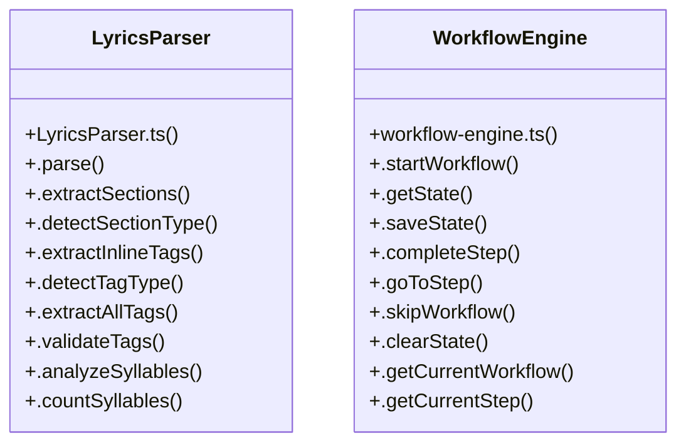

# Lyric Generation

> 423 nodes · cohesion 0.01

## Key Concepts

- [getItem()](file:///D:/.MUSICVERSE/aimusicverse/src/lib/cloudStorage.ts#L83) (59 connections)
- [setItem()](file:///D:/.MUSICVERSE/aimusicverse/src/lib/cloudStorage.ts#L39) (58 connections)
- [.parse()](file:///D:/.MUSICVERSE/aimusicverse/src/lib/lyrics/LyricsParser.ts#L97) (56 connections)
- [deeplink-tracker.ts](file:///D:/.MUSICVERSE/aimusicverse/src/lib/analytics/deeplink-tracker.ts#L1) (24 connections)
- [MainLayout.tsx](file:///D:/.MUSICVERSE/aimusicverse/src/components/MainLayout.tsx#L1) (23 connections)
- [LyricsParser](file:///D:/.MUSICVERSE/aimusicverse/src/lib/lyrics/LyricsParser.ts#L93) (23 connections)
- [removeItem()](file:///D:/.MUSICVERSE/aimusicverse/src/lib/cloudStorage.ts#L182) (19 connections)
- [GamificationOnboarding.tsx](file:///D:/.MUSICVERSE/aimusicverse/src/components/gamification/GamificationOnboarding.tsx#L1) (18 connections)
- [trackConversionStage()](file:///D:/.MUSICVERSE/aimusicverse/src/lib/analytics/deeplink-tracker.ts#L306) (16 connections)
- [QueueSheet.tsx](file:///D:/.MUSICVERSE/aimusicverse/src/components/player/QueueSheet.tsx#L1) (15 connections)
- [index.ts](file:///D:/.MUSICVERSE/aimusicverse/src/lib/ab-testing/index.ts#L1) (15 connections)
- [PaymentFail.tsx](file:///D:/.MUSICVERSE/aimusicverse/src/pages/payments/PaymentFail.tsx#L1) (15 connections)
- [trackDeeplinkVisit()](file:///D:/.MUSICVERSE/aimusicverse/src/lib/analytics/deeplink-tracker.ts#L477) (14 connections)
- [ContinueDraftCard.tsx](file:///D:/.MUSICVERSE/aimusicverse/src/components/home/ContinueDraftCard.tsx#L1) (12 connections)
- [WorkflowEngine](file:///D:/.MUSICVERSE/aimusicverse/src/lib/workflow-engine.ts#L234) (12 connections)
- [cloudStorage.ts](file:///D:/.MUSICVERSE/aimusicverse/src/lib/cloudStorage.ts#L1) (11 connections)
- [session.service.ts](file:///D:/.MUSICVERSE/aimusicverse/src/services/analytics/session.service.ts#L1) (11 connections)
- [.getState()](file:///D:/.MUSICVERSE/aimusicverse/src/lib/workflow-engine.ts#L257) (11 connections)
- [HintRegistry.tsx](file:///D:/.MUSICVERSE/aimusicverse/src/components/hints/HintRegistry.tsx#L1) (10 connections)
- [ProfileSetupOnboarding.tsx](file:///D:/.MUSICVERSE/aimusicverse/src/components/onboarding/ProfileSetupOnboarding.tsx#L1) (10 connections)
- [ProactiveUpsellBanner.tsx](file:///D:/.MUSICVERSE/aimusicverse/src/components/premium/ProactiveUpsellBanner.tsx#L1) (10 connections)
- [FeatureHighlight.tsx](file:///D:/.MUSICVERSE/aimusicverse/src/components/onboarding/FeatureHighlight.tsx#L1) (9 connections)
- [AnnouncementContext.tsx](file:///D:/.MUSICVERSE/aimusicverse/src/contexts/AnnouncementContext.tsx#L1) (9 connections)
- [retention.service.ts](file:///D:/.MUSICVERSE/aimusicverse/src/services/analytics/retention.service.ts#L1) (9 connections)
- [initializeDeeplinkTracker()](file:///D:/.MUSICVERSE/aimusicverse/src/lib/analytics/deeplink-tracker.ts#L762) (9 connections)
- *... and 398 more nodes in this community*

## Class Diagram

## Relationships

- No strong cross-community connections detected

## Source Files

- [D:\.MUSICVERSE\aimusicverse\src\components\ErrorBoundary.tsx](file:///D:/.MUSICVERSE/aimusicverse/src/components/ErrorBoundary.tsx)
- [D:\.MUSICVERSE\aimusicverse\src\components\MainLayout.tsx](file:///D:/.MUSICVERSE/aimusicverse/src/components/MainLayout.tsx)
- [D:\.MUSICVERSE\aimusicverse\src\components\TrackDetailSheet.tsx](file:///D:/.MUSICVERSE/aimusicverse/src/components/TrackDetailSheet.tsx)
- [D:\.MUSICVERSE\aimusicverse\src\components\announcements\SubscriptionFeatureAnnouncement.tsx](file:///D:/.MUSICVERSE/aimusicverse/src/components/announcements/SubscriptionFeatureAnnouncement.tsx)
- [D:\.MUSICVERSE\aimusicverse\src\components\gamification\GamificationOnboarding.tsx](file:///D:/.MUSICVERSE/aimusicverse/src/components/gamification/GamificationOnboarding.tsx)
- [D:\.MUSICVERSE\aimusicverse\src\components\generate-form\PromptHistory.tsx](file:///D:/.MUSICVERSE/aimusicverse/src/components/generate-form/PromptHistory.tsx)
- [D:\.MUSICVERSE\aimusicverse\src\components\generate-form\inspirationPrompts.ts](file:///D:/.MUSICVERSE/aimusicverse/src/components/generate-form/inspirationPrompts.ts)
- [D:\.MUSICVERSE\aimusicverse\src\components\gestures\GestureSettingsPanel.tsx](file:///D:/.MUSICVERSE/aimusicverse/src/components/gestures/GestureSettingsPanel.tsx)
- [D:\.MUSICVERSE\aimusicverse\src\components\hints\HintRegistry.tsx](file:///D:/.MUSICVERSE/aimusicverse/src/components/hints/HintRegistry.tsx)
- [D:\.MUSICVERSE\aimusicverse\src\components\home\ContinueDraftCard.tsx](file:///D:/.MUSICVERSE/aimusicverse/src/components/home/ContinueDraftCard.tsx)
- [D:\.MUSICVERSE\aimusicverse\src\components\layout\SystemAnnouncement.tsx](file:///D:/.MUSICVERSE/aimusicverse/src/components/layout/SystemAnnouncement.tsx)
- [D:\.MUSICVERSE\aimusicverse\src\components\music-graph\GraphOnboarding.tsx](file:///D:/.MUSICVERSE/aimusicverse/src/components/music-graph/GraphOnboarding.tsx)
- [D:\.MUSICVERSE\aimusicverse\src\components\navigation\RecentlyUsedSection.tsx](file:///D:/.MUSICVERSE/aimusicverse/src/components/navigation/RecentlyUsedSection.tsx)
- [D:\.MUSICVERSE\aimusicverse\src\components\onboarding\FeatureHighlight.tsx](file:///D:/.MUSICVERSE/aimusicverse/src/components/onboarding/FeatureHighlight.tsx)
- [D:\.MUSICVERSE\aimusicverse\src\components\onboarding\ProfileSetupOnboarding.tsx](file:///D:/.MUSICVERSE/aimusicverse/src/components/onboarding/ProfileSetupOnboarding.tsx)
- [D:\.MUSICVERSE\aimusicverse\src\components\player\QueueSheet.tsx](file:///D:/.MUSICVERSE/aimusicverse/src/components/player/QueueSheet.tsx)
- [D:\.MUSICVERSE\aimusicverse\src\components\premium\ProactiveUpsellBanner.tsx](file:///D:/.MUSICVERSE/aimusicverse/src/components/premium/ProactiveUpsellBanner.tsx)
- [D:\.MUSICVERSE\aimusicverse\src\components\prompt-dj\PromptDJOnboarding.tsx](file:///D:/.MUSICVERSE/aimusicverse/src/components/prompt-dj/PromptDJOnboarding.tsx)
- [D:\.MUSICVERSE\aimusicverse\src\contexts\AnnouncementContext.tsx](file:///D:/.MUSICVERSE/aimusicverse/src/contexts/AnnouncementContext.tsx)
- [D:\.MUSICVERSE\aimusicverse\src\contexts\telegram\useTelegramInit.ts](file:///D:/.MUSICVERSE/aimusicverse/src/contexts/telegram/useTelegramInit.ts)

## Audit Trail

- EXTRACTED: 934 (68%)
- INFERRED: 449 (32%)
- AMBIGUOUS: 0 (0%)

---

*Part of the graphify knowledge wiki. See [[index]] to navigate.*