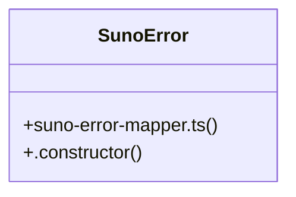

# Lyric Generation

> 601 nodes · cohesion 0.00

## Key Concepts

- [useAuth()](file:///D:/.MUSICVERSE/aimusicverse/src/contexts/AuthContext.tsx#L285) (118 connections)
- [InteractiveChordWheel.tsx](file:///D:/.MUSICVERSE/aimusicverse/src/components/guitar/InteractiveChordWheel.tsx#L1) (29 connections)
- [useHapticFeedback()](file:///D:/.MUSICVERSE/aimusicverse/src/lib/mobile-utils.ts#L355) (15 connections)
- [performance-utils.ts](file:///D:/.MUSICVERSE/aimusicverse/src/lib/performance-utils.ts#L1) (14 connections)
- [StatsWidget.tsx](file:///D:/.MUSICVERSE/aimusicverse/src/components/professional/StatsWidget.tsx#L1) (13 connections)
- [useGamification.ts](file:///D:/.MUSICVERSE/aimusicverse/src/hooks/useGamification.ts#L1) (10 connections)
- [useFeatureAccess()](file:///D:/.MUSICVERSE/aimusicverse/src/hooks/useFeatureAccess.ts#L74) (10 connections)
- [PersonalizedRecommendations.tsx](file:///D:/.MUSICVERSE/aimusicverse/src/components/discovery/PersonalizedRecommendations.tsx#L1) (9 connections)
- [MusicLab.tsx](file:///D:/.MUSICVERSE/aimusicverse/src/pages/MusicLab.tsx#L1) (9 connections)
- [useLibraryData()](file:///D:/.MUSICVERSE/aimusicverse/src/hooks/useLibraryData.ts#L29) (9 connections)
- [useProfile()](file:///D:/.MUSICVERSE/aimusicverse/src/hooks/useProfile.tsx#L36) (9 connections)
- [AILyricsWizard.tsx](file:///D:/.MUSICVERSE/aimusicverse/src/components/generate-form/AILyricsWizard.tsx#L1) (8 connections)
- [Sidebar.tsx](file:///D:/.MUSICVERSE/aimusicverse/src/components/Sidebar.tsx#L1) (8 connections)
- [useCredits.ts](file:///D:/.MUSICVERSE/aimusicverse/src/hooks/useCredits.ts#L1) (8 connections)
- [usePaywallTrigger.ts](file:///D:/.MUSICVERSE/aimusicverse/src/hooks/usePaywallTrigger.ts#L1) (8 connections)
- [usePromptHistorySync.ts](file:///D:/.MUSICVERSE/aimusicverse/src/hooks/usePromptHistorySync.ts#L1) (8 connections)
- [suno-error-mapper.ts](file:///D:/.MUSICVERSE/aimusicverse/src/lib/suno-error-mapper.ts#L1) (8 connections)
- [lyricsWizardStore.ts](file:///D:/.MUSICVERSE/aimusicverse/src/stores/lyricsWizardStore.ts#L1) (8 connections)
- [useGuestMode()](file:///D:/.MUSICVERSE/aimusicverse/src/contexts/GuestModeContext.tsx#L161) (8 connections)
- [useSubscriptionStatus()](file:///D:/.MUSICVERSE/aimusicverse/src/hooks/useSubscriptionStatus.ts#L25) (8 connections)
- [NotificationContext.tsx](file:///D:/.MUSICVERSE/aimusicverse/src/contexts/NotificationContext.tsx#L1) (7 connections)
- [useKeyboardShortcuts.ts](file:///D:/.MUSICVERSE/aimusicverse/src/hooks/useKeyboardShortcuts.ts#L1) (7 connections)
- [useNotificationHub()](file:///D:/.MUSICVERSE/aimusicverse/src/contexts/NotificationContext.tsx#L599) (7 connections)
- [usePaywallTrigger()](file:///D:/.MUSICVERSE/aimusicverse/src/hooks/usePaywallTrigger.ts#L62) (7 connections)
- [useTelegramBackButton()](file:///D:/.MUSICVERSE/aimusicverse/src/hooks/telegram/useTelegramBackButton.ts#L43) (7 connections)
- *... and 576 more nodes in this community*

## Class Diagram

## Relationships

- [[Timer Management]] (2 shared connections)

## Source Files

- [D:\.MUSICVERSE\aimusicverse\src\App.tsx](file:///D:/.MUSICVERSE/aimusicverse/src/App.tsx)
- [D:\.MUSICVERSE\aimusicverse\src\components\GlobalGenerationIndicator.tsx](file:///D:/.MUSICVERSE/aimusicverse/src/components/GlobalGenerationIndicator.tsx)
- [D:\.MUSICVERSE\aimusicverse\src\components\GuestModeBanner.tsx](file:///D:/.MUSICVERSE/aimusicverse/src/components/GuestModeBanner.tsx)
- [D:\.MUSICVERSE\aimusicverse\src\components\ShareSheet.tsx](file:///D:/.MUSICVERSE/aimusicverse/src/components/ShareSheet.tsx)
- [D:\.MUSICVERSE\aimusicverse\src\components\Sidebar.tsx](file:///D:/.MUSICVERSE/aimusicverse/src/components/Sidebar.tsx)
- [D:\.MUSICVERSE\aimusicverse\src\components\analytics\EngagementChart.tsx](file:///D:/.MUSICVERSE/aimusicverse/src/components/analytics/EngagementChart.tsx)
- [D:\.MUSICVERSE\aimusicverse\src\components\comments\CommentForm.tsx](file:///D:/.MUSICVERSE/aimusicverse/src/components/comments/CommentForm.tsx)
- [D:\.MUSICVERSE\aimusicverse\src\components\discovery\PersonalizedRecommendations.tsx](file:///D:/.MUSICVERSE/aimusicverse/src/components/discovery/PersonalizedRecommendations.tsx)
- [D:\.MUSICVERSE\aimusicverse\src\components\engagement\LikeButton.tsx](file:///D:/.MUSICVERSE/aimusicverse/src/components/engagement/LikeButton.tsx)
- [D:\.MUSICVERSE\aimusicverse\src\components\gamification\UserLevel.tsx](file:///D:/.MUSICVERSE/aimusicverse/src/components/gamification/UserLevel.tsx)
- [D:\.MUSICVERSE\aimusicverse\src\components\generate-form\AILyricsWizard.tsx](file:///D:/.MUSICVERSE/aimusicverse/src/components/generate-form/AILyricsWizard.tsx)
- [D:\.MUSICVERSE\aimusicverse\src\components\generate-form\GenerateFormReferences.tsx](file:///D:/.MUSICVERSE/aimusicverse/src/components/generate-form/GenerateFormReferences.tsx)
- [D:\.MUSICVERSE\aimusicverse\src\components\generate-form\lyrics-chat\useLyricsChat.ts](file:///D:/.MUSICVERSE/aimusicverse/src/components/generate-form/lyrics-chat/useLyricsChat.ts)
- [D:\.MUSICVERSE\aimusicverse\src\components\guitar\InteractiveChordWheel.tsx](file:///D:/.MUSICVERSE/aimusicverse/src/components/guitar/InteractiveChordWheel.tsx)
- [D:\.MUSICVERSE\aimusicverse\src\components\notifications\smart-alerts\SmartAlertProvider.tsx](file:///D:/.MUSICVERSE/aimusicverse/src/components/notifications/smart-alerts/SmartAlertProvider.tsx)
- [D:\.MUSICVERSE\aimusicverse\src\components\notifications\smart-alerts\useAntiSpam.ts](file:///D:/.MUSICVERSE/aimusicverse/src/components/notifications/smart-alerts/useAntiSpam.ts)
- [D:\.MUSICVERSE\aimusicverse\src\components\onboarding\QuickStartOverlay.tsx](file:///D:/.MUSICVERSE/aimusicverse/src/components/onboarding/QuickStartOverlay.tsx)
- [D:\.MUSICVERSE\aimusicverse\src\components\premium\FeatureGate.tsx](file:///D:/.MUSICVERSE/aimusicverse/src/components/premium/FeatureGate.tsx)
- [D:\.MUSICVERSE\aimusicverse\src\components\premium\PaywallProvider.tsx](file:///D:/.MUSICVERSE/aimusicverse/src/components/premium/PaywallProvider.tsx)
- [D:\.MUSICVERSE\aimusicverse\src\components\professional\StatsWidget.tsx](file:///D:/.MUSICVERSE/aimusicverse/src/components/professional/StatsWidget.tsx)

## Audit Trail

- EXTRACTED: 972 (66%)
- INFERRED: 504 (34%)
- AMBIGUOUS: 0 (0%)

---

*Part of the graphify knowledge wiki. See [[index]] to navigate.*