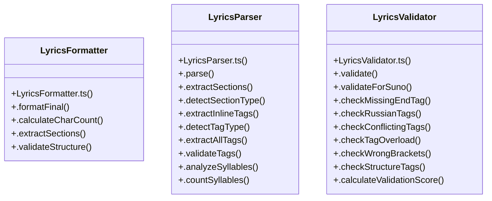

# Lyrics Processing

> 73 nodes · cohesion 0.04

## Key Concepts

- [LyricsParser](file:///D:/.MUSICVERSE/aimusicverse/src/lib/lyrics/LyricsParser.ts#L93) (23 connections)
- [LyricsValidator](file:///D:/.MUSICVERSE/aimusicverse/src/lib/lyrics/LyricsValidator.ts#L102) (17 connections)
- [LyricsValidationAlert.tsx](file:///D:/.MUSICVERSE/aimusicverse/src/components/lyrics-workspace/LyricsValidationAlert.tsx#L1) (10 connections)
- [LyricsParser.ts](file:///D:/.MUSICVERSE/aimusicverse/src/lib/lyrics/LyricsParser.ts#L1) (8 connections)
- [.validateForSuno()](file:///D:/.MUSICVERSE/aimusicverse/src/lib/lyrics/LyricsValidator.ts#L152) (8 connections)
- [.professionalAnalysis()](file:///D:/.MUSICVERSE/aimusicverse/src/lib/lyrics/LyricsParser.ts#L722) (7 connections)
- [LyricsValidator.ts](file:///D:/.MUSICVERSE/aimusicverse/src/lib/lyrics/LyricsValidator.ts#L1) (6 connections)
- [.extractInlineTags()](file:///D:/.MUSICVERSE/aimusicverse/src/lib/lyrics/LyricsParser.ts#L197) (6 connections)
- [LyricsFormatter.ts](file:///D:/.MUSICVERSE/aimusicverse/src/lib/lyrics/LyricsFormatter.ts#L1) (5 connections)
- [LyricsFormatter](file:///D:/.MUSICVERSE/aimusicverse/src/lib/lyrics/LyricsFormatter.ts#L90) (5 connections)
- [.validate()](file:///D:/.MUSICVERSE/aimusicverse/src/lib/lyrics/LyricsValidator.ts#L106) (5 connections)
- [.extractSections()](file:///D:/.MUSICVERSE/aimusicverse/src/lib/lyrics/LyricsParser.ts#L118) (4 connections)
- [handleAutoFix()](file:///D:/.MUSICVERSE/aimusicverse/src/components/lyrics-workspace/LyricsValidationAlert.tsx#L45) (4 connections)
- [.findInvalidSectionTags()](file:///D:/.MUSICVERSE/aimusicverse/src/lib/lyrics/LyricsValidator.ts#L409) (4 connections)
- [.analyzeSyllables()](file:///D:/.MUSICVERSE/aimusicverse/src/lib/lyrics/LyricsParser.ts#L415) (3 connections)
- [.detectRhymeScheme()](file:///D:/.MUSICVERSE/aimusicverse/src/lib/lyrics/LyricsParser.ts#L622) (3 connections)
- [.extractAllTags()](file:///D:/.MUSICVERSE/aimusicverse/src/lib/lyrics/LyricsParser.ts#L326) (3 connections)
- [.suggestStylePrompt()](file:///D:/.MUSICVERSE/aimusicverse/src/lib/lyrics/LyricsParser.ts#L806) (3 connections)
- [.validateStructure()](file:///D:/.MUSICVERSE/aimusicverse/src/lib/lyrics/LyricsParser.ts#L471) (3 connections)
- [.validateTags()](file:///D:/.MUSICVERSE/aimusicverse/src/lib/lyrics/LyricsParser.ts#L355) (3 connections)
- [isValidSectionTag()](file:///D:/.MUSICVERSE/aimusicverse/src/lib/lyrics/LyricsValidator.ts#L81) (3 connections)
- [.calculateValidationScore()](file:///D:/.MUSICVERSE/aimusicverse/src/lib/lyrics/LyricsValidator.ts#L348) (3 connections)
- [.validateTagInsertion()](file:///D:/.MUSICVERSE/aimusicverse/src/lib/lyrics/LyricsValidator.ts#L512) (3 connections)
- [.calculateCharCount()](file:///D:/.MUSICVERSE/aimusicverse/src/lib/lyrics/LyricsFormatter.ts#L164) (2 connections)
- [.formatFinal()](file:///D:/.MUSICVERSE/aimusicverse/src/lib/lyrics/LyricsFormatter.ts#L94) (2 connections)
- *... and 48 more nodes in this community*

## Class Diagram

## Relationships

- [[Timer Management]] (1 shared connections)

## Source Files

- [D:\.MUSICVERSE\aimusicverse\src\components\lyrics-workspace\LyricsValidationAlert.tsx](file:///D:/.MUSICVERSE/aimusicverse/src/components/lyrics-workspace/LyricsValidationAlert.tsx)
- [D:\.MUSICVERSE\aimusicverse\src\lib\lyrics\LyricsFormatter.ts](file:///D:/.MUSICVERSE/aimusicverse/src/lib/lyrics/LyricsFormatter.ts)
- [D:\.MUSICVERSE\aimusicverse\src\lib\lyrics\LyricsParser.ts](file:///D:/.MUSICVERSE/aimusicverse/src/lib/lyrics/LyricsParser.ts)
- [D:\.MUSICVERSE\aimusicverse\src\lib\lyrics\LyricsValidator.ts](file:///D:/.MUSICVERSE/aimusicverse/src/lib/lyrics/LyricsValidator.ts)

## Audit Trail

- EXTRACTED: 189 (90%)
- INFERRED: 20 (10%)
- AMBIGUOUS: 0 (0%)

---

*Part of the graphify knowledge wiki. See [[index]] to navigate.*