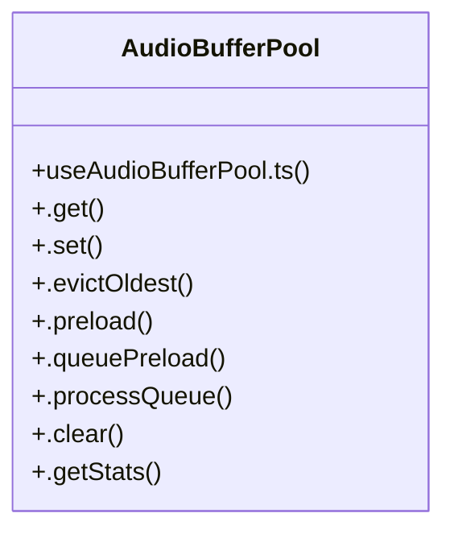

# Lyrics Processing

> 79 nodes · cohesion 0.03

## Key Concepts

- [imageOptimization.ts](file:///D:/.MUSICVERSE/aimusicverse/src/lib/imageOptimization.ts#L1) (20 connections)
- [performance.ts](file:///D:/.MUSICVERSE/aimusicverse/src/lib/performance.ts#L1) (18 connections)
- [route-preloader.ts](file:///D:/.MUSICVERSE/aimusicverse/src/lib/route-preloader.ts#L1) (10 connections)
- [AudioBufferPool](file:///D:/.MUSICVERSE/aimusicverse/src/hooks/useAudioBufferPool.ts#L32) (9 connections)
- [useAudioBufferPool.ts](file:///D:/.MUSICVERSE/aimusicverse/src/hooks/useAudioBufferPool.ts#L1) (7 connections)
- [usePromptDJEnhanced.ts](file:///D:/.MUSICVERSE/aimusicverse/src/hooks/usePromptDJEnhanced.ts#L1) (7 connections)
- [requestIdleCallback](file:///D:/.MUSICVERSE/aimusicverse/src/lib/performance.ts#L178) (6 connections)
- [.dispose()](file:///D:/.MUSICVERSE/aimusicverse/src/lib/audio/bufferPool.ts#L125) (5 connections)
- [.evictOldest()](file:///D:/.MUSICVERSE/aimusicverse/src/hooks/useAudioBufferPool.ts#L66) (4 connections)
- [.preload()](file:///D:/.MUSICVERSE/aimusicverse/src/hooks/useAudioBufferPool.ts#L87) (4 connections)
- [.set()](file:///D:/.MUSICVERSE/aimusicverse/src/hooks/useAudioBufferPool.ts#L47) (4 connections)
- [getOptimizedImageUrl()](file:///D:/.MUSICVERSE/aimusicverse/src/lib/imageOptimization.ts#L266) (3 connections)
- [processBatched()](file:///D:/.MUSICVERSE/aimusicverse/src/lib/performance.ts#L256) (3 connections)
- [.scheduleProcess()](file:///D:/.MUSICVERSE/aimusicverse/src/lib/audio/prefetchManager.ts#L137) (3 connections)
- [preloadCriticalRoutes()](file:///D:/.MUSICVERSE/aimusicverse/src/lib/route-preloader.ts#L120) (3 connections)
- [preloadRoute()](file:///D:/.MUSICVERSE/aimusicverse/src/lib/route-preloader.ts#L87) (3 connections)
- [processQueue()](file:///D:/.MUSICVERSE/aimusicverse/src/lib/route-preloader.ts#L48) (3 connections)
- [.get()](file:///D:/.MUSICVERSE/aimusicverse/src/hooks/useAudioBufferPool.ts#L38) (3 connections)
- [.processQueue()](file:///D:/.MUSICVERSE/aimusicverse/src/hooks/useAudioBufferPool.ts#L107) (3 connections)
- [.queuePreload()](file:///D:/.MUSICVERSE/aimusicverse/src/hooks/useAudioBufferPool.ts#L101) (3 connections)
- [useAudioBufferPool()](file:///D:/.MUSICVERSE/aimusicverse/src/hooks/useAudioBufferPool.ts#L162) (3 connections)
- [.clear()](file:///D:/.MUSICVERSE/aimusicverse/src/lib/audio/bufferPool.ts#L117) (2 connections)
- [.stopCleanupTimer()](file:///D:/.MUSICVERSE/aimusicverse/src/lib/audio/bufferPool.ts#L172) (2 connections)
- [usePredictiveGeneration.ts](file:///D:/.MUSICVERSE/aimusicverse/src/hooks/usePredictiveGeneration.ts#L1) (2 connections)
- [generateSrcSet()](file:///D:/.MUSICVERSE/aimusicverse/src/lib/imageOptimization.ts#L192) (2 connections)
- *... and 54 more nodes in this community*

## Class Diagram

## Relationships

- No strong cross-community connections detected

## Source Files

- [D:\.MUSICVERSE\aimusicverse\src\hooks\useAudioBufferPool.ts](file:///D:/.MUSICVERSE/aimusicverse/src/hooks/useAudioBufferPool.ts)
- [D:\.MUSICVERSE\aimusicverse\src\hooks\usePredictiveGeneration.ts](file:///D:/.MUSICVERSE/aimusicverse/src/hooks/usePredictiveGeneration.ts)
- [D:\.MUSICVERSE\aimusicverse\src\hooks\usePromptDJEnhanced.ts](file:///D:/.MUSICVERSE/aimusicverse/src/hooks/usePromptDJEnhanced.ts)
- [D:\.MUSICVERSE\aimusicverse\src\lib\audio\bufferPool.ts](file:///D:/.MUSICVERSE/aimusicverse/src/lib/audio/bufferPool.ts)
- [D:\.MUSICVERSE\aimusicverse\src\lib\audio\prefetchManager.ts](file:///D:/.MUSICVERSE/aimusicverse/src/lib/audio/prefetchManager.ts)
- [D:\.MUSICVERSE\aimusicverse\src\lib\imageOptimization.ts](file:///D:/.MUSICVERSE/aimusicverse/src/lib/imageOptimization.ts)
- [D:\.MUSICVERSE\aimusicverse\src\lib\performance.ts](file:///D:/.MUSICVERSE/aimusicverse/src/lib/performance.ts)
- [D:\.MUSICVERSE\aimusicverse\src\lib\route-preloader.ts](file:///D:/.MUSICVERSE/aimusicverse/src/lib/route-preloader.ts)

## Audit Trail

- EXTRACTED: 170 (85%)
- INFERRED: 30 (15%)
- AMBIGUOUS: 0 (0%)

---

*Part of the graphify knowledge wiki. See [[index]] to navigate.*