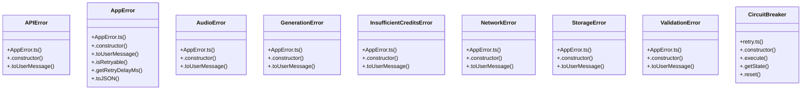

# Lyrics Processing

> 77 nodes · cohesion 0.03

## Key Concepts

- [AppError.ts](file:///D:/.MUSICVERSE/aimusicverse/src/lib/errors/AppError.ts#L1) (17 connections)
- [errorHandling.ts](file:///D:/.MUSICVERSE/aimusicverse/src/lib/errorHandling.ts#L1) (14 connections)
- [playerStore.test.ts](file:///D:/.MUSICVERSE/aimusicverse/src/__tests__/stores/playerStore.test.ts#L1) (11 connections)
- [toAppError()](file:///D:/.MUSICVERSE/aimusicverse/src/lib/errors/AppError.ts#L523) (9 connections)
- [retry.ts](file:///D:/.MUSICVERSE/aimusicverse/supabase/functions/telegram-bot/utils/retry.ts#L1) (8 connections)
- [retryWithBackoff()](file:///D:/.MUSICVERSE/aimusicverse/supabase/functions/telegram-bot/utils/retry.ts#L77) (7 connections)
- [AppError](file:///D:/.MUSICVERSE/aimusicverse/src/lib/errors/AppError.ts#L253) (6 connections)
- [retry.ts](file:///D:/.MUSICVERSE/aimusicverse/src/lib/retry.ts#L1) (6 connections)
- [getEnhancedErrorInfo()](file:///D:/.MUSICVERSE/aimusicverse/src/lib/errorHandling.ts#L248) (6 connections)
- [CircuitBreaker](file:///D:/.MUSICVERSE/aimusicverse/supabase/functions/telegram-bot/utils/retry.ts#L224) (5 connections)
- [tryCatch()](file:///D:/.MUSICVERSE/aimusicverse/src/lib/errors/AppError.ts#L499) (4 connections)
- [tryCatchSync()](file:///D:/.MUSICVERSE/aimusicverse/src/lib/errors/AppError.ts#L511) (4 connections)
- [isRetriableError()](file:///D:/.MUSICVERSE/aimusicverse/src/lib/errorHandling.ts#L312) (4 connections)
- [showErrorWithRecovery()](file:///D:/.MUSICVERSE/aimusicverse/src/lib/errorHandling.ts#L806) (4 connections)
- [retryFetch()](file:///D:/.MUSICVERSE/aimusicverse/supabase/functions/telegram-bot/utils/retry.ts#L133) (4 connections)
- [APIError](file:///D:/.MUSICVERSE/aimusicverse/src/lib/errors/AppError.ts#L334) (3 connections)
- [.isRetryable()](file:///D:/.MUSICVERSE/aimusicverse/src/lib/errors/AppError.ts#L290) (3 connections)
- [AudioError](file:///D:/.MUSICVERSE/aimusicverse/src/lib/errors/AppError.ts#L396) (3 connections)
- [err()](file:///D:/.MUSICVERSE/aimusicverse/src/lib/errors/AppError.ts#L492) (3 connections)
- [GenerationError](file:///D:/.MUSICVERSE/aimusicverse/src/lib/errors/AppError.ts#L418) (3 connections)
- [InsufficientCreditsError](file:///D:/.MUSICVERSE/aimusicverse/src/lib/errors/AppError.ts#L434) (3 connections)
- [NetworkError](file:///D:/.MUSICVERSE/aimusicverse/src/lib/errors/AppError.ts#L321) (3 connections)
- [ok()](file:///D:/.MUSICVERSE/aimusicverse/src/lib/errors/AppError.ts#L485) (3 connections)
- [StorageError](file:///D:/.MUSICVERSE/aimusicverse/src/lib/errors/AppError.ts#L457) (3 connections)
- [.toUserMessage()](file:///D:/.MUSICVERSE/aimusicverse/src/lib/errors/AppError.ts#L462) (3 connections)
- *... and 52 more nodes in this community*

## Class Diagram

## Relationships

- [[Creative Tools Development]] (1 shared connections)

## Source Files

- [D:\.MUSICVERSE\aimusicverse\src\__tests__\stores\playerStore.test.ts](file:///D:/.MUSICVERSE/aimusicverse/src/__tests__/stores/playerStore.test.ts)
- [D:\.MUSICVERSE\aimusicverse\src\lib\errorHandling.ts](file:///D:/.MUSICVERSE/aimusicverse/src/lib/errorHandling.ts)
- [D:\.MUSICVERSE\aimusicverse\src\lib\errors\AppError.ts](file:///D:/.MUSICVERSE/aimusicverse/src/lib/errors/AppError.ts)
- [D:\.MUSICVERSE\aimusicverse\src\lib\retry.ts](file:///D:/.MUSICVERSE/aimusicverse/src/lib/retry.ts)
- [D:\.MUSICVERSE\aimusicverse\supabase\functions\telegram-bot\utils\retry.ts](file:///D:/.MUSICVERSE/aimusicverse/supabase/functions/telegram-bot/utils/retry.ts)

## Audit Trail

- EXTRACTED: 185 (90%)
- INFERRED: 21 (10%)
- AMBIGUOUS: 0 (0%)

---

*Part of the graphify knowledge wiki. See [[index]] to navigate.*