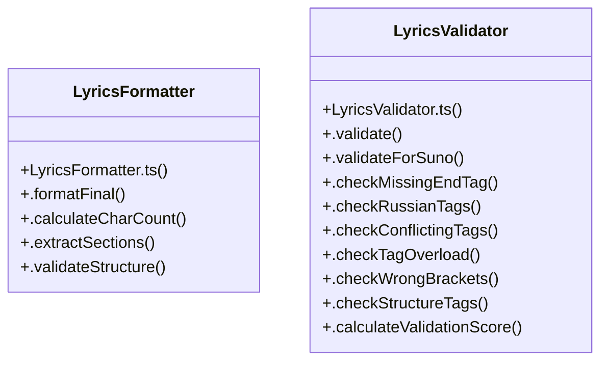

# Lyrics Synchronization

> 33 nodes · cohesion 0.09

## Key Concepts

- [LyricsValidator](file:///D:/.MUSICVERSE/aimusicverse/src/lib/lyrics/LyricsValidator.ts#L127) (17 connections)
- [.validateForSuno()](file:///D:/.MUSICVERSE/aimusicverse/src/lib/lyrics/LyricsValidator.ts#L177) (8 connections)
- [LyricsValidator.ts](file:///D:/.MUSICVERSE/aimusicverse/src/lib/lyrics/LyricsValidator.ts#L1) (6 connections)
- [LyricsFormatter.ts](file:///D:/.MUSICVERSE/aimusicverse/src/lib/lyrics/LyricsFormatter.ts#L1) (5 connections)
- [LyricsFormatter](file:///D:/.MUSICVERSE/aimusicverse/src/lib/lyrics/LyricsFormatter.ts#L101) (5 connections)
- [.validate()](file:///D:/.MUSICVERSE/aimusicverse/src/lib/lyrics/LyricsValidator.ts#L131) (5 connections)
- [.findInvalidSectionTags()](file:///D:/.MUSICVERSE/aimusicverse/src/lib/lyrics/LyricsValidator.ts#L439) (4 connections)
- [isValidSectionTag()](file:///D:/.MUSICVERSE/aimusicverse/src/lib/lyrics/LyricsValidator.ts#L110) (3 connections)
- [.validateTagInsertion()](file:///D:/.MUSICVERSE/aimusicverse/src/lib/lyrics/LyricsValidator.ts#L576) (3 connections)
- [.calculateCharCount()](file:///D:/.MUSICVERSE/aimusicverse/src/lib/lyrics/LyricsFormatter.ts#L169) (2 connections)
- [.formatFinal()](file:///D:/.MUSICVERSE/aimusicverse/src/lib/lyrics/LyricsFormatter.ts#L105) (2 connections)
- [sanitizeTag()](file:///D:/.MUSICVERSE/aimusicverse/src/lib/lyrics/LyricsFormatter.ts#L63) (2 connections)
- [wrapInBrackets()](file:///D:/.MUSICVERSE/aimusicverse/src/lib/lyrics/LyricsFormatter.ts#L82) (2 connections)
- [.autoFixIssues()](file:///D:/.MUSICVERSE/aimusicverse/src/lib/lyrics/LyricsValidator.ts#L401) (2 connections)
- [.calculateValidationScore()](file:///D:/.MUSICVERSE/aimusicverse/src/lib/lyrics/LyricsValidator.ts#L378) (2 connections)
- [.checkConflictingTags()](file:///D:/.MUSICVERSE/aimusicverse/src/lib/lyrics/LyricsValidator.ts#L271) (2 connections)
- [.checkMissingEndTag()](file:///D:/.MUSICVERSE/aimusicverse/src/lib/lyrics/LyricsValidator.ts#L219) (2 connections)
- [.checkRussianTags()](file:///D:/.MUSICVERSE/aimusicverse/src/lib/lyrics/LyricsValidator.ts#L236) (2 connections)
- [.checkSectionBalance()](file:///D:/.MUSICVERSE/aimusicverse/src/lib/lyrics/LyricsValidator.ts#L545) (2 connections)
- [.checkStructureTags()](file:///D:/.MUSICVERSE/aimusicverse/src/lib/lyrics/LyricsValidator.ts#L356) (2 connections)
- [.checkTagOverload()](file:///D:/.MUSICVERSE/aimusicverse/src/lib/lyrics/LyricsValidator.ts#L302) (2 connections)
- [.checkWrongBrackets()](file:///D:/.MUSICVERSE/aimusicverse/src/lib/lyrics/LyricsValidator.ts#L326) (2 connections)
- [.isDynamicTag()](file:///D:/.MUSICVERSE/aimusicverse/src/lib/lyrics/LyricsValidator.ts#L457) (2 connections)
- [normalizeSectionTag()](file:///D:/.MUSICVERSE/aimusicverse/src/lib/lyrics/LyricsValidator.ts#L118) (2 connections)
- [isValidBracketTag()](file:///D:/.MUSICVERSE/aimusicverse/src/lib/lyrics/LyricsFormatter.ts#L42) (1 connections)
- *... and 8 more nodes in this community*

## Class Diagram

## Relationships

- No strong cross-community connections detected

## Source Files

- [D:\.MUSICVERSE\aimusicverse\src\lib\lyrics\LyricsFormatter.ts](file:///D:/.MUSICVERSE/aimusicverse/src/lib/lyrics/LyricsFormatter.ts)
- [D:\.MUSICVERSE\aimusicverse\src\lib\lyrics\LyricsValidator.ts](file:///D:/.MUSICVERSE/aimusicverse/src/lib/lyrics/LyricsValidator.ts)

## Audit Trail

- EXTRACTED: 90 (95%)
- INFERRED: 5 (5%)
- AMBIGUOUS: 0 (0%)

---

*Part of the graphify knowledge wiki. See [[index]] to navigate.*