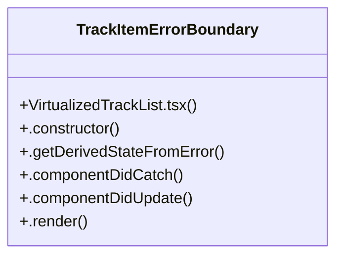

# Software Deployment

> 35 nodes · cohesion 0.06

## Key Concepts

- [VirtualizedTrackList.tsx](file:///D:/.MUSICVERSE/aimusicverse/src/components/library/VirtualizedTrackList.tsx#L1) (29 connections)
- [TrackItemErrorBoundary](file:///D:/.MUSICVERSE/aimusicverse/src/components/library/VirtualizedTrackList.tsx#L28) (6 connections)
- [.componentDidCatch()](file:///D:/.MUSICVERSE/aimusicverse/src/components/library/VirtualizedTrackList.tsx#L38) (2 connections)
- [canPull](file:///D:/.MUSICVERSE/aimusicverse/src/components/library/VirtualizedTrackList.tsx#L255) (1 connections)
- [computeItemKey](file:///D:/.MUSICVERSE/aimusicverse/src/components/library/VirtualizedTrackList.tsx#L349) (1 connections)
- [containerRef](file:///D:/.MUSICVERSE/aimusicverse/src/components/library/VirtualizedTrackList.tsx#L247) (1 connections)
- [gridComponents](file:///D:/.MUSICVERSE/aimusicverse/src/components/library/VirtualizedTrackList.tsx#L434) (1 connections)
- [GridContainer](file:///D:/.MUSICVERSE/aimusicverse/src/components/library/VirtualizedTrackList.tsx#L91) (1 connections)
- [GridFooter](file:///D:/.MUSICVERSE/aimusicverse/src/components/library/VirtualizedTrackList.tsx#L425) (1 connections)
- [GridItemWrapper](file:///D:/.MUSICVERSE/aimusicverse/src/components/library/VirtualizedTrackList.tsx#L106) (1 connections)
- [handleGridEndReached](file:///D:/.MUSICVERSE/aimusicverse/src/components/library/VirtualizedTrackList.tsx#L417) (1 connections)
- [handleScroll()](file:///D:/.MUSICVERSE/aimusicverse/src/components/library/VirtualizedTrackList.tsx#L336) (1 connections)
- [handleTouchEnd](file:///D:/.MUSICVERSE/aimusicverse/src/components/library/VirtualizedTrackList.tsx#L308) (1 connections)
- [handleTouchMove](file:///D:/.MUSICVERSE/aimusicverse/src/components/library/VirtualizedTrackList.tsx#L283) (1 connections)
- [handleTouchStart](file:///D:/.MUSICVERSE/aimusicverse/src/components/library/VirtualizedTrackList.tsx#L267) (1 connections)
- [increaseViewportBy](file:///D:/.MUSICVERSE/aimusicverse/src/components/library/VirtualizedTrackList.tsx#L264) (1 connections)
- [[isPulling, setIsPulling]](file:///D:/.MUSICVERSE/aimusicverse/src/components/library/VirtualizedTrackList.tsx#L252) (1 connections)
- [isReady](file:///D:/.MUSICVERSE/aimusicverse/src/components/library/VirtualizedTrackList.tsx#L176) (1 connections)
- [[isRefreshing, setIsRefreshing]](file:///D:/.MUSICVERSE/aimusicverse/src/components/library/VirtualizedTrackList.tsx#L251) (1 connections)
- [loadingRef](file:///D:/.MUSICVERSE/aimusicverse/src/components/library/VirtualizedTrackList.tsx#L246) (1 connections)
- [log](file:///D:/.MUSICVERSE/aimusicverse/src/components/library/VirtualizedTrackList.tsx#L25) (1 connections)
- [MAX_PULL](file:///D:/.MUSICVERSE/aimusicverse/src/components/library/VirtualizedTrackList.tsx#L259) (1 connections)
- [observer](file:///D:/.MUSICVERSE/aimusicverse/src/components/library/VirtualizedTrackList.tsx#L393) (1 connections)
- [progress](file:///D:/.MUSICVERSE/aimusicverse/src/components/library/VirtualizedTrackList.tsx#L175) (1 connections)
- [PULL_THRESHOLD](file:///D:/.MUSICVERSE/aimusicverse/src/components/library/VirtualizedTrackList.tsx#L258) (1 connections)
- *... and 10 more nodes in this community*

## Class Diagram

## Relationships

- No strong cross-community connections detected

## Source Files

- [D:\.MUSICVERSE\aimusicverse\src\components\library\VirtualizedTrackList.tsx](file:///D:/.MUSICVERSE/aimusicverse/src/components/library/VirtualizedTrackList.tsx)

## Audit Trail

- EXTRACTED: 68 (99%)
- INFERRED: 1 (1%)
- AMBIGUOUS: 0 (0%)

---

*Part of the graphify knowledge wiki. See [[index]] to navigate.*