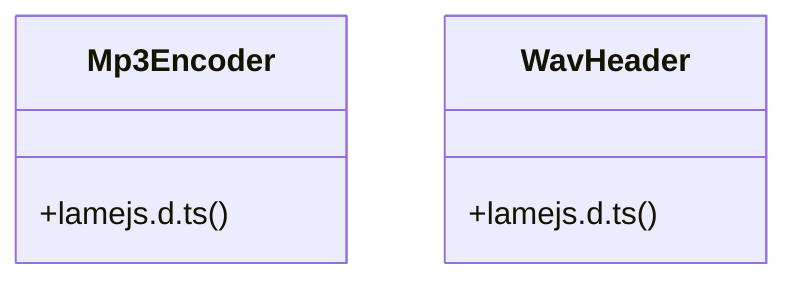

# UI Elements

> 4 nodes · cohesion 0.50

## Key Concepts

- [lamejs.d.ts](file:///D:/.MUSICVERSE/aimusicverse/src/types/lamejs.d.ts#L1) (3 connections)
- [lamejs](file:///D:/.MUSICVERSE/aimusicverse/src/types/lamejs.d.ts#L38) (1 connections)
- [Mp3Encoder](file:///D:/.MUSICVERSE/aimusicverse/src/types/lamejs.d.ts#L9) (1 connections)
- [WavHeader](file:///D:/.MUSICVERSE/aimusicverse/src/types/lamejs.d.ts#L27) (1 connections)

## Class Diagram

## Relationships

- No strong cross-community connections detected

## Source Files

- [D:\.MUSICVERSE\aimusicverse\src\types\lamejs.d.ts](file:///D:/.MUSICVERSE/aimusicverse/src/types/lamejs.d.ts)

## Audit Trail

- EXTRACTED: 6 (100%)
- INFERRED: 0 (0%)
- AMBIGUOUS: 0 (0%)

---

*Part of the graphify knowledge wiki. See [[index]] to navigate.*