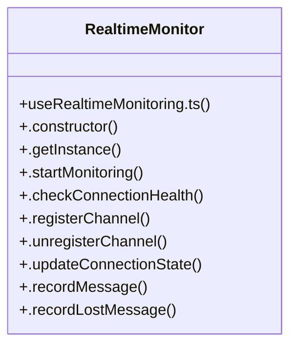

# UI Layout Management

> 25 nodes · cohesion 0.12

## Key Concepts

- [RealtimeMonitor](file:///D:/.MUSICVERSE/aimusicverse/src/hooks/monitoring/useRealtimeMonitoring.ts#L30) (18 connections)
- [useRealtimeMonitoring.ts](file:///D:/.MUSICVERSE/aimusicverse/src/hooks/monitoring/useRealtimeMonitoring.ts#L1) (7 connections)
- [.notifyListeners()](file:///D:/.MUSICVERSE/aimusicverse/src/hooks/monitoring/useRealtimeMonitoring.ts#L207) (6 connections)
- [.addAlert()](file:///D:/.MUSICVERSE/aimusicverse/src/hooks/monitoring/useRealtimeMonitoring.ts#L211) (4 connections)
- [.recordMessage()](file:///D:/.MUSICVERSE/aimusicverse/src/hooks/monitoring/useRealtimeMonitoring.ts#L156) (4 connections)
- [.updateConnectionState()](file:///D:/.MUSICVERSE/aimusicverse/src/hooks/monitoring/useRealtimeMonitoring.ts#L123) (4 connections)
- [.checkConnectionHealth()](file:///D:/.MUSICVERSE/aimusicverse/src/hooks/monitoring/useRealtimeMonitoring.ts#L79) (3 connections)
- [.exportMetrics()](file:///D:/.MUSICVERSE/aimusicverse/src/hooks/monitoring/useRealtimeMonitoring.ts#L228) (3 connections)
- [.getInstance()](file:///D:/.MUSICVERSE/aimusicverse/src/hooks/monitoring/useRealtimeMonitoring.ts#L55) (3 connections)
- [.registerChannel()](file:///D:/.MUSICVERSE/aimusicverse/src/hooks/monitoring/useRealtimeMonitoring.ts#L111) (3 connections)
- [useChannelMonitoring()](file:///D:/.MUSICVERSE/aimusicverse/src/hooks/monitoring/useRealtimeMonitoring.ts#L270) (3 connections)
- [useRealtimeMonitoring()](file:///D:/.MUSICVERSE/aimusicverse/src/hooks/monitoring/useRealtimeMonitoring.ts#L239) (3 connections)
- [measureLatency()](file:///D:/.MUSICVERSE/aimusicverse/src/hooks/monitoring/useRealtimeMonitoring.ts#L310) (2 connections)
- [.constructor()](file:///D:/.MUSICVERSE/aimusicverse/src/hooks/monitoring/useRealtimeMonitoring.ts#L50) (2 connections)
- [.getAlerts()](file:///D:/.MUSICVERSE/aimusicverse/src/hooks/monitoring/useRealtimeMonitoring.ts#L189) (2 connections)
- [.getMetrics()](file:///D:/.MUSICVERSE/aimusicverse/src/hooks/monitoring/useRealtimeMonitoring.ts#L185) (2 connections)
- [.recordLostMessage()](file:///D:/.MUSICVERSE/aimusicverse/src/hooks/monitoring/useRealtimeMonitoring.ts#L180) (2 connections)
- [.startMonitoring()](file:///D:/.MUSICVERSE/aimusicverse/src/hooks/monitoring/useRealtimeMonitoring.ts#L62) (2 connections)
- [.unregisterChannel()](file:///D:/.MUSICVERSE/aimusicverse/src/hooks/monitoring/useRealtimeMonitoring.ts#L117) (2 connections)
- [LATENCY_THRESHOLD_CRITICAL](file:///D:/.MUSICVERSE/aimusicverse/src/hooks/monitoring/useRealtimeMonitoring.ts#L27) (1 connections)
- [LATENCY_THRESHOLD_WARNING](file:///D:/.MUSICVERSE/aimusicverse/src/hooks/monitoring/useRealtimeMonitoring.ts#L26) (1 connections)
- [MAX_LATENCY_SAMPLES](file:///D:/.MUSICVERSE/aimusicverse/src/hooks/monitoring/useRealtimeMonitoring.ts#L28) (1 connections)
- [.clearAlerts()](file:///D:/.MUSICVERSE/aimusicverse/src/hooks/monitoring/useRealtimeMonitoring.ts#L193) (1 connections)
- [.subscribe()](file:///D:/.MUSICVERSE/aimusicverse/src/hooks/monitoring/useRealtimeMonitoring.ts#L197) (1 connections)
- [.subscribeToAlerts()](file:///D:/.MUSICVERSE/aimusicverse/src/hooks/monitoring/useRealtimeMonitoring.ts#L202) (1 connections)

## Class Diagram

## Relationships

- No strong cross-community connections detected

## Source Files

- [D:\.MUSICVERSE\aimusicverse\src\hooks\monitoring\useRealtimeMonitoring.ts](file:///D:/.MUSICVERSE/aimusicverse/src/hooks/monitoring/useRealtimeMonitoring.ts)

## Audit Trail

- EXTRACTED: 72 (89%)
- INFERRED: 9 (11%)
- AMBIGUOUS: 0 (0%)

---

_Part of the graphify knowledge wiki. See [[index]] to navigate._
