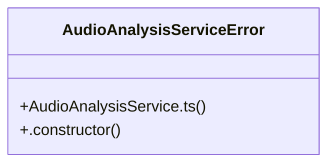

# UI Management

> 156 nodes · cohesion 0.02

## Key Concepts

- [log](file:///D:/.MUSICVERSE/aimusicverse/src/services/unified-analysis/AudioAnalysisService.ts#L32) (34 connections)
- [LyricsEditorMetricsOverlay.tsx](file:///D:/.MUSICVERSE/aimusicverse/src/components/dev/LyricsEditorMetricsOverlay.tsx#L1) (21 connections)
- [GuitarTuner.tsx](file:///D:/.MUSICVERSE/aimusicverse/src/components/guitar/GuitarTuner.tsx#L1) (17 connections)
- [performance-utils.ts](file:///D:/.MUSICVERSE/aimusicverse/src/lib/performance-utils.ts#L1) (14 connections)
- [migrate-filenames.js](file:///D:/.MUSICVERSE/aimusicverse/scripts/migrate-filenames.js#L1) (13 connections)
- [ExportMixDialog.tsx](file:///D:/.MUSICVERSE/aimusicverse/src/components/studio/unified/ExportMixDialog.tsx#L1) (13 connections)
- [lyricsCache.ts](file:///D:/.MUSICVERSE/aimusicverse/src/lib/lyricsCache.ts#L1) (12 connections)
- [update-badges.mjs](file:///D:/.MUSICVERSE/aimusicverse/scripts/update-badges.mjs#L1) (11 connections)
- [track-bundle-size.js](file:///D:/.MUSICVERSE/aimusicverse/scripts/track-bundle-size.js#L1) (8 connections)
- [formatters.ts](file:///D:/.MUSICVERSE/aimusicverse/src/lib/formatters.ts#L1) (8 connections)
- [storage.ts](file:///D:/.MUSICVERSE/aimusicverse/src/lib/storage.ts#L1) (8 connections)
- [validate-sprint-002.ts](file:///D:/.MUSICVERSE/aimusicverse/verification/validate-sprint-002.ts#L1) (8 connections)
- [analyzeBundleSizes()](file:///D:/.MUSICVERSE/aimusicverse/scripts/track-bundle-size.js#L70) (7 connections)
- [main()](file:///D:/.MUSICVERSE/aimusicverse/verification/validate-sprint-002.ts#L380) (7 connections)
- [index.ts](file:///D:/.MUSICVERSE/aimusicverse/src/lib/debug/index.ts#L1) (6 connections)
- [getDB()](file:///D:/.MUSICVERSE/aimusicverse/src/lib/lyricsCache.ts#L28) (6 connections)
- [memoize()](file:///D:/.MUSICVERSE/aimusicverse/src/lib/performance-utils.ts#L115) (6 connections)
- [getCacheKey()](file:///D:/.MUSICVERSE/aimusicverse/src/lib/lyricsCache.ts#L61) (5 connections)
- [setCachedLyrics()](file:///D:/.MUSICVERSE/aimusicverse/src/lib/lyricsCache.ts#L112) (5 connections)
- [addResult()](file:///D:/.MUSICVERSE/aimusicverse/verification/validate-sprint-002.ts#L31) (5 connections)
- [checkLinks()](file:///D:/.MUSICVERSE/aimusicverse/scripts/check-links.js#L36) (4 connections)
- [getCachedLyrics()](file:///D:/.MUSICVERSE/aimusicverse/src/lib/lyricsCache.ts#L68) (4 connections)
- [migrateFile()](file:///D:/.MUSICVERSE/aimusicverse/scripts/migrate-filenames.js#L92) (4 connections)
- [printResults()](file:///D:/.MUSICVERSE/aimusicverse/verification/validate-sprint-002.ts#L323) (4 connections)
- [validateCodeStructure()](file:///D:/.MUSICVERSE/aimusicverse/verification/validate-sprint-002.ts#L111) (4 connections)
- *... and 131 more nodes in this community*

## Class Diagram

## Relationships

- No strong cross-community connections detected

## Source Files

- [D:\.MUSICVERSE\aimusicverse\scripts\check-links.js](file:///D:/.MUSICVERSE/aimusicverse/scripts/check-links.js)
- [D:\.MUSICVERSE\aimusicverse\scripts\migrate-filenames.js](file:///D:/.MUSICVERSE/aimusicverse/scripts/migrate-filenames.js)
- [D:\.MUSICVERSE\aimusicverse\scripts\track-bundle-size.js](file:///D:/.MUSICVERSE/aimusicverse/scripts/track-bundle-size.js)
- [D:\.MUSICVERSE\aimusicverse\scripts\update-badges.mjs](file:///D:/.MUSICVERSE/aimusicverse/scripts/update-badges.mjs)
- [D:\.MUSICVERSE\aimusicverse\src\components\dev\LyricsEditorMetricsOverlay.tsx](file:///D:/.MUSICVERSE/aimusicverse/src/components/dev/LyricsEditorMetricsOverlay.tsx)
- [D:\.MUSICVERSE\aimusicverse\src\components\guitar\GuitarTuner.tsx](file:///D:/.MUSICVERSE/aimusicverse/src/components/guitar/GuitarTuner.tsx)
- [D:\.MUSICVERSE\aimusicverse\src\components\studio\unified\ExportMixDialog.tsx](file:///D:/.MUSICVERSE/aimusicverse/src/components/studio/unified/ExportMixDialog.tsx)
- [D:\.MUSICVERSE\aimusicverse\src\lib\debug\index.ts](file:///D:/.MUSICVERSE/aimusicverse/src/lib/debug/index.ts)
- [D:\.MUSICVERSE\aimusicverse\src\lib\formatters.ts](file:///D:/.MUSICVERSE/aimusicverse/src/lib/formatters.ts)
- [D:\.MUSICVERSE\aimusicverse\src\lib\lyricsCache.ts](file:///D:/.MUSICVERSE/aimusicverse/src/lib/lyricsCache.ts)
- [D:\.MUSICVERSE\aimusicverse\src\lib\performance-utils.ts](file:///D:/.MUSICVERSE/aimusicverse/src/lib/performance-utils.ts)
- [D:\.MUSICVERSE\aimusicverse\src\lib\storage.ts](file:///D:/.MUSICVERSE/aimusicverse/src/lib/storage.ts)
- [D:\.MUSICVERSE\aimusicverse\src\services\unified-analysis\AudioAnalysisService.ts](file:///D:/.MUSICVERSE/aimusicverse/src/services/unified-analysis/AudioAnalysisService.ts)
- [D:\.MUSICVERSE\aimusicverse\supabase\functions\klangio-analyze\index.ts](file:///D:/.MUSICVERSE/aimusicverse/supabase/functions/klangio-analyze/index.ts)
- [D:\.MUSICVERSE\aimusicverse\verification\validate-sprint-002.ts](file:///D:/.MUSICVERSE/aimusicverse/verification/validate-sprint-002.ts)

## Audit Trail

- EXTRACTED: 344 (81%)
- INFERRED: 80 (19%)
- AMBIGUOUS: 0 (0%)

---

*Part of the graphify knowledge wiki. See [[index]] to navigate.*