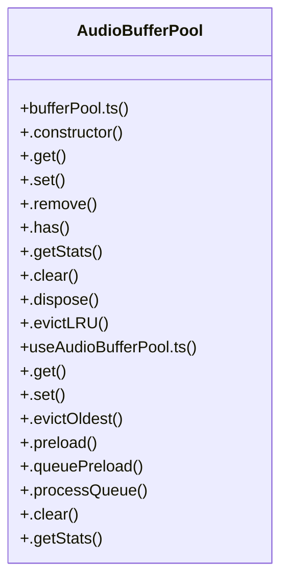

# UI Management

> 284 nodes · cohesion 0.03

## Key Concepts

- [bundle.60a45f97.min.js](file:///D:/.MUSICVERSE/aimusicverse/site/assets/javascripts/bundle.60a45f97.min.js#L1) (205 connections)
- [.subscribe()](file:///D:/.MUSICVERSE/aimusicverse/src/services/audio-reference/ReferenceManager.ts#L76) (68 connections)
- [M()](file:///D:/.MUSICVERSE/aimusicverse/site/assets/javascripts/bundle.60a45f97.min.js#L12) (58 connections)
- [e()](file:///D:/.MUSICVERSE/aimusicverse/site/assets/javascripts/bundle.60a45f97.min.js#L1) (50 connections)
- [next()](file:///D:/.MUSICVERSE/aimusicverse/storybook-static/sb-manager/globals-runtime.js#L18357) (47 connections)
- [H()](file:///D:/.MUSICVERSE/aimusicverse/site/assets/javascripts/bundle.60a45f97.min.js#L12) (46 connections)
- [o()](file:///D:/.MUSICVERSE/aimusicverse/storybook-static/sb-manager/runtime.js#L1316) (44 connections)
- [t()](file:///D:/.MUSICVERSE/aimusicverse/site/assets/javascripts/bundle.60a45f97.min.js#L14) (41 connections)
- [u()](file:///D:/.MUSICVERSE/aimusicverse/site/assets/javascripts/bundle.60a45f97.min.js#L12) (34 connections)
- [c()](file:///D:/.MUSICVERSE/aimusicverse/site/assets/javascripts/bundle.60a45f97.min.js#L12) (33 connections)
- [v()](file:///D:/.MUSICVERSE/aimusicverse/site/assets/javascripts/bundle.60a45f97.min.js#L14) (32 connections)
- [q()](file:///D:/.MUSICVERSE/aimusicverse/site/assets/javascripts/bundle.60a45f97.min.js#L12) (31 connections)
- [Complete](file:///D:/.MUSICVERSE/aimusicverse/src/stories/ui/Progress.stories.tsx#L30) (28 connections)
- [z()](file:///D:/.MUSICVERSE/aimusicverse/site/assets/javascripts/bundle.60a45f97.min.js#L14) (27 connections)
- [W()](file:///D:/.MUSICVERSE/aimusicverse/site/assets/javascripts/bundle.60a45f97.min.js#L14) (26 connections)
- [b()](file:///D:/.MUSICVERSE/aimusicverse/site/assets/javascripts/bundle.60a45f97.min.js#L14) (25 connections)
- [p()](file:///D:/.MUSICVERSE/aimusicverse/site/assets/javascripts/bundle.60a45f97.min.js#L12) (22 connections)
- [n()](file:///D:/.MUSICVERSE/aimusicverse/site/assets/javascripts/bundle.60a45f97.min.js#L12) (21 connections)
- [ne()](file:///D:/.MUSICVERSE/aimusicverse/site/assets/javascripts/bundle.60a45f97.min.js#L14) (20 connections)
- [pe()](file:///D:/.MUSICVERSE/aimusicverse/site/assets/javascripts/bundle.60a45f97.min.js#L14) (20 connections)
- [r()](file:///D:/.MUSICVERSE/aimusicverse/site/assets/javascripts/bundle.60a45f97.min.js#L12) (20 connections)
- [x()](file:///D:/.MUSICVERSE/aimusicverse/site/assets/javascripts/bundle.60a45f97.min.js#L14) (20 connections)
- [.remove()](file:///D:/.MUSICVERSE/aimusicverse/src/lib/audio/bufferPool.ts#L85) (19 connections)
- [ja()](file:///D:/.MUSICVERSE/aimusicverse/site/assets/javascripts/bundle.60a45f97.min.js#L14) (18 connections)
- [ee()](file:///D:/.MUSICVERSE/aimusicverse/site/assets/javascripts/bundle.60a45f97.min.js#L14) (17 connections)
- *... and 259 more nodes in this community*

## Class Diagram

## Relationships

- No strong cross-community connections detected

## Source Files

- [D:\.MUSICVERSE\aimusicverse\site\assets\javascripts\bundle.60a45f97.min.js](file:///D:/.MUSICVERSE/aimusicverse/site/assets/javascripts/bundle.60a45f97.min.js)
- [D:\.MUSICVERSE\aimusicverse\src\components\admin\analytics\RealTimeMetrics.tsx](file:///D:/.MUSICVERSE/aimusicverse/src/components/admin/analytics/RealTimeMetrics.tsx)
- [D:\.MUSICVERSE\aimusicverse\src\components\prompt-dj\VoiceInput.tsx](file:///D:/.MUSICVERSE/aimusicverse/src/components/prompt-dj/VoiceInput.tsx)
- [D:\.MUSICVERSE\aimusicverse\src\hooks\prompt-dj\usePromptDecks.ts](file:///D:/.MUSICVERSE/aimusicverse/src/hooks/prompt-dj/usePromptDecks.ts)
- [D:\.MUSICVERSE\aimusicverse\src\hooks\prompt-dj\usePromptEffects.ts](file:///D:/.MUSICVERSE/aimusicverse/src/hooks/prompt-dj/usePromptEffects.ts)
- [D:\.MUSICVERSE\aimusicverse\src\hooks\prompt-dj\usePromptRecording.ts](file:///D:/.MUSICVERSE/aimusicverse/src/hooks/prompt-dj/usePromptRecording.ts)
- [D:\.MUSICVERSE\aimusicverse\src\hooks\useAudioBufferPool.ts](file:///D:/.MUSICVERSE/aimusicverse/src/hooks/useAudioBufferPool.ts)
- [D:\.MUSICVERSE\aimusicverse\src\hooks\usePredictiveGeneration.ts](file:///D:/.MUSICVERSE/aimusicverse/src/hooks/usePredictiveGeneration.ts)
- [D:\.MUSICVERSE\aimusicverse\src\hooks\usePromptDJEnhanced.ts](file:///D:/.MUSICVERSE/aimusicverse/src/hooks/usePromptDJEnhanced.ts)
- [D:\.MUSICVERSE\aimusicverse\src\lib\audio\bufferPool.ts](file:///D:/.MUSICVERSE/aimusicverse/src/lib/audio/bufferPool.ts)
- [D:\.MUSICVERSE\aimusicverse\src\services\audio-reference\ReferenceManager.ts](file:///D:/.MUSICVERSE/aimusicverse/src/services/audio-reference/ReferenceManager.ts)
- [D:\.MUSICVERSE\aimusicverse\src\stories\ui\Progress.stories.tsx](file:///D:/.MUSICVERSE/aimusicverse/src/stories/ui/Progress.stories.tsx)
- [D:\.MUSICVERSE\aimusicverse\storybook-static\sb-manager\globals-runtime.js](file:///D:/.MUSICVERSE/aimusicverse/storybook-static/sb-manager/globals-runtime.js)
- [D:\.MUSICVERSE\aimusicverse\storybook-static\sb-manager\runtime.js](file:///D:/.MUSICVERSE/aimusicverse/storybook-static/sb-manager/runtime.js)
- [D:\.MUSICVERSE\aimusicverse\supabase\functions\send-admin-message\index.ts](file:///D:/.MUSICVERSE/aimusicverse/supabase/functions/send-admin-message/index.ts)

## Audit Trail

- EXTRACTED: 1976 (80%)
- INFERRED: 499 (20%)
- AMBIGUOUS: 0 (0%)

---

*Part of the graphify knowledge wiki. See [[index]] to navigate.*