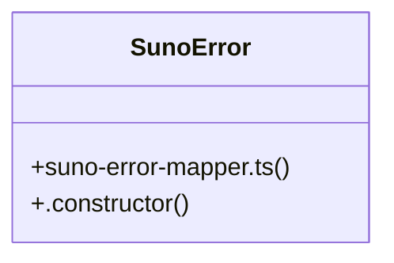

# UI Navigation

> 10 nodes · cohesion 0.27

## Key Concepts

- [suno-error-mapper.ts](file:///D:/.MUSICVERSE/aimusicverse/src/lib/suno-error-mapper.ts#L1) (8 connections)
- [mapSunoError()](file:///D:/.MUSICVERSE/aimusicverse/src/lib/suno-error-mapper.ts#L410) (4 connections)
- [detectErrorCode()](file:///D:/.MUSICVERSE/aimusicverse/src/lib/suno-error-mapper.ts#L356) (3 connections)
- [createSunoError()](file:///D:/.MUSICVERSE/aimusicverse/src/lib/suno-error-mapper.ts#L484) (2 connections)
- [getRetryDelay()](file:///D:/.MUSICVERSE/aimusicverse/src/lib/suno-error-mapper.ts#L460) (2 connections)
- [isRetryableError()](file:///D:/.MUSICVERSE/aimusicverse/src/lib/suno-error-mapper.ts#L452) (2 connections)
- [SunoError](file:///D:/.MUSICVERSE/aimusicverse/src/lib/suno-error-mapper.ts#L468) (2 connections)
- [ERROR_MESSAGES](file:///D:/.MUSICVERSE/aimusicverse/src/lib/suno-error-mapper.ts#L92) (1 connections)
- [FAQ_URLS](file:///D:/.MUSICVERSE/aimusicverse/src/lib/suno-error-mapper.ts#L80) (1 connections)
- [.constructor()](file:///D:/.MUSICVERSE/aimusicverse/src/lib/suno-error-mapper.ts#L469) (1 connections)

## Class Diagram

## Relationships

- No strong cross-community connections detected

## Source Files

- [D:\.MUSICVERSE\aimusicverse\src\lib\suno-error-mapper.ts](file:///D:/.MUSICVERSE/aimusicverse/src/lib/suno-error-mapper.ts)

## Audit Trail

- EXTRACTED: 24 (92%)
- INFERRED: 2 (8%)
- AMBIGUOUS: 0 (0%)

---

*Part of the graphify knowledge wiki. See [[index]] to navigate.*