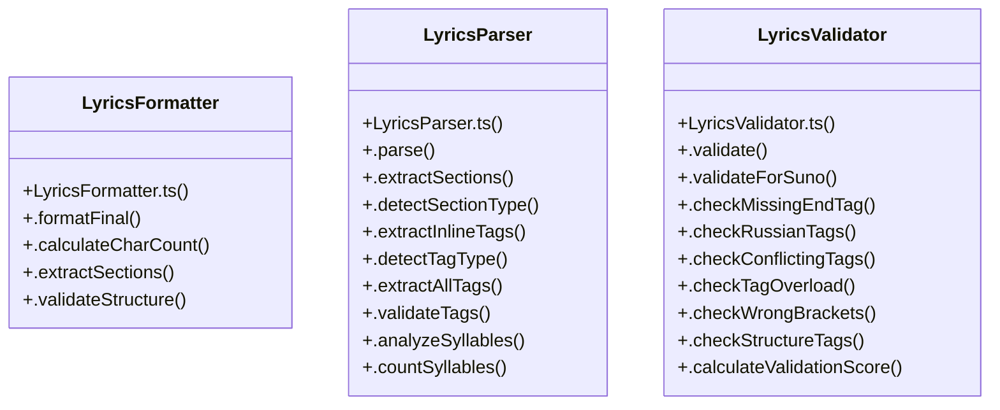

# User Achievements

> 1354 nodes · cohesion 0.01

## Key Concepts

- [manager-bundle.js](file:///D:/.MUSICVERSE/aimusicverse/site/storybook-static/sb-addons/essentials-controls-2/manager-bundle.js#L1) (500 connections)
- [manager-bundle.js](file:///D:/.MUSICVERSE/aimusicverse/storybook-static/sb-addons/essentials-controls-2/manager-bundle.js#L1) (500 connections)
- [manager-bundle.js](file:///D:/.MUSICVERSE/aimusicverse/site/storybook-static/sb-addons/essentials-docs-4/manager-bundle.js#L1) (468 connections)
- [manager-bundle.js](file:///D:/.MUSICVERSE/aimusicverse/storybook-static/sb-addons/essentials-docs-4/manager-bundle.js#L1) (468 connections)
- [manager-bundle.js](file:///D:/.MUSICVERSE/aimusicverse/site/storybook-static/sb-addons/interactions-10/manager-bundle.js#L1) (356 connections)
- [manager-bundle.js](file:///D:/.MUSICVERSE/aimusicverse/storybook-static/sb-addons/interactions-10/manager-bundle.js#L1) (356 connections)
- [map](file:///D:/.MUSICVERSE/aimusicverse/tests/e2e/smoke.app-boots.spec.ts#L213) (348 connections)
- [manager-bundle.js](file:///D:/.MUSICVERSE/aimusicverse/site/storybook-static/sb-addons/a11y-11/manager-bundle.js#L1) (264 connections)
- [manager-bundle.js](file:///D:/.MUSICVERSE/aimusicverse/storybook-static/sb-addons/a11y-11/manager-bundle.js#L1) (264 connections)
- [filter()](file:///D:/.MUSICVERSE/aimusicverse/site/assets/javascripts/lunr/wordcut.js#L3167) (241 connections)
- [split()](file:///D:/.MUSICVERSE/aimusicverse/storybook-static/sb-manager/globals-runtime.js#L16496) (179 connections)
- [toString()](file:///D:/.MUSICVERSE/aimusicverse/storybook-static/sb-manager/globals-runtime.js#L16710) (126 connections)
- [match()](file:///D:/.MUSICVERSE/aimusicverse/storybook-static/sb-manager/globals-runtime.js#L20582) (123 connections)
- [test()](file:///D:/.MUSICVERSE/aimusicverse/storybook-static/sb-manager/globals-runtime.js#L24523) (115 connections)
- [C()](file:///D:/.MUSICVERSE/aimusicverse/storybook-static/sb-addons/interactions-10/manager-bundle.js#L133) (87 connections)
- [a](file:///D:/.MUSICVERSE/aimusicverse/storybook-static/sb-addons/interactions-10/manager-bundle.js#L131) (86 connections)
- [isArray()](file:///D:/.MUSICVERSE/aimusicverse/site/assets/javascripts/lunr/wordcut.js#L6533) (85 connections)
- [e](file:///D:/.MUSICVERSE/aimusicverse/storybook-static/sb-addons/interactions-10/manager-bundle.js#L131) (76 connections)
- [l](file:///D:/.MUSICVERSE/aimusicverse/storybook-static/sb-addons/links-1/manager-bundle.js#L2) (75 connections)
- [t](file:///D:/.MUSICVERSE/aimusicverse/storybook-static/sb-addons/interactions-10/manager-bundle.js#L2) (75 connections)
- [fn()](file:///D:/.MUSICVERSE/aimusicverse/storybook-static/sb-addons/interactions-10/manager-bundle.js#L214) (69 connections)
- [manager-bundle.js](file:///D:/.MUSICVERSE/aimusicverse/site/storybook-static/sb-addons/essentials-actions-3/manager-bundle.js#L1) (63 connections)
- [manager-bundle.js](file:///D:/.MUSICVERSE/aimusicverse/storybook-static/sb-addons/essentials-actions-3/manager-bundle.js#L1) (63 connections)
- [n()](file:///D:/.MUSICVERSE/aimusicverse/storybook-static/sb-addons/interactions-10/manager-bundle.js#L131) (61 connections)
- [s()](file:///D:/.MUSICVERSE/aimusicverse/storybook-static/sb-addons/interactions-10/manager-bundle.js#L131) (58 connections)
- *... and 1329 more nodes in this community*

## Class Diagram

## Relationships

- No strong cross-community connections detected

## Source Files

- [D:\.MUSICVERSE\aimusicverse\scripts\check-md-links.mjs](file:///D:/.MUSICVERSE/aimusicverse/scripts/check-md-links.mjs)
- [D:\.MUSICVERSE\aimusicverse\scripts\count-any.mjs](file:///D:/.MUSICVERSE/aimusicverse/scripts/count-any.mjs)
- [D:\.MUSICVERSE\aimusicverse\scripts\lint-filenames.js](file:///D:/.MUSICVERSE/aimusicverse/scripts/lint-filenames.js)
- [D:\.MUSICVERSE\aimusicverse\site\assets\javascripts\lunr\min\lunr.el.min.js](file:///D:/.MUSICVERSE/aimusicverse/site/assets/javascripts/lunr/min/lunr.el.min.js)
- [D:\.MUSICVERSE\aimusicverse\site\assets\javascripts\lunr\wordcut.js](file:///D:/.MUSICVERSE/aimusicverse/site/assets/javascripts/lunr/wordcut.js)
- [D:\.MUSICVERSE\aimusicverse\site\assets\javascripts\workers\search.f8cc74c7.min.js](file:///D:/.MUSICVERSE/aimusicverse/site/assets/javascripts/workers/search.f8cc74c7.min.js)
- [D:\.MUSICVERSE\aimusicverse\site\storybook-static\sb-addons\a11y-11\manager-bundle.js](file:///D:/.MUSICVERSE/aimusicverse/site/storybook-static/sb-addons/a11y-11/manager-bundle.js)
- [D:\.MUSICVERSE\aimusicverse\site\storybook-static\sb-addons\essentials-actions-3\manager-bundle.js](file:///D:/.MUSICVERSE/aimusicverse/site/storybook-static/sb-addons/essentials-actions-3/manager-bundle.js)
- [D:\.MUSICVERSE\aimusicverse\site\storybook-static\sb-addons\essentials-backgrounds-5\manager-bundle.js](file:///D:/.MUSICVERSE/aimusicverse/site/storybook-static/sb-addons/essentials-backgrounds-5/manager-bundle.js)
- [D:\.MUSICVERSE\aimusicverse\site\storybook-static\sb-addons\essentials-controls-2\manager-bundle.js](file:///D:/.MUSICVERSE/aimusicverse/site/storybook-static/sb-addons/essentials-controls-2/manager-bundle.js)
- [D:\.MUSICVERSE\aimusicverse\site\storybook-static\sb-addons\essentials-docs-4\manager-bundle.js](file:///D:/.MUSICVERSE/aimusicverse/site/storybook-static/sb-addons/essentials-docs-4/manager-bundle.js)
- [D:\.MUSICVERSE\aimusicverse\site\storybook-static\sb-addons\essentials-measure-8\manager-bundle.js](file:///D:/.MUSICVERSE/aimusicverse/site/storybook-static/sb-addons/essentials-measure-8/manager-bundle.js)
- [D:\.MUSICVERSE\aimusicverse\site\storybook-static\sb-addons\essentials-outline-9\manager-bundle.js](file:///D:/.MUSICVERSE/aimusicverse/site/storybook-static/sb-addons/essentials-outline-9/manager-bundle.js)
- [D:\.MUSICVERSE\aimusicverse\site\storybook-static\sb-addons\essentials-toolbars-7\manager-bundle.js](file:///D:/.MUSICVERSE/aimusicverse/site/storybook-static/sb-addons/essentials-toolbars-7/manager-bundle.js)
- [D:\.MUSICVERSE\aimusicverse\site\storybook-static\sb-addons\essentials-viewport-6\manager-bundle.js](file:///D:/.MUSICVERSE/aimusicverse/site/storybook-static/sb-addons/essentials-viewport-6/manager-bundle.js)
- [D:\.MUSICVERSE\aimusicverse\site\storybook-static\sb-addons\interactions-10\manager-bundle.js](file:///D:/.MUSICVERSE/aimusicverse/site/storybook-static/sb-addons/interactions-10/manager-bundle.js)
- [D:\.MUSICVERSE\aimusicverse\site\storybook-static\sb-addons\links-1\manager-bundle.js](file:///D:/.MUSICVERSE/aimusicverse/site/storybook-static/sb-addons/links-1/manager-bundle.js)
- [D:\.MUSICVERSE\aimusicverse\src\__tests__\api\batch.api.test.ts](file:///D:/.MUSICVERSE/aimusicverse/src/__tests__/api/batch.api.test.ts)
- [D:\.MUSICVERSE\aimusicverse\src\__tests__\api\presets.api.test.ts](file:///D:/.MUSICVERSE/aimusicverse/src/__tests__/api/presets.api.test.ts)
- [D:\.MUSICVERSE\aimusicverse\src\__tests__\api\recordings.api.test.ts](file:///D:/.MUSICVERSE/aimusicverse/src/__tests__/api/recordings.api.test.ts)

## Audit Trail

- EXTRACTED: 10914 (79%)
- INFERRED: 2959 (21%)
- AMBIGUOUS: 0 (0%)

---

*Part of the graphify knowledge wiki. See [[index]] to navigate.*