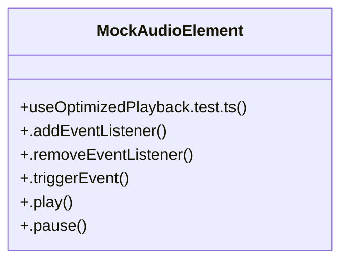

# User Achievements

> 518 nodes · cohesion 0.00

## Key Concepts

- [.pause()](file:///D:/.MUSICVERSE/aimusicverse/tests/unit/hooks/studio/useOptimizedPlayback.test.ts#L51) (50 connections)
- [.play()](file:///D:/.MUSICVERSE/aimusicverse/tests/unit/hooks/studio/useOptimizedPlayback.test.ts#L45) (38 connections)
- [WaveformWithChords.tsx](file:///D:/.MUSICVERSE/aimusicverse/src/components/guitar/WaveformWithChords.tsx#L1) (33 connections)
- [SectionVariantOverlay.tsx](file:///D:/.MUSICVERSE/aimusicverse/src/components/studio/unified/SectionVariantOverlay.tsx#L1) (27 connections)
- [pauseTrack](file:///D:/.MUSICVERSE/aimusicverse/src/components/player/PlayerActionsBar.tsx#L61) (27 connections)
- [ABCompareOverlay.tsx](file:///D:/.MUSICVERSE/aimusicverse/src/components/stem-studio/section-editor/ABCompareOverlay.tsx#L1) (26 connections)
- [MinimalProjectTrackItem.tsx](file:///D:/.MUSICVERSE/aimusicverse/src/components/project/MinimalProjectTrackItem.tsx#L1) (25 connections)
- [BeatGridVisualizer.tsx](file:///D:/.MUSICVERSE/aimusicverse/src/components/guitar/BeatGridVisualizer.tsx#L1) (23 connections)
- [TrimDialog.tsx](file:///D:/.MUSICVERSE/aimusicverse/src/components/stem-studio/TrimDialog.tsx#L1) (22 connections)
- [CreateArtistDialog.tsx](file:///D:/.MUSICVERSE/aimusicverse/src/components/CreateArtistDialog.tsx#L1) (21 connections)
- [PlayerActionsBar.tsx](file:///D:/.MUSICVERSE/aimusicverse/src/components/player/PlayerActionsBar.tsx#L1) (21 connections)
- [pauseAllStudioAudio()](file:///D:/.MUSICVERSE/aimusicverse/src/hooks/studio/useStudioAudio.ts#L52) (21 connections)
- [GuitarAnalysisReportSimplified.tsx](file:///D:/.MUSICVERSE/aimusicverse/src/components/guitar/GuitarAnalysisReportSimplified.tsx#L1) (20 connections)
- [SectionEditorSheet.tsx](file:///D:/.MUSICVERSE/aimusicverse/src/components/studio/editor/SectionEditorSheet.tsx#L1) (19 connections)
- [PianoRollWithMidiSync.tsx](file:///D:/.MUSICVERSE/aimusicverse/src/components/guitar/PianoRollWithMidiSync.tsx#L1) (18 connections)
- [AudioTrimSelector.tsx](file:///D:/.MUSICVERSE/aimusicverse/src/components/generate-form/AudioTrimSelector.tsx#L1) (17 connections)
- [GuitarAnalysisReportImproved.tsx](file:///D:/.MUSICVERSE/aimusicverse/src/components/guitar/GuitarAnalysisReportImproved.tsx#L1) (17 connections)
- [SavedRecordingsList.tsx](file:///D:/.MUSICVERSE/aimusicverse/src/components/guitar/SavedRecordingsList.tsx#L1) (17 connections)
- [InstrumentalGeneratorPanel.tsx](file:///D:/.MUSICVERSE/aimusicverse/src/components/studio/InstrumentalGeneratorPanel.tsx#L1) (16 connections)
- [CloudAudioPicker.tsx](file:///D:/.MUSICVERSE/aimusicverse/src/components/lyrics-workspace/CloudAudioPicker.tsx#L1) (14 connections)
- [SFXGeneratorPanel.tsx](file:///D:/.MUSICVERSE/aimusicverse/src/components/studio/SFXGeneratorPanel.tsx#L1) (14 connections)
- [StudioTransport.tsx](file:///D:/.MUSICVERSE/aimusicverse/src/components/studio/unified/StudioTransport.tsx#L1) (14 connections)
- [AlbumView.tsx](file:///D:/.MUSICVERSE/aimusicverse/src/pages/AlbumView.tsx#L1) (14 connections)
- [CloudAudioSelector.tsx](file:///D:/.MUSICVERSE/aimusicverse/src/components/audio-reference/CloudAudioSelector.tsx#L1) (13 connections)
- [EnhancedVersionTimeline.tsx](file:///D:/.MUSICVERSE/aimusicverse/src/components/studio/unified/EnhancedVersionTimeline.tsx#L1) (13 connections)
- _... and 493 more nodes in this community_

## Class Diagram

## Relationships

- No strong cross-community connections detected

## Source Files

- [D:\.MUSICVERSE\aimusicverse\src\components\CreateArtistDialog.tsx](file:///D:/.MUSICVERSE/aimusicverse/src/components/CreateArtistDialog.tsx)
- [D:\.MUSICVERSE\aimusicverse\src\components\admin\AdminTrackDetailsDialog.tsx](file:///D:/.MUSICVERSE/aimusicverse/src/components/admin/AdminTrackDetailsDialog.tsx)
- [D:\.MUSICVERSE\aimusicverse\src\components\admin\ReferenceAudioPlayer.tsx](file:///D:/.MUSICVERSE/aimusicverse/src/components/admin/ReferenceAudioPlayer.tsx)
- [D:\.MUSICVERSE\aimusicverse\src\components\audio-record\CloudAudioPicker.tsx](file:///D:/.MUSICVERSE/aimusicverse/src/components/audio-record/CloudAudioPicker.tsx)
- [D:\.MUSICVERSE\aimusicverse\src\components\audio-reference\CloudAudioSelector.tsx](file:///D:/.MUSICVERSE/aimusicverse/src/components/audio-reference/CloudAudioSelector.tsx)
- [D:\.MUSICVERSE\aimusicverse\src\components\audio\AudioReferencePreview.tsx](file:///D:/.MUSICVERSE/aimusicverse/src/components/audio/AudioReferencePreview.tsx)
- [D:\.MUSICVERSE\aimusicverse\src\components\generate-form\AudioActionDialog.tsx](file:///D:/.MUSICVERSE/aimusicverse/src/components/generate-form/AudioActionDialog.tsx)
- [D:\.MUSICVERSE\aimusicverse\src\components\generate-form\AudioReferenceUpload.tsx](file:///D:/.MUSICVERSE/aimusicverse/src/components/generate-form/AudioReferenceUpload.tsx)
- [D:\.MUSICVERSE\aimusicverse\src\components\generate-form\AudioTrimSelector.tsx](file:///D:/.MUSICVERSE/aimusicverse/src/components/generate-form/AudioTrimSelector.tsx)
- [D:\.MUSICVERSE\aimusicverse\src\components\generate-form\AudioUploadActionDialog.tsx](file:///D:/.MUSICVERSE/aimusicverse/src/components/generate-form/AudioUploadActionDialog.tsx)
- [D:\.MUSICVERSE\aimusicverse\src\components\generate-form\GuitarModeRecorder.tsx](file:///D:/.MUSICVERSE/aimusicverse/src/components/generate-form/GuitarModeRecorder.tsx)
- [D:\.MUSICVERSE\aimusicverse\src\components\generate-form\GuitarRecordDialog.tsx](file:///D:/.MUSICVERSE/aimusicverse/src/components/generate-form/GuitarRecordDialog.tsx)
- [D:\.MUSICVERSE\aimusicverse\src\components\generate-form\RecordMelodyDialog.tsx](file:///D:/.MUSICVERSE/aimusicverse/src/components/generate-form/RecordMelodyDialog.tsx)
- [D:\.MUSICVERSE\aimusicverse\src\components\generation\SectionReplacementProgress.tsx](file:///D:/.MUSICVERSE/aimusicverse/src/components/generation/SectionReplacementProgress.tsx)
- [D:\.MUSICVERSE\aimusicverse\src\components\guitar\BeatGridVisualizer.tsx](file:///D:/.MUSICVERSE/aimusicverse/src/components/guitar/BeatGridVisualizer.tsx)
- [D:\.MUSICVERSE\aimusicverse\src\components\guitar\ChordProgressionTimeline.tsx](file:///D:/.MUSICVERSE/aimusicverse/src/components/guitar/ChordProgressionTimeline.tsx)
- [D:\.MUSICVERSE\aimusicverse\src\components\guitar\GuitarAnalysisReport.tsx](file:///D:/.MUSICVERSE/aimusicverse/src/components/guitar/GuitarAnalysisReport.tsx)
- [D:\.MUSICVERSE\aimusicverse\src\components\guitar\GuitarAnalysisReportImproved.tsx](file:///D:/.MUSICVERSE/aimusicverse/src/components/guitar/GuitarAnalysisReportImproved.tsx)
- [D:\.MUSICVERSE\aimusicverse\src\components\guitar\GuitarAnalysisReportSimplified.tsx](file:///D:/.MUSICVERSE/aimusicverse/src/components/guitar/GuitarAnalysisReportSimplified.tsx)
- [D:\.MUSICVERSE\aimusicverse\src\components\guitar\GuitarRecordingStudio.tsx](file:///D:/.MUSICVERSE/aimusicverse/src/components/guitar/GuitarRecordingStudio.tsx)

## Audit Trail

- EXTRACTED: 999 (78%)
- INFERRED: 286 (22%)
- AMBIGUOUS: 0 (0%)

---

_Part of the graphify knowledge wiki. See [[index]] to navigate._
