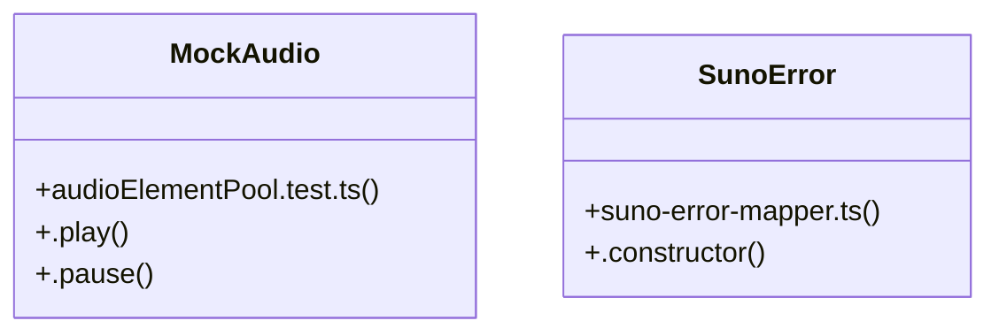

# User Achievements

> 559 nodes · cohesion 0.00

## Key Concepts

- [useAuth()](file:///D:/.MUSICVERSE/aimusicverse/src/contexts/AuthContext.tsx#L285) (128 connections)
- [smoke.app-boots.spec.ts](file:///D:/.MUSICVERSE/aimusicverse/tests/e2e/smoke.app-boots.spec.ts#L1) (17 connections)
- [performance-utils.ts](file:///D:/.MUSICVERSE/aimusicverse/src/lib/performance-utils.ts#L1) (14 connections)
- [useHapticFeedback()](file:///D:/.MUSICVERSE/aimusicverse/src/hooks/useHapticFeedback.ts#L14) (14 connections)
- [StatsWidget.tsx](file:///D:/.MUSICVERSE/aimusicverse/src/components/professional/StatsWidget.tsx#L1) (13 connections)
- [audioElementPool.test.ts](file:///D:/.MUSICVERSE/aimusicverse/src/__tests__/audio/audioElementPool.test.ts#L1) (13 connections)
- [useGamification.ts](file:///D:/.MUSICVERSE/aimusicverse/src/hooks/useGamification.ts#L1) (10 connections)
- [useMediaQuery()](file:///D:/.MUSICVERSE/aimusicverse/src/hooks/use-media-query.ts#L24) (9 connections)
- [useFeatureAccess()](file:///D:/.MUSICVERSE/aimusicverse/src/hooks/useFeatureAccess.ts#L72) (9 connections)
- [useLibraryData()](file:///D:/.MUSICVERSE/aimusicverse/src/hooks/useLibraryData.ts#L29) (9 connections)
- [use-media-query.ts](file:///D:/.MUSICVERSE/aimusicverse/src/hooks/use-media-query.ts#L1) (8 connections)
- [useCredits.ts](file:///D:/.MUSICVERSE/aimusicverse/src/hooks/useCredits.ts#L1) (8 connections)
- [usePaywallTrigger.ts](file:///D:/.MUSICVERSE/aimusicverse/src/hooks/usePaywallTrigger.ts#L1) (8 connections)
- [usePresets.ts](file:///D:/.MUSICVERSE/aimusicverse/src/hooks/usePresets.ts#L1) (8 connections)
- [suno-error-mapper.ts](file:///D:/.MUSICVERSE/aimusicverse/src/lib/suno-error-mapper.ts#L1) (8 connections)
- [useProfile()](file:///D:/.MUSICVERSE/aimusicverse/src/hooks/useProfile.tsx#L36) (8 connections)
- [useSubscriptionStatus()](file:///D:/.MUSICVERSE/aimusicverse/src/hooks/useSubscriptionStatus.ts#L25) (8 connections)
- [NotificationContext.tsx](file:///D:/.MUSICVERSE/aimusicverse/src/contexts/NotificationContext.tsx#L1) (7 connections)
- [useKeyboardShortcuts.ts](file:///D:/.MUSICVERSE/aimusicverse/src/hooks/useKeyboardShortcuts.ts#L1) (7 connections)
- [useGuestMode()](file:///D:/.MUSICVERSE/aimusicverse/src/contexts/GuestModeContext.tsx#L165) (7 connections)
- [useGenerateFormState()](file:///D:/.MUSICVERSE/aimusicverse/src/hooks/generation/useGenerateFormState.ts#L51) (7 connections)
- [usePaywallTrigger()](file:///D:/.MUSICVERSE/aimusicverse/src/hooks/usePaywallTrigger.ts#L62) (7 connections)
- [useUserCredits()](file:///D:/.MUSICVERSE/aimusicverse/src/hooks/useUserCredits.ts#L23) (7 connections)
- [useGenerateDraft.ts](file:///D:/.MUSICVERSE/aimusicverse/src/hooks/generation/useGenerateDraft.ts#L1) (6 connections)
- [useReferrals.ts](file:///D:/.MUSICVERSE/aimusicverse/src/hooks/useReferrals.ts#L1) (6 connections)
- *... and 534 more nodes in this community*

## Class Diagram

## Relationships

- No strong cross-community connections detected

## Source Files

- [D:\.MUSICVERSE\aimusicverse\src\App.tsx](file:///D:/.MUSICVERSE/aimusicverse/src/App.tsx)
- [D:\.MUSICVERSE\aimusicverse\src\__tests__\audio\audioElementPool.test.ts](file:///D:/.MUSICVERSE/aimusicverse/src/__tests__/audio/audioElementPool.test.ts)
- [D:\.MUSICVERSE\aimusicverse\src\components\GlobalGenerationIndicator.tsx](file:///D:/.MUSICVERSE/aimusicverse/src/components/GlobalGenerationIndicator.tsx)
- [D:\.MUSICVERSE\aimusicverse\src\components\GuestModeBanner.tsx](file:///D:/.MUSICVERSE/aimusicverse/src/components/GuestModeBanner.tsx)
- [D:\.MUSICVERSE\aimusicverse\src\components\analytics\EngagementChart.tsx](file:///D:/.MUSICVERSE/aimusicverse/src/components/analytics/EngagementChart.tsx)
- [D:\.MUSICVERSE\aimusicverse\src\components\comments\ReportCommentDialog.tsx](file:///D:/.MUSICVERSE/aimusicverse/src/components/comments/ReportCommentDialog.tsx)
- [D:\.MUSICVERSE\aimusicverse\src\components\dialog\variants\alert.tsx](file:///D:/.MUSICVERSE/aimusicverse/src/components/dialog/variants/alert.tsx)
- [D:\.MUSICVERSE\aimusicverse\src\components\dialog\variants\modal.tsx](file:///D:/.MUSICVERSE/aimusicverse/src/components/dialog/variants/modal.tsx)
- [D:\.MUSICVERSE\aimusicverse\src\components\engagement\LikeButton.tsx](file:///D:/.MUSICVERSE/aimusicverse/src/components/engagement/LikeButton.tsx)
- [D:\.MUSICVERSE\aimusicverse\src\components\gamification\UserLevel.tsx](file:///D:/.MUSICVERSE/aimusicverse/src/components/gamification/UserLevel.tsx)
- [D:\.MUSICVERSE\aimusicverse\src\components\generate-form\GenerateFormReferences.tsx](file:///D:/.MUSICVERSE/aimusicverse/src/components/generate-form/GenerateFormReferences.tsx)
- [D:\.MUSICVERSE\aimusicverse\src\components\generate-form\QueuePosition.tsx](file:///D:/.MUSICVERSE/aimusicverse/src/components/generate-form/QueuePosition.tsx)
- [D:\.MUSICVERSE\aimusicverse\src\components\notifications\smart-alerts\SmartAlertProvider.tsx](file:///D:/.MUSICVERSE/aimusicverse/src/components/notifications/smart-alerts/SmartAlertProvider.tsx)
- [D:\.MUSICVERSE\aimusicverse\src\components\notifications\smart-alerts\useAntiSpam.ts](file:///D:/.MUSICVERSE/aimusicverse/src/components/notifications/smart-alerts/useAntiSpam.ts)
- [D:\.MUSICVERSE\aimusicverse\src\components\onboarding\QuickStartOverlay.tsx](file:///D:/.MUSICVERSE/aimusicverse/src/components/onboarding/QuickStartOverlay.tsx)
- [D:\.MUSICVERSE\aimusicverse\src\components\playlist\CreatePlaylistDialog.tsx](file:///D:/.MUSICVERSE/aimusicverse/src/components/playlist/CreatePlaylistDialog.tsx)
- [D:\.MUSICVERSE\aimusicverse\src\components\premium\FeatureGate.tsx](file:///D:/.MUSICVERSE/aimusicverse/src/components/premium/FeatureGate.tsx)
- [D:\.MUSICVERSE\aimusicverse\src\components\premium\PaywallProvider.tsx](file:///D:/.MUSICVERSE/aimusicverse/src/components/premium/PaywallProvider.tsx)
- [D:\.MUSICVERSE\aimusicverse\src\components\professional\StatsWidget.tsx](file:///D:/.MUSICVERSE/aimusicverse/src/components/professional/StatsWidget.tsx)
- [D:\.MUSICVERSE\aimusicverse\src\components\profile\ProfileSetupGuard.tsx](file:///D:/.MUSICVERSE/aimusicverse/src/components/profile/ProfileSetupGuard.tsx)

## Audit Trail

- EXTRACTED: 900 (64%)
- INFERRED: 507 (36%)
- AMBIGUOUS: 0 (0%)

---

*Part of the graphify knowledge wiki. See [[index]] to navigate.*